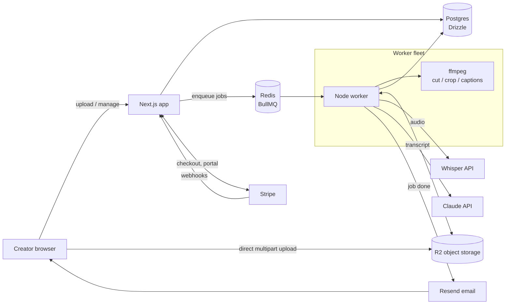

# ClipForge — Architecture

## Stack & rationale

| Layer | Choice | Why |
|-------|--------|-----|
| Web app | **Next.js 15 (App Router) + TypeScript + Tailwind** | Portfolio default; server components for the dashboard, API routes for webhooks/uploads; one deployable for marketing site + app |
| Database | **Postgres + Drizzle ORM** | Relational fits the project→asset→output graph; Drizzle gives typed schema shared by web and worker |
| Queue | **BullMQ + Redis** | Media jobs are long (5–15 min), multi-stage, and must survive restarts; BullMQ gives retries, priorities (Pro = priority lane), and progress events |
| Worker | **Node worker process** running ffmpeg + calling Whisper + Claude | Separate process/VM from the web tier so renders never starve request handling; scale horizontally by adding workers |
| Media processing | **ffmpeg** (cut, crop, caption burn-in via ASS subtitles) | No GPU needed for cut+caption workloads; keeps COGS near zero for rendering |
| Transcription | **OpenAI Whisper API** (fallback: self-hosted whisper.cpp later) | $0.006/min, word timestamps, good enough diarization when paired with pyannote-style segmenting later; API-first keeps MVP simple |
| LLM | **Claude API (claude-sonnet class)** | Clip selection + copy generation; long-context handles 3-hour transcripts in one pass |
| Storage | **S3-compatible (Cloudflare R2)** | R2 has zero egress fees — critical because users download every rendered clip |
| Billing | **Stripe** (subscriptions + metered overage) | Portfolio default |
| Email | **Resend** | Processing-complete notifications, dunning handled by Stripe |

**Deviation from default stack:** a dedicated long-running worker (not serverless queues) because ffmpeg render jobs routinely exceed serverless time/memory limits and need local scratch disk.

## System diagram

## Data model

- **users** — id, email, name, avatar_url, created_at
- **workspaces** — id, name, owner_user_id, plan (starter|pro|team), stripe_customer_id, stripe_subscription_id, uploads_used_this_period, period_resets_at, brand_preset_id, created_at
- **workspace_members** — workspace_id, user_id, role (owner|editor), invited_at
- **brand_presets** — id, workspace_id, font, primary_color, secondary_color, logo_url, caption_style (enum), watermark_enabled
- **projects** (one upload) — id, workspace_id, title, source_type (upload|youtube|rss), source_url, media_key (R2), duration_seconds, status (uploaded|transcribing|selecting|rendering|ready|failed), error, created_by, created_at
- **transcripts** — id, project_id, language, full_text, words_json (word-level timestamps), speakers_json, whisper_cost_cents
- **clip_candidates** — id, project_id, start_ms, end_ms, hook_score, self_containment_score, title, rationale, transcript_excerpt, rank
- **clips** — id, project_id, candidate_id, aspect (9x16|1x1|16x9), caption_style, status (pending|rendering|ready|failed), render_key (R2), thumbnail_key, duration_ms, edited_start_ms, edited_end_ms
- **text_outputs** — id, project_id, kind (tweet_thread|linkedin_post|newsletter), variant, content_json (structured: tweets[], citations[]), edited_content_json, model, tokens_used
- **jobs_audit** — id, project_id, stage, status, started_at, finished_at, cost_cents, error
- **usage_events** — id, workspace_id, project_id, kind (upload|overage), amount, stripe_reported_at

## Key flows

### 1. Upload → content kit (the core pipeline)
1. Browser requests a presigned multipart upload URL from Next.js (`/api/uploads`); file goes browser→R2 directly (no server proxying of gigabyte files).
2. On completion, web app creates `projects` row (status `uploaded`), checks quota (`uploads_used_this_period` vs plan), enqueues `pipeline` job in BullMQ.
3. Worker stage **transcribe**: pulls media from R2, extracts audio (ffmpeg), chunks >25MB audio, calls Whisper, stores `transcripts` with word timestamps. Status → `selecting`.
4. Worker stage **select**: sends structured transcript to Claude with the clip-selection prompt; receives 5–10 scored candidates with exact start/end word indices → `clip_candidates`. Same call batch generates `text_outputs` (thread, LinkedIn ×2, newsletter) with mandatory quote citations. Status → `rendering`.
5. Worker stage **render**: for each of the top candidates, ffmpeg cuts the segment, crops to 9:16, burns ASS captions styled by the workspace preset, uploads MP4 + thumbnail to R2 → `clips`. Status → `ready`.
6. Resend email "Your content kit is ready"; dashboard live-updates via polling of project status.

### 2. Edit & re-render a clip
1. User adjusts clip bounds in the transcript-based editor (word-level in/out points) or changes caption style.
2. Web app writes `edited_start_ms/edited_end_ms`, enqueues a single `render_clip` job (priority queue — small job, fast lane).
3. Worker re-cuts only that clip; previous render kept until new one succeeds (no broken state). Renders are cached by (project, bounds, style) hash to stop re-render loops from burning COGS.

### 3. Billing & quota
1. Stripe Checkout creates subscription; webhook (`checkout.session.completed`, `customer.subscription.updated`) sets `plan` and resets quota anchors.
2. Each successful pipeline run inserts a `usage_events` row and increments `uploads_used_this_period`.
3. Upload attempt over quota → paywall modal offering $3 overage (metered usage record pushed to Stripe) or upgrade.
4. `invoice.payment_failed` → Stripe smart retries + email; workspace enters `past_due` (read-only after 7 days).

### 4. YouTube/RSS import
1. User pastes URL; web app validates and enqueues `import` job.
2. Worker downloads media (yt-dlp for YouTube, direct enclosure fetch for RSS), uploads to R2, then continues into the standard pipeline at step 2 above.

## Third-party services & pricing notes

| Service | Used for | Rough pricing |
|---------|----------|---------------|
| Whisper API | Transcription | $0.006/min → $0.36 per 60-min episode |
| Claude API | Selection + copy | ~150k input tokens per 60-min transcript ≈ $0.50–$0.80/episode (sonnet-class) |
| Cloudflare R2 | Media storage | $0.015/GB-mo, **$0 egress**; ~2–4 GB per episode incl. renders |
| Vercel (or Railway) | Web hosting | $0–20/mo hobby→pro |
| Railway / Fly.io | Worker VMs (2 vCPU, scratch disk) | ~$10–20/mo per worker |
| Neon | Postgres | Free tier → ~$19/mo launch plan |
| Upstash | Redis | Free tier → ~$10/mo |
| Stripe | Billing | 2.9% + 30¢ |
| Resend | Email | Free tier → $20/mo |

**COGS per 60-min episode ≈ $0.90–$1.50** (transcribe + LLM + storage; ffmpeg render is just CPU time).

## Estimated monthly running cost

| Scale | Assumptions | Infra | COGS (usage) | Total |
|-------|-------------|-------|--------------|-------|
| **0 customers** (pre-launch) | Free tiers everywhere, 1 small worker for dev | ~$15 | ~$5 (testing) | **~$20/mo** |
| **100 customers** (~$4k MRR) | 70 Starter / 25 Pro / 5 Team; ~800 uploads/mo; 2 workers | ~$90 (workers, Neon, Upstash, Vercel Pro, Resend) | ~$950 | **~$1,050/mo (≈74% gross margin)** |
| **1,000 customers** (~$42k MRR) | Same mix; ~8,500 uploads/mo; 8–10 workers, autoscaled | ~$450 | ~$9,800 | **~$10,300/mo (≈76% gross margin)** |

Margin holds because heavy usage is concentrated in higher tiers; the main margin lever at scale is moving Whisper to self-hosted whisper.cpp on the worker fleet (cuts transcription COGS ~80%).
