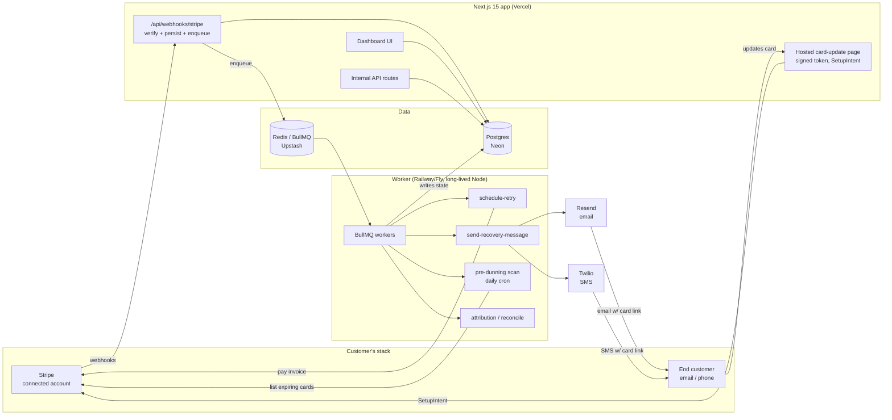

# Dunly Architecture

## Stack & Rationale

| Layer | Choice | Why |
|---|---|---|
| Web app + API | **Next.js 15 (App Router) + TypeScript** | One deployable for dashboard, marketing pages, webhook endpoints, and hosted card-update pages. Route handlers are fine for webhook ingestion because we do near-zero work inline (verify, persist, enqueue). |
| Database | **Postgres (Neon) + Drizzle ORM** | The whole domain is relational (orgs -> accounts -> customers -> invoices -> attempts). Drizzle gives typed schema-as-code and plain SQL when needed; drizzle-kit handles migrations. Neon: serverless, branches for preview envs, cheap at small scale. |
| Queue | **BullMQ on Redis (Upstash)** | Retry scheduling is the core of the product: delayed jobs, per-org rate limiting, exponential backoff, and dead-letter handling are exactly BullMQ's feature set. Cron-style repeatables cover the pre-dunning daily scan. |
| Worker | **Standalone Node process (`src/worker`)** | Retries and message sends must not depend on serverless timeouts or web deploys. Runs on Railway/Fly/Render as a long-lived process, same codebase, shares `src/db` and `src/lib`. |
| Payments platform | **Stripe Connect (OAuth) + webhooks** | Read/write on connected accounts: list invoices, pay invoices (retries), create SetupIntents for card updates, listen to `invoice.*`, `customer.*`, `payment_method.*` events. |
| Email | **Resend** | Simple API, React Email templates, per-domain sending with SPF/DKIM -- we need per-customer subdomains for deliverability isolation. |
| SMS | **Twilio** | Boring and reliable. Programmable Messaging + 10DLC registration for US traffic. |
| Auth | **Auth.js (NextAuth v5)** | Email magic-link + Google OAuth; org-scoped sessions. No need for anything heavier. |
| Styling | **Tailwind CSS v4** | Dashboard-speed UI development. |

## System Diagram

## Data Model

All tables keyed by `id` (uuid), timestamps `created_at` / `updated_at` implied. Multi-tenancy: everything hangs off `organization_id`.

- **organizations** -- tenant root. `name`, `plan` (starter|growth|scale|performance), `billing_stripe_customer_id` (our own billing), `mrr_under_management_cents`, `settings` (jsonb: sender domain, branding, retry config overrides).
- **users** -- `organization_id`, `email`, `name`, `role` (owner|member). Auth.js accounts/sessions live alongside.
- **stripe_accounts** -- one per connected account. `organization_id`, `stripe_account_id`, `access_mode` (standard connect), `livemode`, `default_currency`, `webhook_status`, `backfill_completed_at`.
- **customers** -- mirror of Stripe customers we care about. `stripe_account_id`, `stripe_customer_id`, `email`, `phone`, `name`, `delinquent`, `sms_opt_in` (bool), `unsubscribed_at`.
- **subscriptions** -- `customer_id`, `stripe_subscription_id`, `status`, `mrr_cents`, `current_period_end`, `cancel_at_period_end`.
- **payment_methods** -- for pre-dunning. `customer_id`, `stripe_payment_method_id`, `brand`, `last4`, `exp_month`, `exp_year`, `is_default`.
- **payment_failures** -- the central work item; one per failing invoice. `subscription_id`, `customer_id`, `stripe_invoice_id`, `amount_due_cents`, `currency`, `decline_code`, `failure_reason`, `status` (open|recovering|recovered|lost|canceled), `first_failed_at`, `resolved_at`, `resolution` (dunly_retry|dunly_message|stripe_auto|customer_direct|null).
- **recovery_campaigns** -- a configured sequence template per org. `organization_id`, `type` (dunning|pre_dunning), `trigger` (payment_failed|card_expiring), `steps` (jsonb: [{offset_hours, channel: email|sms, template_id}]), `retry_schedule` (jsonb: [{offset_hours}]), `active`.
- **recovery_attempts** -- one row per retry we execute. `payment_failure_id`, `scheduled_for`, `executed_at`, `bullmq_job_id`, `result` (succeeded|failed|skipped), `decline_code`, `stripe_payment_intent_id`.
- **messages** -- one row per email/SMS sent. `payment_failure_id` (nullable for pre-dunning), `customer_id`, `campaign_id`, `step_index`, `channel` (email|sms), `provider_message_id`, `status` (queued|sent|delivered|bounced|complained|clicked), `card_update_token`, `sent_at`.
- **webhook_events** -- raw ingestion log for idempotency + replay. `stripe_account_id`, `stripe_event_id` (unique), `type`, `payload` (jsonb), `processed_at`, `error`.
- **recovered_revenue_events** -- the attribution ledger the dashboard and our Performance-plan billing read from. `organization_id`, `payment_failure_id`, `amount_cents`, `currency`, `attributed_to` (retry|email|sms|baseline), `recovery_attempt_id` (nullable), `message_id` (nullable), `recovered_at`.
- **audit_log** -- every action we take on a connected account. `organization_id`, `actor` (system|user_id), `action`, `target`, `metadata` (jsonb).

## Key Flows

### 1. Webhook ingestion -> failure detection -> retry scheduling

1. Stripe POSTs to `/api/webhooks/stripe` (Connect events, single endpoint for all accounts).
2. Route handler verifies the signature (`STRIPE_WEBHOOK_SECRET`), inserts into `webhook_events` with `stripe_event_id` unique constraint (duplicate = ack 200 and stop -- idempotency).
3. Handler enqueues a lightweight `process-webhook` job and returns 200 in <1s. No business logic inline.
4. Worker processes the event. On `invoice.payment_failed`: upsert customer/subscription mirrors, create `payment_failures` row (status `open` -> `recovering`).
5. Worker checks whether Stripe Smart Retries are active on that invoice; if so, our retry engine defers (suppression window) and we only run the messaging sequence -- never double-retry.
6. `schedule-retry` computes the retry plan from the org's campaign config (default: +1d, +3d, +7d, +14d, nudged toward local morning and start-of-month/payday heuristics) and enqueues BullMQ delayed jobs, one `recovery_attempts` row each.
7. On each attempt execution: call Stripe `invoices.pay` with an idempotency key; record result. Hard declines (`stolen_card`, `card_declined/do_not_honor` variants judged permanent) short-circuit remaining retries and lean on the message sequence instead.
8. On `invoice.paid` (any source): cancel outstanding retry jobs and message steps, mark failure `recovered`, hand off to attribution (flow 4).

### 2. Pre-dunning card-expiry flow

1. Daily cron job (BullMQ repeatable) scans `payment_methods` for default cards with `exp_year/exp_month` = this month or next, joined to active subscriptions. (Kept fresh via `payment_method.updated` / `customer.updated` webhooks plus periodic re-sync.)
2. For each match without an already-active pre-dunning sequence, start the org's `pre_dunning` campaign: typically email at T-21d, T-7d, and T-1d before the first renewal on the expiring card.
3. Each message contains a signed card-update link (flow 3's hosted page).
4. If the card is updated (webhook `payment_method.attached` / SetupIntent succeeded), the sequence stops and we record a `recovered_revenue_events` row with `attributed_to` based on the last touch, amount = next renewal amount (reported separately from dunning recoveries as "prevented failures").
5. If the renewal fails anyway, the normal dunning flow (flow 1) takes over.

### 3. Recovery email/SMS sequence

1. When a `payment_failures` row enters `recovering`, the worker schedules the org's campaign steps as delayed `send-recovery-message` jobs (default: email at +1h, +3d, +7d; SMS at +5d on Growth+).
2. Before each send: re-check failure status (skip if recovered/canceled), check suppression (unsubscribed, bounced, `sms_opt_in` false for SMS).
3. Render template (React Email via Resend; plain text via Twilio) with merge tags and a **signed card-update token** (JWT, 30-day expiry, scoped to customer + failure).
4. Hosted card-update page: token -> lookup -> create Stripe SetupIntent on the connected account -> Stripe Elements form -> on success, set as default payment method and immediately enqueue an off-schedule retry.
5. Delivery webhooks from Resend/Twilio update `messages.status`; bounces and complaints feed the suppression list.
6. Sequence ends on: recovery, exhaustion (mark `lost`), or subscription cancellation. Final-step option per org: cancel the subscription or leave `past_due`.

### 4. Recovered-revenue attribution

1. Trigger: `invoice.paid` for an invoice that has a `payment_failures` row.
2. Determine cause, conservatively and in priority order:
   - Payment intent matches one of our `recovery_attempts` -> `attributed_to = retry`.
   - Card was updated via our hosted page, or payment landed within 24h of a click/delivery on one of our messages -> `attributed_to = email|sms` (last-touch, `message_id` linked).
   - Otherwise (Stripe's own retry succeeded, or customer paid through other means) -> `attributed_to = baseline`. **Baseline is displayed but never counted in "recovered by Dunly" or billed on the Performance plan.**
3. Insert `recovered_revenue_events` row; update dashboard aggregates.
4. Performance-plan invoicing reads this ledger monthly: 25% of non-baseline recovered revenue, capped at $2,000.

## Third-Party Services & Rough Pricing

| Service | Role | Rough cost |
|---|---|---|
| Stripe | Connect platform + our own billing | No platform fee for Connect OAuth apps; our own billing costs 2.9% + 30c on our subscriptions. Retries on connected accounts cost the *customer's* normal Stripe fees, not ours. |
| Neon (Postgres) | Primary DB | Free tier -> ~$19/mo (Launch) -> ~$69/mo as data/branches grow |
| Upstash (Redis) | BullMQ backend | Free tier -> ~$10-20/mo pay-per-request at moderate job volume |
| Vercel | Next.js hosting | Hobby free -> Pro $20/mo/seat |
| Railway / Fly.io | Worker process | ~$5-20/mo for a small always-on Node service |
| Resend | Email | Free 3k emails/mo -> $20/mo for 50k -> $90/mo for 200k. Dunning volume is low per customer (~5-50 emails/customer/mo). |
| Twilio | SMS | ~$0.0079/SMS (US) + ~$1.15/mo per number + one-time ~$4-15/mo 10DLC brand/campaign fees |
| Sentry | Errors | Free tier -> ~$26/mo |
| Posthog or Plausible | Product analytics | Free tier -> ~$9-20/mo |

## Estimated Monthly Running Cost

| Scale | Assumptions | Estimate |
|---|---|---|
| **0 customers (dev/preview)** | All free tiers: Neon free, Upstash free, Vercel Hobby, one $5 worker, Resend free | **~$5-10/mo** |
| **100 customers** | ~$12k MRR for us. ~30k emails/mo, ~2k SMS/mo, Neon Launch, Upstash paid, Vercel Pro, worker $10, Sentry | Neon $19 + Upstash $15 + Vercel $20 + worker $10 + Resend $20 + Twilio ~$25 + Sentry $26 = **~$135-150/mo** (~1% of revenue) |
| **1,000 customers** | ~$120k MRR for us. ~400k emails/mo, ~30k SMS/mo, bigger DB, redundant workers | Neon ~$150 + Upstash ~$50 + Vercel ~$60 + workers ~$50 + Resend ~$150 + Twilio ~$300 + observability ~$80 = **~$800-1,000/mo** (<1% of revenue) |

Margin stays >90% on infrastructure at every stage; the real costs are support and deliverability babysitting, not compute.
