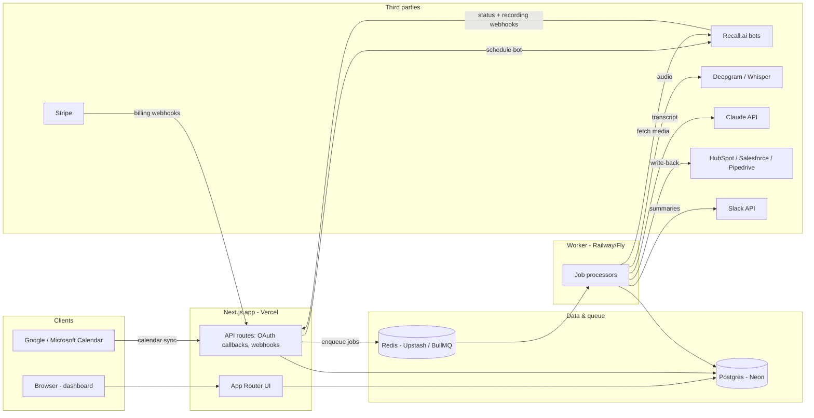

# Briefcast -- Architecture

## Stack & Rationale

| Layer | Choice | Why |
|---|---|---|
| Web app | Next.js 15 (App Router) + TypeScript | One codebase for marketing site, dashboard, and API routes (webhooks, OAuth callbacks). RSC keeps the meeting library fast without a client-heavy SPA. |
| Styling | Tailwind CSS v4 | Fast iteration, no design-system overhead at this stage. |
| Database | Postgres (Neon) + Drizzle ORM | Relational fits the domain (orgs -> meetings -> transcripts -> action items -> CRM sync logs). Drizzle gives typed schema-as-code and cheap migrations. Neon for serverless-friendly connections and branching. |
| Queue | BullMQ on Redis (Upstash) | Meeting processing is a multi-step async pipeline (transcribe -> extract -> deliver -> sync) with retries and backoff; BullMQ is the boring proven choice. |
| Worker | Long-running Node process (Railway/Fly) | Webhook handlers must return fast; all heavy lifting (media download, transcription polling, LLM calls, CRM writes) happens in the worker. Deployed separately from the Next.js app. |
| Meeting bots | Recall.ai | Unified bot API for Zoom/Meet/Teams. Building and maintaining bots per-platform is a company-sized problem; renting it is the only sane MVP path. Abstracted behind `src/lib/recall.ts` in case we ever swap. |
| Transcription | Deepgram (primary), Whisper via API (fallback) | Deepgram nova is cheap (~$0.0043/min), fast, good diarization. Whisper as quality fallback / second opinion. |
| Extraction | Claude API | Structured extraction (summary, decisions, action items, CRM field proposals) from long transcripts; strong long-context handling and reliable JSON output. |
| CRM / Slack | OAuth apps per provider | HubSpot first, then Pipedrive, Salesforce. Common interface in `src/lib/crm/types.ts`, one adapter per provider. |
| Billing | Stripe (per-seat subscriptions) | Seat quantity synced from active org members; webhooks drive entitlements. |
| Email | Resend | Transactional: consent notices, digests, trial emails. |
| Auth | Auth.js (Google/Microsoft OAuth) | Calendar scopes ride on the same OAuth providers users sign in with. |

## System Diagram

## Data Model

Multi-tenant by `org_id` on every table. Types below are indicative, not exhaustive.

- **organizations** -- `id`, `name`, `slug`, `plan` (starter|pro|business), `stripe_customer_id`, `settings` (jsonb: consent mode, auto-apply CRM updates, retention days), `created_at`
- **users** -- `id`, `org_id`, `email`, `name`, `role` (admin|member), `bot_join_rule` (all|external_only|opt_in), `slack_user_id`, `created_at`
- **calendar_connections** -- `id`, `user_id`, `provider` (google|microsoft), `access_token`, `refresh_token` (encrypted), `scopes`, `sync_token`, `status`, `last_synced_at`
- **meetings** -- `id`, `org_id`, `organizer_user_id`, `calendar_event_id`, `title`, `platform` (zoom|meet|teams), `join_url`, `starts_at`, `ends_at`, `attendees` (jsonb), `is_external`, `status` (scheduled|recording|processing|ready|failed|skipped)
- **bots** -- `id`, `meeting_id`, `recall_bot_id`, `status` (scheduled|joining|in_call|done|failed), `recording_url`, `media_expires_at`, `error`, `raw_events` (jsonb)
- **transcripts** -- `id`, `meeting_id`, `provider` (deepgram|whisper), `language`, `duration_seconds`, `word_count`, `status`, `created_at`
- **transcript_segments** -- `id`, `transcript_id`, `idx`, `speaker_label`, `speaker_user_id?`, `start_ms`, `end_ms`, `text`
- **summaries** -- `id`, `meeting_id`, `model`, `overview`, `decisions` (jsonb), `risks` (jsonb), `crm_field_proposals` (jsonb: property, proposed value, confidence, evidence segment ids), `token_usage` (jsonb), `created_at`
- **action_items** -- `id`, `meeting_id`, `text`, `owner_name`, `owner_user_id?`, `due_date?`, `source_segment_id`, `status` (open|done|dismissed), `synced_to_crm` (bool)
- **crm_connections** -- `id`, `org_id`, `provider` (hubspot|salesforce|pipedrive), `access_token`, `refresh_token` (encrypted), `portal_id`, `field_mappings` (jsonb: Briefcast field -> CRM property), `write_mode` (review|auto), `status`
- **crm_sync_logs** -- `id`, `org_id`, `meeting_id`, `crm_connection_id`, `operation` (log_meeting|update_field|create_task), `target_object` (contact|company|deal), `target_id`, `field?`, `old_value?`, `new_value?`, `status` (pending|applied|rejected|failed), `error?`, `applied_by?`, `created_at`
- **deals** -- `id`, `org_id`, `crm_connection_id`, `external_id`, `name`, `stage`, `amount`, `close_date`, `owner`, `last_meeting_at`, `signals` (jsonb rolling summary) -- local mirror of CRM deals for the per-deal timeline
- **meeting_deal_links** -- `id`, `meeting_id`, `deal_id`, `match_method` (attendee_email|manual|domain), `confidence`
- **subscriptions** -- `id`, `org_id`, `stripe_subscription_id`, `plan`, `seat_count`, `status` (trialing|active|past_due|canceled), `current_period_end`, `recording_hours_used_period`

## Key Flows

### 1. Calendar-triggered bot join -> summary

1. Calendar sync (poll + push channel) finds an upcoming event with a Zoom/Meet/Teams link; creates a `meetings` row; applies the user's `bot_join_rule`.
2. App schedules a Recall.ai bot for the join URL at start time (`bots` row with `recall_bot_id`); bot displays consent name ("Briefcast Notetaker").
3. Recall.ai posts status webhooks to `/api/webhooks/recall` (joining, in_call, done, failed). Handler verifies signature, updates `bots.status`, returns 200 fast.
4. On `done` (recording ready), handler enqueues `transcribe` job. Worker fetches media URL from Recall, streams audio to Deepgram, stores `transcripts` + `transcript_segments`, maps diarized speakers to attendees where possible.
5. Worker enqueues `extract-insights`: builds Claude prompt from segments + meeting metadata + linked-deal context; validates JSON output against Zod schema; stores `summaries` + `action_items` + CRM field proposals. Retries with repair prompt on invalid output.
6. Worker enqueues delivery jobs (Slack, CRM sync) and marks meeting `ready`. Failures at any step mark the meeting `failed` with a user-visible reason and are retried with exponential backoff.

### 2. CRM OAuth connect + write-back

1. Admin clicks "Connect HubSpot" -> OAuth authorize -> callback stores tokens in `crm_connections`; we pull pipelines, deal properties, and owners to seed `field_mappings` (defaults: next step -> `hs_next_step`, etc., editable in settings).
2. After each processed meeting, worker matches attendees' email domains/addresses to CRM contacts and open deals; writes `meeting_deal_links` (confidence-scored; ambiguous matches ask the user in the UI).
3. Sync job composes operations: log meeting engagement with summary, create tasks from action items, propose field updates from `summaries.crm_field_proposals`. Each operation is a `crm_sync_logs` row.
4. In `review` mode (default), proposals sit pending until a user approves in the UI or Slack; in `auto` mode, high-confidence updates apply immediately. All writes are idempotent (external ids + operation keys), record old/new values, and are individually retryable. Token refresh handled per provider; a revoked connection flips status and notifies the admin.

### 3. Slack delivery

1. Org admin installs the Slack app (OAuth, bot token stored on org); users optionally map themselves to Slack ids.
2. After extraction, `deliver-slack` job posts: DM to the meeting organizer with summary, action items (with owners), and pending CRM proposals with approve/dismiss buttons; optionally posts to a configured channel per team or per deal.
3. Slack interactivity payloads hit `/api/webhooks/slack` (signature-verified) and resolve approvals into `crm_sync_logs` transitions.

### 4. Per-seat billing (Stripe)

1. Org starts a 14-day trial (no card) on Pro. Admin adds card -> Stripe Checkout creates a subscription with `quantity = active seats`.
2. Inviting/removing members updates the subscription quantity (proration on) via API; a nightly reconcile job fixes drift.
3. Stripe webhooks (`/api/webhooks/stripe`): `checkout.session.completed`, `customer.subscription.updated/deleted`, `invoice.payment_failed` -> update `subscriptions`, gate features by plan, dunning emails via Resend.
4. Recording-hour usage is metered per period against plan limits; soft warnings at 80%, bots stop being scheduled past the cap (Starter/Pro).

## Third-Party Services & Rough Pricing

| Service | Purpose | Rough cost |
|---|---|---|
| Recall.ai | Meeting bots + recording | ~$0.70-1.00 per recorded hour (volume-tiered); largest COGS line |
| Deepgram | Transcription | ~$0.0043/min (~$0.26/hr) nova tier |
| Claude API | Extraction | A 1-hour call is ~9k words -> ~15k input tokens + context, ~2k output; on a Sonnet-class model roughly $0.05-0.10 per meeting, call it ~$0.10 with deal context and retries |
| Stripe | Billing | 2.9% + $0.30 per transaction |
| Resend | Email | Free to ~3k/mo, then ~$20/mo |
| Neon | Postgres | Free tier -> ~$25-70/mo |
| Upstash | Redis/queue | Free tier -> ~$10-30/mo |
| Vercel | Next.js hosting | Free/Pro $20/mo |
| Railway/Fly | Worker | ~$10-40/mo |

**Per-meeting-hour COGS: ~$1.05-1.35** (Recall ~$0.85 avg + Deepgram ~$0.26 + Claude ~$0.10).

## Estimated Monthly Running Cost

Assumption: **1 customer = 1 org averaging 4 seats; each seat records ~5 meetings/week at ~45 min = ~15 hrs/user/mo.** COGS scales with recorded hours, not seats -- this assumption is the whole model, so revisit it with real usage data.

| | 0 customers | 100 customers (~400 seats) | 1,000 customers (~4,000 seats) |
|---|---|---|---|
| Recorded hours/mo | 0 | ~6,000 | ~60,000 |
| Recall.ai (~$0.85/hr avg) | $0 | ~$5,100 | ~$45,000 (volume pricing assumed ~$0.75) |
| Deepgram (~$0.26/hr) | $0 | ~$1,550 | ~$15,500 |
| Claude (~$0.13/meeting, ~1.33 meetings/hr) | $0 | ~$1,050 | ~$10,500 |
| Infra (Vercel, Neon, Upstash, worker, Resend, misc) | ~$0-25 (free tiers) | ~$250 | ~$1,500 |
| **Total** | **~$25** | **~$8,000** | **~$72,500** |
| Revenue @ ~$35 avg/seat | $0 | ~$14,000 MRR | ~$140,000 MRR |
| Gross margin | -- | ~43% | ~48% |

Notes: margin at these usage levels is uncomfortably low for SaaS -- which is exactly why plan hour-caps exist and why average real-world usage (many seats record far less than 15 hrs/mo) matters. At a more typical observed ~8 hrs/user/mo, COGS roughly halves and gross margin lands ~70%. Track hours-per-seat cohorts from day one; renegotiate Recall volume pricing at ~10k hrs/mo.
