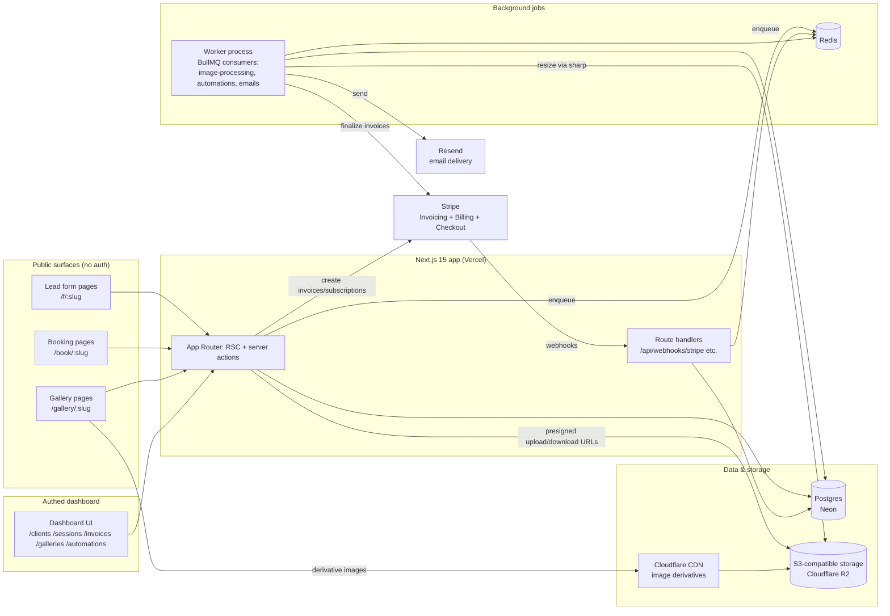

# LensCRM Architecture

## Stack

| Layer | Choice | Rationale |
|---|---|---|
| Web app | Next.js 15 (App Router) + TypeScript | One codebase serves both the authed dashboard and the public-facing surfaces (lead forms, booking pages, galleries). Public pages need SEO + fast cold loads (RSC/streaming); dashboard needs rich interactivity. Route groups keep them cleanly separated. |
| Styling | Tailwind CSS 4 | Fast iteration; gallery pages need custom, image-forward layouts more than a component kit. |
| Database | Postgres (Neon) + Drizzle ORM | Relational data with real integrity needs (bookings <-> invoices <-> contracts). Drizzle gives typed schema-as-code and cheap migrations. Neon for serverless-friendly pooling and branch-per-PR dev databases. |
| Payments | Stripe: Checkout + **Stripe Invoicing** + Billing | See below. |
| Object storage | S3-compatible (Cloudflare R2 primary target) | Gallery originals and derivatives. R2 chosen for zero egress fees -- galleries are download-heavy, and S3 egress ($0.09/GB) would dwarf storage cost. Code targets the S3 API so AWS S3/Backblaze B2 remain drop-in. |
| Image processing | sharp in background workers, pre-generated derivative sizes | See "why not a gallery CDN service" below. |
| Email | Resend + React Email templates | Transactional + automation sends; good deliverability tooling, templates as TSX components in-repo. |
| Jobs/queues | BullMQ + Redis (Upstash/managed) | Image processing pipelines and the automation scheduler need retries, delays, and scheduled jobs. Vercel cron alone can't do per-job retry/backoff for thousands of image jobs. |
| Booking engine | Custom, cal-style (in `src/lib/booking.ts`) | Availability-rule + slot-generation logic over our own tables. Cal.com embed was considered and rejected: booking must be tied to booking types with deposits and contract flows, which requires owning the data model. |
| Auth | Auth.js (NextAuth v5), email magic link + Google | Photographers are non-technical; passwordless reduces support load. Session-based, single workspace per account at MVP. |
| Hosting | Vercel (app) + small worker host (Railway/Fly) for BullMQ consumers | Vercel functions can't run long-lived queue consumers; the worker is a separate, tiny Node process. |

### Why not a separate gallery CDN service (imgix / Cloudinary / Pixieset-style infra)?

- **Cost shape.** Cloudinary/imgix price on transformations and bandwidth; at gallery scale (a wedding gallery is 800-2,000 images viewed by dozens of guests) this becomes a per-customer cost that scales faster than our $24 ARPU. Pre-generating a fixed set of derivatives (thumb 400px, web 1600px, full 2560px + original) with sharp at upload time is a one-time compute cost per image, then plain object serving.
- **R2 + Cloudflare CDN gives us caching for free.** Public gallery derivatives are immutable (content-hashed keys), so cache-hit ratios are high and egress is $0 on R2.
- **On-the-fly resizing is deferred, not rejected.** If we later need arbitrary sizes (client apps, print crops), Cloudflare Image Resizing can be layered in front of R2 without changing storage. Starting with it would be premature spend.
- **Originals never go through the CDN.** Downloads of originals use short-lived presigned URLs directly against the bucket, gated by gallery permissions and per-tier download rules.

### Why Stripe Invoicing (not homegrown invoices + PaymentIntents)?

- Stripe Invoices give us hosted invoice pages, PDF generation, receipt emails, partial payments, and automatic reconciliation via webhooks -- all things we'd otherwise rebuild badly. Our `invoices` table stores the business meaning (which session, deposit vs. balance, due dates); Stripe stores the payment truth.
- **Deposits map cleanly:** a booking produces two Stripe invoices -- a retainer invoice due immediately (booking confirms on `invoice.paid`) and a balance invoice with a future due date, auto-finalized T-N days before the session by our scheduler. No custom installment engine.
- Stripe Billing separately handles **our own** SaaS subscriptions (the three tiers). Two distinct Stripe usages, one webhook endpoint, discriminated by event object metadata.
- Cost note: Stripe Invoicing adds 0.4-0.5% on invoice payments beyond base processing fees. Photographers pay Stripe's fees on their client payments (we take no cut); we absorb nothing.

## System Diagram

## Data Model

All tables carry `id` (uuid pk), `createdAt`, `updatedAt`; tenant-scoped tables carry `accountId` FK. Only distinctive fields listed.

**accounts** (the photographer/studio workspace)
- `name`, `slug` (public URL namespace), `email`, `timezone`
- `plan` (`solo | studio | pro`), `stripeCustomerId`, `stripeSubscriptionId`, `subscriptionStatus`
- `storageUsedBytes`, `storageQuotaBytes`, `brandLogoUrl`, `brandColor`, `customDomain`

**users** (team seats within an account)
- `accountId`, `email`, `name`, `role` (`owner | member`), `authProviderId`

**lead_forms**
- `accountId`, `name`, `slug`, `shootType` (`wedding | newborn | family | portrait | commercial | other`)
- `fields` (jsonb: ordered field definitions), `successMessage`, `notifyEmails`, `isActive`

**leads**
- `accountId`, `leadFormId?`, `name`, `email`, `phone?`
- `shootType`, `eventDate?`, `budget?`, `message`, `answers` (jsonb, raw form submission)
- `stage` (`inquiry | consult | proposal | booked | lost`), `source`, `convertedClientId?`

**clients**
- `accountId`, `name`, `email`, `phone?`, `address?`, `notes`
- `partnerName?` (weddings), `leadId?` (origin), `archivedAt?`

**booking_types**
- `accountId`, `name`, `slug`, `shootType`, `durationMinutes`, `locationMode` (`studio | onLocation | video | phone`)
- `priceCents`, `depositPercent`, `bufferBeforeMinutes`, `bufferAfterMinutes`, `minNoticeHours`, `maxAdvanceDays`
- `contractTemplateId?`, `isActive`

**availability_rules**
- `accountId`, `userId?` (per-shooter in Studio/Pro)
- `kind` (`weekly | dateOverride | blackout`), `weekday?`, `startTime?`, `endTime?`, `date?`, `timezone`

**sessions** (bookings)
- `accountId`, `clientId`, `bookingTypeId?`, `userId?` (assigned shooter)
- `title`, `startsAt`, `endsAt`, `timezone`, `location?`
- `status` (`pending | confirmed | completed | cancelled | rescheduled`) -- `pending -> confirmed` on retainer payment
- `contractId?`, `notes`, `rescheduledFromId?`

**contract_templates**
- `accountId`, `name`, `shootType?`, `body` (rich text with merge fields like `{{client.name}}`, `{{session.date}}`, `{{invoice.total}}`)

**contracts**
- `accountId`, `clientId`, `sessionId?`, `templateId?`
- `body` (frozen snapshot at send time), `status` (`draft | sent | viewed | signed | declined | voided`)
- `sentAt`, `signedAt`, `signedPdfKey?` (object storage key), `documentSha256` (tamper evidence)

**signatures**
- `contractId`, `signerName`, `signerEmail`, `signerRole` (`client | photographer`)
- `signatureData` (typed name or drawn strokes), `consentedAt` (e-business consent), `signedAt`, `ipAddress`, `userAgent`

**invoices**
- `accountId`, `clientId`, `sessionId?`, `kind` (`deposit | balance | full | custom`)
- `stripeInvoiceId`, `status` (`draft | open | paid | void | uncollectible`), `currency`
- `subtotalCents`, `taxCents`, `totalCents`, `dueAt`, `paidAt`, `hostedInvoiceUrl`

**invoice_items**
- `invoiceId`, `description`, `quantity`, `unitAmountCents`

**payments**
- `invoiceId`, `accountId`, `stripePaymentIntentId`, `amountCents`, `status` (`succeeded | failed | refunded`), `method?`, `paidAt`

**galleries**
- `accountId`, `clientId?`, `sessionId?`, `name`, `slug`
- `status` (`draft | processing | published | expired`), `coverImageId?`
- `passwordHash?`, `downloadPolicy` (`none | web | originals`), `watermarkEnabled`, `expiresAt?`, `deliveredAt?`
- `totalBytes` (rolls up into account storage usage)

**gallery_images**
- `galleryId`, `filename`, `originalKey`, `sizeBytes`, `width`, `height`, `contentHash`
- `derivatives` (jsonb: `{thumb, web, full}` -> object keys), `processStatus` (`uploaded | processing | ready | failed`), `sortOrder`

**image_selections** (proofing)
- `galleryImageId`, `galleryId`, `selectionSet` (`favorites | finalPicks | printOrder`)
- `selectedBy` (client identifier: email or gallery visitor token), `comment?`, `selectedAt`

**email_automations**
- `accountId`, `name`, `trigger` (`booking_confirmed | contract_signed | invoice_paid | gallery_published | session_scheduled`)
- `offsetMinutes` (signed; e.g. -2880 = T-48h before session start), `templateSlug`, `subject`, `body` (mjml/react-email ref + merge fields), `shootTypeFilter?`, `isActive`

**automation_runs**
- `automationId`, `accountId`, `sessionId?`, `clientId?`
- `scheduledFor`, `status` (`scheduled | sent | skipped | failed | cancelled`), `dedupeKey` (unique -- prevents double sends), `sentAt`, `error?`, `resendMessageId?`

## Key Flows

### 1. Lead -> booking -> contract -> deposit (the money path)

1. Visitor submits a **lead form** (`/f/:slug`, public). Server action validates with zod, creates `leads` row (stage `inquiry`), enqueues `lead-notify` job -> photographer gets an email.
2. Photographer replies from the lead inbox; sends the lead a **booking link** for a booking type (or the lead self-books directly if the form is wired to one).
3. Booking page (`/book/:slug`) computes free slots: availability rules minus existing sessions minus buffers (all in `src/lib/booking.ts`). Client picks a slot -> `sessions` row created with status `pending`; lead stage -> `booked` pipeline pending payment; client record created/linked.
4. Contract generated from the booking type's **contract template**: merge fields resolved, body frozen into `contracts` (status `sent`), e-sign email sent. Client opens signing page, consents to electronic business, signs (drawn or typed) -> `signatures` row with IP/UA/timestamps; signed PDF rendered, stored to R2, `documentSha256` recorded; status `signed`.
5. On signature, the **deposit invoice** is created: Stripe Invoice for `depositPercent` of the package, due on receipt, plus a draft balance invoice due T-14d before the session. Client pays the hosted Stripe invoice.
6. Stripe webhook `invoice.paid` hits `/api/webhooks/stripe`: signature verified, `invoices.status -> paid`, `payments` row inserted, and -- if it was the deposit -- `sessions.status -> confirmed`. Automation triggers fire (`booking_confirmed` email, shoot-reminder scheduled).

### 2. Gallery upload -> processing -> proofing -> delivery

1. Photographer creates a gallery for a session and uploads JPEGs. Browser requests **presigned PUT URLs** in batches; files go directly to R2 (never through the Next.js server). Each completed upload creates a `gallery_images` row (`processStatus: uploaded`) and enqueues an `image-process` job.
2. Worker consumes jobs: downloads original, uses **sharp** to emit thumb/web/full derivatives (optionally watermarked), writes them to R2 under content-hashed keys, updates `derivatives` + `processStatus: ready`, increments gallery/account byte counters (quota enforced here -- uploads rejected when over quota).
3. Photographer publishes: gallery status `published`, optional password + expiry; `gallery_published` automation sends the client the link.
4. Client browses (`/gallery/:slug`), hearts favorites and marks final picks -> `image_selections` rows (visitor identified by email gate or signed visitor token). Photographer sees selection sets in the dashboard and exports the pick list.
5. Delivery: per `downloadPolicy`, client downloads web-size images via CDN or originals via short-lived presigned GETs; bulk download runs as a worker job that builds a zip in R2 and emails an expiring link.

### 3. Automation scheduler (shoot reminder T-48h)

1. When a session is confirmed, the app evaluates active `email_automations` for the account. The "shoot reminder" automation (`trigger: session_scheduled`, `offsetMinutes: -2880`) yields an `automation_runs` row: `scheduledFor = session.startsAt - 48h`, `dedupeKey = automation:session` (unique index makes re-evaluation idempotent).
2. A BullMQ **repeatable job** (every 5 min) claims due runs (`scheduledFor <= now AND status = scheduled`) with `FOR UPDATE SKIP LOCKED`.
3. For each run the worker re-validates preconditions (session still confirmed and in the future, client not unsubscribed) -- else marks `skipped`. Otherwise it renders the React Email template with merge data and sends via Resend; `status: sent`, `resendMessageId` stored. Failures retry with backoff (max 5), then `failed` and surfaced in the dashboard.
4. Reschedules/cancellations cancel and re-create pending runs via the dedupe key -- reminders always track the current session time.

## Third-Party Services & Pricing Notes

| Service | Role | Rough pricing |
|---|---|---|
| Stripe | Client payments (Invoicing) + our SaaS billing | 2.9% + $0.30 per card charge; Invoicing adds ~0.4-0.5%; Billing ~0.5-0.7% of our own subscription revenue. Photographers' processing fees pass through to them. |
| Cloudflare R2 | Gallery storage + serving | ~$0.015/GB-month storage, **$0 egress** (the reason it wins over S3 at ~$0.023/GB + $0.09/GB egress). Class A/B ops negligible at our scale. |
| Image resizing | sharp in our worker (pre-generated derivatives) | Compute only -- pennies per gallery on a small worker box. Cloudflare Image Resizing (~$0.50/1k unique transforms) is the later option for arbitrary sizes. |
| Resend | All email (transactional + automations) | Free to 3k emails/mo; ~$20/mo for 50k; ~$90/mo at 100k+. Automations average maybe 15-30 emails per active customer per month. |
| Neon | Postgres | Free tier for dev; ~$19-25/mo Launch tier covers early production; scales with compute hours + storage. |
| Vercel | App hosting | Free/Hobby for dev, $20/mo Pro; bandwidth is small because images never transit the app. |
| Railway/Fly + Upstash | Worker + Redis | ~$5-15/mo worker; Upstash Redis pay-per-request, ~$0-10/mo early on. |
| Auth.js | Auth | Free (library). |

## Estimated Monthly Running Cost

Assumptions: average photographer stores **60 GB** (mix of Solo near their 100 GB cap and lighter portrait shooters; JPEG-only, ~8 active galleries at 5-10 GB each with derivatives adding ~15% overhead). Storage is the only cost that scales linearly with customers -- everything else steps.

| Cost | 0 customers (dev) | 100 customers | 1,000 customers |
|---|---|---|---|
| R2 storage (60 GB avg x $0.015) | ~$0 | 6 TB -> ~$90 | 60 TB -> ~$900 |
| R2 egress | $0 | $0 | $0 |
| Neon Postgres | $0 (free tier) | ~$25 | ~$70-150 |
| Vercel | $0-20 | ~$20-40 | ~$150-250 (Pro + usage) |
| Worker + Redis | ~$5 | ~$15-25 | ~$50-100 |
| Resend | $0 | ~$20 | ~$90-150 |
| Stripe (on our ~$30 ARPU subs) | $0 | ~$100-120 (fees on ~$3k MRR) | ~$1,000-1,200 (fees on ~$30k MRR) |
| Misc (Sentry, DNS, backups) | ~$0 | ~$25 | ~$100 |
| **Total infra (excl. Stripe fees)** | **~$5-25/mo** | **~$200/mo (~$2/customer)** | **~$1,300-1,700/mo (~$1.50/customer)** |

Read: at ~$30 blended ARPU, infrastructure is ~6% of revenue and **storage is the dominant and only truly variable line** (~45-55% of infra at 1k customers). Margin protection = per-tier quotas, JPEG-only policy, derivative-size discipline, and gallery expiry defaults (expired galleries move to cheaper archive handling in Phase 3). If average storage per customer doubles to 120 GB, storage cost doubles to ~$1,800/mo at 1k customers -- still ~6% of revenue, but it is the number to watch on the dashboard.
