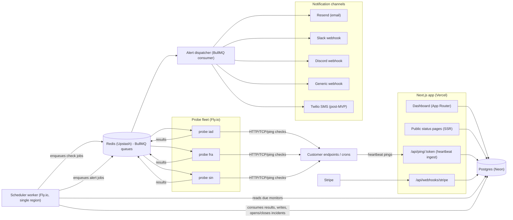

# PulseWatch — Architecture

## Stack

| Layer | Choice | Rationale |
|---|---|---|
| Dashboard + status pages | Next.js 15 (App Router), React 19, Tailwind CSS 4 | Server-rendered status pages get SEO + fast cold loads; one framework for marketing site, dashboard, and public pages |
| Language | TypeScript everywhere | One language across web, scheduler, and probe worker; shared types for check payloads/results |
| Database | Postgres (Neon) + Drizzle ORM | Relational fits the domain (monitors -> checks -> incidents); Drizzle gives typed schema shared by web and workers; Neon scales to zero in dev |
| Queue | Redis (Upstash) + BullMQ | Delayed/repeatable jobs, per-queue concurrency, retries with backoff — exactly the check-dispatch problem |
| Probe workers | Plain Node processes on Fly.io machines | See below |
| Billing | Stripe (Checkout + Billing portal + webhooks) | Standard; no reason to be clever |
| Email | Resend | Cheap transactional email, good DX |
| SMS (post-MVP) | Twilio | Boring and reliable; SMS is a paid-tier feature so cost passes through |

### Two deployment shapes

The design below — a scheduler, a regional probe fleet, and an alert dispatcher
talking over Redis — is the one that can confirm an outage from more than one
network, which is what makes the alerting trustworthy and what the paid plans
sell. It needs four always-on processes.

There is a second, smaller shape for a Vercel + Neon deployment with no Redis: a
single cron-triggered function runs the due checks inline, sweeps heartbeats, and
sends the alerts itself. Same schema, same incident engine, same guarantees about
confirmation and alert dedupe — but one region, so confirmation falls back to N
consecutive failures rather than N concurrent regions.

Nothing selects between them at build time. `REDIS_URL` decides: present means
queued, absent means inline (`src/lib/runtime.ts`). The two paths share the check
executor (`src/lib/check-runner.ts`) so they cannot drift. `DEPLOYING.md` covers
both, including the pricing-table consequence of shipping single-region.

### Why a single package, not a full monorepo split

The dashboard, scheduler, and probe worker share the majority of their code: the Drizzle schema, check-result types, incident logic, and alert dispatch. A pnpm-workspace/Turborepo split (`apps/web`, `apps/probe`, `packages/db`, ...) buys dependency isolation and independent versioning — neither matters for a solo/2-person team deploying everything from one repo on every merge. The costs of the split are real: workspace config, cross-package build orchestration, publish/link friction, and "which package does this live in" decisions on every file.

Instead: **one `package.json`, one `src/`, multiple entrypoints.** The web app deploys via `next build`; the scheduler and probe deploy as `tsx src/scheduler/index.ts` and `tsx src/probe/index.ts` in slim Node images. If the probe fleet ever needs a genuinely different dependency surface (e.g. raw-socket ICMP native modules), extract *then* — extraction is cheap, premature structure is not.

### Why Fly.io for multi-region probes

The core credibility requirement is confirming an outage from more than one network before alerting. Options considered:

- **Serverless (Lambda/Cloudflare Workers) per region** — attractive on paper, but per-invocation pricing is hostile to "small request every 60s forever," cold starts pollute latency measurements, and Workers can't do TCP/ICMP checks.
- **VPSes in 3 providers** — cheapest raw compute, but 3 providers × provisioning, patching, deploy pipelines is ops drag.
- **Fly.io machines** — one `fly deploy` fans the same Docker image out to `iad`, `fra`, `sin`. Each machine sets `PROBE_REGION` from Fly's env, connects outbound to Redis (no inbound surface), and costs a few dollars a month at shared-CPU size. Latency measurements come from a stable long-running process. Adding a region is a one-line config change.

Fly's occasional platform wobbles are mitigated by the fan-out itself: quorum logic tolerates one dead region, and the scheduler detects probe-heartbeat loss (probes are themselves monitored).

## System Diagram

Notes:
- Probes never touch Postgres; they only speak Redis. This keeps DB credentials off edge machines and makes probes stateless/disposable.
- The scheduler doubles as the result consumer and incident engine at MVP scale (single process, one region). Split later if needed.
- Status pages are served by the same Next.js app at MVP but designed to depend only on Postgres reads, so they can move to separate infra when trust demands it.

## Data Model

Field lists are indicative, not exhaustive; authoritative version lives in `src/db/schema.ts`.

- **users** — id, email, password_hash / oauth ids, name, created_at
- **teams** — id, name, slug, owner_user_id, plan (`free|solo|team`), stripe_customer_id, created_at
- **team_members** — team_id, user_id, role (`owner|admin|member`)
- **monitors** — id, team_id, name, type (`http|tcp|ping|heartbeat`), url_or_host, port, interval_seconds, regions (text[]), expected_status_codes, keyword, keyword_invert, request_headers (jsonb), timeout_ms, failure_threshold (N regions/consecutive), status (`up|down|paused|pending`), paused_at, created_at
- **check_results** — id, monitor_id, region, checked_at, ok (bool), status_code, latency_ms, error_kind, error_detail; partitioned/pruned by retention policy (highest-volume table)
- **incidents** — id, monitor_id, started_at, resolved_at, kind (`down|degraded|ssl_expiry|domain_expiry|missed_heartbeat`), trigger_summary
- **incident_updates** — id, incident_id, author_user_id (nullable for automated), body, posted_at, visibility (`public|private`)
- **heartbeats** — monitor_id (type=heartbeat), ping_token (unique), schedule_kind (`interval|cron`), expected_interval_seconds, cron_expression, grace_seconds, last_ping_at
- **heartbeat_pings** — id, heartbeat_monitor_id, received_at, source_ip, user_agent, exit_status (optional `/fail` variant), body_excerpt
- **ssl_certificates** — monitor_id, issuer, subject, not_after, last_scanned_at, days_remaining
- **domain_expiry** — monitor_id, domain, registrar, expires_at, last_whois_at
- **status_pages** — id, team_id, slug, title, custom_domain, custom_domain_verified, logo_url, published (bool)
- **status_page_monitors** — status_page_id, monitor_id, display_name, sort_order
- **alert_channels** — id, team_id, kind (`email|slack|discord|webhook|sms`), config (jsonb: address / webhook URL / phone), verified
- **alert_rules** — id, monitor_id (nullable = team default), alert_channel_id, notify_on (`down|recovery|ssl|domain|missed_heartbeat`), throttle_seconds
- **notifications** — id, incident_id, alert_channel_id, sent_at, status (`queued|sent|failed`), attempt, provider_message_id
- **subscriptions** — team_id, stripe_subscription_id, price_id, plan, status, current_period_end, cancel_at_period_end
- **usage_counters** — team_id, month, sms_sent (SMS credit metering)

## Key Flows

### 1. Scheduled check -> incident -> alert -> recovery

1. Scheduler ticks every second; queries monitors where `next_due_at <= now()` (kept as an indexed column, advanced on enqueue).
2. For each due monitor, enqueue one BullMQ job per configured region onto `checks:{region}` with a dedupe key `monitor:{id}:{tick}`.
3. Probe worker in each region pops jobs for its `PROBE_REGION`, runs the check (see `src/probe/checks/`), pushes a `CheckResult` onto the `results` queue.
4. Result consumer writes `check_results`, then evaluates incident state: a monitor flips to `down` only when >= `failure_threshold` regions report failure for the same tick (or N consecutive failures single-region on Free). This is the false-positive firewall.
5. On flip to `down`: insert `incidents` row, enqueue alert jobs per matching `alert_rules` onto `alerts` queue.
6. Alert dispatcher renders per-channel payloads and sends (Resend / Slack / Discord / webhook POST), recording `notifications` rows with retry + backoff; failures never block other channels.
7. On first successful quorum after `down`: set `incidents.resolved_at`, flip monitor to `up`, fan out recovery alerts through the same path.

### 2. Cron heartbeat

1. User creates a heartbeat monitor; gets `https://ping.pulsewatch.dev/api/ping/{token}`.
2. Their cron job appends `&& curl -fsS <url>` (or hits `/fail` on error). Ingest route validates token, inserts `heartbeat_pings`, updates `last_ping_at` — write-only hot path, no reads beyond token lookup.
3. Scheduler runs a missed-ping sweep each minute: a heartbeat is late when `now() > last_ping_at + expected_interval + grace` (or past the next cron-expression occurrence + grace).
4. Late heartbeat opens a `missed_heartbeat` incident through the same incident/alert pipeline as flow 1. Next successful ping auto-resolves it.

### 3. SSL / domain expiry daily scan

1. Daily repeatable job enumerates HTTP(S) monitors + explicit domain watches.
2. Probe performs a TLS handshake, records `not_after` into `ssl_certificates`; WHOIS lookup (rate-limited, cached) updates `domain_expiry`.
3. Threshold crossings (30/14/7/1 days) open advisory incidents (`ssl_expiry` / `domain_expiry`) — alert-generating but not "down" on status pages. Each threshold alerts once (tracked via `notifications`).

### 4. Public status page render

1. Request to `status.pulsewatch.dev/{slug}` (or a verified custom domain resolved via Host header) hits `src/app/(public)/status/[slug]/page.tsx`.
2. Server component loads the status page, its monitors, current status, and 90 days of daily uptime aggregates (materialized daily rollup table or cached aggregate query — never raw `check_results` scans on the public path).
3. Renders uptime bars, overall banner (operational / degraded / outage), and public incident history with updates. ISR/short-TTL cache (~30s) keeps DB load flat under HN-spike traffic.

## Third-Party Services & Rough Pricing

| Service | Role | Rough cost |
|---|---|---|
| Fly.io | Probe fleet + scheduler | shared-cpu-1x ~$2–5/machine/mo; 3 probe regions + 1 scheduler ≈ $10–20/mo |
| Neon | Postgres | Free tier in dev; Launch ~$19/mo; grows with `check_results` storage |
| Upstash | Redis / BullMQ | Pay-per-request; ~$0 dev, ~$10–50/mo at volume (check jobs are the driver) |
| Vercel | Next.js hosting | Hobby $0 -> Pro $20/mo |
| Stripe | Billing | 2.9% + $0.30 per transaction; no fixed cost |
| Resend | Alert + auth email | Free 3k/mo -> $20/mo |
| Twilio | SMS (post-MVP) | ~$0.0079/SMS US + $1.15/mo number; metered against plan credits |
| Domain + misc | pulsewatch.dev, ping subdomain | ~$3/mo amortized |

## Estimated Monthly Running Cost

The probe fleet is the defining fixed cost: three always-on regional machines cost the same whether they execute 3 checks or 300,000 checks per hour. Cost per customer *falls* as volume grows — this is the margin story.

| | 0 customers | 100 customers | 1,000 customers |
|---|---|---|---|
| Probe fleet + scheduler (Fly) | $15 | $20 | $40 (bump machine sizes, maybe +1 region) |
| Postgres (Neon) | $0 (free tier) | $19 | $69 (storage + compute for check_results) |
| Redis (Upstash) | $0 | $10 | $60 |
| Vercel | $0 | $20 | $20 |
| Resend | $0 | $20 | $20 |
| Twilio | $0 | $0 | ~$40 (covered by Team-tier SMS credits) |
| Domains/misc | $3 | $3 | $3 |
| **Total** | **~$18/mo** | **~$92/mo** | **~$250/mo** |

At 1,000 customers with ~40% paid at $12 blended ARPU, that's ~$4,800 MRR against ~$250 infra — ~95% gross margin. The main cost risks are `check_results` retention (mitigate with rollups + pruning) and free-tier check volume (mitigate with 5-min intervals and monitor caps).
