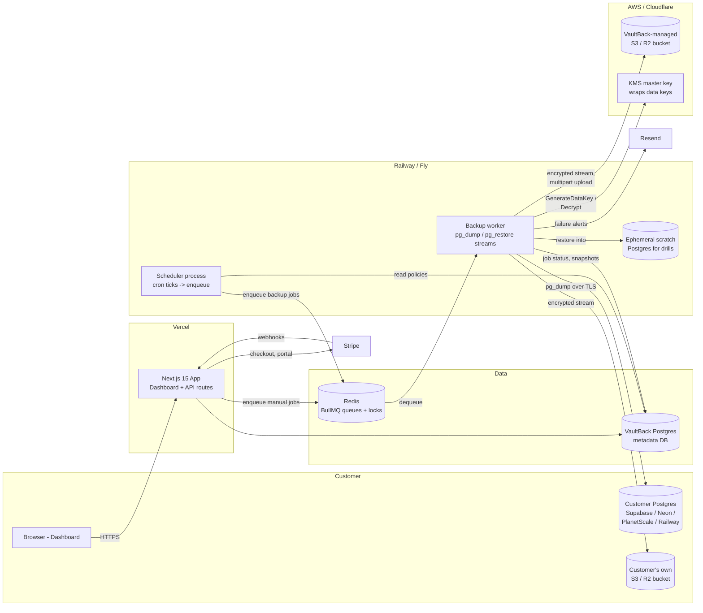

# VaultBack Architecture

## Stack & Rationale

| Layer | Choice | Why |
|---|---|---|
| Dashboard + API | Next.js 15 (App Router) + TypeScript | One deployable for marketing site, dashboard, and API routes; RSC keeps the dashboard fast with minimal client JS; the team (of one) stays in a single framework |
| ORM / DB | Drizzle ORM + Postgres | Typed schema-as-code, no codegen step, SQL-transparent (important for a product whose job is literally Postgres); our own metadata DB is small and boring |
| Queue | BullMQ + Redis | Battle-tested delayed jobs, retries with backoff, rate limiting, and job-level concurrency -- exactly the semantics a backup pipeline needs; Redis is also our scheduler lock |
| Worker | Standalone Node process (tsx/compiled) | Backups are long-running streaming jobs (minutes to hours) that must not live inside serverless request lifecycles; a plain Node process on Railway/Fly can run pg_dump binaries, hold streams open, and be scaled independently |
| Scheduler | Standalone Node process using BullMQ repeatable jobs + a tick loop | Cron semantics with drift detection; kept separate from the worker so a saturated worker pool never delays enqueueing (missed-schedule detection depends on enqueue happening on time) |
| Billing | Stripe (Checkout + Customer Portal + webhooks) | Standard; webhooks drive plan limits so the app never trusts client state |
| Styling | Tailwind CSS v4 | Fast to build a dense ops dashboard; no design system overhead |
| Auth | Auth.js (next-auth v5) with GitHub OAuth + email | Target users all have GitHub; magic-link email as fallback |
| Storage | AWS S3 and Cloudflare R2 (S3-compatible API) | One S3 client covers both; R2's zero egress matters for restores of large snapshots |
| Encryption | AES-256-GCM data keys wrapped by AWS KMS master key | Envelope encryption: snapshot data never touches KMS (only 32-byte keys do), so KMS cost is per-backup-cents while key compromise blast radius stays per-snapshot |
| Email | Resend | Failure alerts and drill reports; trivial API, good deliverability |
| Validation | Zod | Every API input, every job payload, every webhook body |

Deliberate non-choices: no Kubernetes (two long-lived processes and a web app do not need it), no WAL streaming at MVP (pg_dump snapshots are simpler, portable, and restorable anywhere; continuous archiving is a Phase 3 feature), no microservices (web/scheduler/worker is already the right seam).

## System Diagram

## Data Model

All tables have `id` (uuid, pk), `created_at`, `updated_at` unless noted.

**users** -- `email` (unique), `name`, `avatar_url`, `github_id` (nullable). Auth.js adapter tables (accounts, sessions) live alongside.

**organizations** -- `name`, `slug` (unique), `owner_user_id` (fk users). Membership via `organization_members` join table: `org_id`, `user_id`, `role` (`owner` | `admin` | `member`).

**subscriptions** -- `org_id` (fk, unique), `stripe_customer_id`, `stripe_subscription_id`, `plan` (`hobby` | `startup` | `business`), `status` (`active` | `past_due` | `canceled` | `trialing`), `current_period_end`, `cancel_at_period_end` (bool). Written only by the Stripe webhook handler; read for plan enforcement everywhere.

**database_connections** -- `org_id` (fk), `name`, `provider` (`supabase` | `neon` | `planetscale` | `railway` | `generic`), `encrypted_connection_string` (bytea; AES-256-GCM under a dedicated app key, never the snapshot key), `host_fingerprint` (for display without decryption), `postgres_version`, `approx_size_bytes`, `status` (`active` | `unreachable` | `disabled`), `last_checked_at`.

**storage_targets** -- `org_id` (fk), `kind` (`managed` | `byo_s3` | `byo_r2`), `bucket`, `region`, `endpoint` (nullable, for R2), `prefix`, `encrypted_credentials` (bytea, nullable -- managed targets have none), `verified_at`. One default per org.

**backup_policies** -- `database_connection_id` (fk), `storage_target_id` (fk), `frequency` (`hourly` | `daily`), `schedule_cron` (derived), `timezone`, `retention_days`, `enabled` (bool), `next_run_at` (indexed -- the scheduler's work queue), `drill_frequency` (`none` | `monthly` | `weekly`).

**backup_jobs** -- `policy_id` (fk), `database_connection_id` (fk, denormalized), `trigger` (`scheduled` | `manual` | `retry`), `status` (`queued` | `running` | `uploading` | `succeeded` | `failed`), `started_at`, `finished_at`, `bytes_processed`, `error_code`, `error_detail`, `attempt` (int), `bullmq_job_id`. The operational heartbeat table; heavily indexed by `(database_connection_id, created_at)`.

**snapshots** -- `backup_job_id` (fk), `database_connection_id` (fk), `storage_target_id` (fk), `object_key`, `size_bytes`, `compressed_size_bytes`, `sha256`, `wrapped_data_key` (bytea -- the KMS-encrypted AES key), `kms_key_id`, `pg_dump_version`, `schema_only` (bool), `expires_at` (retention), `deleted_at` (soft delete after pruning). The unit customers browse and restore from.

**restore_drills** -- `snapshot_id` (fk), `policy_id` (fk), `status` (`queued` | `restoring` | `verifying` | `passed` | `failed`), `scratch_instance` (identifier of ephemeral DB), `tables_expected` / `tables_restored` (int), `rowcount_checks` (jsonb -- per-table expected vs. actual), `duration_ms`, `error_detail`, `report_url` (nullable). Evidence store for the compliance report.

**audit_log** -- `org_id` (fk), `actor_user_id` (fk, nullable -- system events have none), `action` (e.g. `connection.created`, `backup.succeeded`, `drill.failed`, `policy.updated`, `restore.executed`), `subject_type`, `subject_id`, `metadata` (jsonb), `created_at`. Append-only; feeds the dashboard activity feed and the compliance PDF.

## Key Flows

### 1. Scheduled backup run

1. Scheduler tick (every 30s) queries `backup_policies` where `enabled = true AND next_run_at <= now()`, taking a Redis lock per policy to guarantee single enqueue.
2. For each due policy: insert `backup_jobs` row (`status = queued`), enqueue BullMQ `backup` job with `{ backupJobId }` (never credentials -- the worker fetches and decrypts those itself), advance `next_run_at` from the cron expression.
3. Worker dequeues, marks job `running`, decrypts the connection string, verifies plan limits still allow the run (subscription may have lapsed).
4. Worker calls KMS `GenerateDataKey` -> gets a plaintext AES-256 key + wrapped copy. Plaintext key lives only in worker memory for the job's duration.
5. Worker spawns `pg_dump --format=custom` against the customer DB and pipes: `pg_dump stdout -> gzip -> AES-256-GCM cipher stream -> S3 multipart upload`. No local disk spool; a 50 GB database needs ~constant worker memory.
6. On stream completion: worker records `snapshots` row (object key, sizes, sha256 computed on the encrypted stream, wrapped key, expiry), marks job `succeeded`, writes `audit_log`.
7. On failure: BullMQ retries with exponential backoff (3 attempts); terminal failure marks job `failed`, sends Resend alert, writes audit log. Separately, a watchdog job flags any policy whose `next_run_at` passed >15 min ago with no corresponding job -- the dead-man's switch that catches scheduler/worker outages.
8. Retention pruning runs daily per policy: snapshots past `expires_at` are deleted from storage and soft-deleted in the DB.

### 2. Connect a new database

1. User pastes a connection string. API validates shape (Zod), detects provider from hostname patterns (`*.supabase.co`, `*.neon.tech`, `*.psdb.cloud`, `*.railway.app`), and warns on known pooler ports where pg_dump needs the direct connection instead.
2. API enforces plan limits (Hobby = 1 DB) before anything touches the network.
3. Connection check job enqueued (checks run in the worker, not in a Vercel function -- customer DBs may be slow to respond and may allowlist only the worker's static egress IP): connect over TLS, read `version()`, estimate size from `pg_database_size`, verify the role can read all schemas.
4. On success: connection string encrypted (AES-256-GCM, dedicated credentials key from env -- distinct from snapshot keys) and stored; `database_connections` row goes `active`; a default `backup_policies` row is created at the plan's best frequency; first backup enqueued immediately so the user sees a green checkmark within minutes of signup.
5. Docs surface a copy-paste snippet for creating a read-only backup role per provider, and the UI nags (but does not block) if the supplied role is superuser-ish.

### 3. Restore drill verification (the headline feature)

1. Scheduler enqueues a `restore-drill` job per policy at its drill cadence (weekly/monthly), targeting the latest successful snapshot.
2. Worker provisions an ephemeral scratch Postgres (MVP: a dedicated database on a VaultBack-operated Postgres instance, created per drill; later: throwaway Neon branch via API for large snapshots).
3. Worker downloads the snapshot stream, calls KMS `Decrypt` on the wrapped data key, and pipes: `S3 -> decipher -> gunzip -> pg_restore` into the scratch DB.
4. Verification pass: compare restored table list against the table manifest recorded at dump time; run row-count checks per table; run `pg_restore --list` integrity validation. Results land in `restore_drills.rowcount_checks`.
5. Scratch DB is dropped. Drill marked `passed`/`failed`; failure alerts fire like backup failures (a drill failure means the customer's backups are decorative -- highest-severity alert in the product).
6. Drill history feeds the dashboard "last verified restore" badge and the monthly compliance PDF.

### 4. One-click restore (point-in-time)

1. User browses the snapshot timeline for a database, picks a snapshot, and provides a target connection string (a fresh empty DB they created at their provider -- we never restore over a live database, ever; the UI refuses a target that matches the source host+dbname).
2. Restore job enqueued; worker validates the target is empty (or user explicitly confirmed non-empty), decrypts data key via KMS, streams `S3 -> decipher -> gunzip -> pg_restore --no-owner --no-privileges` into the target.
3. Progress (tables restored / total) streams to the dashboard via job status polling.
4. Completion writes `audit_log` (`restore.executed` with actor, snapshot, target fingerprint) -- restores are the most sensitive action in the product and every one is attributable.

## Third-Party Services & Rough Pricing

| Service | Role | Rough pricing notes |
|---|---|---|
| Cloudflare R2 (managed storage default) | Snapshot storage | $0.015/GB-month, zero egress (egress matters: restores re-download every byte). Class A/B ops negligible at our volumes |
| AWS S3 (alternative + what many BYO customers use) | Snapshot storage | ~$0.023/GB-month standard + egress $0.09/GB -- R2's zero egress is why it is our default |
| AWS KMS | Master key, envelope encryption | $1/key/month + $0.03 per 10k requests; 2 requests per backup (GenerateDataKey) and 1 per restore/drill (Decrypt) -- effectively free |
| Upstash Redis (or Railway Redis) | BullMQ queues, scheduler locks | Upstash pay-per-request: free tier -> ~$10-20/mo at 1k customers; a small dedicated Redis on Railway (~$10/mo) is the boring alternative |
| Stripe | Billing | 2.9% + $0.30 per charge; on a $29 sub that is ~$1.14 (~3.9%) per invoice |
| Resend | Alerts, drill reports, magic links | Free to 3k emails/mo; $20/mo for 50k -- alert volume is low by design |
| Vercel | Next.js hosting | Hobby free for dev; Pro $20/mo in production |
| Railway or Fly.io | Worker + scheduler + metadata Postgres + scratch drill DB | Usage-based; a 2 vCPU/4 GB worker ~ $20-40/mo, scheduler is tiny (~$5), metadata Postgres ~$10-20/mo. Workers scale vertically first (backup throughput is network/CPU-for-gzip bound) |
| Neon (Phase 2+, optional) | Throwaway branches as drill scratch targets | Branch storage billed on unique data; cheap for short-lived drill branches |

## Estimated Monthly Running Cost

Assumptions: average customer DB 5 GB; compression ~5x (1 GB stored per snapshot); blended plan mix 50/35/15 (Hobby/Startup/Business); Startup+ customers on hourly backups but retention pruning caps stored volume; ~60% of stored bytes on managed storage (rest BYO); R2 for managed storage. Storage per customer averages ~35 GB after retention (daily x 30 for Hobby; hourly snapshots are pruned to a tiered keep-schedule, not all retained).

| Item | 0 customers (build) | 100 customers | 1,000 customers |
|---|---|---|---|
| Vercel | $0 (Hobby) | $20 | $20 |
| Worker compute (Railway/Fly) | $10 (1 small worker) | $45 (1-2 workers + scheduler) | $250 (worker pool, ~6-8 instances peak-scheduled) |
| Metadata Postgres | $5 | $15 | $50 |
| Redis | $0 (free tier) | $10 | $30 |
| Managed snapshot storage (R2) | ~$0 (test data) | 100 x 35 GB x 60% = ~2.1 TB -> $32 | ~21 TB -> $315 |
| KMS | $1 | $2 | $5 |
| Resend | $0 | $0 (free tier) | $20 |
| Scratch DBs for drills | $0 | $10 | $60 |
| Stripe fees (~3.9% of revenue) | $0 | ~$105 (on ~$2.7k MRR) | ~$1,050 (on ~$27k theoretical; realistically fees scale with actual MRR) |
| Monitoring/status page (BetterStack or similar) | $0 | $15 | $30 |
| **Total infra (excl. Stripe fees)** | **~$16/mo** | **~$149/mo** | **~$780/mo** |

Readings: infra at 100 customers is ~5% of MRR; at 1,000 customers ~3% plus Stripe's cut -- gross margin stays above 85% on the realistic path. The line that grows fastest is managed storage, which is why BYO-bucket is strategically load-bearing (it converts our largest COGS into the customer's bill) and why retention pruning must actually work. Note 1,000 customers likely exceeds the realistic $5k-$15k MRR band from README.md; the column exists to show the cost curve stays tame even in the bull case.
