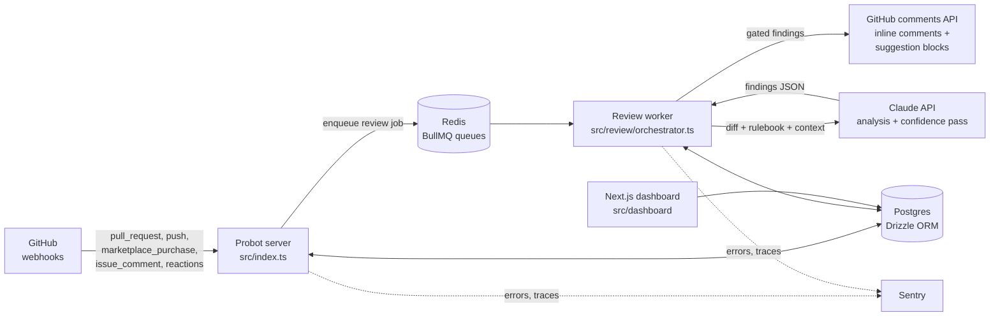

# MergeMate Architecture

## Stack & Rationale

| Layer | Choice | Why |
|---|---|---|
| Webhook server | Node.js + TypeScript, Probot 13 | Probot handles GitHub App auth (JWT -> installation tokens), webhook signature verification, and event routing out of the box. Writing that plumbing by hand is a week of undifferentiated work and a source of security bugs. |
| Job queue | BullMQ on Redis | Webhook load is spiky (a monorepo push can fan out dozens of events in seconds) while LLM analysis is slow (30-120s per PR). The queue isolates the two: the webhook handler acks in milliseconds and enqueues; workers drain at a controlled concurrency. Also gives retries, rate limiting per installation, and the priority lanes the Business tier sells. |
| LLM | Claude API (Anthropic) | Strong code reasoning, large context window for diffs plus surrounding file content, prompt caching to cut repeat-context cost, structured outputs for the findings schema. Model name is configured via env var so upgrades are a config change. |
| Database | Postgres via Drizzle ORM | Relational data (installations, findings, versions) with real foreign keys. Drizzle gives typed schema-as-code and SQL-first migrations without an ORM runtime tax. drizzle-kit generates migrations from the schema file. |
| Dashboard | Next.js (minimal), stubbed in src/dashboard | Marketing pages plus a thin authenticated dashboard. Deliberately minimal: the product lives in the PR, not in our UI. |
| Observability | Sentry + pino structured logs | Errors and per-job traces; noise/precision metrics are first-class product telemetry. |

Design rule: the GitHub PR is the interface. Everything else (queue, DB, dashboard) exists to make the comments on the PR trustworthy.

## System Diagram

## Data Model

All tables have `id` (uuid pk), `created_at`, `updated_at` unless noted.

- **installations** — one row per GitHub App installation. `github_installation_id` (bigint, unique), `account_login`, `account_type` (org/user), `plan` (free/team/business), `suspended_at`, `settings_json` (threshold overrides, shadow mode flag).
- **repositories** — `installation_id` (fk), `github_repo_id` (bigint, unique), `full_name`, `is_private`, `default_branch`, `active_rulebook_version_id` (fk, nullable), `enabled`.
- **rulebooks** — one logical rulebook per repository. `repository_id` (fk, unique), `source_path` (default `.mergemate.yml`), `current_version` (int).
- **rulebook_versions** — immutable snapshots. `rulebook_id` (fk), `version` (int), `commit_sha` (the commit that changed the file), `raw_yaml` (text), `parsed_json` (jsonb), `is_valid` (bool), `validation_errors` (jsonb). Unique on (rulebook_id, version).
- **pull_requests** — `repository_id` (fk), `github_pr_number` (int), `author_login`, `head_sha`, `base_ref`, `state`, `is_fork_pr` (bool, drives prompt-injection posture). Unique on (repository_id, github_pr_number).
- **review_runs** — one row per analysis attempt. `pull_request_id` (fk), `rulebook_version_id` (fk, nullable), `trigger` (opened/synchronize/manual), `status` (queued/running/posted/failed/skipped), `model`, `input_tokens`, `output_tokens`, `cost_usd_estimate` (numeric), `latency_ms`, `findings_total`, `findings_posted`, `summary_comment_id` (bigint, for update-in-place).
- **findings** — `review_run_id` (fk), `fingerprint` (text, stable hash of rule + file + normalized snippet; the suppression key), `category` (bug/security/standards), `rule_id` (nullable, from rulebook), `file_path`, `start_line`, `end_line`, `title`, `body_md`, `suggested_patch` (text, nullable), `confidence` (numeric 0-1), `posted` (bool), `suppressed_by` (fk suppressions, nullable), `github_comment_id` (bigint, nullable).
- **feedback_events** — `finding_id` (fk), `actor_login`, `kind` (thumbs_up/thumbs_down/ignore_reply/patch_applied/comment_resolved), `github_event_payload` (jsonb). The raw signal for threshold tuning and suppression.
- **suppressions** — `scope` (repo/installation), `repository_id` (fk, nullable), `installation_id` (fk), `fingerprint`, `reason` (reaction/reply/dashboard), `created_by_login`, `expires_at` (nullable, default never). Unique on (scope target, fingerprint).
- **seats** — `installation_id` (fk), `github_login`, `first_pr_at`, `last_pr_at`, `billable_period` (date). A seat is a unique PR author in a billing period.
- **subscriptions** — `installation_id` (fk, unique), `provider` (github_marketplace/stripe), `external_id`, `plan`, `seat_limit`, `billing_cycle_anchor`, `status` (active/past_due/canceled), `raw_provider_payload` (jsonb).

## Key Flows

### 1. PR opened -> review posted

1. GitHub sends `pull_request.opened`; Probot verifies the signature and the handler in `src/webhooks/pull-request.ts` upserts the `pull_requests` row.
2. Handler enqueues a `review` job in BullMQ keyed `install:{id}:pr:{number}:{head_sha}` (idempotent; a duplicate delivery is a no-op) and returns 200 immediately.
3. Worker picks up the job (priority lane if plan = business). It loads the active `rulebook_versions` row, fetches the diff and expanded context via the installation-scoped Octokit client, and records a `review_runs` row as `running`.
4. Orchestrator calls Claude: analysis pass produces candidate findings against the findings JSON schema; a second lightweight pass scores confidence per finding.
5. Gating (`src/review/confidence.ts`): drop findings under threshold, drop findings whose fingerprint matches a suppression, cap total posted per PR. Everything (posted or not) is stored in `findings`.
6. `src/github/comments.ts` posts one review with inline comments (suggestion blocks where a patch exists) plus a single summary comment; the summary comment id is stored so later runs edit it instead of stacking new ones.
7. `review_runs` updated to `posted` with token counts, cost estimate, and latency.

### 2. Developer reacts thumbs-down -> suppression learned

1. GitHub sends a reaction event (or `issue_comment` reply "mergemate ignore") on a bot comment.
2. Handler resolves the comment id to its `findings` row, writes a `feedback_events` row.
3. For thumbs-down/ignore: a `suppressions` row is created for that finding's fingerprint at repo scope (installation scope on Business when org-wide sharing is on).
4. Bot edits the comment to append "Acknowledged, will not raise this again here" and resolves the thread where the API allows.
5. All future gating passes (flow 1, step 5) check suppressions by fingerprint, so the same nit never posts again. Aggregated feedback also feeds periodic threshold tuning per repo.

### 3. Rulebook change -> new version applied

1. GitHub sends `push` to the default branch; handler checks whether `.mergemate.yml` is in the changed files. If not, ignore.
2. `src/review/rulebook.ts` fetches the file at the new sha, parses YAML, validates against the rulebook zod schema.
3. Valid: insert an immutable `rulebook_versions` row (version N+1, commit sha, raw + parsed), point `repositories.active_rulebook_version_id` at it, and post a commit status/check confirming "MergeMate rulebook v{N+1} active".
4. Invalid: keep the previous version active, insert the row flagged `is_valid=false` with errors, and post a failing check with the validation messages. Reviews continue on the last good version — a broken rulebook never silently disables standards.
5. Every subsequent `review_runs` row records the version it used, which is what makes findings auditable.

### 4. Marketplace purchase -> seats provisioned

1. GitHub sends `marketplace_purchase` (purchased/changed/cancelled) to the Probot server.
2. `src/billing/marketplace.ts` upserts `subscriptions` with plan and seat limit, updates `installations.plan`.
3. Seat accounting is lazy: when a PR review job runs, the author is upserted into `seats` for the current billing period. If unique authors exceed `seat_limit`, reviews still run but the summary comment and dashboard show an over-limit notice for the admin (grace, then enforcement).
4. Cancellation: plan reverts to free at period end; private-repo reviews stop, public-repo reviews continue.
5. Stripe fallback follows the same shape via checkout webhooks writing to the same `subscriptions` table.

## Third-Party Services & Rough Pricing

| Service | Purpose | Rough cost |
|---|---|---|
| Claude API | Review analysis | Dominant cost. Assumption: average PR = ~300 changed lines; with expanded context, rulebook, and prompts, roughly 25-40k input tokens + 2-4k output tokens across analysis + confidence passes. At Sonnet-class pricing (~$3/M input, ~$15/M output) that is **$0.03-0.10 per PR**, before prompt-caching savings on repeated rulebook/system content (caching can cut input cost substantially on active repos). |
| GitHub Marketplace | Billing + distribution | 5% fee on Marketplace transactions (GitHub reduced this from 25%; verify current terms at listing time). No fixed cost. |
| Stripe (fallback billing) | Orgs that cannot buy via Marketplace | 2.9% + $0.30 per transaction. |
| Upstash Redis | BullMQ backing store | Free tier to start; ~$10-50/mo pay-per-request at moderate volume. |
| Neon or Supabase Postgres | Primary DB | Free tier to start; ~$19-25/mo (launch/pro tiers) at 100 customers; ~$69-100+/mo at 1,000. |
| Fly.io or Railway | Probot server + workers + dashboard hosting | ~$5-15/mo for small always-on instances at start; scale workers horizontally. |
| Sentry | Errors + tracing | Free tier; Team plan ~$26/mo when volume grows. |

## Estimated Monthly Running Cost

Core assumption: **avg 15 PRs/dev/month**, avg team = 8 devs, avg LLM cost **$0.06/PR** (mid-range, some caching benefit). Customers = paying team accounts.

**0 customers (build/beta, a handful of free OSS repos)**

| Item | Cost |
|---|---|
| Hosting (Fly.io shared instances) | $5-10 |
| Neon Postgres free tier | $0 |
| Upstash Redis free tier | $0 |
| Sentry free tier | $0 |
| Claude API (beta + golden-set runs, ~500 PRs) | ~$30 |
| **Total** | **~$35-40/mo** |

**100 customers** (~800 devs, ~12,000 PRs/mo, plus ~3,000 free OSS PRs/mo)

| Item | Cost |
|---|---|
| Claude API: 15,000 PRs x $0.06 | ~$900 |
| Hosting (server + 2-3 workers + dashboard) | ~$50 |
| Neon Postgres | ~$25 |
| Upstash Redis | ~$25 |
| Sentry | ~$26 |
| **Total** | **~$1,025/mo** against ~$11,500 MRR (800 seats x $12, 5% Marketplace fee) -> ~91% gross margin |

**1,000 customers** (~8,000 devs, ~120,000 PRs/mo, plus ~20,000 OSS PRs/mo)

| Item | Cost |
|---|---|
| Claude API: 140,000 PRs x $0.06 | ~$8,400 |
| Hosting (scaled workers) | ~$300 |
| Postgres (dedicated tier) | ~$150 |
| Redis | ~$100 |
| Sentry + misc observability | ~$80 |
| **Total** | **~$9,000/mo** against ~$91,000 net MRR -> ~90% gross margin |

The lever to watch is the LLM line: it scales linearly with PR volume, not customer count. If average PR size or push frequency doubles, so does the dominant cost. That is why cost telemetry per installation (`review_runs.cost_usd_estimate`) and incremental re-review on synchronize are MVP-scoped, not nice-to-haves. Note the 1,000-customer row is aspirational context; the realistic planning band from README.md is $10k-$50k MRR, i.e. between the first and second scenarios.
