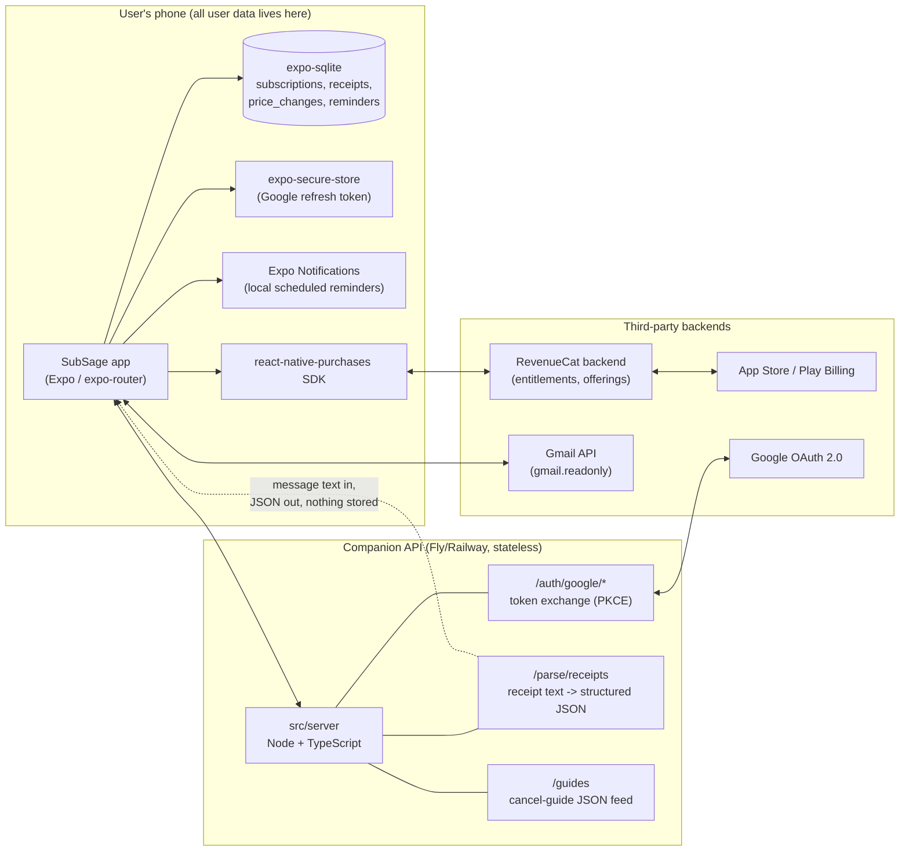

# SubSage Architecture

## Stack & Rationale

| Layer | Choice | Why |
|-------|--------|-----|
| Mobile app | Expo (managed workflow), React Native 0.79, React 19, TypeScript | One codebase for iOS + Android; managed workflow avoids native churn for a small team; EAS handles builds/submissions without a Mac farm |
| Navigation | expo-router ~5 | File-based routing, typed routes, deep-link support out of the box (needed for notification taps and cancel-guide deep links) |
| Local data | expo-sqlite (+ AsyncStorage for small flags) | **Receipts and subscription data never persist server-side.** SQLite gives real queries (price history diffs, category rollups) that AsyncStorage cannot; on-device storage is the product's core privacy claim |
| Payments | RevenueCat (react-native-purchases ^8) | Cross-platform IAP, remote offering config, trials, A/B paywall experiments, revenue analytics -- without running a receipt-validation server |
| Push | Expo Notifications (local notifications primarily) | Renewal reminders are computed on device from local data, so they are *local* scheduled notifications -- no push infrastructure, no tokens stored server-side for MVP |
| Auth (Gmail) | expo-auth-session + companion API for token exchange | OAuth authorization code flow with PKCE; the client secret lives only on the server |
| Companion API | Node 20 + TypeScript, single small service (`src/server`) | Two jobs only: exchange/refresh Google OAuth tokens, and parse receipt text into structured JSON. Stateless by design -- it holds no user database |
| Secrets on device | expo-secure-store | Google refresh token is stored in the device keychain, not in SQLite or AsyncStorage |
| Validation | zod | Runtime validation at every boundary: parser output, cancel-guide cache, server request/response |
| Dates | date-fns | Billing-cycle math (next renewal, proration display) without timezone footguns |

**Design principle: thin, stateless server.** Everything that *can* run on device *does* run on device (storage, reminder scheduling, price-diff detection, insights math). The server exists only because (a) the OAuth client secret cannot ship in the app binary and (b) receipt-parsing rules should be updatable without an app release. It processes message content in memory and returns structured results; nothing user-specific is written to disk or database except short-lived OAuth session state.

## System Diagram

Note: after token exchange, the app calls the Gmail API directly with its access token; message bodies can be sent to `/parse/receipts` for rule-based extraction, processed in memory, and discarded. (A stretch goal is moving parsing fully on-device so message content never leaves the phone at all.)

## Data Model

### On device (SQLite, `lib/db.ts`)

| Table | Purpose | Key columns |
|-------|---------|-------------|
| `subscriptions` | One row per tracked service | `id`, `name`, `merchant_key` (normalized, links receipts), `amount_cents`, `currency`, `billing_cycle` (weekly/monthly/yearly/custom_days), `next_renewal_at`, `category`, `is_trial`, `trial_ends_at`, `source` (manual/gmail), `status` (active/paused/cancelled), `created_at`, `updated_at` |
| `receipts` | Parsed transactions/receipt emails, the raw material for hike detection | `id`, `subscription_id` (nullable until confirmed), `merchant_key`, `amount_cents`, `currency`, `charged_at`, `gmail_message_id` (dedupe key, unique), `parser_version`, `confidence`, `created_at` |
| `price_changes` | Detected hikes/drops per subscription | `id`, `subscription_id`, `old_amount_cents`, `new_amount_cents`, `detected_at`, `effective_at`, `acknowledged_at` (nullable) |
| `reminders` | Scheduled local notifications, mirrored so they can be rescheduled after edits/reinstalls | `id`, `subscription_id`, `kind` (renewal/trial_ending/price_hike), `fire_at`, `notification_id` (OS handle), `status` |
| `cancel_guides` | Cached copy of the server's guide feed for offline use | `merchant_key` (pk), `title`, `steps_json`, `deep_link`, `web_url`, `difficulty`, `fetched_at`, `feed_version` |
| `settings` | Key-value app settings | `key` (pk), `value_json` -- e.g. reminder lead days, currency, last_scan_at, free-tier counters |

### On server (minimal, `src/server`)

| Store | Purpose | Notes |
|-------|---------|-------|
| `oauth_sessions` | Short-lived state for the PKCE authorization flow (state nonce, code_verifier hash, created_at) | TTL minutes; in-memory or Redis-with-expiry. This is the **only** server-side state. No users table, no receipts, no tokens at rest |

Everything else server-side is stateless request/response. Cancel guides ship as a versioned static JSON file, not a database.

## Key Flows

### 1. Gmail connect + first scan

1. User taps "Connect Gmail" (premium-gated) -> app calls `POST /auth/google/start`; server creates an `oauth_sessions` row and returns the Google authorization URL (scope: `gmail.readonly` only).
2. `expo-auth-session` opens the browser; user consents; Google redirects to the server callback with an auth code.
3. Server exchanges code + client secret for access/refresh tokens, deletes the session row, and hands tokens back to the app over the established session. App stores the refresh token in `expo-secure-store`; server keeps nothing.
4. App queries Gmail directly (`messages.list` with a receipt-oriented query: from known billing senders, subjects like "receipt", "your invoice", "payment confirmation", last 12 months).
5. For each candidate message, app fetches the body and posts text to `POST /parse/receipts`; server applies per-merchant rules, returns `{merchant_key, amount_cents, currency, charged_at, confidence}[]`, stores nothing.
6. App inserts rows into `receipts` (deduped on `gmail_message_id`), groups by `merchant_key`, infers billing cycle from charge spacing, and shows a "Found 9 subscriptions" confirmation list. Only user-confirmed groups become `subscriptions` rows.
7. `last_scan_at` is recorded; later scans query only newer messages.

### 2. Renewal reminder scheduling

1. On subscription create/update (and on app launch as a reconciliation pass), the app computes upcoming fire times from `next_renewal_at` minus the user's lead-time settings (default 3 days and 1 day before; trials also get a trial-ending reminder).
2. For each fire time, schedule a local notification via expo-notifications and insert a `reminders` row holding the OS `notification_id`.
3. On edit/cancel of a subscription, look up its pending `reminders`, cancel the OS notifications by id, and reschedule.
4. When a renewal date passes, the app rolls `next_renewal_at` forward one billing cycle and schedules the next round -- no server involvement at any point.
5. Tapping a notification deep-links (expo-router) to `subscription/[id]`.

### 3. Price-hike detection

1. After any scan inserts new `receipts`, run detection (`lib/price-hike.ts`) per `merchant_key` linked to a subscription.
2. Sort that subscription's receipts by `charged_at`; compare each amount to the previous one, ignoring currency mismatches and low-`confidence` parses.
3. If `new > old`, insert a `price_changes` row, update `subscriptions.amount_cents` to the new amount, and schedule an immediate local notification ("Netflix went from $15.49 to $17.99").
4. The subscription detail screen renders `price_changes` plus the receipt series as a price-history timeline; insights aggregate total "hike cost per year."
5. Manual-only subscriptions get a lighter path: when the user edits the amount upward, offer to log it as a price change so history stays meaningful.

### 4. Paywall + purchase via RevenueCat

1. App configures the RevenueCat SDK at launch with the platform API key and an anonymous app user ID (no login system).
2. A gate check (`lib/purchases.ts`) runs at premium touchpoints: adding a 6th subscription, tapping Connect Gmail, opening hike history or full insights.
3. If not entitled, `app/paywall.tsx` fetches current offerings from RevenueCat: package `$rc_weekly` ($4.99/week, 3-day trial) presented as primary, `$rc_annual` ($34.99/year) as fallback. Offering composition is remote-configurable for experiments.
4. Purchase runs through `Purchases.purchasePackage`; StoreKit/Play Billing handles payment; RevenueCat validates the receipt server-side and returns updated `CustomerInfo`.
5. App checks the `premium` entitlement on `CustomerInfo`, caches it locally (so a RevenueCat outage fails open for existing subscribers), and unlocks features. "Restore purchases" calls `Purchases.restorePurchases`.

## Third-Party Services & Rough Pricing

| Service | Role | Rough pricing |
|---------|------|---------------|
| RevenueCat | IAP infrastructure, entitlements, paywall experiments | Free up to $2.5k monthly tracked revenue (MTR), then ~1% of MTR |
| Apple App Store / Google Play | Distribution + payment rails | 15% commission under ~$1M/yr (Small Business Program) up to 30%; Apple $99/yr developer account, Google $25 one-time |
| Google Cloud (Gmail API + OAuth) | Email access | API usage is free within generous quota; the real cost is **restricted-scope verification: annual CASA Tier 2 assessment, roughly $500-$5,000+/yr depending on assessor, plus weeks of lead time** |
| Expo EAS | Builds, submit, OTA updates | Free tier covers early dev; production plan ~$19/mo (plus usage) once build volume grows |
| Fly.io or Railway | Companion API host | Small always-on Node service: ~$5-10/mo; scales trivially since it is stateless |
| Sentry | Crash/error reporting (app + server) | Free developer tier; ~$26/mo team tier when volume requires |
| PostHog (or similar) | Product analytics (events only, never receipt content) | Free tier ~1M events/mo; effectively $0 at this scale |

## Estimated Monthly Running Cost

Mobile-heavy architecture with on-device storage means infra cost barely moves with users; the step changes are compliance (CASA) and revenue share, not servers.

| Item | 0 customers (dev) | 100 customers | 1,000 customers |
|------|-------------------|---------------|-----------------|
| Companion API (Fly/Railway) | $0-5 (dev instance) | $5-10 (1 small VM) | $10-25 (2 small VMs for redundancy) |
| Expo EAS | $0 (free tier) | $19 | $19 |
| RevenueCat | $0 | $0 (under $2.5k MTR) | ~1% of MTR (e.g. ~$60 at ~$6k MTR) |
| Sentry | $0 | $0 | $26 |
| PostHog analytics | $0 | $0 | $0 (free tier) |
| Google Cloud / Gmail API | $0 | $0 (within quota) | $0 (within quota) |
| CASA assessment (amortized ~$1.5k/yr) | $0 (not yet verified) | ~$125 | ~$125 |
| Apple developer account (amortized) | $8 | $8 | $8 |
| Domain + misc | $2 | $2 | $2 |
| **Total** | **~$10-15/mo** | **~$160/mo** | **~$250-265/mo** |

At 1,000 customers (~$6k+ MRR at blended pricing), all-in infrastructure plus compliance is under 5% of revenue; store commission (15-30%) dominates the cost structure.
