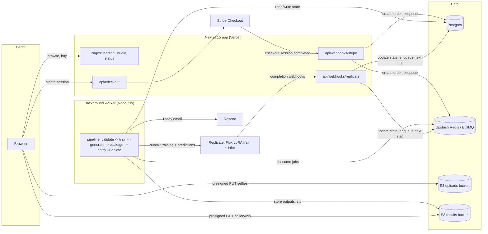

# LumaShot Architecture

## Stack and Rationale

| Layer | Choice | Why |
|---|---|---|
| Web app | Next.js 15 (App Router) + TypeScript | One codebase for marketing pages (SSG, SEO-critical) and the authenticated studio (server components + API routes). Vercel deploy is zero-ops. |
| Styling | Tailwind CSS v4 | Fast iteration on landing pages; no design-system overhead at this stage. |
| Auth | Auth.js (next-auth v5) with Google OAuth | Buyers are LinkedIn/Google-centric; one-click sign-in maximizes checkout conversion. Session in JWT, no extra infra. |
| Database | Postgres + Drizzle ORM | Relational shape (orders -> upload sets -> trainings -> batches -> images) is naturally normalized. Drizzle gives typed schema-as-code and SQL migrations without an ORM runtime tax. |
| Payments | Stripe Checkout (one-time payments) | Hosted checkout means no PCI scope and best-in-class conversion. Webhook is the single source of truth for fulfillment. |
| Queue/worker | BullMQ on Redis (Upstash) | Training + generation is a long-running, retryable, multi-step pipeline. BullMQ gives retries, backoff, priority queues (Executive pack), and delayed jobs (auto-deletion) with minimal code. A DB-polling queue is the fallback if Redis is cut for cost. |
| Model provider | Replicate (Flux LoRA fine-tune + inference) | No GPU fleet to run. Flux LoRA training completes in minutes, inference is per-image priced, and webhooks push completion events -- the whole ML layer is an HTTP API. |
| Object storage | S3 (two buckets: uploads, results) | Presigned PUT for direct browser upload (selfies never touch our servers), presigned GET for gallery/downloads, lifecycle rules as a backstop for deletion. |
| Email | Resend | Single transactional flow ("your headshots are ready" + receipts). Simple API, React email templates. |

## System Diagram

## Data Model

All tables have `id` (uuid), `created_at`, `updated_at` unless noted.

- **users** -- `email`, `name`, `google_id`, `image_url`. One row per authenticated buyer.
- **packs** -- static catalog: `slug` (basic/pro/executive), `price_cents`, `shot_count`, `style_limit` (null = all), `priority` (bool), `stripe_price_id`. Seeded, rarely changes.
- **orders** -- `user_id`, `pack_id`, `stripe_checkout_session_id` (unique, idempotency key), `stripe_payment_intent_id`, `status` (`pending_payment | paid | uploading | validating | training | generating | packaging | ready | refunded | failed`), `amount_cents`, `ready_at`, `emailed_at`. The order row is the pipeline's state machine.
- **upload_sets** -- `order_id` (1:1), `status` (`open | validating | accepted | rejected`), `photo_count`, `rejection_reason`. Groups the 8-15 selfies for one order.
- **uploads** -- `upload_set_id`, `s3_key`, `content_type`, `bytes`, `width`, `height`, `validation_status` (`pending | ok | rejected`), `validation_errors` (jsonb: face_count, blur_score, resolution, duplicate_of). One row per selfie.
- **model_trainings** -- `order_id`, `replicate_training_id` (unique), `status` (`queued | starting | processing | succeeded | failed | canceled`), `lora_weights_url`, `trigger_token`, `error`, `started_at`, `finished_at`. One LoRA per order.
- **styles** -- catalog: `slug`, `name`, `description`, `prompt_template`, `negative_prompt`, `preview_image_key`, `tier_min` (which packs can use it), `active`. Adding a style is an insert, not a deploy.
- **generation_batches** -- `order_id`, `style_id`, `replicate_prediction_id` (unique), `status` (`queued | processing | succeeded | failed`), `requested_count`, `completed_count`, `error`. One Replicate prediction per style batch.
- **generated_images** -- `batch_id`, `order_id` (denormalized for gallery queries), `s3_key`, `width`, `height`, `nsfw_flagged` (bool), `seed`. One row per output image.
- **favorites** -- `user_id`, `generated_image_id`, unique on the pair.
- **deletion_schedule** -- `order_id`, `scope` (`training_photos | lora_weights`), `delete_after` (timestamptz), `status` (`scheduled | done | canceled`), `executed_at`. The audited record behind the GDPR auto-deletion promise.

Key relations: `users 1-N orders`, `orders 1-1 upload_sets 1-N uploads`, `orders 1-1 model_trainings`, `orders 1-N generation_batches 1-N generated_images`, `styles 1-N generation_batches`.

## Key Flows

### 1. Purchase -> upload -> validate -> train -> generate -> notify

1. User picks a pack; `POST /api/checkout` creates a Stripe Checkout Session (pack's `stripe_price_id`, `client_reference_id` = user id) and redirects.
2. Stripe fires `checkout.session.completed` -> `/api/webhooks/stripe` verifies the signature, upserts the order keyed on `stripe_checkout_session_id` (idempotent), sets status `uploading`, creates the `upload_set`.
3. Studio page: user picks styles (limited by pack tier) and uploads 8-15 selfies via presigned S3 PUTs; each upload registers an `uploads` row.
4. User hits "Start" -> `validate-uploads` job enqueued. Worker runs face detection, single-face check, blur/resolution scoring, duplicate detection, and cross-photo face consistency. Failures are written per-photo; the user replaces rejected photos and retries. On acceptance: status `training`, enqueue `train-lora`.
5. Worker submits a Flux LoRA fine-tune to Replicate (zip of validated selfies, unique `trigger_token`), stores `replicate_training_id`, and registers the deletion schedule (`now + TRAINING_DATA_RETENTION_DAYS`).
6. Replicate training webhook (flow 2) marks training `succeeded` -> worker enqueues one `generate-batch` job per selected style, splitting the pack's shot quota across styles. Executive orders enqueue on the priority queue.
7. Each prediction-completed webhook stores outputs: worker copies images to the results bucket, runs the NSFW filter, inserts `generated_images` rows, increments `completed_count`.
8. When all batches are done: worker builds the zip in the results bucket, sets order `ready`, sends the Resend "your headshots are ready" email with a gallery link, stamps `ready_at`/`emailed_at`.

### 2. Replicate webhook handling

1. `POST /api/webhooks/replicate` verifies the `webhook-signature` HMAC against `REPLICATE_WEBHOOK_SECRET`; unverified requests get 401.
2. Payload is matched by `replicate_training_id` or `replicate_prediction_id`; unknown ids are logged and ack'd 200 (never 5xx retries for garbage).
3. Handling is idempotent: state transitions are guarded (`succeeded` twice is a no-op) because Replicate retries and events can arrive out of order.
4. The route only records the event and enqueues the follow-up job; all heavy work (downloading outputs, S3 copies, zip building) happens in the worker so the webhook returns in milliseconds.
5. Terminal failures (`failed`/`canceled`) mark the training/batch failed; the worker retries with backoff up to 2 times, then flags the order for the admin queue and pauses the pipeline.

### 3. Auto-deletion of training photos

1. Training-photo deletion is scheduled at training submission time: `deletion_schedule` row with `delete_after = now + TRAINING_DATA_RETENTION_DAYS`, mirrored as a BullMQ delayed job.
2. The studio shows a countdown ("training photos auto-delete in N days") plus a "Delete now" button that fast-forwards the schedule.
3. When the job fires: worker deletes every `uploads.s3_key` from the uploads bucket, deletes the LoRA training zip, marks the schedule `done` with `executed_at`, and nulls stored keys. LoRA weights get a second schedule (longer window, so regeneration upsells still work) unless the user requests full deletion.
4. An S3 lifecycle rule on the uploads bucket (retention + 7 days) is the backstop if the queue ever loses a job. Generated results are NOT auto-deleted; they belong to the customer.

### 4. Refund / regeneration request

1. From the gallery, the user opens "Not happy with the likeness?" -> structured form (which styles, which failure: "doesn't look like me" / artifacts / other) written to the order.
2. First response is a free regeneration: if LoRA weights still exist, worker re-enqueues batches for the flagged styles with adjusted prompt/seed parameters -- COGS ~$0.50-2 versus refunding $29. If weights were deleted, offer re-training from a fresh upload set.
3. If the user still requests a refund (or asks directly), admin issues it via Stripe; the `charge.refunded` webhook sets order status `refunded` and immediately enqueues deletion of training photos and LoRA weights.
4. Both regenerations and refunds are recorded per order so likeness-acceptance and refund rates are queryable -- these are the product's core health metrics.

## Third-Party Services and Rough Pricing

| Service | Used for | Rough pricing |
|---|---|---|
| Replicate | Flux LoRA training + inference | Training ~$2-3 per run (a few minutes of H100 time); inference ~$0.03-0.05 per image |
| Stripe | Checkout, refunds | 2.9% + $0.30 per transaction |
| AWS S3 | Selfie uploads, generated results, zips | ~$0.023/GB-month storage + egress; pennies per order at MVP scale |
| Resend | Transactional email | Free to 3k emails/mo; $20/mo for 50k |
| Vercel | Next.js hosting | Hobby $0 / Pro $20/mo per seat |
| Upstash Redis | BullMQ queue | Free tier; ~$10-20/mo under real load (pay-per-request) |
| Postgres (Neon or Supabase) | Primary database | Free tier; ~$19-25/mo for a production tier |

## Estimated Monthly Running Cost

"Customers" = packs sold per month. Assumed mix: 40% Basic ($19), 45% Pro ($29), 15% Executive ($49) -> average order value ~$28, average ~104 images per pack.

**COGS per pack (Pro, $29, 100 images, 5 styles):**

- LoRA training: ~$2.50
- Inference: 100 x ~$0.04 = ~$4.00 -- call it $2-4 with batching and cheaper Flux endpoints; use $3.00
- Stripe: 2.9% x $29 + $0.30 = ~$1.14
- S3 + email: ~$0.10
- **Total ~ $5-7 -> gross margin ~75-80%** (Basic: ~$4 COGS on $19 = ~79%; Executive: ~$9-11 on $49 = ~78-82%). Matches the category's 70-85% range; inference volume is the swing factor.

| Monthly cost | 0 customers | 100 customers | 1,000 customers |
|---|---|---|---|
| Replicate (train + infer) | $0 | ~$550 | ~$5,500 |
| Stripe fees | $0 | ~$110 | ~$1,100 |
| S3 | ~$1 | ~$10 | ~$60 |
| Resend | $0 | $0 | $20 |
| Vercel | $0 | $20 | $20-150 |
| Upstash Redis | $0 | ~$10 | ~$30 |
| Postgres | $0 | ~$20 | ~$50 |
| **Total infra** | **~$1** | **~$720** | **~$6,900** |
| Revenue (at ~$28 AOV) | $0 | ~$2,800 | ~$28,000 |
| **Gross margin** | -- | **~74%** | **~75%** |

Fixed cost at zero customers is effectively $1/month -- every meaningful cost scales with orders, which is exactly the shape you want for a spiky-revenue business.
