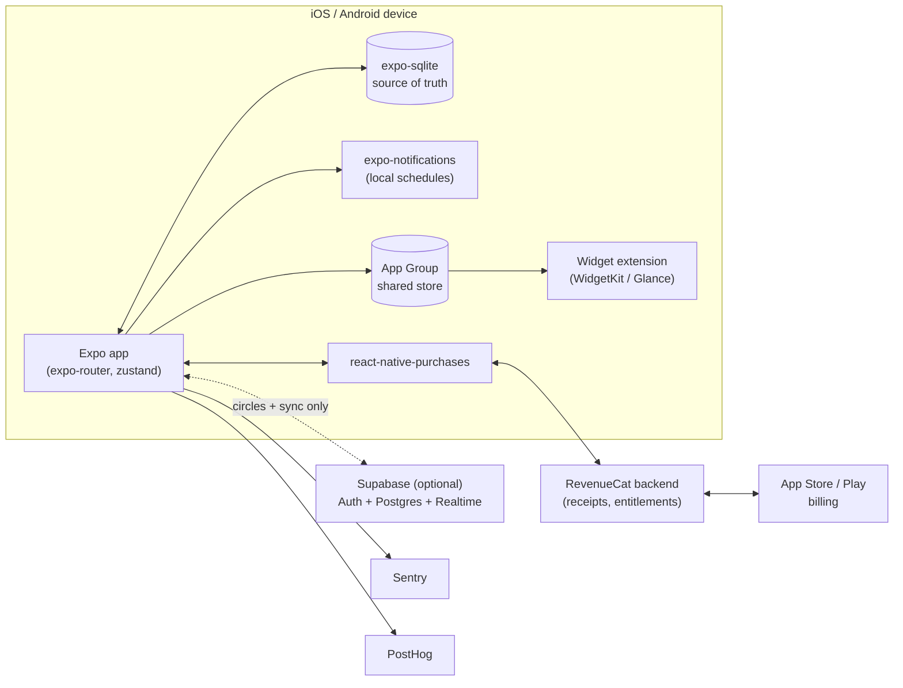

# Streakly Architecture

## Stack and Rationale

| Layer | Choice | Why |
|---|---|---|
| App framework | Expo SDK ~53 (React Native 0.79, React 19) + TypeScript | One codebase for iOS-first launch and Phase 3 Android; EAS handles builds/submission without a Mac fleet; TypeScript everywhere including the streak engine, which must be unit-testable pure code |
| Navigation | expo-router ~5 | File-based routing, typed routes, deep links for circle invites (`streakly://circle/join?code=...`) fall out of the router for free |
| Local data | expo-sqlite | **Local-first: SQLite on device is the source of truth.** Habit completion must work in airplane mode with zero latency; a habit tracker that needs a network round-trip to check a box is dead on arrival. SQL also makes streak/stats queries cheap |
| Payments | RevenueCat (react-native-purchases ^8) | Receipt validation, entitlements, cross-platform products, price experiments, and churn analytics without building a subscription backend |
| Notifications | expo-notifications | Local scheduled notifications cover all MVP needs (habit reminders, session end, weekly review). Push (circle nudges) arrives with Supabase in Phase 3 |
| Sync backend (optional) | Supabase (Postgres + Auth + Realtime) | Only needed for circles and multi-device sync. Stubbed in `src/server/`; the app must ship and function without it. Auth is anonymous-first, upgradeable to Apple/Google sign-in when the user joins a circle |
| Widgets | Native extensions via Expo config plugins | iOS WidgetKit requires a Swift widget extension target added through a config plugin (for example `@bacons/apple-targets` or a custom plugin). **This forces an EAS development build; widgets can never be tested in Expo Go.** Data is shared app-to-widget through an App Group container. Android uses Glance/AppWidget similarly via a plugin in Phase 3 |
| State | zustand | Thin in-memory mirror over SQLite for UI reactivity; no server cache layer needed in a local-first app |
| Observability | Sentry + PostHog | Crashes and funnel/retention analytics; both have workable free tiers |

Key stance: **the network is an enhancement.** Everything on the free path and most of premium (habits, timer, streaks, reviews, widgets) works with zero backend. Supabase is additive and isolated behind `src/server/sync.ts` so it can be deferred, swapped, or deleted.

## System Diagram

## Data Model

### Local (expo-sqlite, source of truth)

| Table | Purpose | Key columns |
|---|---|---|
| `habits` | Habit definitions | `id`, `name`, `icon`, `color`, `schedule_type` (daily / weekdays / x_per_week), `schedule_days`, `target_per_week`, `default_focus_minutes`, `created_at`, `archived_at` |
| `habit_logs` | One row per completion | `id`, `habit_id`, `completed_on` (local date), `source` (tap / focus_session / repair), `focus_session_id?`, `created_at` |
| `focus_sessions` | Timer sessions | `id`, `habit_id?` (nullable: freestanding sessions allowed), `planned_minutes`, `actual_seconds`, `started_at`, `ended_at`, `outcome` (completed / abandoned) |
| `streaks` | Materialized per-habit streak state (recomputed from logs; cache, not truth) | `habit_id`, `current_length`, `best_length`, `last_counted_on`, `freezes_banked`, `freezes_used_total`, `repair_available_until?` |
| `weekly_reviews` | Review ritual entries | `id`, `week_start_on`, `wins_text`, `misses_text`, `adjustment_text`, `completed_at` |
| `settings` | Key/value app settings | `key`, `value` (day_start_hour, notification prefs, theme, onboarding state) |

Dates are stored as **local calendar dates** (`YYYY-MM-DD`) resolved via the user's `day_start_hour`, so a 12:30 AM completion counts for the evening the user experienced. Timezone changes reuse the same rule; the streak engine (`lib/streaks.ts`) is the only module allowed to interpret these fields.

### Synced (Supabase Postgres, only when circles/sync are enabled)

| Table | Purpose | Key columns |
|---|---|---|
| `profiles` | Public identity per auth user | `id` (= auth.users.id), `display_name`, `avatar_seed`, `created_at` |
| `circles` | Accountability groups | `id`, `name`, `invite_code` (unique), `max_members` (default 8), `created_by`, `created_at` |
| `circle_members` | Membership | `circle_id`, `profile_id`, `role` (owner / member), `joined_at` |
| `circle_activity` | Denormalized share of each member's progress (a projection pushed from the device, never the truth) | `id`, `circle_id`, `profile_id`, `kind` (habit_completed / streak_milestone / streak_at_risk / focus_minutes), `payload` (jsonb), `occurred_on`, `created_at` |

Privacy stance: circles never see habit *content* by default, only streak lengths, completion counts, and focus minutes. The device decides what to project into `circle_activity`; raw `habit_logs` never leave the device. Row Level Security restricts every synced table to circle co-members. Schema stub: `src/server/supabase-schema.sql`.

## Key Flows

### 1. Complete a habit + streak update

1. User taps the habit ring on the Today screen (or a completion arrives from flow 2).
2. UI optimistically animates; a `habit_logs` row is inserted with `completed_on` = today per `day_start_hour`, `source = 'tap'`, inside a transaction.
3. `lib/streaks.ts` recomputes streak state for that habit from recent logs and the schedule rule (daily schedules require consecutive days; x-per-week schedules count weeks), applying banked freezes to bridge eligible gaps.
4. `streaks` row is updated; if `current_length` crossed a milestone (7/30/100), enqueue a celebration and, if circles are enabled, push a `streak_milestone` activity via `src/server/sync.ts`.
5. Shared App Group store is rewritten and `WidgetCenter.reloadTimelines` is requested so the widget updates within seconds.
6. Today's remaining reminder notification for that habit is cancelled.

### 2. Focus session tied to a habit

1. From a habit's row or detail screen, user taps "Focus"; timer screen opens pre-configured with the habit's `default_focus_minutes`.
2. A `focus_sessions` row is inserted (`outcome` pending); a "session end" local notification is scheduled; on iOS a Live Activity shows the countdown on the lock screen (Phase 2 polish).
3. Timer end state is derived from `started_at` + wall clock, never from a running JS interval, so backgrounding/kill cannot corrupt a session.
4. On completion, the session row is finalized and, if `actual_seconds >= 80%` of planned, flow 1 runs automatically with `source = 'focus_session'` and the session id linked. One action, both loops closed. Abandoned sessions are recorded but log no habit completion.

### 3. Join an accountability circle

1. User receives an invite link (`https://streakly.app/c/XK4F9Q` -> deep link `streakly://circle/join?code=XK4F9Q` via expo-router).
2. Entitlement check: circles are premium; non-premium users see the paywall with join-intent preserved so success resumes the join.
3. If not yet authenticated, Supabase anonymous sign-in runs and a `profiles` row is created (display name prompt); no email required to join.
4. An RPC (`join_circle(invite_code)`) validates the code and capacity (max 8) and inserts `circle_members`; RLS confirms visibility.
5. Device begins projecting daily summaries into `circle_activity`; the Circles tab subscribes via Realtime and renders member streaks. Inviter is granted one streak freeze.

### 4. Paywall + purchase + entitlement check (RevenueCat)

1. App launch: `Purchases.configure` with the platform API key and a stable anonymous app user id; `getCustomerInfo()` result is cached in zustand and mirrored into `settings` so offline launches keep the last known entitlement.
2. A gated action (4th habit, widget setup, circle join, focus stats) calls `isPremium()`; if false, `app/paywall.tsx` presents the current RevenueCat Offering (weekly w/ trial, monthly, annual, lifetime) so pricing is remotely configurable without an app release.
3. `purchasePackage()` runs the native purchase; RevenueCat validates the receipt server-side and returns updated `CustomerInfo`.
4. Access is granted iff `customerInfo.entitlements.active['premium']` exists; the gated action then resumes. "Restore purchases" calls `restorePurchases()` and re-checks the same entitlement.
5. RevenueCat webhooks (trial start/conversion/churn) can later feed PostHog; not required for MVP.

## Third-Party Services and Pricing

| Service | Role | Rough pricing |
|---|---|---|
| RevenueCat | Subscriptions, entitlements, paywall offerings | Free up to $2.5k MTR, then ~1% of monthly tracked revenue |
| Apple Developer Program | iOS distribution | $99/year + 15% commission (Small Business Program, under $1M/yr) to 30% on IAP |
| Google Play (Phase 3) | Android distribution | $25 one-time + 15% commission on first $1M/yr |
| Expo EAS | Builds, submit, OTA updates | Free tier (limited builds) to start; $99/mo Production plan when build volume/priority demands it |
| Supabase | Auth + Postgres + Realtime for circles/sync | Free tier (500MB DB, 50k MAU) covers launch; $25/mo Pro when circles get real usage |
| Sentry | Crash reporting | Free developer tier; ~$26/mo Team when volume requires |
| PostHog | Product analytics, funnels, retention cohorts | Free tier (1M events/mo) likely sufficient for a long time |
| Domain + landing page | streakly.app + static site | ~$15/yr domain; static hosting free (Cloudflare Pages or similar) |

## Estimated Monthly Running Cost

Infra is deliberately cheap; the dominant "costs" are the store commissions (percentage, not fixed) and your time.

| Item | 0 customers | 100 customers | 1,000 customers |
|---|---|---|---|
| Apple Developer ($99/yr amortized) | $8.25 | $8.25 | $8.25 |
| Expo EAS | $0 (free tier) | $0 to $99 (upgrade when build cadence demands) | $99 (Production) |
| RevenueCat | $0 | $0 (under $2.5k MTR at ~$7 ARPU) | ~$60 (1% of ~$6k MTR) |
| Supabase | $0 (free tier) | $0 (free tier) | $25 (Pro) |
| Sentry | $0 | $0 | $26 |
| PostHog | $0 | $0 | $0 (within free events) |
| Domain / misc | $1.25 | $1.25 | $1.25 |
| **Total infra / month** | **~$10** | **~$10 to $110** | **~$220** |

At 1,000 paying customers (~$6k MRR blended), infra is ~3.5% of revenue; store commission (~15%) is the real margin line. The scaffold's local-first design is what keeps the 0-to-100 column near zero: no servers are required until circles earn them.
