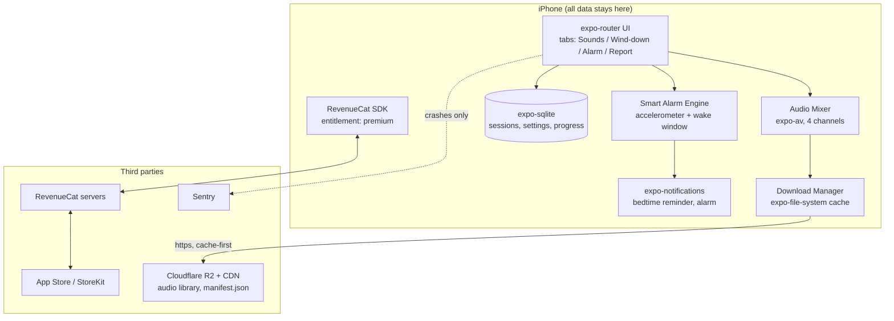

# DriftOff — Architecture

## Stack

| Layer | Choice | Rationale |
|-------|--------|-----------|
| App framework | **Expo (React Native) + TypeScript** | One codebase for iOS now / Android later; EAS Build removes native toolchain pain for a solo dev |
| Navigation | **expo-router** (file-based) | Convention over configuration; deep links to paywall/sounds for ASA landing |
| Audio engine | **expo-av** (migrate to `expo-audio` when its background/mixing support is fully stable) | Multi-track playback, background audio mode, per-track volume — everything the mixer needs |
| Purchases | **RevenueCat** (`react-native-purchases`) | Entitlements, 7-day trial, receipt validation, paywall analytics without running a server |
| Local data | **expo-sqlite** (+ a thin typed DAO layer) | Sleep sessions, settings, program progress — all on-device; no account, no backend |
| Notifications | **expo-notifications** | Bedtime reminders + alarm scheduling (local only) |
| Sensors | **expo-sensors** (accelerometer) | Light-sleep detection for the smart-alarm wake window |
| Content delivery | Bundled starter pack + **CDN (Cloudflare R2 + CDN)** for the full library | Keeps binary small; premium sounds downloaded on demand, cached for offline |
| Crash/analytics | **Sentry** + RevenueCat charts (no product-analytics SDK in MVP) | Privacy positioning: no third-party behavioral analytics |

**Deliberate absence of a backend.** There is no API server. RevenueCat is the only remote dependency at runtime, and even it degrades gracefully (cached entitlements) offline. This is a feature (privacy, offline) and a cost structure (near-zero infra).

## System diagram

## Data model (on-device SQLite)

**sound** — catalog row, synced from bundled/CDN manifest
- `id` (text, pk), `title`, `category` (rain|nature|noise|asmr|story), `duration_s`, `is_free` (bool), `file_url`, `local_path` (nullable), `size_bytes`, `sort_order`

**mix_preset** — a saved mixer configuration
- `id` (pk), `name`, `created_at`, `channels` (JSON: `[{sound_id, volume}]` max 4)

**sleep_session** — one night
- `id` (pk), `started_at`, `ended_at`, `mix_preset_id` (nullable), `winddown_program_id` (nullable), `alarm_window_start`, `alarm_window_end`, `woke_at`, `movement_samples` (JSON, downsampled), `estimated_cycles` (int, derived), `rating` (1–5, optional morning input)

**winddown_program** / **winddown_progress**
- program: `id`, `title`, `nights_total`, `audio_ids` (JSON)
- progress: `program_id` (pk), `current_night`, `last_completed_at`

**settings** (key-value)
- `bedtime_reminder_time`, `alarm_sound_id`, `wake_window_minutes`, `theme`, `haptics_enabled`

**entitlement cache** is owned by the RevenueCat SDK — never duplicated in SQLite.

## Key flows

### 1. Nightly sleep flow (the core loop)
1. Bedtime reminder fires (local notification) → user opens app.
2. Optional: wind-down program plays tonight's audio (marks `winddown_progress`).
3. User starts a mix (or preset); audio session set to `playsInSilentModeIOS + staysActiveInBackground`; sleep timer arms fade-out.
4. `sleep_session` row created; accelerometer sampling starts at low frequency (batched, ~1 Hz aggregated to 1/min) with phone on mattress/nightstand.
5. During the wake window, the alarm engine looks for a movement spike (light sleep); fires ramping alarm at the detected moment or at window end, whichever first.
6. On dismiss, session row is closed; morning report screen renders from the session data.

### 2. Purchase flow
1. Free user taps a locked sound / program / smart-alarm toggle → `paywall` route (modal).
2. Paywall renders offerings fetched from RevenueCat (annual hero + monthly fallback), falls back to cached offerings offline.
3. Purchase → StoreKit sheet → RevenueCat validates receipt → `premium` entitlement active → UI unlocks reactively via customer-info listener.
4. Trial events (start, conversion, cancellation) tracked entirely in RevenueCat dashboards.

### 3. Audio download flow (offline-first)
1. App ships with 3 free + 2 premium sounds bundled (≤ 25 MB binary budget).
2. On first premium unlock (or Wi-Fi + charging), download manager fetches `manifest.json` from CDN, diffs against `sound.local_path`, queues downloads via `expo-file-system` resumable downloads.
3. Every play checks `local_path` first; network is never required for owned content. Cache eviction only by explicit user action ("Manage downloads").

### 4. Audio content pipeline (build-time, not runtime)
1. Source recordings (commissioned buyouts or in-house field recordings) mastered to -16 LUFS mono/stereo AAC 128kbps, loop points verified.
2. `scripts/build-manifest` (Phase 1 tooling) hashes files, writes `manifest.json` (id, title, category, duration, size, sha256, url), uploads to R2.
3. App treats the manifest as the source of truth; adding a sound = upload + manifest bump, no app release.

## Third-party services & rough pricing

| Service | Purpose | Cost notes |
|---------|---------|-----------|
| RevenueCat | Subscriptions/entitlements | Free to $2.5k MTR, then ~1% of tracked revenue |
| Apple Developer Program | Distribution | $99/yr |
| App Store commission | Payments | 15% (Small Business Program) up to $1M/yr |
| Cloudflare R2 + CDN | Audio hosting | ~$0.015/GB-mo storage, zero egress fees — a few $/mo even at scale |
| EAS Build/Submit | CI builds | Free tier OK early; $19/mo (production plan) once shipping regularly |
| Sentry | Crash reporting | Free tier (5k events/mo) sufficient for a long time |
| Audio commissions | Content | One-time: ~$100–300/track buyout; budget ~$5k for a 50-sound library |

## Estimated monthly running cost

| Scale | Breakdown | Total |
|-------|-----------|-------|
| 0 customers | Apple $8.25/mo amortized + R2 ~$1 + everything else free tier | **~$10/mo** |
| 100 customers (~$500 MRR-equiv) | + EAS $19 + R2 ~$2 + RevenueCat still free | **~$30/mo** |
| 1,000 customers (~$5k MRR-equiv) | + RevenueCat ~$50 + R2/CDN ~$10 + Sentry $26 + EAS $19 | **~$115/mo** (excl. Apple's 15% and ad spend) |

Infra never exceeds ~2% of revenue — the cost structure of this business is App Store commission + user acquisition, not servers.
