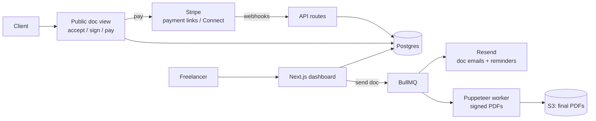

# PaperTrail — Architecture

## Stack

| Layer | Choice | Why |
|-------|--------|-----|
| Web app | Next.js 15 (App Router) + TypeScript + Tailwind | Dashboard + client-facing doc views + API in one deploy |
| Database | Postgres (Drizzle ORM) | Relational document chain with strict integrity |
| Payments | Stripe (Payment Links + Connect Standard later) | Deposits, partial payments, ACH; Connect enables platform fees in Phase 3 |
| PDF | Puppeteer in a worker (render the same web view to PDF) | One template renders both web and PDF — no drift |
| Email | Resend + React Email | Doc delivery, reminder sequences |
| Queue | Redis + BullMQ | Reminder scheduling, PDF jobs |

## System diagram

## Data model

- **users** — id, email, name, plan, stripe_customer_id
- **brands** — id, user_id, name, logo_key, colors, sender_domain
- **clients** — id, user_id, name, email, company, notes
- **documents** — id, user_id, brand_id, client_id, type (proposal|contract|invoice), status (draft|sent|viewed|accepted|signed|paid|overdue|void), parent_document_id (the chain link), public_token, sent_at, expires_at
- **doc_blocks** — id, document_id, kind (heading|text|pricing_table|terms|signature), position, content jsonb
- **signatures** — id, document_id, signer_name, signer_email, method (typed|drawn), signature_data, ip, user_agent, signed_at (immutable; audit trail)
- **invoices** — document_id (1:1), number, currency, subtotal, tax, total, amount_paid, due_at, deposit_of_document_id
- **payments** — id, invoice_id, stripe_payment_intent_id, amount, method, paid_at
- **reminder_rules / reminder_sends** — sequence config + delivery log
- **events** — id, document_id, type (sent|viewed|accepted|signed|paid|reminded), actor, metadata, created_at (drives the timeline UI)

Chain integrity: `parent_document_id` links invoice → contract → proposal; accepted pricing rows are snapshotted (copied, not referenced) so later edits never mutate signed history.

## Key flows

### 1. Proposal → contract → deposit invoice
1. Freelancer builds proposal (pricing table supports optional add-on rows the client can toggle).
2. Client opens public link (`/d/{public_token}`) — view event logged; accepts and selects add-ons.
3. Acceptance snapshot (scope + selected pricing) creates a draft **contract** pre-filled from the template; freelancer reviews, sends for signature.
4. Client signs (typed or drawn) — signature row written with IP/UA/timestamp; both parties get the countersigned PDF (Puppeteer render, stored in S3).
5. On signature webhook-free (same process), the **deposit invoice** (configurable %, default 50%) is auto-created and emailed with a Stripe payment link.

### 2. Payment + reminders
1. Stripe webhook (`payment_intent.succeeded`) → payment recorded, invoice status updated, receipt emailed.
2. Unpaid invoices past due enter the reminder sequence (day 1 gentle, day 7 firm, day 14 final w/ freelancer CC) — every send logged, sequence stops on payment.

### 3. E-sign compliance
- Explicit consent checkbox before signing; full audit trail (who/when/where/how) embedded in the final PDF's last page; documents immutable post-signature (edits require voiding + reissue).

## Third-party services & cost

| Service | Use | Rough cost |
|---------|-----|-----------|
| Vercel | App | $0–$20/mo |
| Neon Postgres | DB | $0–$19/mo |
| Upstash Redis | Queue | $0–$10/mo |
| Resend | Email | $0–$20/mo |
| S3/R2 | PDFs, logos | ~$1/mo |
| Stripe | Payments | 2.9% + 30¢ (passed through) |

## Estimated monthly running cost

| Customers | Total infra | Revenue (blended ~$14/mo) | Gross margin |
|-----------|-------------|---------------------------|--------------|
| 0 (dev) | ~$0 | — | — |
| 100 | ~$50 | ~$1,400 | ~96% |
| 1,000 | ~$250 | ~$14,000 | ~98% |

No LLM costs and tiny storage — this is a near-pure-margin product; the cost line that matters long-term is support time, which the template-driven onboarding minimizes.
