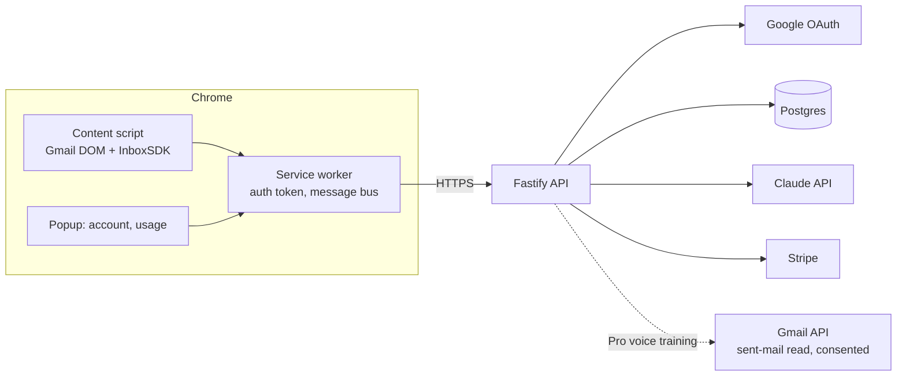

# InboxPilot — Architecture

## Stack

| Layer | Choice | Why |
|-------|--------|-----|
| Extension | Manifest V3 + TypeScript, built with Vite + @crxjs | Modern MV3 build pipeline with HMR |
| Gmail integration | InboxSDK + defensive DOM fallbacks | Survives Gmail UI churn far better than raw selectors |
| Backend | Node.js + Fastify (small API) | Auth, billing, LLM proxy — keys never live in the extension |
| LLM | Claude API (server-side) | Draft quality; streaming into the compose box |
| Database | Postgres (Drizzle) | Users, style profiles, usage metering |
| Billing | Stripe Checkout + customer portal | Subscription tiers with draft quotas |

## System diagram

## Data model

- **users** — id, google_sub, email, plan, stripe_customer_id, created_at
- **style_profiles** — user_id, derived_features jsonb (greeting/sign-off/sentence-length/phrase patterns), trained_at, sample_count (NO raw email storage)
- **usage** — user_id, month, drafts_used
- **snippets** — id, user_id, name, body, variables
- **followups** — id, user_id, thread_fingerprint, remind_at, status

## Key flows

### 1. Draft a reply
1. Content script extracts the visible thread (on-page DOM — no API scopes needed) and the user's tone selection.
2. Service worker sends it to the API with the session token; API checks quota.
3. API builds the prompt (thread + style profile if Pro) → Claude streaming response proxied back; content script types the draft into the compose box.
4. Usage incremented; edits before send are diffed client-side to improve tone presets (opt-in telemetry).

### 2. Voice training (Pro)
1. Explicit consent screen → Google OAuth with gmail.readonly.
2. Server fetches up to 200 recent sent messages, extracts style features (greeting, sign-off, avg sentence length, characteristic phrases), stores ONLY the derived profile, discards bodies.
3. Profile is injected into every subsequent draft prompt.

### 3. Billing
Stripe Checkout from the popup/web app; webhook updates plan; quota enforced server-side per calendar month.

## Third-party services & cost

| Service | Use | Rough cost |
|---------|-----|-----------|
| Fly.io/Railway | API | $5–$20/mo |
| Neon Postgres | DB | $0–$19/mo |
| Anthropic API | Drafts | ~$0.005–$0.02/draft |
| Stripe | Billing | 2.9% + 30¢ |
| Chrome Web Store | Distribution | $5 one-time |

## Estimated monthly running cost

| Customers | Infra | LLM | Total | Revenue (blended ~$12/mo) | Gross margin |
|-----------|-------|-----|-------|----------------------------|--------------|
| 0 (dev) | ~$5 | ~$2 | **~$7** | — | — |
| 100 | ~$30 | ~$120 | **~$150** | ~$1,200 | ~88% |
| 1,000 | ~$80 | ~$1,200 | **~$1,280** | ~$12,000 | ~89% |
