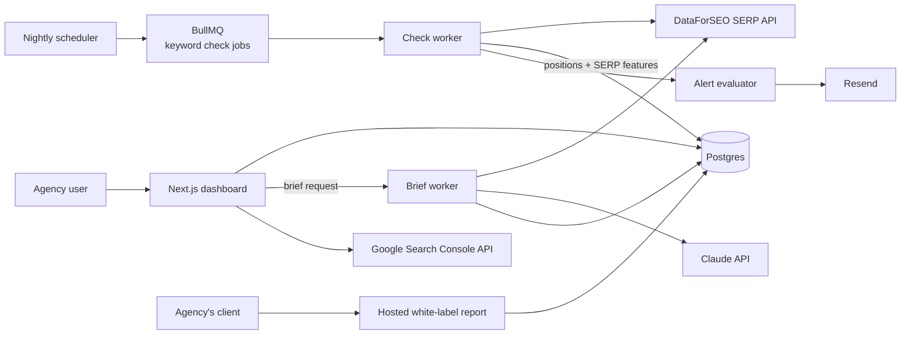

# RankRadar — Architecture

## Stack

| Layer | Choice | Why |
|-------|--------|-----|
| Web app | Next.js 15 (App Router) + TypeScript + Tailwind | Dashboard, hosted reports, API |
| Database | Postgres (Drizzle) | Time-series-ish rank data with careful indexing/rollups |
| Queue | Redis + BullMQ | Nightly check fan-out (thousands of keyword jobs) |
| SERP data | DataForSEO API | Reliable, ~$0.0006–$0.003/check, no scraping-infra liability |
| LLM | Claude API | Content-brief generation grounded in SERP + site data |
| Billing | Stripe | Flat tiers + brief credit packs |
| Reports | Server-rendered hosted pages + Puppeteer PDF | White-label shareables |

## System diagram

## Data model

- **users / teams** — auth, plan, stripe_customer_id, brief_credits
- **projects** — id, team_id, domain, locations[], competitors[] (≤5), gsc_connected
- **keywords** — id, project_id, term, location, device, tags[], created_at
- **rank_checks** — keyword_id, checked_at, position, url, serp_features jsonb (partitioned monthly; rollup table keeps daily best per keyword for fast charts)
- **briefs** — id, project_id, keyword, outline jsonb, entities[], questions[], internal_links jsonb, word_count_target, generated_at
- **reports** — id, project_id, public_token, branding jsonb, schedule (weekly|monthly), sections jsonb
- **alerts / alert_events** — rules (drop >N, page-1 entry) + delivery log

## Key flows

### 1. Nightly rank check
1. Scheduler enumerates active keywords per plan frequency → batched jobs (DataForSEO supports task batching; batch by location/device to cut cost).
2. Worker stores position, ranking URL, and SERP-feature presence (AI Overview, featured snippet, local pack).
3. Alert evaluator diffs against yesterday's rollup → queued notifications.
4. Rollup job compacts raw checks past 90 days into daily aggregates.

### 2. AI content brief
1. User picks a target keyword → live SERP fetch (top 10 pages + PAA questions).
2. Worker composes grounding: competitor headings (scraped from ranking pages), entity extraction, the project's own tracked pages for internal-link candidates.
3. Claude produces outline/entities/questions/links/word-count as structured JSON → stored, rendered, exportable to Google Docs/markdown.
4. Brief credit decremented; overage prompts credit-pack purchase.

### 3. White-label report
Hosted page at /r/{public_token} with agency logo/colors; scheduled worker renders PDF (Puppeteer) and emails it to configured recipients.

## Third-party services & cost

| Service | Use | Rough cost |
|---------|-----|-----------|
| Vercel + Fly worker | App + workers | $20–$60/mo |
| Neon Postgres | Data | $19–$69/mo |
| Upstash Redis | Queue | $10/mo |
| DataForSEO | SERP checks | ~$0.0006–$0.003/check |
| Anthropic API | Briefs | ~$0.05–$0.15/brief |
| Resend, Stripe | Email, billing | usual |

## Estimated monthly running cost

| Customers | Infra | SERP data | LLM | Total | Revenue (blended ~$55/mo) | Gross margin |
|-----------|-------|-----------|-----|-------|---------------------------|--------------|
| 0 (dev) | ~$10 | ~$5 | ~$2 | **~$17** | — | — |
| 100 | ~$100 | ~$1,300 | ~$150 | **~$1,550** | ~$5,500 | ~72% |
| 1,000 | ~$400 | ~$13,000 | ~$1,500 | **~$14,900** | ~$55,000 | ~73% |

Data cost dominates — plan caps and weekly-frequency tiers are the margin levers.
