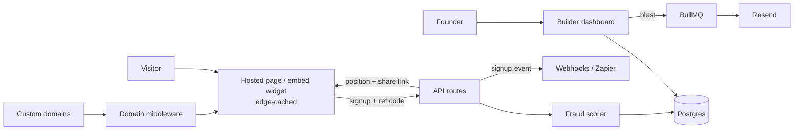

# LaunchList — Architecture

## Stack

| Layer | Choice | Why |
|-------|--------|-----|
| Web app | Next.js 15 (App Router) + TypeScript + Tailwind | Builder dashboard + hosted pages + API |
| Hosted pages | Edge-cached SSR (ISR) + custom-domain middleware | Launch spikes hit pages, not the DB |
| Database | Postgres (Drizzle) | Signups, referral graph, positions |
| Widget | Vanilla TS embed bundle (<10KB) | Drop into any existing site |
| Email | Resend (transactional + blasts) | Domain verification (DKIM) per sender |
| Queue | Redis + BullMQ | Blast sending, fraud scoring, webhooks |
| Billing | Stripe | Tiers by signup volume |

## System diagram

## Data model

- **users** — id, email, plan, stripe_customer_id
- **lists** — id, user_id, name, slug, custom_domain, template, theme jsonb, og_image_key, badge_hidden, status (pre|launched|archived)
- **signups** — id, list_id, email, referral_code (own), referred_by_signup_id, position, verified_email, fraud_score, source (page|widget|api), ip_hash, created_at
- **rewards** — id, list_id, threshold (referral count), label, description
- **reward_grants** — signup_id, reward_id, granted_at
- **blasts** — id, list_id, subject, body_html, segment (all|top_referrers|reward_tier), status, sent_count, scheduled_at
- **events** — signup/referral/blast-open events for the funnel dashboard
- **webhook_endpoints / deliveries** — Pro-tier integration log

Position semantics: base position = signup order; each verified referral moves the referrer up by a configurable boost; positions recomputed incrementally (never full-table) on referral verification.

## Key flows

### 1. Signup with referral
1. Visitor lands on `list.launchlist.app/{slug}` (or custom domain) possibly with `?ref=CODE`.
2. POST /signup: email validated (syntax + disposable-domain blocklist), double-opt-in email sent via Resend.
3. On verification: signup activated, referrer's boost applied, both parties' positions updated, reward thresholds checked → grants issued + notification email.
4. Fraud scorer (async): IP-hash clustering, velocity checks, disposable/alias patterns → high scores quarantined to review queue (don't count toward referrer boosts until cleared).

### 2. Launch-day blast
1. Founder composes blast, picks segment, schedules.
2. Worker fans out sends in rate-limited batches through Resend; opens/clicks tracked; unsubscribes honored globally per list.

### 3. Custom domain
CNAME to LaunchList edge → middleware resolves domain → list; TLS via host platform (Vercel domains API); DKIM/SPF setup wizard required before that domain can send blasts.

## Third-party services & cost

| Service | Use | Rough cost |
|---------|-----|-----------|
| Vercel | App + edge pages | $0–$40/mo |
| Neon Postgres | Data | $0–$19/mo |
| Upstash Redis | Queues | $0–$10/mo |
| Resend | Verification + blasts | $0–$90/mo (volume) |
| Stripe | Billing | 2.9% + 30¢ |

## Estimated monthly running cost

| Customers | Total | Revenue (blended ~$25/mo) | Gross margin |
|-----------|-------|---------------------------|--------------|
| 0 (dev) | ~$0 | — | — |
| 100 | ~$80 | ~$2,500 | ~97% |
| 1,000 | ~$500 | ~$25,000 | ~98% |

Email volume is the only meaningful variable cost; blast quotas per tier keep it bounded.
