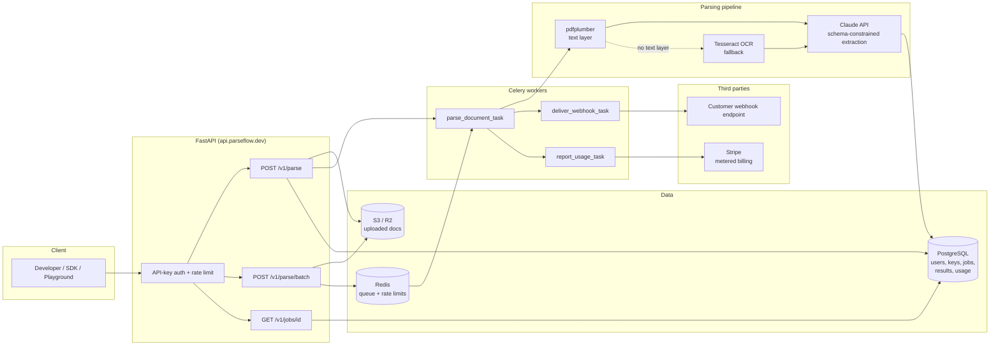

# ParseFlow — Architecture

## Stack

| Choice | Rationale (one line) |
|---|---|
| Python 3.12 | The document/ML ecosystem (pdfplumber, pytesseract, Pillow) is Python-native; 3.12 for perf + typing improvements |
| FastAPI + Pydantic v2 | Async-first, OpenAPI schema for free (feeds the docs site and playground), Pydantic v2 validates both API I/O and extraction schemas |
| PostgreSQL + SQLAlchemy 2.x (async) + asyncpg | Boring, transactional source of truth for keys/jobs/usage; async engine matches FastAPI; Alembic for migrations |
| Redis + Celery | Battle-tested async job queue for batch parsing and webhook delivery; Redis doubles as rate-limit counter store |
| pdfplumber | Free, fast text-layer extraction — handles the ~70% of PDFs that are born-digital without any OCR cost |
| Tesseract (pytesseract) | Zero-marginal-cost OCR fallback for scanned docs/images; good enough as the text source for LLM extraction |
| Claude API (anthropic SDK) | Structured extraction against arbitrary JSON Schemas via `output_config.format` — the feature that makes custom schemas possible without training |
| Stripe (metered billing) | Usage records + subscriptions handle the entire pricing table; no billing code to write beyond usage reporting |
| S3-compatible storage (Cloudflare R2) | Uploaded docs are blobs; R2 has zero egress fees and S3 API compatibility (boto3 works unchanged) |
| HMAC-signed webhooks | Industry-standard (Stripe-style) delivery verification; no shared-secret-in-URL hacks |
| argon2 (argon2-cffi) | API keys hashed at rest like passwords; prefix + last-4 stored in plaintext for display |
| Sentry + Resend | Error tracking and transactional email (key created, quota warnings) without running infrastructure |

## System Diagram

Note: sync parse runs the same pipeline code in-process (with a 30s budget) rather than through Celery, so latency isn't queue-bound; batch always goes through the queue.

## Data Model

| Entity | Fields |
|---|---|
| **User** | `id`, `email`, `password_hash` (nullable — magic-link possible), `stripe_customer_id`, `plan` (free/payg/startup/scale), `created_at`, `deleted_at` |
| **ApiKey** | `id`, `user_id` FK, `key_hash` (argon2), `prefix` (`pf_live_`/`pf_test_`), `last4`, `name`, `is_test`, `revoked_at`, `last_used_at`, `created_at` |
| **Document** | `id`, `user_id` FK, `s3_key`, `filename`, `content_type`, `size_bytes`, `page_count`, `sha256`, `retention_expires_at`, `created_at` |
| **ParseJob** | `id`, `user_id` FK, `document_id` FK, `mode` (sync/batch), `status` (queued/processing/succeeded/failed), `schema_ref` (built-in name or CustomSchema FK), `error_code`, `error_message`, `started_at`, `finished_at`, `created_at` |
| **ExtractionResult** | `id`, `job_id` FK, `output_json` (JSONB: values + per-field confidence), `overall_confidence`, `text_source` (text_layer/ocr/mixed), `model_used`, `input_tokens`, `output_tokens`, `latency_ms`, `created_at` |
| **CustomSchema** | `id`, `user_id` FK, `name`, `json_schema` (JSONB), `version`, `is_active`, `created_at` |
| **WebhookEndpoint** | `id`, `user_id` FK, `url`, `secret` (encrypted), `is_active`, `event_types` (array), `created_at` |
| **WebhookDelivery** | `id`, `endpoint_id` FK, `job_id` FK, `event_type`, `payload` (JSONB), `attempt`, `status` (pending/delivered/failed), `response_status`, `next_retry_at`, `created_at` |
| **UsageRecord** | `id`, `user_id` FK, `job_id` FK, `pages`, `billable` (bool — test keys aren't), `stripe_reported_at` (nullable), `period` (YYYY-MM), `created_at` |

Indexes that matter: `ApiKey.key_hash` lookup is by prefix+hash-verify (index on `prefix`), `UsageRecord (user_id, period)` for quota checks, `WebhookDelivery (status, next_retry_at)` for the retry sweeper, `ParseJob (user_id, created_at)` for dashboards.

## Key Flows

### 1. Sync parse (`POST /v1/parse`)

1. Auth middleware extracts `Authorization: Bearer pf_...`, verifies against `ApiKey.key_hash` (argon2), loads user + plan.
2. Quota check: `UsageRecord` sum for current period vs. plan limit; free tier over 100 pages → `402`.
3. Multipart upload validated (type, `MAX_UPLOAD_MB`, ≤10 pages for sync), streamed to S3; `Document` row created.
4. Pipeline runs in-process: pdfplumber extracts text per page → pages with <50 meaningful chars are rendered to images and OCR'd via Tesseract → combined text + (for image-heavy docs) page images sent to Claude with the target JSON Schema via structured outputs.
5. Confidence scoring: each extracted field is checked for verbatim/normalized grounding in the source text, combined with the model's self-reported certainty → 0–1 per field.
6. `ParseJob` + `ExtractionResult` persisted; `UsageRecord` written (pages counted); response returned. P95 target: <15s for a 3-page invoice.

### 2. Async batch with webhook (`POST /v1/parse/batch`)

1. Same auth/quota path; accepts up to 1,000 documents (or a manifest of S3-presigned uploads for large batches).
2. One `ParseJob` per document, `status=queued`; `parse_document_task` fanned out to Celery via Redis.
3. Workers run the identical pipeline (step 4–6 above). Failures retry ×2 with backoff, then mark `failed` with a machine-readable `error_code`.
4. On each job completion, `deliver_webhook_task` enqueued: payload `{event: "job.completed", job_id, status, result_url}` signed with `X-ParseFlow-Signature: t=<ts>,v1=HMAC_SHA256(secret, ts + "." + body)`.
5. Non-2xx or timeout → retries at +1m, +10m, +1h; after final failure `WebhookDelivery.status=failed` and the customer sees it on the dashboard. Polling via `GET /v1/jobs/{id}` always works as fallback.

### 3. Metered billing → Stripe

1. Every completed job writes a `UsageRecord` (pages, billable flag) in the same DB transaction as the result — usage is never lost to a crash after billing.
2. `report_usage_task` runs every 15 min: selects `stripe_reported_at IS NULL AND billable`, aggregates per user, pushes Stripe usage records against the metered price (`STRIPE_METERED_PRICE_ID`), stamps `stripe_reported_at`. Target: usage visible in Stripe within 1h of parse.
3. Idempotency: Stripe usage records keyed by `usage_record_batch_id` so a retried task can't double-bill.
4. Plan tiers are Stripe subscriptions with included quantity; overage is the same meter at the tier's overage price. Stripe webhooks (`invoice.paid`, `customer.subscription.updated`) update `User.plan`; payment failure → key soft-suspension after grace period.

### 4. Custom-schema extraction

1. Customer registers a schema: `POST /v1/schemas` with a JSON Schema document. Server validates it against the supported subset (object/array/scalars, enums, `additionalProperties: false` enforced; no recursion, no numeric/string constraints — those are validated post-hoc server-side).
2. Schema stored versioned in `CustomSchema`; parse requests reference `schema=cust_<id>`.
3. At parse time the pipeline wraps the customer schema: every leaf property is transformed into `{value: <original type>, confidence: number}` before being sent to Claude as the structured-output format — so confidence scoring is uniform across built-in and custom schemas.
4. The (stable) schema prompt block is placed before the (volatile) document text with a prompt-cache breakpoint, so repeat extractions against the same schema hit the prompt cache (~90% input-cost reduction on the schema portion).

## Third-Party Services & Rough Pricing

| Service | Role | Rough cost |
|---|---|---|
| Claude API (Anthropic) | Structured extraction | Sonnet-class ≈ $3/MTok in, $15/MTok out; a typical page ≈ 1–2k input tokens + ~300 output → **~$0.002–0.004/page**; Haiku-class ($1/$5 per MTok) cuts simple-doc cost ~3× |
| Cloudflare R2 (or AWS S3) | Document storage | $0.015/GB-mo, zero egress on R2 — ~$5–20/mo at early scale |
| Stripe | Billing | 2.9% + 30¢ per charge, + Billing at 0.5–0.7% of volume |
| Render / Fly.io / Railway | API + workers + Postgres + Redis hosting | $25–40/mo minimal (1 web, 1 worker, small PG, small Redis); scales linearly |
| Sentry | Errors/perf | Free tier → $26/mo Team |
| Resend | Transactional email | Free 3k/mo → $20/mo |
| Tesseract | OCR | $0 licence; costs show up as worker CPU (~1–3s/page ⇒ sizing driver for workers) |

## Estimated Monthly Running Cost

Assumption: average paying customer parses ~2,000 pages/mo; ~35% of pages need OCR.

| Scale | Infra | LLM + OCR compute | Other SaaS | Total |
|---|---|---|---|---|
| **0 customers (idle)** | $25–30 (1 web + 1 worker + PG + Redis) | ~$0 | $0 (free tiers) | **~$25–40** |
| **100 customers** (~200k pages/mo) | $80–150 (2–3 workers, bigger PG) | $400–800 LLM + OCR CPU | $50–100 (Sentry, Resend, Stripe Billing fees) | **~$300–600** (spec-consistent; LLM-dominated) |
| **1,000 customers** (~2M pages/mo) | $500–1,000 | $2.5k–4.5k | $300–500 | **~$3k–6k** |

**Per-page unit economics:** price $0.010 (list) vs. COGS ~$0.004 (LLM ~$0.003 + OCR/infra amortized ~$0.001) → **~60% gross margin** at pay-as-you-go, ~35–50% at the Scale tier's $0.005/page — which is why volume tiers should route more traffic to the cheaper model class and lean on prompt caching. Costs are dominated by LLM + OCR compute at every scale past zero; infrastructure is a rounding error.
