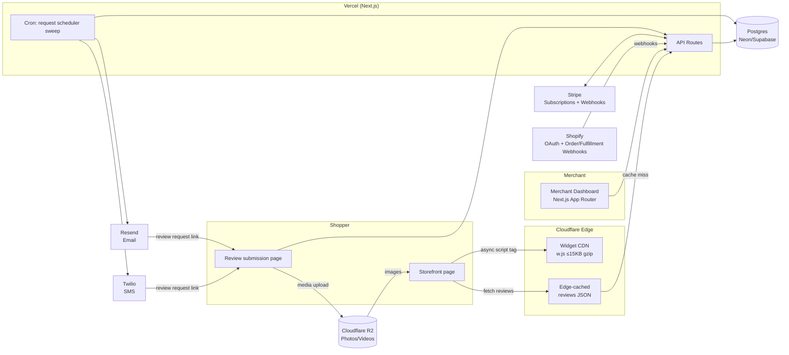

# TrustBadge — Architecture

## Stack & Rationale

| Layer | Choice | Why |
|---|---|---|
| App framework | Next.js 15 (App Router) + TypeScript | One codebase for merchant dashboard, hosted review submission pages, and API routes; RSC keeps dashboard fast; Vercel deploy is zero-ops for a solo builder |
| Styling | Tailwind CSS | Speed of iteration; design consistency without a design system team |
| Database | Postgres (Neon or Supabase) + Drizzle ORM | Relational fits the domain (orders → requests → reviews → media); Drizzle gives typed schema + SQL migrations without a heavyweight runtime; serverless drivers fit Vercel |
| Billing | Stripe subscriptions | Tier enforcement via webhook-synced subscription state; usage (order count) metered in-app against tier limits |
| Widget | Separate vanilla-JS bundle (`src/widget`, built with esbuild) | The widget must NOT ship React or any framework. Hard budget: ≤15KB gzip. Built independently of the Next.js app, deployed to Cloudflare CDN |
| Widget data | Edge-cached JSON API | Reviews JSON served from Cloudflare edge cache (or Vercel edge with `s-maxage` + tag revalidation); target ≤30ms TTFB |
| Shopify | OAuth app + webhooks (`orders/fulfilled`, `orders/create`, `app/uninstalled`) | Fulfillment events trigger review-request scheduling |
| Email | Resend | Modern API, per-domain sending for deliverability, React Email templates |
| SMS | Twilio | Commodity, reliable, pay-per-message |
| Media storage | Cloudflare R2 (S3-compatible API) | Review photos/videos; zero egress fees matter because widget traffic serves media at storefront scale |
| Scheduling | Vercel Cron + DB-backed job table | Review requests are "send at T+14 days" jobs; a cron sweep every 10 min over a `review_requests` table beats a queue service at this scale |

## System Diagram

## Data Model

All tables in Postgres via Drizzle (`src/lib/db/schema.ts`).

| Entity | Purpose | Key fields (beyond id/timestamps) |
|---|---|---|
| **Merchant** | Account owner (a human/team) | email, name, authProvider |
| **Store** | A storefront; merchant has many | merchantId, platform (`shopify`\|`script_tag`\|`woocommerce`), domain, shopifyShopId?, accessToken (encrypted), publicKey (widget auth), settings |
| **Order** | Ingested order, the metering unit | storeId, externalId, customerEmail, customerPhone?, lineItems (jsonb), fulfilledAt, status |
| **ReviewRequest** | Scheduled outreach job | orderId, storeId, channel (`email`\|`sms`), scheduledAt, sentAt?, openedAt?, status (`scheduled`\|`sent`\|`opened`\|`submitted`\|`bounced`\|`cancelled`), token (submission link) |
| **Review** | The review itself | storeId, orderId?, requestId?, productExternalId, rating 1–5, title, body, authorName, verifiedPurchase, status (`pending`\|`approved`\|`rejected`), incentiveCode?, reply, source (`native`\|`import_amazon`\|`import_etsy`\|`import_google`\|`import_csv`\|`import_judgeme`\|`import_loox`) |
| **ReviewMedia** | Photos/videos on a review | reviewId, kind (`photo`\|`video`), r2Key, width, height, bytes, moderationStatus |
| **Widget** | An embeddable instance | storeId, type (`wall`\|`carousel`\|`badge`\|`stars`), abGroup? |
| **WidgetSettings** | Per-widget config (versioned) | widgetId, theme (jsonb: colors, radius, font), layout options, showBranding |
| **ImportJob** | Bulk review import run | storeId, source, fileR2Key, status, totalRows, importedRows, errorLog (jsonb) |
| **Subscription** | Stripe state mirror | merchantId, stripeCustomerId, stripeSubscriptionId, tier (`free`\|`starter`\|`growth`\|`pro`), status, currentPeriodEnd, orderCountThisPeriod |

Relations: Merchant 1—N Store 1—N Order 1—1..N ReviewRequest; Review N—1 Store, optionally N—1 Order/ReviewRequest; Review 1—N ReviewMedia; Store 1—N Widget 1—1 WidgetSettings (current) with history; Merchant 1—1 Subscription.

## Key Flows

### 1. Shopify install + OAuth
1. Merchant clicks install on the Shopify App Store → Shopify redirects to `/api/shopify/auth` with `shop` param.
2. Validate HMAC, redirect to Shopify authorize URL with scopes `read_orders,read_fulfillments,write_script_tags`.
3. Callback: exchange code for offline access token, encrypt + store on `Store`, register webhooks (`orders/create`, `orders/fulfilled`, `app/uninstalled`).
4. Create Merchant + Store rows (or link to existing account by email), inject storefront script tag (or instruct theme-app-extension install on OS 2.0 themes).
5. Land merchant in onboarding: pick widget, preview on their live theme, set request delay.

### 2. Order → review request → live review
1. `orders/fulfilled` webhook hits `/api/webhooks/shopify` → verify HMAC → upsert `Order`, increment period order count (tier metering).
2. Create `ReviewRequest` with `scheduledAt = fulfilledAt + store.requestDelayDays` (default 14).
3. Cron sweep (every 10 min) selects due `scheduled` requests → sends via Resend (or Twilio on Growth+ if phone present and email previously ignored) → marks `sent`. Suppression + bounce handling updates status.
4. Shopper clicks tokenized link → hosted submission page → stars, text, photo upload (presigned R2 PUT). Photo submission on Growth+ triggers incentive discount code issuance (any rating — no gating).
5. Review lands in moderation queue as `pending` (or auto-approves at/above merchant's threshold, e.g. ≥4 stars auto-publish is allowed; *suppressing* below-threshold reviews from requests is not — anti-gating).
6. On approve: review becomes servable; edge cache for that store's reviews JSON is purged (cache tag invalidation).

### 3. Widget render path (the ≤30ms story)
1. Storefront HTML contains `<script async src="https://cdn.trustbadge.io/w.js" data-store="pk_...">` — async, so zero render blocking.
2. `w.js` is immutable-cached on Cloudflare CDN (`cache-control: public, max-age=31536000`, versioned filename); ≤15KB gzip enforced by CI.
3. Script reserves widget container height *before* fetch (fixed aspect placeholder) → zero CLS.
4. Fetches `GET /api/widget/{storeId}/reviews?product=...` — served from Cloudflare edge cache (`s-maxage=300, stale-while-revalidate=86400`). Cache hit ≈ 10–30ms TTFB globally; miss falls through to the Next.js API (~150–300ms) and repopulates.
5. Renders wall/carousel/badge with vanilla DOM; images lazy-load from R2 with explicit dimensions; JSON-LD `AggregateRating` injected for rich snippets.
6. Approval/rejection events purge the store's cache keys so content is never >minutes stale after moderation.

### 4. Review import / migration
1. Merchant uploads CSV or a Judge.me/Loox export file (or connects Amazon/Etsy/Google Business via URL/listing scrape-and-parse for public reviews) → file lands in R2, `ImportJob` created.
2. Background processing (cron-picked or immediate serverless invocation) streams rows: validate, dedupe (hash of author+body+date), map to `Review` with `source` set, download referenced photos into R2.
3. Imported reviews enter moderation as `pending` by default with a bulk-approve action; job progress visible in dashboard; error rows downloadable.

## Third-Party Services & Pricing Notes

| Service | Role | Pricing note |
|---|---|---|
| Vercel | App hosting + cron | Hobby free; Pro $20/mo/seat when commercial |
| Neon / Supabase | Postgres | Free tier fine to ~100 customers; ~$19–25/mo (Neon Launch / Supabase Pro) after; ~$69–100+/mo at high volume |
| Stripe | Billing | No fixed fee; 2.9% + 30¢ (+0.5% for billing on some plans) |
| Resend | Email | Free 3k emails/mo; **$20/mo for 50k**; ~$90/mo for 200k |
| Twilio | SMS | **~$0.0079/SMS** (US) + $1.15/mo per number; toll-free/10DLC registration fees |
| Cloudflare R2 + CDN | Media + widget + edge cache | R2 $0.015/GB-mo storage, **zero egress**; CDN/cache effectively free at this scale |
| Shopify Partner | App distribution | **0% rev share on first $1M lifetime app revenue** (registration required) — effectively free distribution |

## Estimated Monthly Running Cost

Assumptions: avg customer ≈ 500 orders/mo blended, ~60% get an email request, ~15% of Growth+ requests add SMS, ~2GB media/customer accumulating.

| Scale | Rough math | Est. cost |
|---|---|---|
| **0 customers (idle)** | Vercel Hobby $0 + Neon free $0 + Resend free $0 + R2 pennies + domain | **~$0–25/mo** |
| **100 customers** | ~30k emails (Resend $20) + ~2k SMS ($16) + Neon/Supabase paid ~$25 + Vercel Pro $20 + R2 ~200GB $3 + misc/monitoring ~$50–150 | **~$150–300/mo** (vs ~$3.5k MRR → ~92% gross margin) |
| **1,000 customers** | ~300k emails (~$90–200) + ~25k SMS (~$200–400) + Postgres at real load ~$200–500 + Vercel ~$100–250 + R2 ~2TB $30 + observability/support tooling ~$200–500 + headroom | **~$1.5k–3k/mo** (vs ~$35k MRR → still >90% margin; email/SMS volume + DB dominate) |

Cost scales sub-linearly with revenue; the only per-unit costs that matter are messages and media storage, and R2's zero egress removes the classic media-serving trap.
