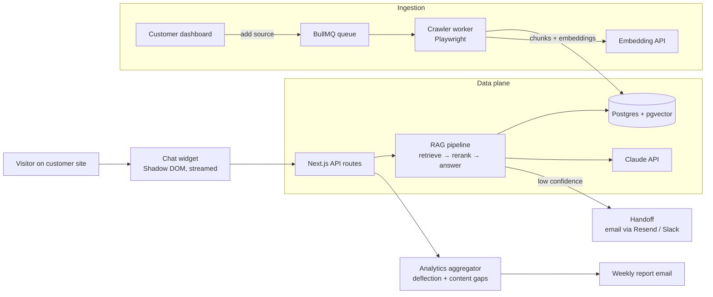

# AnswerDesk — Architecture

## Stack

| Layer | Choice | Why |
|-------|--------|-----|
| Web app | Next.js 15 (App Router) + TypeScript + Tailwind | One codebase for marketing, dashboard, and API routes |
| Database | Postgres + **pgvector** (Drizzle ORM) | Relational data and vector search in one store — no separate vector DB to run |
| Queue | Redis + BullMQ | Crawl and re-index jobs are long-running and retryable |
| Crawler | Node worker + Playwright | JS-rendered docs sites (Docusaurus, GitBook, Intercom articles) need a real browser |
| LLM | Claude (answers) + OpenAI `text-embedding-3-small` (embeddings) | Best answer quality with citations; embeddings are a commodity — buy the cheapest good one |
| Widget | Vanilla TS bundle, Shadow DOM | Must load on any site without conflicts; <25KB gzipped budget |
| Billing | Stripe subscriptions + metered messages | Flat tiers with message caps |
| Email/Slack | Resend / Slack Web API | Handoff channels |

## System diagram

## Data model

- **orgs** — id, name, plan, stripe_customer_id, message_quota, created_at
- **bots** — id, org_id, name, brand_color, welcome_message, confidence_threshold, handoff_channel (email|slack), status
- **sources** — id, bot_id, type (crawl|file), root_url / file_key, page_limit, last_crawled_at, crawl_status
- **pages** — id, source_id, url, title, content_hash, last_indexed_at
- **chunks** — id, page_id, heading_path, content, token_count, embedding `vector(1536)` (HNSW index)
- **conversations** — id, bot_id, visitor_id, started_at, resolved (bool), handed_off (bool)
- **messages** — id, conversation_id, role, content, citations jsonb, confidence, feedback (up|down|null), created_at
- **unanswered_questions** — id, bot_id, question, cluster_id, count, first_seen, last_seen
- **subscriptions** — org_id, stripe_subscription_id, plan, current_period_messages

## Key flows

### 1. Source ingestion
1. Customer adds a root URL in the dashboard → `sources` row + crawl job enqueued.
2. Crawler fetches sitemap (fallback: BFS from root), respecting robots.txt and `CRAWL_PAGE_LIMIT`.
3. Each page: Playwright render → readability extraction → markdown (turndown) → content hash. Unchanged hashes are skipped on re-crawls.
4. Changed pages are chunked (~500 tokens, heading path prepended for context), embedded in batches, upserted into `chunks`.
5. Crawl summary (pages indexed / skipped / failed) surfaces in the dashboard.

### 2. Answering a question
1. Widget POSTs the question; API validates bot + org message quota.
2. Hybrid retrieval: pgvector cosine top-20 + keyword (tsvector) top-10 → merged and reranked → top-6 chunks.
3. Claude generates the answer **constrained to retrieved chunks**, emitting inline `[n]` citation markers mapped to source URLs; response streams to the widget.
4. Confidence gate: if retrieval scores or model self-assessment fall below the bot's threshold, the bot says it doesn't know and offers handoff. The question is recorded in `unanswered_questions` (clustered by embedding similarity).
5. Message + citations + confidence persisted; quota counter incremented.

### 3. Handoff
1. Visitor accepts handoff → form captures email + transcript context.
2. Email channel: Resend sends transcript to the org's support address. Slack channel: message posted via Slack app with reply-in-thread instructions.
3. Conversation flagged `handed_off` — counts **against** deflection rate (honest analytics is the product promise).

### 4. Weekly content-gap report
1. Cron aggregates per bot: deflection rate, top intents, new unanswered clusters.
2. Report email: "Your bot couldn't answer these 12 questions — here are the 3 doc pages to write."

## Third-party services & cost

| Service | Use | Rough cost |
|---------|-----|-----------|
| Vercel / Fly.io | App + workers | $0–$40/mo |
| Neon/Supabase Postgres (pgvector) | Data + vectors | $0–$69/mo |
| Upstash Redis | Queues | $0–$10/mo |
| Anthropic API | Answers | ~$0.003–$0.01 per answered message |
| OpenAI embeddings | Indexing | ~$0.02 per 1M tokens — negligible |
| Resend / Slack | Handoff + reports | $0–$20/mo |
| Stripe | Billing | 2.9% + 30¢ |

## Estimated monthly running cost

| Customers | Infra | LLM | Total | Revenue (blended ~$80/mo) | Gross margin |
|-----------|-------|-----|-------|---------------------------|--------------|
| 0 (dev) | ~$5 | ~$5 | **~$10** | — | — |
| 100 | ~$120 | ~$400 | **~$520** | ~$8,000 | ~93% |
| 1,000 | ~$600 | ~$4,000 | **~$4,600** | ~$80,000 | ~94% |

LLM cost scales with messages, not customers — message caps per tier keep margins predictable; overage pricing protects the tail.
