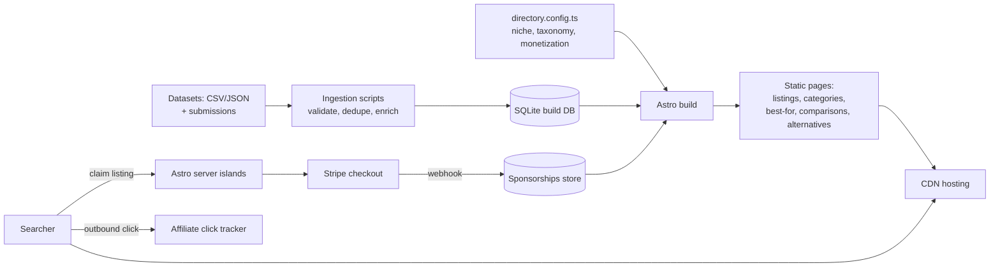

# NicheHub — Architecture

## Stack

| Layer | Choice | Why |
|-------|--------|-----|
| Framework | Astro 5 (static-first, content collections) + TypeScript + Tailwind | Programmatic pages as static HTML = CWV wins + pennies to host |
| Data | SQLite at build time (better-sqlite3) per directory; Postgres optional for large/live datasets | Directories are read-heavy, build-time data is enough for <50k listings |
| Dynamic islands | Astro islands (search, filters, claim/checkout) | Interactivity only where needed |
| Payments | Stripe Checkout + customer portal | Self-serve sponsored listings |
| Search | Pagefind (build-time index) | Zero-infra client search |
| Deploy | One deployment per directory, parameterized by `directory.config.ts` | Config-not-code per niche |

## System diagram

## Data model (per directory)

- **listings** — id, slug, name, description, website, category_ids[], location (city/region/geo), attributes jsonb (schema defined per niche in config), logo_key, rating, review_count, last_verified_at, status (active|dead|pending)
- **categories** — id, slug, name, parent_id, intro_content
- **locations** — id, slug, city, region, country (for local niches)
- **sponsorships** — listing_id, tier (featured|premium), stripe_subscription_id, starts_at, ends_at
- **submissions** — pending listing submissions + moderation state
- **clicks** — listing_id, kind (site|affiliate), day, count (aggregated; feeds "popular" ranking + affiliate reporting)

`directory.config.ts` defines: niche name, domain, listing attribute schema (typed fields that drive comparison tables), taxonomy depth, page-generation rules (which matrices to build), monetization toggles, affiliate URL templates.

## Key flows

### 1. Build a directory site
1. Ingestion scripts load CSV/JSON → validate against the config's attribute schema → dedupe (name+domain fuzzy match) → enrich (geocode, favicon/logo fetch) → SQLite.
2. Astro build reads config + SQLite → generates: listing pages, category and category×location pages, "best X for Y" pages, A-vs-B comparison pages (top-N pairs by traffic potential), alternatives pages.
3. **Thin-content guard:** every generated page computes a unique-content score (distinct data points rendered); below-threshold pages are excluded from build + sitemap.
4. Pagefind indexes at build; sitemaps + schema.org JSON-LD emitted per page type.

### 2. Sponsored listing purchase
1. Business owner clicks "Claim & feature this listing" → email-verify ownership (domain-match heuristic + confirmation link).
2. Stripe Checkout (tier per config) → webhook records sponsorship → next scheduled rebuild promotes placement + badge. Rebuilds run on a cron (e.g., every 6h) so the site stays static.

### 3. Affiliate click tracking
Outbound CTAs route through /go/{listing} edge function → click logged (aggregate) → 302 to affiliate-templated URL. No PII stored.

## Third-party services & cost (per directory)

| Service | Use | Rough cost |
|---------|-----|-----------|
| Cloudflare Pages / Netlify | Hosting + edge functions | $0–$5/mo |
| Domain | — | ~$12/yr |
| Stripe | Sponsorships | 2.9% + 30¢ |
| Geocoding/enrichment APIs | Build-time only | ~$0–$10 per ingest |
| Resend | Claim verification, "you're listed" outreach | $0–$20/mo |

## Estimated monthly running cost

| Portfolio | Total infra | Revenue potential (mature) | Margin |
|-----------|-------------|----------------------------|--------|
| 1 directory | ~$5 | $2k–$30k/mo | ~99% |
| 5 directories | ~$25 | $10k–$60k/mo | ~99% |

The cost is time, not infrastructure: dataset curation and SEO patience dominate.
