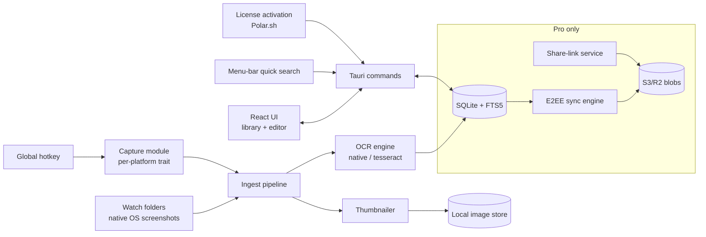

# ShotStash — Architecture

## Stack

| Layer | Choice | Why |
|-------|--------|-----|
| Shell | Tauri 2 (Rust) | Tiny binaries, real native APIs, cross-platform (Win/mac/Linux) |
| Frontend | React + TypeScript + Vite + Tailwind | Library UI, search, editor |
| Storage | SQLite (rusqlite) with **FTS5** | Local full-text index over OCR output; fast at 100k+ rows |
| OCR | Platform-native first: Apple Vision (macOS), Windows.Media.Ocr (Win); Tesseract (Linux/fallback) | Native OCR beats Tesseract on UI text by a wide margin |
| Capture | Per-platform behind a Rust trait: ScreenCaptureKit / Windows Graphics Capture / xdg-desktop-portal (Wayland) | Isolates the churny OS surface |
| Licensing | Polar.sh (or LemonSqueezy) SDK, offline-capable activation | Merchant of record handles tax |
| Sync (Pro) | End-to-end encrypted blobs to S3-compatible storage; keys never leave devices | Privacy promise must hold in architecture |

## System diagram

## Data model (SQLite)

- **shots** — id, file_path, sha256, captured_at, source (hotkey|import|watch), app_name, window_title, width, height, thumb_path
- **shot_text** — FTS5 virtual table: shot_id, ocr_text, ocr_blocks jsonb (text + bounding boxes for in-image highlight)
- **tags / shot_tags** — user taxonomy
- **collections / collection_shots** — manual groupings
- **settings** — hotkeys, watch folders, retention rules, telemetry opt-in
- **license** — key, activated_at, machine_fingerprint, plan
- **sync_state** (Pro) — per-shot sync status, device id, key material references (OS keychain)

## Key flows

### 1. Capture → searchable in <2s
1. Hotkey → capture trait grabs region/window/screen → PNG written to local store.
2. Ingest: hash, EXIF-ish metadata (frontmost app, window title where OS allows), thumbnail.
3. OCR job (background thread pool) → text + word bounding boxes → FTS5 upsert.
4. Toast with instant actions (copy, annotate, tag); library updates live.

### 2. Bulk import (the wow moment)
1. User points at ~/Desktop or the OS screenshot folder → ingest queue with progress.
2. OCR throttled to N workers to stay cool; index builds incrementally — search works on already-processed shots immediately.

### 3. Search with in-image highlights
Query → FTS5 match → results ranked (recency × match density) → selected result renders bounding-box highlights over matched words.

### 4. E2EE sync (Pro)
Device keypair in OS keychain; per-shot content keys wrapped per device; encrypted blobs + encrypted index deltas pushed to S3; server never holds plaintext or keys. Pairing via QR/short-code between devices.

## Third-party services & cost

| Service | Use | Rough cost |
|---------|-----|-----------|
| Polar.sh / LemonSqueezy | License sales (MoR) | ~5% + fees per sale |
| R2/S3 (Pro sync) | Encrypted blobs | ~$0.015/GB — pennies/user |
| Website hosting | Marketing site | $0 (static) |
| Apple/MS signing certs | Notarization/signing | ~$99/yr + ~$200/yr |

## Estimated monthly running cost

| Users | Infra | Notes |
|-------|-------|-------|
| 0 (dev) | ~$0 | signing certs are the only fixed cost |
| 1,000 licensed | ~$10 | local-first: no per-user server cost |
| 1,000 licensed + 200 Pro sync | ~$30 | sync storage/egress only |

Effectively a ~95%+ margin product; the real costs are code signing, support time, and platform QA.
