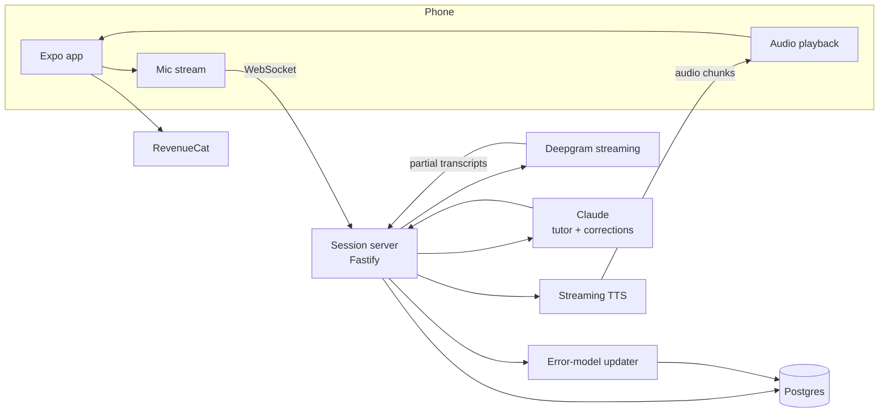

# LingoLoop — Architecture

## Stack

| Layer | Choice | Why |
|-------|--------|-----|
| Mobile app | Expo (React Native) + TypeScript + expo-router | One codebase, fast iteration, OTA updates |
| Audio | expo-av + streaming via WebSocket | Mic capture upstream, TTS chunks downstream |
| Backend | Node.js + Fastify (WebSocket session server) | Orchestrates the STT → LLM → TTS pipeline per session |
| STT | Deepgram streaming (or Whisper via provider) | Low-latency word-by-word transcription |
| LLM | Claude API | Tutor persona, corrections, level adaptation |
| TTS | ElevenLabs / provider with streaming + per-language voices | Naturalness is the product |
| Database | Postgres (Drizzle) | Users, sessions, error models, drills |
| Payments | RevenueCat | Annual-with-trial paywall, experiments |

## System diagram

## Data model

- **users** — id, level_estimate (CEFR per language), native_language, target_languages[], rc_customer_id
- **sessions** — id, user_id, language, scenario_id, mode (voice|text), duration_sec, transcript jsonb, completed_goal, started_at
- **corrections** — id, session_id, utterance, issue_type (grammar|vocab|pronunciation), correction, explanation, confidence
- **error_model** — user_id, language, pattern_key (e.g. "ser-vs-estar"), strength (decaying score), last_seen
- **drills** — id, user_id, pattern_key, prompt, status (pending|done), generated_at
- **scenarios** — id, language_agnostic prompt pack: setting, tutor persona, goal condition, level variants
- **streaks / usage** — daily activity, fair-use accounting

## Key flows

### 1. Voice session
1. App opens WebSocket with session config (language, scenario, level).
2. Mic audio streams up; Deepgram partials stream to the session server; end-of-utterance detection triggers the LLM turn.
3. Claude responds in persona (level-appropriate vocabulary, one thought at a time); response streams to TTS; audio chunks stream down and play with <1.5s target first-audio latency.
4. Silent correction pass runs alongside (separate cheaper call): flags issues with confidence scores — never interrupts the conversation.
5. Session end → corrections persisted → error model updated (pattern extraction + strength bump) → post-session report rendered in app.

### 2. Adaptive warm-up
On session start, top-N strongest error patterns generate 2–3 quick drills (cached TTS); completing them decays pattern strength.

### 3. Paywall
Free tier = 1 session/day enforced server-side; paywall placements: session-limit hit, report screen ("unlock full corrections"), scenario library. RevenueCat entitlements gate server-side session auth.

## Third-party services & cost

| Service | Use | Rough cost |
|---------|-----|-----------|
| Deepgram | STT | ~$0.0059/min |
| Anthropic | Tutor + corrections | ~$0.01–0.04/session |
| ElevenLabs (or similar) | TTS | ~$0.03–0.10/session (the big line; cache drills) |
| Fly.io | Session servers | $20–200/mo scaling |
| Neon Postgres | Data | $19–69/mo |
| RevenueCat | Billing | free <$2.5k MTR, then 1% |

## Estimated monthly running cost

| Subscribers | Infra | Speech+LLM | Total | Revenue (~$9/mo blended) | Gross margin |
|-------------|-------|------------|-------|--------------------------|--------------|
| 0 (dev) | ~$25 | ~$20 | **~$45** | — | — |
| 100 | ~$60 | ~$350 | **~$410** | ~$900 | ~54% |
| 1,000 | ~$250 | ~$3,500 | **~$3,750** | ~$9,000 | ~58% |

Margins are the thinnest in the portfolio at small scale and improve with TTS caching, fair-use caps, and falling speech prices — model this honestly before discounting.
