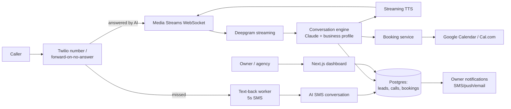

# CallCatch — Architecture

## Stack

| Layer | Choice | Why |
|-------|--------|-----|
| Web app | Next.js 15 + TypeScript + Tailwind | Dashboard, onboarding wizard, agency portal |
| Telephony | Twilio (Voice, SMS, phone numbers) behind an adapter | Industry default; adapter keeps Telnyx as fallback |
| Voice AI | Twilio Media Streams → STT (Deepgram) → Claude → streaming TTS | Full control of the conversation loop |
| Database | Postgres (Drizzle) | Businesses, calls, leads, bookings |
| Queue | Redis + BullMQ | Text-back timers, notification fan-out, transcript processing |
| Calendar | Google Calendar API + Cal.com API | Booking against real availability |
| Billing | Stripe | Tiers + setup fees + agency invoicing |

## System diagram

## Data model

- **businesses** — id, name, vertical, phone_config (provisioned|forwarded), twilio_number, timezone, plan, agency_id?, stripe_customer_id
- **profiles** — business_id, services[], service_area, hours jsonb, pricing_notes, faqs jsonb, escalation_number, vertical_pack_id
- **calls** — id, business_id, direction, caller_number, mode (ai_voice|missed|transferred), duration, recording_url?, transcript jsonb, outcome (lead|booked|message|spam), consent_disclosed
- **conversations** — SMS threads: id, business_id, caller_number, messages jsonb, state (qualifying|captured|closed)
- **leads** — id, business_id, source_call_id?, source_conversation_id?, name, contact, job_type, urgency, est_value, status
- **bookings** — lead_id, calendar_event_id, slot, status
- **agencies** — white-label config, margin, managed business ids
- **vertical_packs** — per-industry FAQ/qualification templates

## Key flows

### 1. Missed-call text-back (the $99 workhorse)
1. Twilio status callback fires on no-answer/busy → worker sends SMS within 5s.
2. Caller replies → AI SMS loop qualifies: job type → location → urgency → name. Every turn updates the lead record (partial capture beats none).
3. Owner notified with summary + tap-to-call; dashboard logs estimated value (vertical-pack average job values).

### 2. AI-answered call
1. Inbound → recorded-line disclosure (state-aware) → greeting in business name.
2. Streaming loop (STT partials → conversation engine → TTS) with a strict state machine: answer-FAQ / qualify-lead / book-appointment / take-message / transfer-to-human.
3. Confidence gate: any low-confidence turn degrades gracefully to message-taking — never improvise pricing or promises.
4. Booking: engine reads availability, offers 2–3 slots, books, confirms by SMS to caller + owner.
5. Post-call: transcript summarization, lead extraction, outcome classification, notification.

### 3. Onboarding wizard
Business info → vertical pack applied → FAQ review/edit → number provisioning or forwarding instructions (with live test call) → calendar connect → go live. Target: 15 minutes.

## Third-party services & cost

| Service | Use | Rough cost |
|---------|-----|-----------|
| Twilio | Numbers, voice, SMS, media streams | ~$1.15/number, ~$0.014/min voice, ~$0.0079/SMS |
| Deepgram | STT | ~$0.0059/min |
| Anthropic | Conversation engine | ~$0.01–0.03/call |
| TTS provider | Voice | ~$0.02–0.10/call |
| Vercel + Fly.io | App + media-stream servers | $30–150/mo |
| Neon, Upstash, Stripe, Resend | Usual | ~$50/mo |

## Estimated monthly running cost

| Customers | Infra | Telephony+AI | Total | Revenue (blended ~$165/mo) | Gross margin |
|-----------|-------|--------------|-------|----------------------------|--------------|
| 0 (dev) | ~$40 | ~$20 | **~$60** | — | — |
| 100 | ~$150 | ~$3,000 | **~$3,150** | ~$16,500 | ~81% |
| 1,000 | ~$600 | ~$30,000 | **~$30,600** | ~$165,000 | ~81% |

Call-volume caps per tier keep the variable line predictable; overage pricing (>plan calls) protects against heavy users.
