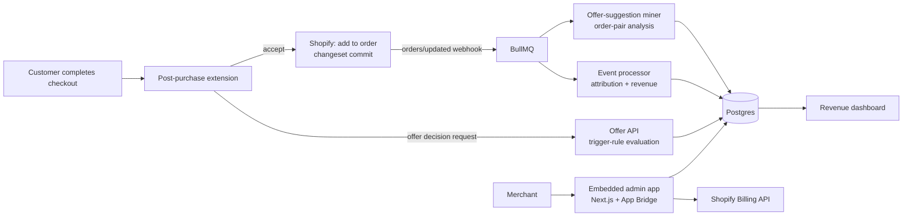

# CartBoost — Architecture

## Stack

| Layer | Choice | Why |
|-------|--------|-----|
| App server | Next.js 15 + TypeScript + Tailwind (embedded Shopify admin app via App Bridge) | Standard modern Shopify app shape |
| Checkout UI | Shopify **post-purchase checkout extension** (React, extension points API) | The only sanctioned way to render one-click post-purchase offers |
| Database | Postgres (Drizzle) | Shops, funnels, offers, events |
| Queue | Redis + BullMQ | Webhook processing, analytics rollups, AI suggestion mining |
| Billing | Shopify Billing API (mandatory for app-store apps) | Charges appear on the merchant's Shopify bill |
| Analytics | Event stream in Postgres, daily rollups | Powers the "found money" dashboard |

## System diagram

## Data model

- **shops** — id, shopify_domain, access_token (encrypted), plan, billing_charge_id, install/uninstall timestamps
- **funnels** — id, shop_id, name, status, trigger_rules jsonb (products[], min_cart_value, customer_tags[]), priority
- **offers** — id, funnel_id, step (1|2/downsell), product_id, variant_strategy, discount_pct, copy jsonb, ab_group?
- **ab_tests** — funnel_id, variant_a/b offer ids, split, winner, significance state
- **offer_events** — id, shop_id, funnel_id, offer_id, order_id, event (shown|accepted|declined), amount, created_at
- **revenue_rollups** — shop_id, day, upsell_revenue, offers_shown, acceptance_rate (dashboard reads these, never raw events)
- **suggestions** — shop_id, anchor_product_id, suggested_product_id, support/confidence metrics, status

## Key flows

### 1. Post-purchase offer
1. Checkout completes → Shopify invokes the extension's `shouldRender` → Offer API evaluates funnels by priority against order contents/value/customer.
2. Matching offer renders (product, discount, one-click Add / No thanks) with a countdown-free, honest UI (dark patterns hurt store brands).
3. Accept → extension commits the changeset (Shopify handles payment on the original authorization) → decline → step-2 downsell if configured.
4. `orders/updated` webhook → event processor attributes the added line item → revenue rollups.

### 2. A/B test
Deterministic hash(order_id) splits traffic; dashboard shows acceptance + revenue per variant with a simple significance indicator; one-click promote winner.

### 3. AI offer suggestions (Pro)
Nightly job mines the shop's order history for frequently-co-purchased pairs (support/confidence thresholds), filters low-margin/oversized items, surfaces "create this funnel" cards.

### 4. Billing + free-tier cap
Shopify Billing subscription per tier; free tier tracked against monthly attributed upsell revenue — crossing $200 triggers the upgrade nudge (offers keep running for the grace period, then pause).

## Third-party services & cost

| Service | Use | Rough cost |
|---------|-----|-----------|
| Vercel / Fly | App + workers | $20–60/mo |
| Neon Postgres | Data | $19–69/mo |
| Upstash Redis | Queues | $10/mo |
| Shopify | Platform rev share | 0% first $1M/yr (small-dev program), then 15% |

## Estimated monthly running cost

| Customers | Total infra | Revenue (blended ~$35/mo) | Gross margin |
|-----------|-------------|---------------------------|--------------|
| 0 (dev) | ~$10 | — | — |
| 100 | ~$80 | ~$3,500 | ~97% |
| 1,000 | ~$400 | ~$35,000 | ~98% (pre Shopify rev share) |
