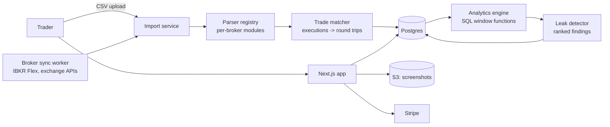

# TradeLog — Architecture

## Stack

| Layer | Choice | Why |
|-------|--------|-----|
| Web app | Next.js 15 + TypeScript + Tailwind | Dashboard-heavy product, one deploy |
| Database | Postgres (Drizzle) | Executions/trades relational core; window functions do the analytics |
| Queue | Redis + BullMQ | Import parsing, broker syncs, leak-detection jobs |
| Charts | Recharts + lightweight-charts (TradingView OSS) | Equity curves + candle context snapshots |
| Imports | Parser registry (per-broker modules) + IBKR Flex / exchange APIs | The moat; fixture-tested per broker |
| Billing | Stripe | Tiers + annual |
| Storage | S3/R2 | Trade screenshots |

## System diagram

## Data model

- **users** — id, email, plan, stripe_customer_id, timezone
- **accounts** — id, user_id, broker, label, currency, sync_config (encrypted)
- **executions** — id, account_id, symbol, asset_class (equity|option|future|crypto), side, qty, price, fees, executed_at, import_batch_id, dedupe_hash
- **trades** — id, account_id, symbol, direction, opened_at, closed_at, qty_max, avg_entry, avg_exit, pnl, r_multiple, fees_total, setup_id?, status (open|closed)
- **trade_executions** — join table preserving the matching audit trail
- **setups** — id, user_id, name, rules_notes, color
- **trade_notes** — trade_id, text, emotion_tags[], screenshot_keys[]
- **findings** — id, user_id, kind (time_leak|revenge|winner_cut|...), statement, dollar_impact, sample_size, period, dismissed
- **import_batches** — file metadata, parser version, row errors (user-visible)

## Key flows

### 1. Import → matched trades
1. CSV/API payload → parser module normalizes to canonical executions (dedupe_hash prevents double-import).
2. Trade matcher folds executions into round trips per symbol/account: FIFO position tracking that handles scaling in/out, partial closes, options multi-leg grouping (by strategy detection), and overnight holds.
3. Derived metrics (P&L, R-multiple if stop recorded, hold time) computed at close; open positions tracked live.
4. Import report shows matched/unmatched rows — never silently drop.

### 2. Leak detection (nightly + on-import)
Statistical checks over closed trades with minimum sample sizes: time-of-day/day-of-week P&L segments, post-loss behavior (next-trade expectancy after a stop-out), hold-time asymmetry (avg winner hold vs loser hold), position-size drift, per-setup expectancy trends. Findings ranked by absolute dollar impact; below-sample-size checks stay silent (no astrology).

### 3. Weekly review
Guided template pulls the week's trades, top finding, and setup stats; prompts written reflection; streak mechanics on completed reviews (the retention ritual).

## Third-party services & cost

| Service | Use | Rough cost |
|---------|-----|-----------|
| Vercel + Fly | App + workers | $20–60/mo |
| Neon Postgres | Data | $19–69/mo |
| Upstash Redis | Queues | $10/mo |
| R2/S3 | Screenshots | ~$5/mo |
| Stripe, Resend | Billing, email | usual |

## Estimated monthly running cost

| Customers | Total | Revenue (blended ~$24/mo) | Gross margin |
|-----------|-------|---------------------------|--------------|
| 0 (dev) | ~$10 | — | — |
| 100 | ~$90 | ~$2,400 | ~96% |
| 1,000 | ~$450 | ~$24,000 | ~98% |
