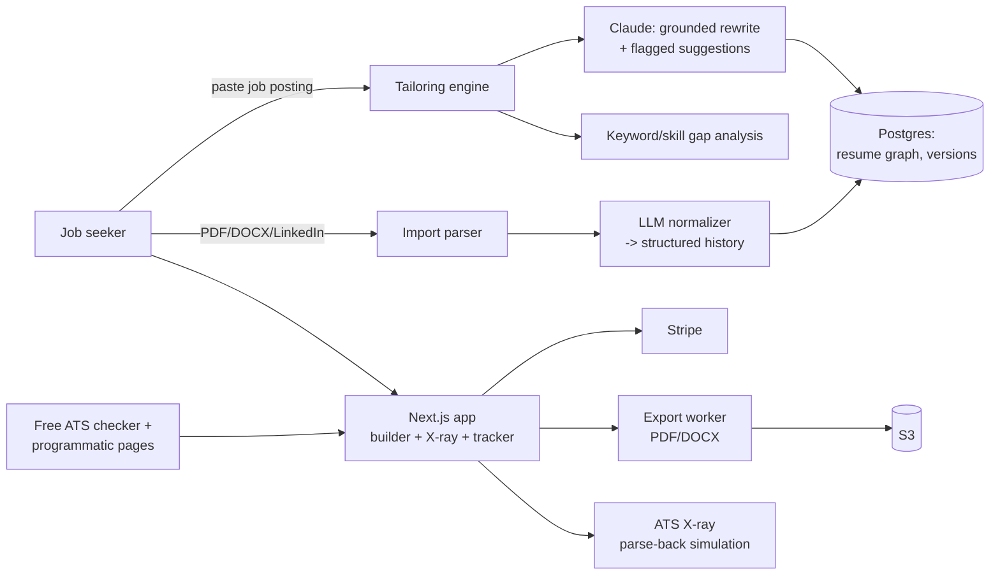

# ResumeRocket — Architecture

## Stack

| Layer | Choice | Why |
|-------|--------|-----|
| Web app | Next.js 15 + TypeScript + Tailwind | Builder UI + SEO pages + API |
| Database | Postgres (Drizzle) | Users, resumes (versioned), applications |
| LLM | Claude API | Tailoring, cover letters, gap analysis — grounded prompting |
| Parsing | pdf-parse / mammoth (DOCX) + LLM normalization | Import existing resumes reliably |
| Export | Typst or Puppeteer HTML→PDF; docx lib for DOCX | Typography quality at export is a retention feature |
| Queue | Redis + BullMQ | Import parsing, exports, SEO page generation |
| Billing | Stripe | Weekly/monthly passes, honest cancellation |

## System diagram

## Data model

- **users** — id, email, plan, pass_expires_at, stripe_customer_id
- **profiles** — user_id, structured history: experiences[], education[], skills[], projects[] (the source of truth the AI may never exceed)
- **resumes** — id, user_id, name, template, content jsonb (ordered sections/bullets referencing profile items), version, parent_resume_id
- **postings** — id, user_id, raw_text, parsed jsonb (title, company, keywords[], requirements[])
- **applications** — id, user_id, posting_id, resume_id, cover_letter_id?, match_score, status (draft|applied|interview|offer|rejected), applied_at
- **cover_letters** — id, application_id, tone, content, version
- **exports** — resume_id, format, file_key, watermarked
- **atsx_reports** — resume_id, parsed_fields jsonb, warnings[], missing_keywords[] (vs posting when linked)

## Key flows

### 1. Import → structured profile
1. PDF/DOCX upload → text extraction → LLM normalization into the structured profile (experiences with dates, bullets, skills).
2. User confirms/edits — the profile is ground truth; every later AI operation cites which profile item a rewrite came from.

### 2. Tailor to posting
1. Paste posting → parse (title, hard/soft requirements, keywords with importance).
2. Gap analysis: profile vs posting → covered / partially covered / missing.
3. Grounded rewrite: bullets re-emphasized toward matching requirements, quantification prompts ("you mention a migration — any numbers?"), **fabrication guard**: output validated against profile items; anything unverifiable renders as a flagged suggestion the user must explicitly accept.
4. Match score + fix list; tailored resume saved as a version linked to the application.

### 3. ATS X-ray
Resume rendered → re-parsed by the same extraction stack ATS systems use (text layer, headings, dates) → shows parsed-back fields, format warnings (tables, columns, images), and keyword coverage vs linked posting. Free-tool version of this flow is the SEO engine.

### 4. Passes & billing
Weekly pass = Stripe subscription with 1-week interval; cancellation is one click (and marketed as such). Alumni win-back: pass expiry + 60 days triggers the "new search?" offer.

## Third-party services & cost

| Service | Use | Rough cost |
|---------|-----|-----------|
| Vercel + Fly | App + workers | $20–60/mo |
| Neon Postgres | Data | $19–69/mo |
| Anthropic | Tailoring/letters | ~$0.02–0.05 per tailored application |
| R2/S3 | Exports | ~$2/mo |
| Stripe, Resend, Upstash | Usual | ~$40/mo |

## Estimated monthly running cost

| Customers | Infra | LLM | Total | Revenue (blended ~$16/mo) | Gross margin |
|-----------|-------|-----|-------|---------------------------|--------------|
| 0 (dev) | ~$10 | ~$5 | **~$15** | — | — |
| 100 | ~$80 | ~$100 | **~$180** | ~$1,600 | ~89% |
| 1,000 | ~$350 | ~$1,000 | **~$1,350** | ~$16,000 | ~92% |
