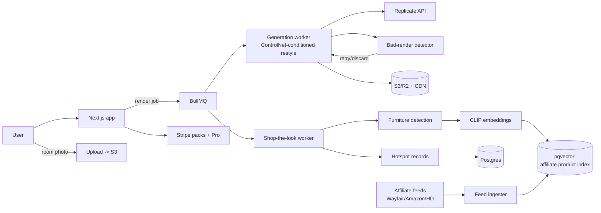

# RoomGenius — Architecture

## Stack

| Layer | Choice | Why |
|-------|--------|-----|
| Web app | Next.js 15 + TypeScript + Tailwind | Upload → results funnel + SEO style pages |
| Database | Postgres (Drizzle) | Users, renders, products, hotspots |
| Generation | Replicate (SDXL/Flux + ControlNet depth/canny conditioning) behind an adapter | Structure preservation without owning GPUs |
| Queue | Redis + BullMQ | Render jobs, upscales, product matching |
| Vision/matching | Embedding model (CLIP-class) + pgvector over affiliate product feeds | Visually-similar product search |
| Storage | S3/R2 + CDN | Uploads, renders, share cards |
| Billing | Stripe (packs = payment intents; Pro = subscription) | Mixed model |

## System diagram

## Data model

- **users** — id, email, credits, plan (free|pro), stripe_customer_id
- **rooms** — id, user_id, upload_key, room_type, width/height, exif_stripped
- **renders** — id, room_id, style_id, status, image_key, hd_key?, conditioning_params, qa_score, created_at
- **styles** — id, name, prompt_pack, negative_prompts, preview_key, room_type_variants
- **products** — id, feed_source, sku, title, price, image_key, embedding vector, category, url_template (affiliate), in_stock
- **hotspots** — render_id, bbox, detected_category, matched_product_ids[], click/cart events
- **credit_ledger** — user_id, delta, reason (pack|render|refund|promo), balance_after
- **staging_batches** (Pro) — listing label, renders[], mls_disclosure_applied

## Key flows

### 1. Render
1. Upload → EXIF strip → room-type classification (or user pick).
2. Job per selected style: depth/edge maps extracted → conditioned generation with the style's prompt pack → QA pass (detects melted geometry, window hallucination via structural-similarity heuristics) → auto-retry once on failure.
3. Results grid streams in as jobs finish; credit decremented only on QA-passed renders (generosity is cheap; bad-render refunds are the #1 trust move).

### 2. Shop the look
1. On a paid render: furniture detection (sofa/table/lamp/rug bboxes) → crop embeddings → pgvector similarity search over in-stock products (same category, price-band filter).
2. Hotspots render as tappable dots → product tray → affiliate outclick (tracked).
3. Feed ingester refreshes nightly; out-of-stock products drop from matching.

### 3. Pro staging batch
Batch upload (listing) → empty-room detection → staged renders per room with a consistent style → "virtually staged" disclosure label baked into images → zip/MLS-ready export.

## Third-party services & cost

| Service | Use | Rough cost |
|---------|-----|-----------|
| Replicate | Generation + upscale | ~$0.01–0.05/render |
| Vercel + Fly | App + workers | $20–80/mo |
| Neon (pgvector) + Upstash | Data + queue | $30–90/mo |
| R2 + CDN | Images | $10–50/mo |
| Affiliate networks | Product feeds | free (rev share to us) |

## Estimated monthly running cost

| Scale | Infra | Generation | Total | Revenue | Gross margin |
|-------|-------|------------|-------|---------|--------------|
| Dev | ~$20 | ~$10 | **~$30** | — | — |
| 1k packs/mo + 50 Pro | ~$150 | ~$900 | **~$1,050** | ~$16,000 + affiliate | ~93% |
| 5k packs/mo + 300 Pro | ~$400 | ~$4,500 | **~$4,900** | ~$85,000 + affiliate | ~94% |
