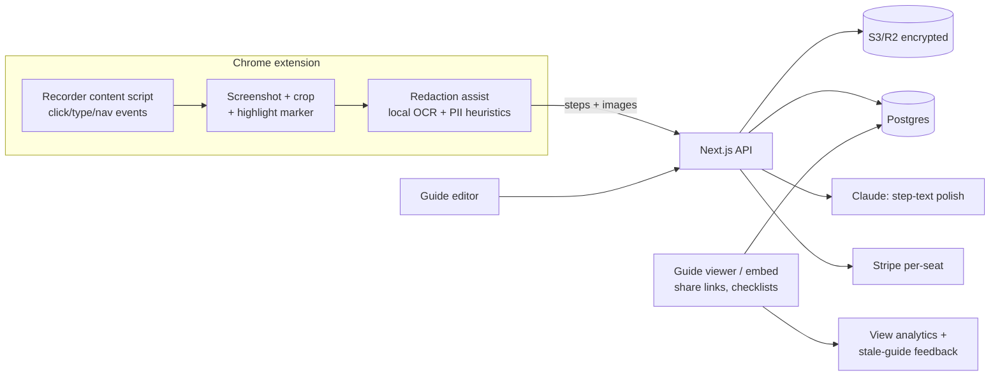

# StepDocs — Architecture

## Stack

| Layer | Choice | Why |
|-------|--------|-----|
| Extension | Manifest V3 + TypeScript (Vite + @crxjs) | Capture engine lives here |
| Web app | Next.js 15 + TypeScript + Tailwind | Editor, viewer, workspaces, billing |
| Database | Postgres (Drizzle) | Guides, steps, workspaces, analytics |
| Storage | S3/R2 + CDN | Step screenshots (encrypted at rest) |
| LLM | Claude API (small calls) | Step-text polishing, title generation |
| Redaction | Client-side OCR pass (tesseract.js) + regex PII heuristics | Suggest blurs before upload when possible |
| Billing | Stripe | Per-seat tiers |

## System diagram

## Data model

- **users / workspaces / memberships** — auth, roles (admin|editor|viewer), seat counting, sso_config (Team)
- **guides** — id, workspace_id, title, status (draft|published), visibility (private|workspace|unlisted|public), share_token, brand_config, created_by, updated_at
- **steps** — id, guide_id, position, action_type (click|type|navigate|note|warning), text, element_context jsonb (tag, label, url), screenshot_key, crop bbox, highlight point, blur_regions jsonb
- **guide_versions** — edit history snapshots (Pro)
- **views** — guide_id, day, count, avg_completion (checklist progress)
- **feedback** — guide_id, step_id?, kind (outdated|unclear|thanks), note
- **spaces** — Team-tier folders with permissions

## Key flows

### 1. Record → guide
1. User hits record; content script listens for interaction events; each event grabs a viewport screenshot (chrome.tabs.captureVisibleTab via the service worker), crops around the target element, stamps a highlight marker.
2. Element context (accessible name, tag, page URL/title) drafts raw step text locally.
3. Redaction assist runs local OCR + PII regexes → suggested blur regions attached to steps.
4. Stop → bundle uploads → server stores images (encrypted), Claude polishes step text and titles → draft guide opens in the editor.

### 2. Edit → publish
Editor operations (reorder/merge/retake/blur/annotate) are step-level CRUD; publish snapshots a version; share link or embed issued per visibility setting.

### 3. Guides that stay alive
Viewer checklists report completion; "flag as outdated" feedback + a view-drop heuristic drive stale-guide alerts to the owner; Team analytics roll up per space.

## Third-party services & cost

| Service | Use | Rough cost |
|---------|-----|-----------|
| Vercel | App | $0–40/mo |
| Neon Postgres | Data | $19–69/mo |
| R2 + CDN | Screenshots | $10–80/mo (the scaling line) |
| Anthropic | Text polish | ~$0.002/guide — negligible |
| Stripe | Billing | usual |

## Estimated monthly running cost

| Customers (seats) | Total | Revenue (blended ~$15/seat) | Gross margin |
|-------------------|-------|------------------------------|--------------|
| 0 (dev) | ~$10 | — | — |
| 100 seats | ~$90 | ~$1,500 | ~94% |
| 1,000 seats | ~$450 | ~$15,000 | ~97% |
