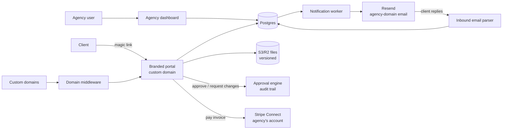

# ClientDock — Architecture

## Stack

| Layer | Choice | Why |
|-------|--------|-----|
| Web app | Next.js 15 + TypeScript + Tailwind | Agency dashboard + client portals in one app |
| Database | Postgres (Drizzle) | Workspaces, portals, modules, approvals |
| Files | S3/R2 + presigned uploads, CDN | Versioned deliverables |
| Email | Resend with per-agency domain sending (DKIM wizard) | Notifications from the agency's domain |
| Payments | Stripe Connect (agency's own Stripe) | Invoices paid inside the portal, money never touches us |
| Custom domains | Vercel domains API middleware | portal.agencyname.com |
| Billing (ours) | Stripe subscriptions | Per-business tiers |

## System diagram

## Data model

- **workspaces** — id, agency name, plan, branding jsonb (logo, colors), custom_domain, email_domain_config (DKIM state), stripe_customer_id, stripe_connect_id
- **members** — workspace users + roles (owner|member)
- **clients** — id, workspace_id, company, contacts[] (name, email)
- **portals** — id, workspace_id, client_id, slug, enabled_modules[], template_id?, status
- **timeline_phases** — portal_id, name, position, progress_pct, updated_at (freshness stamp)
- **files** — id, portal_id, folder, name, version, s3_key, size, uploaded_by (agency|client)
- **approvals** — id, portal_id, file_id?, title, status (pending|approved|changes_requested), decided_by_contact, decided_at, audit jsonb
- **threads / messages** — portal messaging with email-reply ingestion (inbound address per thread)
- **invoices** — portal_id, stripe_invoice_id (Connect), amount, status
- **portal_views** — portal_id, contact, day (adoption analytics)
- **magic_tokens** — contact access tokens, expiring, revocable

## Key flows

### 1. Client access (zero-friction)
1. Agency adds a client contact → invitation email (from the agency's domain) with a magic link.
2. Link sets a long-lived scoped session for that portal only; re-auth is always another magic link. No passwords, ever.
3. Every view logged → adoption analytics for the agency ("Acme viewed the portal 4× this week").

### 2. Approval round
1. Agency uploads v3 of a deliverable → creates approval request → client notified.
2. Client opens portal → Approve / Request changes (with comment) → audit trail entry (who, when, from which contact).
3. Decision notifies the agency in-app + email; approved files badge in the file list.

### 3. Email-reply threading
Each thread gets a unique inbound address (reply-to); inbound parser (Resend inbound webhooooks or Postmark) appends replies to the thread — clients can live entirely in email while the portal stays the record.

### 4. White-label plumbing
Custom domain: CNAME wizard → middleware maps host → portal theme. Email: DKIM/SPF wizard with DNS-record checker; agency-domain sending unlocks only after verification passes (protects everyone's deliverability).

## Third-party services & cost

| Service | Use | Rough cost |
|---------|-----|-----------|
| Vercel | App + domains | $20–60/mo |
| Neon Postgres | Data | $19–69/mo |
| R2 + CDN | Files | $10–100/mo (scaling line) |
| Resend | Notifications + inbound | $20–90/mo |
| Stripe | Our billing; Connect for agency invoices | usual |

## Estimated monthly running cost

| Customers | Total | Revenue (blended ~$70/mo) | Gross margin |
|-----------|-------|---------------------------|--------------|
| 0 (dev) | ~$10 | — | — |
| 100 | ~$150 | ~$7,000 | ~98% |
| 1,000 | ~$800 | ~$70,000 | ~99% |
