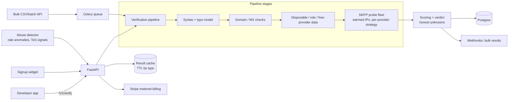

# MailProbe — Architecture

## Stack

| Layer | Choice | Why |
|-------|--------|-----|
| API | Python 3.12 + FastAPI + Pydantic v2 | Async-heavy I/O workload; great OpenAPI DX |
| Database | Postgres (SQLAlchemy async) | Accounts, keys, jobs, verification cache |
| Queue | Redis + Celery | Bulk jobs, probe scheduling |
| Probe fleet | Dedicated small VMs with warmed IPs (separate from API infra) | SMTP probing needs reputation-managed egress |
| Cache | Redis + Postgres result cache (TTL by result type) | Same-address re-verifications are common; caching is margin |
| Billing | Stripe metered + subscriptions | PAYG + plans |
| Widget/SDKs | Vanilla JS widget; Node + Python SDKs | Embed surface |

## System diagram

## Data model

- **accounts** — id, email, plan, stripe_customer_id, abuse_score, vetted
- **api_keys** — id, account_id, prefix, hash, scopes, per-key rate limits
- **verifications** — id (cache key = normalized address), address_hash, result, confidence, signals jsonb (catch_all, disposable, role, free, typo_suggestion), provider, checked_at, ttl_class
- **bulk_jobs** — id, account_id, source (csv|api), total, processed, result_counts jsonb, file_keys (in/out), webhook_url, status
- **usage_records** — account_id, day, count, billed (metered reporting)
- **probe_ips** — ip, pool, reputation_state, per-provider throttle state
- **abuse_events** — account_id, kind, detail, action_taken

Privacy: addresses stored hashed + encrypted with a strict retention window (configurable per account, default 30 days); raw lists deleted after job completion + grace.

## Key flows

### 1. Realtime verify (<400ms budget)
1. Auth + rate limit → cache hit? return.
2. Syntax + typo model (local, ~1ms) → hard-fail fast.
3. DNS/MX (cached per domain) + disposable/role/free lists (in-memory, refreshed daily).
4. Provider strategy: known-catch-all domains and no-answer providers (Gmail) short-circuit to pattern/data verdicts with honest confidence; probe-eligible domains go to the SMTP fleet with a strict deadline — timeout degrades to "unknown", never blocks the caller past budget.
5. Verdict + signals persisted to cache; usage metered.

### 2. Bulk job
Chunked Celery fan-out with per-domain concurrency caps (be a polite citizen — reputation is the asset); progress endpoint + webhook on completion; results CSV with verdict/confidence/signals columns.

### 3. Abuse defense
Signup vetting (disposable-signup block, card-before-volume), anomaly detection on verify patterns (single-domain hammering, sequential-generation patterns), automatic throttle + review queue. Cold-outreach cleaning requests are ToS-refused.

## Third-party services & cost

| Service | Use | Rough cost |
|---------|-----|-----------|
| Hetzner/OVH VMs | Probe fleet (warmed IPs) | $50–300/mo scaling |
| Fly.io / Railway | API + workers | $20–80/mo |
| Neon Postgres + Upstash | Data + queue | $30–90/mo |
| Disposable-domain feeds | Data layer | $0–50/mo |
| Stripe | Billing | usual |

## Estimated monthly running cost

| Volume | Infra | Total | Revenue (@~$0.005 blended) | Gross margin |
|--------|-------|-------|-----------------------------|--------------|
| Dev | ~$70 | **~$70** | — | — |
| 1M verifications/mo | ~$250 | **~$250** | ~$5,000 | ~95% |
| 10M/mo | ~$900 | **~$900** | ~$40,000 (volume-discounted) | ~98% |
