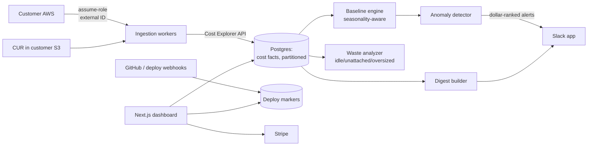

# CloudSpend — Architecture

## Stack

| Layer | Choice | Why |
|-------|--------|-----|
| Web app | Next.js 15 + TypeScript + Tailwind | Dashboard + onboarding + API |
| Database | Postgres (Drizzle) + timescale-style partitioning on cost facts | Cost lines are append-heavy time series |
| Queue | Redis + BullMQ | Polling schedules, CUR parsing, alert evaluation |
| AWS access | Cross-account IAM role (CloudFormation quick-create, external ID) | Least-privilege read-only; the trust-critical path |
| Ingestion | Cost Explorer API (hourly-ish) + CUR from customer S3 (deep/accurate) | Two-speed accuracy model |
| Alerts | Slack app (bot + webhooks), email fallback | Where engineers live |
| Billing | Stripe | Flat tiers |

## System diagram

## Data model

- **orgs / members** — auth, plan, slack_team_id, stripe_customer_id
- **aws_accounts** — id, org_id, account_id, role_arn, external_id, regions[], connect_status, cur_config (bucket, prefix)?
- **cost_facts** — account_id, ts (hour), service, region, usage_type, tag_set_id, amount, source (ce|cur) — monthly partitions
- **tag_sets** — normalized tag combinations (team/env/service attribution)
- **baselines** — account_id, service, dow/hour profile, updated_at
- **anomalies** — id, account_id, service, started_at, deviation_per_day, status (open|ack|resolved), probable_resources jsonb, correlated_deploy_id?
- **deploys** — org_id, service_name, sha, deployed_at, source (github|webhook)
- **budgets** — org_id, scope (service|tag|account), monthly_limit, burn_alert_thresholds[]
- **waste_findings** — account_id, kind (idle_instance|unattached_ebs|old_snapshot|oversized), resource_id, est_monthly_saving, status
- **alert_channels / alert_log** — Slack routing + delivery history

## Key flows

### 1. Connect an AWS account (5-minute path)
1. Dashboard generates a CloudFormation quick-create link (read-only policy: ce:*, cur read, ec2/cloudwatch describe — human-readable and documented) with a unique external ID.
2. Stack creates the role → callback confirms assume-role works → backfill job pulls 3 months of Cost Explorer history → dashboard populates within minutes.
3. Optional depth upgrade: customer points us at their CUR bucket for resource-level accuracy.

### 2. Anomaly alert
1. Ingestion updates hourly facts → baseline engine maintains per-service seasonal profiles (day-of-week × hour).
2. Detector flags sustained deviations (not single-hour noise) → enriches with top contributing usage types/resources → correlates against deploy markers within the window.
3. Slack alert: dollar impact/day, service, probable cause, deploy link, ack/resolve buttons → alert state syncs to dashboard.

### 3. Waste report
Scheduled describe-based scans (instances vs CloudWatch utilization, unattached EBS, aged snapshots) → dollar-ranked findings → monthly "roast" digest; one-time free version of this flow is the acquisition tool.

## Third-party services & cost

| Service | Use | Rough cost |
|---------|-----|-----------|
| Fly.io / ECS | App + workers | $30–100/mo |
| Neon Postgres | Facts (partitioned) | $19–150/mo scaling |
| Upstash Redis | Queues | $10/mo |
| Slack | App (free) | $0 |
| Stripe, Resend | Billing, email | usual |

AWS API costs: Cost Explorer API is $0.01/request — polling discipline matters (batch queries, hourly cadence); CUR parsing is free (customer's S3).

## Estimated monthly running cost

| Customers | Infra | CE API | Total | Revenue (blended ~$90/mo) | Gross margin |
|-----------|-------|--------|-------|---------------------------|--------------|
| 0 (dev) | ~$20 | ~$5 | **~$25** | — | — |
| 100 | ~$200 | ~$700 | **~$900** | ~$9,000 | ~90% |
| 1,000 | ~$800 | ~$7,000 | **~$7,800** | ~$90,000 | ~91% |
