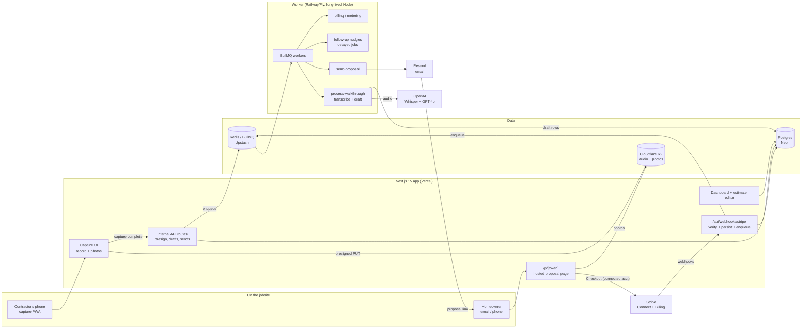

# QuoteFox Architecture

## Stack & Rationale

| Layer | Choice | Why |
|---|---|---|
| Web app + API | **Next.js 15 (App Router) + TypeScript** | One deployable for the mobile-first capture PWA, dashboard, marketing pages, hosted proposal pages, and webhook endpoints. Route handlers do near-zero inline work (verify, persist, enqueue). |
| Database | **Postgres (Neon) + Drizzle ORM** | The domain is relational (orgs -> price book -> jobs -> walkthroughs -> estimates -> proposals -> deposits). Drizzle gives typed schema-as-code and plain SQL when needed; drizzle-kit handles migrations. Neon: serverless, branches for preview envs, cheap at small scale. |
| Queue | **BullMQ on Redis (Upstash)** | The transcription/drafting pipeline is inherently async and multi-step (upload complete -> transcribe -> draft -> notify). Delayed jobs also power the +2d/+5d follow-up nudges. Per-org rate limiting protects the OpenAI budget. |
| Worker | **Standalone Node process (`src/worker`)** | Whisper on a 5-minute walkthrough plus GPT-4o drafting can take 30-90s -- unfit for serverless timeouts. Long-lived process on Railway/Fly, same codebase, shares `src/db` and `src/lib`. |
| AI | **OpenAI Whisper (transcription) + GPT-4o drafting behind a thin model adapter (Claude swappable via `ANTHROPIC_API_KEY`)** | Whisper handles jobsite audio acceptably and costs $0.006/min. The drafting call uses structured outputs against the org's price book (retrieved by embedding similarity + category filters) and is forced to reference real item ids -- it cannot invent prices. The adapter keeps the drafting model a config choice, not an architecture change. |
| Object storage | **Cloudflare R2 (S3 API)** | Walkthrough audio and photos upload direct from the phone via presigned URLs -- media never transits our servers. R2: zero egress fees (proposal pages serve the photos back out), S3-compatible SDK. |
| Payments | **Stripe Connect (standard) + Checkout/PaymentIntents; Stripe Billing for our own plans** | Deposits are collected on the *contractor's* connected account via Checkout -- funds, KYC, and dispute liability stay with the contractor and Stripe. Our own three plans run on ordinary Stripe Billing. |
| Email | **Resend** | Proposal delivery, view/acceptance notifications, follow-up nudges. React Email templates; per-org sender name with our verified domain in v1. |
| Auth | **Auth.js (NextAuth v5)** | Email magic-link + Google OAuth; org-scoped sessions with roles. Homeowners never log in -- proposal pages use signed tokens. |
| Styling | **Tailwind CSS v4** | Speed on a small design-token surface; DESIGN.md tokens map to CSS custom properties. |

## System Diagram

## Data Model

All tables keyed by `id` (uuid), timestamps `created_at` / `updated_at` implied. Multi-tenancy: everything hangs off `organization_id`.

- **organizations** -- tenant root. `name`, `trade` (hvac|roofing|electrical|plumbing|other), `plan` (solo|crew|fleet), `billing_stripe_customer_id` (our billing), `stripe_connect_account_id` (their deposits), `branding` (jsonb: logo key, license number, colors), `quote_count_current_period`, `settings` (jsonb: default markup, tax rate, deposit default, terms text).
- **users** -- `organization_id`, `email`, `name`, `role` (owner|estimator|tech). Auth.js accounts/sessions live alongside.
- **price_book_items** -- the moat. `organization_id`, `category`, `name`, `description`, `kind` (labor|material|flat_rate), `unit` (each|hour|sqft|lf), `unit_cost_cents`, `default_markup_pct`, `embedding` (pgvector, for draft matching), `active`, `source` (manual|csv_import|template).
- **jobs** -- one per prospective job. `organization_id`, `customer_name`, `customer_email`, `customer_phone`, `address`, `trade`, `status` (open|quoted|won|lost), `created_by`.
- **walkthroughs** -- one capture session. `job_id`, `recorded_by`, `status` (capturing|uploaded|transcribing|drafting|drafted|failed), `duration_seconds`, `transcript` (text), `transcript_confidence`, `failure_reason`.
- **walkthrough_media** -- `walkthrough_id`, `kind` (audio|photo), `r2_key`, `content_type`, `size_bytes`, `sequence`, `captured_at`, `upload_status` (pending|complete).
- **estimates** -- `job_id`, `walkthrough_id` (nullable -- manual estimates allowed), `version`, `status` (drafting|draft|ready|sent), `subtotal_cents`, `tax_cents`, `total_cents`, `deposit_type` (percent|fixed|none), `deposit_value`, `drafted_by_model` (nullable), `draft_duration_ms`.
- **estimate_line_items** -- `estimate_id`, `position`, `price_book_item_id` (nullable -- null means AI couldn't match; row is flagged `needs_pricing`), `name`, `description`, `quantity`, `unit`, `unit_price_cents`, `line_total_cents`, `source` (ai|manual), `transcript_excerpt` (the narration that produced this row -- the audit trail).
- **proposals** -- the sent artifact. `estimate_id`, `token_id` (jti of the signed link), `status` (sent|viewed|accepted|deposit_paid|expired|withdrawn), `sent_at`, `expires_at`, `accepted_at`, `accepted_by_name`, `acceptance_ip`, `pdf_snapshot_r2_key`.
- **proposal_events** -- append-only timeline. `proposal_id`, `type` (sent|delivered|opened|viewed|accepted|deposit_initiated|deposit_paid|nudge_sent|expired), `metadata` (jsonb: user agent, amounts), `occurred_at`.
- **deposits** -- `proposal_id`, `stripe_checkout_session_id`, `stripe_payment_intent_id`, `amount_cents`, `currency`, `status` (pending|paid|refunded|failed), `paid_at`.
- **webhook_events** -- raw ingestion log for idempotency + replay. `source` (stripe), `external_event_id` (unique), `type`, `payload` (jsonb), `processed_at`, `error`.
- **audit_log** -- every consequential action. `organization_id`, `actor` (system|ai|user_id), `action` (draft_created|line_item_edited|proposal_sent|deposit_paid|...), `target`, `metadata` (jsonb).

## Key Flows

### 1. Walkthrough capture -> transcription -> AI draft

1. Contractor opens a job and taps the record control; the capture UI records audio in chunks (pause/resume safe) and queues photos.
2. For each chunk/photo the app requests a presigned R2 PUT from `/api/uploads/presign` and uploads directly; `walkthrough_media` rows track `upload_status`.
3. On "End walkthrough," the app calls `/api/walkthroughs/:id/complete`; the route verifies all media is `complete` (or marks stragglers for retry) and enqueues `process-walkthrough`.
4. Worker transcribes audio chunks with Whisper (`walkthroughs.status = transcribing`), stitches the transcript, stores confidence.
5. Worker retrieves candidate `price_book_items` by embedding similarity against transcript segments plus trade/category filters (top ~50 items), then calls GPT-4o with structured outputs: transcript + photo captions + candidate items in, an array of line items out -- each either referencing a real `price_book_item_id` with quantity, or flagged `needs_pricing` with the transcript excerpt.
6. Worker writes `estimates` (version 1, status `draft`) and `estimate_line_items`, computes totals from the org's markup/tax rules, records `draft_duration_ms`, sets `walkthroughs.status = drafted`, and notifies the contractor (push/email).
7. Failures (unusable audio, OpenAI outage) set `status = failed` with `failure_reason`; the UI offers re-run or manual estimate. Every draft is an `audit_log` row with model + prompt version.

### 2. Review/edit -> proposal send

1. Contractor opens the draft; line items reveal with the signature animation, `needs_pricing` rows pinned to the top with their transcript excerpts.
2. Edits (reprice, quantity, add/remove, reorder) hit the API and write `audit_log` rows with `source = manual`; totals recompute server-side. Estimate moves to `ready`.
3. On "Send proposal": server snapshots the estimate, mints a signed proposal token (JWT via `src/lib/tokens.ts` -- jti stored on `proposals`, 30-day expiry), renders the PDF snapshot to R2, and enqueues `send-proposal`.
4. Worker emails the homeowner via Resend (branded, link to `/p/[token]`), writes `proposal_events (sent)`, and schedules nudge jobs at +2d and +5d (Crew+; cancelled on view/accept).
5. Estimate status `sent`; job status `quoted`. Resend delivery webhooks append `delivered`/`opened` events.

### 3. Homeowner accept + deposit

1. Homeowner opens `/p/[token]`; server verifies signature + expiry + `proposals.status`, renders scope, line items, photos, terms, license block. First view appends `viewed` and notifies the contractor.
2. Homeowner taps Accept: typed-name signature + checkbox; server records `accepted_at`, `accepted_by_name`, `acceptance_ip`, appends `accepted`, archives the PDF snapshot as the binding artifact.
3. If the estimate carries a deposit, the page immediately offers payment: server creates a Stripe Checkout session **on the contractor's connected account** (destination: their funds, their statement descriptor; QuoteFox takes no application fee) and redirects.
4. `checkout.session.completed` arrives at `/api/webhooks/stripe`; handler verifies signature, inserts into `webhook_events` (unique `external_event_id`; duplicate = ack and stop), enqueues processing.
5. Worker marks `deposits.status = paid`, `proposals.status = deposit_paid`, appends the event, cancels outstanding nudges, sets `jobs.status = won`, and emails both parties a receipt + accepted-proposal PDF.
6. Refunds/disputes flow back through the same webhook path and update `deposits.status`; the contractor handles them in their own Stripe dashboard.

### 4. QuoteFox billing & plan gating

1. Signup creates an org on the 14-day trial (5 AI quotes, no card). Upgrading runs Stripe Checkout against our platform account; `customer.subscription.*` webhooks set `organizations.plan`.
2. Every `process-walkthrough` job increments `quote_count_current_period` atomically before calling OpenAI; the counter resets on the `invoice.paid` billing-cycle webhook.
3. Gates enforced server-side in one place (`src/lib/billing.ts` checks): AI quotes/mo and price-book size per tier; deposit collection and nudges require Crew+; seats capped per tier. Over-limit drafting returns a typed `PLAN_LIMIT` error the UI turns into an upgrade prompt -- capture is never blocked mid-walkthrough, only drafting of new quotes.
4. Dunning on our own failed invoices: Stripe Billing's built-in retries + a grace period flag; org drops to read-only (proposals still viewable, deposits still land) rather than data hostage-taking.

## Third-Party Services & Rough Pricing

| Service | Role | Rough cost |
|---|---|---|
| OpenAI | Whisper $0.006/min audio; GPT-4o ~$2.50/M input + $10/M output tokens; embeddings negligible | ~$0.10 per quote (see math below) |
| Stripe | Connect (standard) for deposits -- no platform fee taken; Stripe Billing for our plans | 2.9% + 30c on our subscription revenue; deposit processing fees paid by the contractor |
| Neon (Postgres) | Primary DB (+ pgvector) | Free tier -> ~$19/mo (Launch) -> ~$69+/mo as data grows |
| Upstash (Redis) | BullMQ backend | Free tier -> ~$10-20/mo pay-per-request |
| Cloudflare R2 | Audio/photo storage + serving | $0.015/GB-mo storage, zero egress; ~$5-50/mo across scales |
| Vercel | Next.js hosting | Hobby free -> Pro $20/mo/seat |
| Railway / Fly.io | Worker process | ~$5-20/mo small always-on Node service; scale to 2 instances later |
| Resend | Proposal + notification email | Free 3k/mo -> $20/mo for 50k (volume is low: ~5 emails per quote) |
| Sentry | Errors (app + worker) | Free tier -> ~$26/mo |

## Estimated Monthly Running Cost

Per-quote AI math: a typical walkthrough is ~4 min audio (4 x $0.006 = $0.024 Whisper) + 6 photos captioned via GPT-4o vision (~$0.02) + drafting call (~12k input tokens with candidate price-book items = $0.030; ~1.5k output = $0.015) = **~$0.09, call it $0.10 with retries**.

| Scale | Assumptions | Estimate |
|---|---|---|
| **0 customers (dev/preview)** | Free tiers: Neon, Upstash, Vercel Hobby, one $5 worker, R2 pennies; ~200 test quotes x $0.10 | **~$25-35/mo** |
| **100 customers** | ~$9.5k MRR (blended ~$95 ARPU). ~4,000 quotes/mo x $0.10 = $400 AI; Neon $19 + Upstash $15 + Vercel $20 + worker $10 + R2 $10 + Resend $20 + Sentry $26 | **~$520-560/mo** (~6% of revenue) |
| **1,000 customers** | ~$95k MRR. ~40,000 quotes/mo x $0.10 = $4,000 AI; Neon ~$150 + Upstash ~$50 + Vercel ~$60 + workers ~$40 + R2 ~$80 + Resend ~$60 + observability ~$80 | **~$4,500-5,000/mo** (~5% of revenue) |

AI is the dominant COGS line and scales linearly with usage -- which is why quotes/mo is the metered limit on every tier. Margin holds ~93-94% at every stage; the real costs are per-trade distribution and support, not compute.
