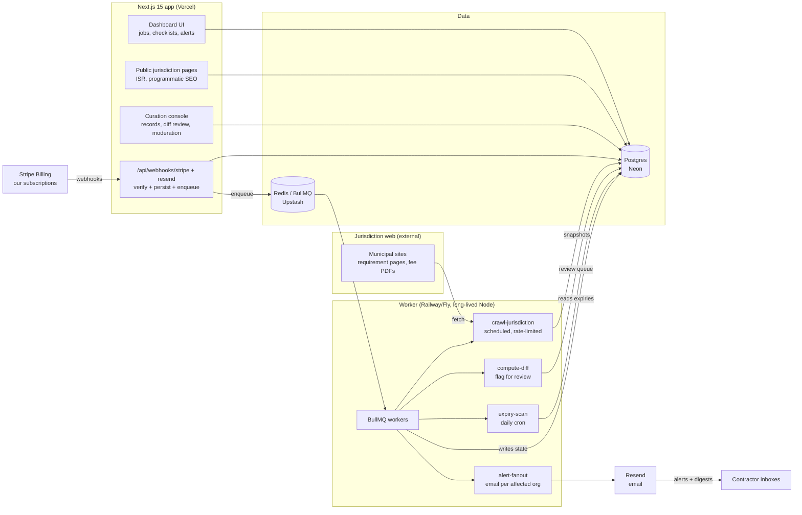

# PermitPath Architecture

## Stack & Rationale

| Layer | Choice | Why |
|---|---|---|
| Web app + API | **Next.js 15 (App Router) + TypeScript** | One deployable for the dashboard, the programmatic SEO jurisdiction pages (static/ISR -- thousands of pages from the same data), the admin curation console, and webhook endpoints. |
| Database | **Postgres (Neon) + Drizzle ORM** | The domain is deeply relational and versioned (jurisdictions -> sources -> requirement records -> versions -> checklists -> items). Drizzle gives typed schema-as-code and plain SQL for the version-history queries; drizzle-kit handles migrations. Neon: serverless, branches for preview envs, cheap at small scale. |
| Queue | **BullMQ on Redis (Upstash)** | Scheduled jurisdiction crawls (repeatable jobs with per-host rate limiting), alert fan-out to affected orgs, and the daily expiry scan are exactly BullMQ's feature set: delayed jobs, cron repeatables, backoff, dead-letter handling. |
| Worker | **Standalone Node process (`src/worker`)** | Crawls and diff computation must not depend on serverless timeouts or web deploys. Long-lived process on Railway/Fly/Render, same codebase, shares `src/db` and `src/lib`. Crawl concurrency is capped per host (`CRAWL_CONCURRENCY`) -- we are polite guests on municipal servers. |
| Change detection | **cheerio + diff (jsdiff)** | Fetch monitored pages, extract the content region with cheerio (strip nav/footer noise), normalize, and text-diff against the stored snapshot. Meaningful diffs go to a *human review queue* -- nothing auto-publishes. Boring, debuggable, no headless browser until a jurisdiction forces it. |
| Billing | **Stripe Billing** | Our own three flat plans + annual prices, customer portal for self-serve plan changes, webhooks for entitlement state. No Connect needed -- we never touch the customer's money. |
| Email | **Resend** | Expiry alerts, rule-change alerts, weekly digests, moderation notifications. React Email templates; delivery webhooks feed alert status. |
| Auth | **Auth.js (NextAuth v5)** | Email magic-link + Google OAuth; org-scoped sessions with roles (owner, member, contributor). Nothing heavier needed. |
| Styling | **Tailwind CSS v4** | Dashboard-speed UI development; design tokens from DESIGN.md as CSS custom properties. |

## System Diagram

## Data Model

All tables keyed by `id` (uuid), timestamps `created_at` / `updated_at` implied. Multi-tenancy: org-owned tables carry `organization_id`; the jurisdiction/requirement corpus is global and shared.

- **organizations** -- tenant root. `name`, `plan` (crew|company|regional), `billing_stripe_customer_id`, `trade_focus`, `settings` (jsonb: alert preferences, digest day), `contribution_credit_cents`.
- **users** -- `organization_id`, `email`, `name`, `role` (owner|member), `contributor_reputation` (int). Auth.js accounts/sessions live alongside.
- **jurisdictions** -- the shared corpus root. `name`, `slug`, `state`, `county`, `kind` (city|county|state|special_district), `department_name`, `contact` (jsonb: phone, address, hours), `portal_url`, `coverage_status` (curated|partial|requested), `curated_at`.
- **jurisdiction_sources** -- monitored URLs per jurisdiction. `jurisdiction_id`, `url`, `label` (fee schedule, mechanical requirements, ...), `selector` (content-region hint for cheerio), `last_crawled_at`, `last_snapshot_hash`, `crawl_frequency_hours`, `status` (active|broken|paused).
- **requirement_records** -- the product's atoms; versioned. `jurisdiction_id`, `job_type` (taxonomy code: hvac_changeout, reroof, panel_upgrade, water_heater, solar_pv, ...), `permits_required` (jsonb), `submittal_requirements` (jsonb), `fees` (jsonb), `review_timeline`, `quirks` (text), `version` (int), `source_id`, `source_kind` (official_page|phone_confirmation|contribution), `verified_at`, `verified_by` (user_id or curator), `superseded_by` (nullable self-ref -- the version chain).
- **requirement_changes** -- one row per detected or curated change. `requirement_record_id` (new version), `previous_record_id`, `origin` (crawl_diff|contribution|curator), `diff_summary`, `raw_diff` (text), `review_state` (pending|approved|rejected), `reviewed_by`, `reviewed_at`, `alerted_at`.
- **jobs** -- org work items. `organization_id`, `site_address`, `jurisdiction_id`, `job_type`, `label`, `status` (active|closed), `assigned_user_id`.
- **permit_checklists** -- one per job. `job_id`, `requirement_record_id` (pinned version at generation time), `generated_at`, `fully_stamped_at`.
- **checklist_items** -- `checklist_id`, `kind` (permit|document|fee|inspection_note), `title`, `detail`, `state` (open|verified|na), `verified_by`, `verified_at` (drives the stamp + "verified n days ago" label).
- **permit_applications** -- status timeline per permit. `job_id`, `permit_name`, `jurisdiction_ref_number`, `status` (not_submitted|in_review|issued|expired|stop_work), `status_history` (jsonb timeline), `submitted_at`, `issued_at`, `expires_at`.
- **inspections** -- scheduling notes per application. `permit_application_id`, `inspection_type`, `scheduled_for`, `contact_notes`, `lead_time_days`, `result` (pending|passed|failed), `reinspection_fee_cents`.
- **licenses_and_credentials** -- the org's own papers. `organization_id`, `kind` (contractor_license|trade_registration|business_license|insurance_cert), `issuing_authority`, `number`, `holder`, `expires_at`.
- **expiry_alerts** -- scheduled + sent alerts. `organization_id`, `subject_type` (license|permit_application), `subject_id`, `tier` (t60|t30|t7|t1), `scheduled_for`, `sent_at`, `resend_message_id`.
- **contributions** -- crowdsourced edits. `user_id`, `organization_id`, `requirement_record_id`, `proposed_changes` (jsonb), `evidence` (text/URL), `review_state` (pending|accepted|rejected), `reviewed_by`, `credit_cents_awarded`.
- **webhook_events** -- raw ingestion log for Stripe/Resend. `provider`, `provider_event_id` (unique -- idempotency), `type`, `payload` (jsonb), `processed_at`, `error`.
- **audit_log** -- every publish/moderation/billing action. `actor` (system|user_id), `action`, `target`, `metadata` (jsonb).

## Key Flows

### 1. Checklist generation (jurisdiction + job type)

1. User creates a job: site address (geocoded via Mapbox to suggest the jurisdiction -- city limits are not intuition), jurisdiction confirmed from the covered list, job type from the taxonomy.
2. App resolves the current `requirement_records` row for that (jurisdiction, job_type) pair. If coverage is missing: an honest "not covered yet" state that files a coverage request and shows the department's phone/contact card instead of guessing.
3. Checklist is generated and **pinned to the record version** -- items for each required permit, each submittal document, each fee, plus inspection notes. The pinned version means a later rule change never silently rewrites an in-flight job.
4. Every item shows the record's `verified_at` and source label. Marking an item verified stamps it (the signature) with `verified_by` + timestamp.
5. If a newer record version exists for a checklist's pinned pair, the checklist header shows a "requirements changed since generation" banner linking the diff -- the user chooses to regenerate.

### 2. Change detection: crawl -> diff -> human review -> versioned update -> alerts

1. BullMQ repeatable jobs schedule `crawl-jurisdiction` per active `jurisdiction_sources` row (default every 72h, per-host concurrency 1, identified `CRAWLER_USER_AGENT`, conditional GETs).
2. Worker fetches the page, extracts the content region (cheerio + stored selector), normalizes whitespace, hashes. Hash unchanged -> update `last_crawled_at`, done.
3. Hash changed -> compute text diff against the stored snapshot (jsdiff), store snapshot, create `requirement_changes` row with `review_state = pending`. **Nothing is published automatically.**
4. Curator reviews the diff in the admin console: noise (a reworded sentence) -> reject; substantive (new load-calc requirement, fee change) -> edit the affected `requirement_records`, creating a new version linked via `superseded_by`, and approve.
5. On approval, `alert-fanout` enqueues one email per org watching that jurisdiction (and flags affected in-flight checklists per flow 1.5). Alert states what changed, when it was verified, and links the source.
6. Broken sources (404s, layout collapse) auto-mark `status = broken` after 3 failures and surface in the curation console -- silence is never mistaken for "no change."

### 3. Crowdsourced contribution -> moderation -> verification stamp

1. Any user hits "suggest an edit" on a requirement record: structured proposed change (fee, timeline, submittal item, quirk) + free-text evidence ("plan reviewer confirmed by phone 6/12," a link, a rejection letter).
2. Contribution lands in the moderation queue with the contributor's reputation score attached.
3. Curator verifies -- against the source page, or by calling the department for high-impact changes. Accepted: new record version with `source_kind = contribution`, fresh `verified_at`, contributor credited ($10 account credit via a Stripe customer-balance credit, capped at 50% of invoice), reputation up. Rejected: reason recorded, reputation down on bad-faith patterns.
4. Accepted contributions trigger the same alert fan-out as flow 2 when they change facts orgs are watching.
5. Spot-check pass: contributor-sourced records get re-verified by a curator within 60 days (sampled), keeping the paid-credit loop honest.

### 4. Expiry scanning -> escalating alerts

1. Daily cron (`expiry-scan`) sweeps `licenses_and_credentials` and issued `permit_applications` for `expires_at` within the alert horizon.
2. For each subject, missing `expiry_alerts` rows are scheduled at T-60/T-30/T-7/T-1 (licenses) and T-30/T-7/T-1 (permits -- their windows are shorter and driven by last-inspection rules).
3. Alert emails escalate in tone and recipients: T-60 goes to the assigned user; T-7 and T-1 also go to the org owner. Each links the renewal authority and the record.
4. Renewing (user updates `expires_at`) cancels outstanding alerts for that subject and reschedules against the new date.
5. Expired-and-unrenewed subjects flip status to `expired` (permits: surfaced as a red state on the job), and appear in the weekly digest until resolved.

## Third-Party Services & Rough Pricing

| Service | Role | Rough cost |
|---|---|---|
| Stripe Billing | Our subscriptions + contribution credits (customer balance) | 2.9% + 30c per transaction; no fixed fee |
| Neon (Postgres) | Primary DB (corpus + tenant data) | Free tier -> ~$19/mo (Launch) -> ~$69/mo as snapshots and history grow |
| Upstash (Redis) | BullMQ backend | Free tier -> ~$10-20/mo pay-per-request at moderate crawl volume |
| Vercel | Next.js hosting + ISR for SEO pages | Hobby free -> Pro $20/mo/seat |
| Railway / Fly.io | Worker process | ~$5-20/mo for a small always-on Node service |
| Resend | Alert + digest email | Free 3k emails/mo -> $20/mo for 50k. Alert volume is low per customer (~10-40 emails/mo). |
| Mapbox | Geocoding: job-site address -> jurisdiction resolution | Free 100k geocodes/mo, then $0.75/1k -- job creation volume never gets close |
| Sentry | Errors (app + worker) | Free tier -> ~$26/mo |
| Plausible or Posthog | Product + SEO-page analytics | Free tier -> ~$9-20/mo |
| Human curation | Requirement verification + diff review + moderation | The real line: ~2-4 curator-hours per jurisdiction to onboard, ~15-30 min/jurisdiction/month to maintain. At 50 jurisdictions: founder time. At 500: a part-time researcher (~$2-3k/mo contract). |

## Estimated Monthly Running Cost

| Scale | Assumptions | Estimate |
|---|---|---|
| **0 customers (dev/preview)** | All free tiers: Neon free, Upstash free, Vercel Hobby, one $5 worker, Resend free. Crawling 50 jurisdictions every 72h is ~500 fetches/day -- noise. | **~$5-10/mo** |
| **100 customers** | ~$15k MRR. 150 jurisdictions live, ~40k emails/mo, Neon Launch, Upstash paid, Vercel Pro, worker $10, Sentry. Curation: ~10 founder-hours/week (unpriced) or ~$1k/mo contracted. | Neon $19 + Upstash $15 + Vercel $20 + worker $10 + Resend $20 + Sentry $26 = **~$110-130/mo infra** (+~$1,000 curation = ~7% of revenue) |
| **1,000 customers** | ~$150k MRR. 600 jurisdictions, ~350k emails/mo, bigger DB (snapshot history), redundant workers. Curation: ~1.5 FTE researchers. | Neon ~$120 + Upstash ~$40 + Vercel ~$60 + workers ~$40 + Resend ~$120 + observability ~$80 = **~$450-550/mo infra** (+~$8-10k curation = ~7% of revenue) |

Compute stays a rounding error at every stage -- crawling text pages is cheap. The honest cost line is human curation, and it is also the moat: it is exactly the work competitors would have to repeat, jurisdiction by jurisdiction, to catch up.
