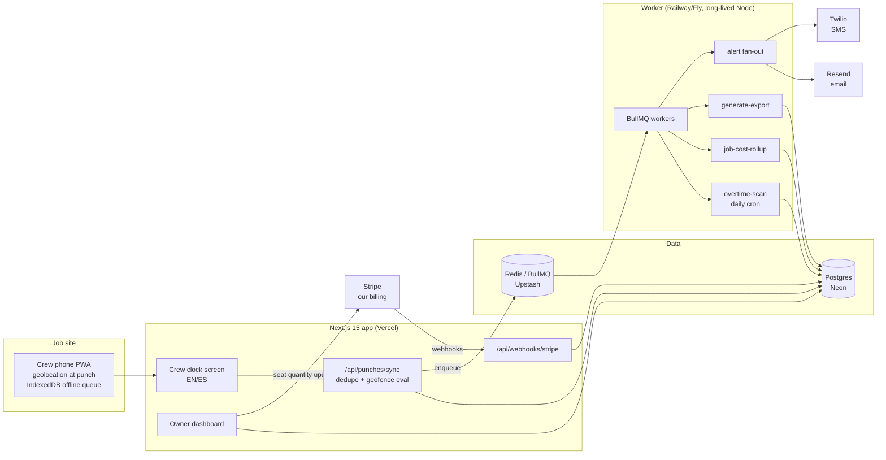

# CrewClock Architecture

## Stack & Rationale

| Layer | Choice | Why |
|---|---|---|
| Web app + API | **Next.js 15 (App Router) + TypeScript, installable PWA** | One deployable for the crew clock screen, owner dashboard, marketing pages, and webhook endpoints. A service worker + web app manifest make the crew screen installable to the home screen; an IndexedDB outbox queues clock events offline. Geolocation is browser-side (`navigator.geolocation`) captured at punch time — no native app needed for the MVP. |
| Database | **Postgres (Neon) + Drizzle ORM** | The domain is relational to the bone (orgs -> users -> assignments -> time entries -> exports). Drizzle gives typed schema-as-code; drizzle-kit migrations. Neon: serverless, branch-per-preview, cheap at small scale. |
| Queue | **BullMQ on Redis (Upstash)** | Repeatable cron jobs (nightly OT scan, daily cost rollups), alert fan-out with per-org rate limits, and export-file generation off the request path. Exactly BullMQ's feature set. |
| Worker | **Standalone Node process (`src/worker`)** | OT scans and export generation must not depend on serverless timeouts or web deploys. Long-lived process on Railway/Fly, same repo, shares `src/db` and `src/lib`. |
| Billing | **Stripe Billing (per-seat quantity subscriptions)** | Subscription quantity = active seats, synced on invite/deactivate. The $49 floor is a minimum invoice amount enforced via a floor line item when `seats x price < $49`. Customer portal handles cards and cancellation. |
| Email | **Resend** | OT alerts, budget threshold alerts, weekly owner digest, export delivery. React Email templates; low volume per org. |
| SMS | **Twilio (optional)** | Owners live in trucks, not inboxes — SMS for OT alerts is a per-org opt-in. 10DLC registration required for US traffic; feature-flagged so email-only orgs never touch it. |
| Auth | **Auth.js (NextAuth v5), split model** | Owners/office sign in with email magic links. Crew join via an org invite code or QR + a 4-digit PIN: field workers share devices, change phone numbers seasonally, and often don't have work email — a PIN on a claimed profile is the highest-security scheme that survives a muddy jobsite. Crew sessions are long-lived and scoped to punch/read-own-hours only. |
| Maps | **Mapbox (static tiles + geocoding)** | The crew mini-map and the office's site picker (drop a pin, set a radius). Static tile images on the crew screen — no interactive map library in the crew bundle; geocoding only when the office creates a site. Free tier covers the MVP comfortably. |
| i18n | **In-house dictionary layer (`src/lib/i18n.ts`)** | Two locales, one product. Typed dictionary modules per locale (`en.ts`, `es.es`-reviewed), a `t()` helper with interpolation, locale stored per user. next-intl is good but brings routing/middleware machinery we don't need for a per-user (not per-URL) locale; a ~100-line module keeps every string typed and greppable. |
| Styling | **Tailwind CSS v4** | Dashboard-speed UI development; design tokens from DESIGN.md as CSS custom properties. |

## System Diagram

Note: geolocation never touches our servers except as punch-event fields — there is no location stream, no background channel, nothing to subpoena beyond punches (README Key Risk 2).

## Data Model

All tables keyed by `id` (uuid), timestamps `created_at` / `updated_at` implied. Multi-tenancy: everything hangs off `organization_id`. Money is integer cents everywhere; coordinates are decimal degrees; all instants are `timestamptz` interpreted through the job site's timezone.

- **organizations** — tenant root. `name`, `plan` (crew|company), `seat_count`, `billing_stripe_customer_id`, `timezone`, `week_starts_on`, `ot_weekly_threshold_hours` (default 40), `settings` (jsonb: alert channels, pay period schedule, default locale).
- **users** — `organization_id`, `name`, `email` (nullable for crew), `phone`, `role` (owner|office|crew), `locale` (en|es), `hourly_cost_cents` (loaded rate: wage + burden), `overtime_rule` (weekly_40|daily_8_weekly_40|none), `pin_hash` (crew), `active`. Auth.js accounts/sessions alongside for owner/office.
- **job_sites** — `organization_id`, `label`, `address`, `lat`, `lng`, `radius_m` (default 150), `timezone`.
- **jobs** — `organization_id`, `job_site_id`, `name`, `client_name`, `bid_labor_hours`, `bid_labor_cost_cents`, `status` (bidding|active|complete|archived), `started_at`, `budget_alert_80_sent_at`, `budget_alert_100_sent_at`.
- **crew_assignments** — who may punch into what. `job_id`, `user_id`, `assigned_at`, `removed_at`.
- **time_entries** — the core record. `user_id`, `job_id`, `clock_in_at`, `clock_out_at` (nullable while on the clock), `in_lat`/`in_lng`/`in_accuracy_m`, `out_lat`/`out_lng`/`out_accuracy_m`, `geofence_status_in` / `geofence_status_out` (inside|outside|unavailable), `source` (live|offline_sync|manual), `client_event_id` (uuid minted on device — the offline dedupe key, unique per org), `edited` (bool), `approved_at`, `approved_by`.
- **time_entry_edits** — audit trail. `time_entry_id`, `edited_by`, `field`, `old_value`, `new_value`, `reason`, `edited_at`. Append-only; never deleted.
- **overtime_alerts** — `organization_id`, `user_id`, `week_start`, `projected_hours`, `threshold_hours`, `sent_at`, `channel` (email|sms), `acknowledged_at`. Unique on (user, week) — one alert per worker per week.
- **payroll_exports** — `organization_id`, `format` (adp|gusto), `period_start`, `period_end`, `status` (pending|generated|failed), `file_key`, `row_count`, `total_hours`, `generated_by`, `delivered_to`.
- **export_line_items** — one per worker per export, for drill-down and dispute resolution. `payroll_export_id`, `user_id`, `regular_hours`, `overtime_hours`, `time_entry_ids` (jsonb array).
- **webhook_events** — Stripe ingestion log. `stripe_event_id` (unique), `type`, `payload` (jsonb), `processed_at`, `error`.
- **audit_log** — every privileged action. `organization_id`, `actor` (system|user_id), `action`, `target`, `metadata` (jsonb).

## Key Flows

### 1. Geofenced clock-in (with offline queue)

1. Crew member opens the PWA, sees assigned jobs, taps **CLOCK IN / MARCAR ENTRADA**.
2. Device requests a fresh position (`getCurrentPosition`, high accuracy, 10s timeout). The punch object is built client-side: `client_event_id` (uuid), user, job, timestamp, lat/lng/accuracy (or nulls on timeout/denial).
3. Online: POST to `/api/punches/sync`. Offline or failed: the punch lands in the IndexedDB outbox; the service worker retries with backoff and on `online` events. The UI confirms honestly ("Saved on phone — will sync / Guardado en el teléfono — se sincronizará").
4. Server evaluates the geofence: haversine distance from the job site vs `radius_m`, widened by the reported accuracy. `distance <= radius + accuracy` -> `inside`; beyond -> `outside`; no coordinates -> `unavailable`. The punch is **never rejected** for being outside — it's recorded and flagged for review. Workers get paid; owners get flags.
5. Dedupe on `client_event_id` unique constraint: a punch synced twice (flaky signal, double retry) inserts once, acks both times. Out-of-order arrivals reconcile by device timestamp.
6. Clock-out mirrors the flow, closing the open entry. A forgotten clock-out is auto-flagged at the org's configured max shift (default 14h) for office review — never silently truncated.

### 2. Live job-cost rollup

1. Every time entry prices at the worker's `hourly_cost_cents` (loaded rate) at entry time; rate changes never rewrite history.
2. An hourly `job-cost-rollup` worker job (plus on-punch incremental updates) aggregates per job: actual hours, actual labor cost, vs `bid_labor_hours` / `bid_labor_cost_cents`.
3. The job detail screen shows the cost bar: spent vs bid, projected finish based on the trailing burn rate.
4. Threshold crossings fire once each: at **80%** of bid ("this job is eating its budget") and **100%** ("over budget as of today"), email/SMS to the owner with the day's numbers. The `budget_alert_*_sent_at` columns make the alerts idempotent.

### 3. Weekly OT scan -> pre-OT alert

1. Daily cron (`overtime-scan`, runs each evening per org timezone): for each active worker, sum the week's hours, add scheduled/typical remaining days (trailing 4-week average per weekday), and project the week total.
2. If projected hours cross the worker's `overtime_rule` threshold and no alert exists for (user, week): insert `overtime_alerts`, fan out email/SMS — "Miguel is at 31.5h Wed; projected 44h Fri."
3. The owner acknowledges in-app (recorded) and can rebalance the schedule while it still matters. Actual OT that occurs anyway is computed at export time regardless — alerts inform, they never alter pay.

### 4. Timesheet approval -> payroll CSV

1. Office opens the pay-period review: entries grouped by worker, flags surfaced first (outside fence, GPS unavailable, edited, auto-flagged shifts).
2. Edits (fix a missed clock-out, reassign a job) write `time_entry_edits` rows with a required reason. Approval stamps `approved_at`; approved entries lock against further crew-side changes.
3. "Export" enqueues `generate-export` with format + period. The worker computes regular vs OT hours per the worker's rule (in the job site's timezone via date-fns-tz — a crew crossing a week boundary at midnight must land in the right week), writes `export_line_items`, and renders the CSV with csv-stringify against the format's column spec (ADP: Co Code, Batch ID, File #, Reg Hours, O/T Hours; Gusto: last_name, first_name, regular_hours, overtime_hours per template).
4. File stored, linked on `payroll_exports`, downloadable from the dashboard and optionally emailed to the bookkeeper. Golden-file tests pin both formats; a pre-export validator blocks generation if any worker lacks a payroll mapping.

## Third-Party Services & Rough Pricing

| Service | Role | Rough cost |
|---|---|---|
| Stripe | Our billing (per-seat subscriptions) | 2.9% + 30c on our own invoices; no other Stripe usage |
| Neon (Postgres) | Primary DB | Free tier -> ~$19/mo (Launch) -> ~$69/mo as data grows |
| Upstash (Redis) | BullMQ backend | Free tier -> ~$10-20/mo pay-per-request; cron + alert volume is tiny |
| Vercel | Next.js hosting | Hobby free -> Pro $20/mo/seat |
| Railway / Fly.io | Worker process | ~$5-20/mo for a small always-on Node service |
| Mapbox | Static mini-map tiles + geocoding | Free tier (50k static requests/mo) covers the MVP; ~$25/mo at 1,000 customers |
| Resend | Email | Free 3k/mo covers hundreds of orgs (alerts + digests are ~20-60 emails/org/mo) -> $20/mo for 50k |
| Twilio | Optional SMS alerts | ~$0.0079/SMS (US) + ~$1.15/mo per number + 10DLC registration fees (~$4-15/mo) |
| Sentry | Errors | Free tier -> ~$26/mo |
| Plausible or Posthog | Product analytics | Free tier -> ~$9-20/mo |

## Estimated Monthly Running Cost

| Scale | Assumptions | Estimate |
|---|---|---|
| **0 customers (dev/preview)** | All free tiers: Neon free, Upstash free, Vercel Hobby, one $5 worker | **~$5-10/mo** |
| **100 customers** | ~$16k MRR for us (100 x ~$160). ~2k workers punching 2x/day = ~120k punch rows/mo (trivial for Postgres). ~4k emails/mo, ~1k SMS/mo | Neon $19 + Upstash $10 + Vercel $20 + worker $10 + Resend $0-20 + Twilio ~$15 + Sentry $26 = **~$100-120/mo** (<1% of revenue) |
| **1,000 customers** | ~$160k MRR. ~20k workers, ~1.2M punch rows/mo, ~40k emails/mo, ~10k SMS/mo, redundant workers | Neon ~$120 + Upstash ~$40 + Vercel ~$60 + workers ~$40 + Resend ~$40 + Twilio ~$110 + observability ~$80 = **~$450-550/mo** (<0.5% of revenue) |

This product is compute-cheap: punches are tiny rows, costing is arithmetic, exports are CSVs. There is no AI inference, no media storage, no per-customer infrastructure — the punch volume of a thousand crews fits comfortably in one small Postgres. Infrastructure margin stays >90% at every stage; the real costs are support, Spanish-language content, and payroll-format babysitting — people costs, not compute.
