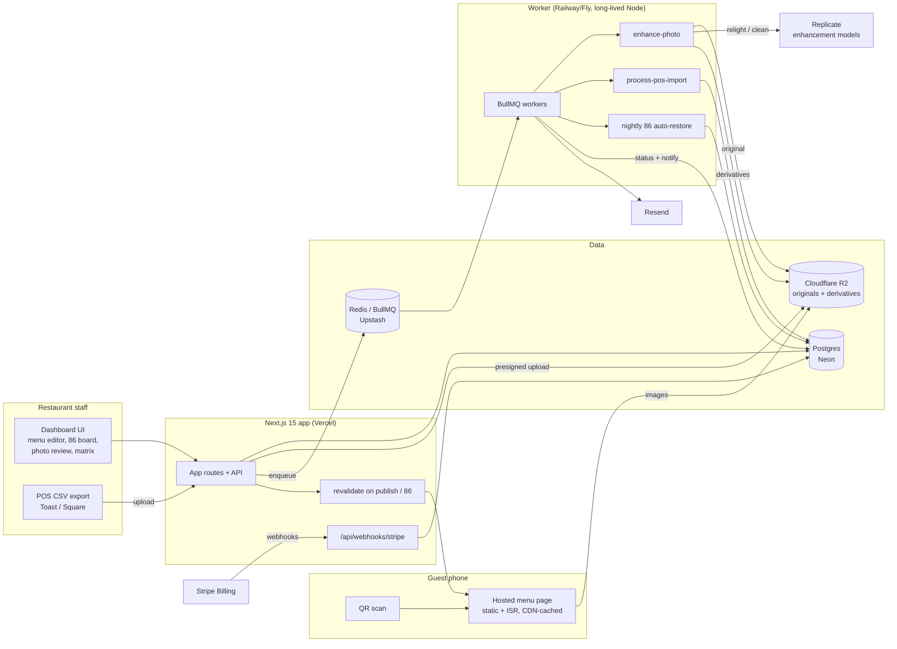

# MenuLift Architecture

## Stack & Rationale

| Layer | Choice | Why |
|---|---|---|
| Web app + API | **Next.js 15 (App Router) + TypeScript** | One deployable for the dashboard, marketing pages, and the hosted guest menus. Guest menu pages are **statically generated with ISR** and revalidated on publish/86 events — the guest page *is* the product's performance promise (sub-1s LCP on 4G), and static HTML from a CDN is the only honest way to keep it. |
| Database | **Postgres (Neon) + Drizzle ORM** | The domain is relational (orgs -> locations -> menus -> sections -> items -> photos/stats). Drizzle gives typed schema-as-code plus plain SQL for the matrix aggregations; drizzle-kit handles migrations. Neon: serverless, branch-per-preview, cheap at small scale. |
| Queue | **BullMQ on Redis (Upstash)** | Photo enhancement and CSV imports are multi-second jobs that must never block a request. BullMQ gives delayed jobs, retries with backoff, per-org rate limiting, and dead-letter handling; repeatables cover the nightly auto-restore scan for 86'd items. |
| Worker | **Standalone Node process (`src/worker`)** | Enhancement calls and 5,000-row CSV parses can't live inside serverless timeouts. Long-lived process on Railway/Fly, same repo, shares `src/db` and `src/lib`. |
| Image enhancement | **Replicate (hosted model API) + sharp** | Replicate: pay-per-run pricing, versioned models (relight + background cleanup), no GPU ops on our side. All calls go through `src/lib/photo-pipeline.ts` — a thin abstraction so swapping to fal.ai or a self-hosted model is a one-file change, not a rewrite. `sharp` handles crops, consistent aspect ratios, and web derivatives (AVIF/WebP at 1x/2x) after enhancement. |
| Object storage + CDN | **Cloudflare R2** | Originals and enhanced derivatives, served through Cloudflare's CDN with zero egress fees — food photos are the heaviest bytes on the guest page and get cached at the edge. S3-compatible API means the `@aws-sdk` client and presigned uploads just work. |
| Billing | **Stripe Billing** | Per-location pricing maps to subscription **quantity** (one subscription per org, quantity = locations, tier = price). Standard webhooks drive entitlements. |
| Email | **Resend** | Magic links, import-finished and photo-ready notifications, and the weekly menu-engineering digest. React Email templates. |
| Auth | **Auth.js (NextAuth v5)** | Email magic-link + Google OAuth, org-scoped sessions. Owners and managers, nothing heavier. |
| Styling | **Tailwind CSS v4** | Dashboard-speed UI development; guest menu uses the same tokens compiled to a tiny static stylesheet. |

## System Diagram

## Data Model

All tables keyed by `id` (uuid), timestamps `created_at` / `updated_at` implied. Multi-tenancy: everything hangs off `organization_id`, usually via `location_id`.

- **organizations** — tenant root. `name`, `plan` (menu|kitchen|margin), `billing_stripe_customer_id`, `stripe_subscription_id`, `location_quantity`, `settings` (jsonb: branding, default currency).
- **locations** — the billable unit. `organization_id`, `name`, `slug` (guest URL), `timezone`, `address`, `active`.
- **users** — `organization_id`, `email`, `name`, `role` (owner|manager). Auth.js accounts/sessions live alongside.
- **menus** — `location_id`, `name` ("Dinner", "Brunch"), `daypart` (jsonb: days + active windows, nullable = always), `status` (draft|live), `published_at`, `theme` (jsonb).
- **menu_sections** — `menu_id`, `name`, `position`, `note` (nullable, e.g. "add a side for $5").
- **menu_items** — `section_id`, `name`, `description`, `price_cents`, `cost_cents` (nullable — needed for margin math, prompted during import), `dietary_tags` (text[]: GF|V|VG|DF), `is_eighty_sixed` (bool), `position`, `photo_id` (nullable), `schedule` (jsonb, nullable: auto-86 windows).
- **item_photos** — `menu_item_id`, `original_key`, `enhanced_key` (nullable), `derivative_keys` (jsonb), `status` (pending|processing|ready|approved|rejected), `replicate_prediction_id`, `error` (nullable).
- **eighty_six_events** — the service log. `menu_item_id`, `location_id`, `actor_user_id`, `eighty_sixed_at`, `restored_at` (nullable), `restore_mode` (manual|nightly_auto).
- **pos_imports** — `location_id`, `source` (toast|square|other), `period_start`, `period_end`, `file_key`, `row_count`, `matched_count`, `column_mapping` (jsonb), `status` (uploaded|mapping|processing|complete|failed), `error`.
- **item_sales_stats** — per import, per item. `pos_import_id`, `menu_item_id`, `qty_sold`, `revenue_cents`, `est_margin_cents` (nullable when `cost_cents` missing).
- **matrix_snapshots** — the analysis output. `pos_import_id`, `menu_item_id`, `quadrant` (star|plowhorse|puzzle|dog), `popularity_index`, `margin_index`, `recommendation` (text, e.g. "re-price +$1, move above the fold").
- **menu_change_log** — every edit. `menu_item_id` (nullable for section/menu edits), `actor_user_id`, `field`, `old_value`, `new_value`, `changed_at`.
- **qr_codes** — `location_id`, `menu_id` (nullable = location default), `slug`, `format` (table_tent|window_card|raw_svg), `scan_count`.
- **webhook_events** — Stripe ingestion log for idempotency. `stripe_event_id` (unique), `type`, `payload` (jsonb), `processed_at`, `error`.
- **audit_log** — sensitive actions (plan changes, user invites, menu deletions). `organization_id`, `actor`, `action`, `target`, `metadata` (jsonb).

## Key Flows

### 1. Menu edit -> publish -> guest page revalidation

1. Owner edits items in the dashboard; every field change writes a `menu_change_log` row (the change history is free).
2. Edits accumulate against the `draft` state; the guest page keeps serving the last published version.
3. **Publish** stamps `published_at`, snapshots the render payload, and calls `revalidatePath('/m/[slug]')` (plus a CDN purge for the image derivatives if crops changed).
4. Next request regenerates the static page; every request after that is CDN-cached HTML. The guest page never queries Postgres at request time.

### 2. One-tap 86 -> instant propagation -> nightly restore

1. From the 86 board (phone-friendly, expo-station reality), a tap flips `menu_items.is_eighty_sixed` and inserts an `eighty_six_events` row with actor and timestamp.
2. The write path immediately triggers ISR revalidation for every live menu containing the item — this bypasses the draft/publish cycle by design: 86 state is service truth, not an edit.
3. Guest pages worldwide show the item as unavailable within seconds (acceptance criterion: under 10s, measured).
4. Un-86ing sets `restored_at` and revalidates again. The nightly worker job (per-location timezone, default 4am) auto-restores items whose event has `restore_mode = nightly_auto` — configurable per item.
5. Revalidation calls are rate-limited per location (max 1 per 2s, trailing) so a frantic night of taps coalesces instead of stampeding the ISR endpoint.

### 3. Photo upload -> enhancement -> review -> live

1. Owner snaps or picks a photo; the dashboard requests a presigned R2 upload URL and puts the original directly to R2 (`item_photos.status = pending`).
2. App enqueues `enhance-photo`; worker downloads the original, calls Replicate (relight + background cleanup model chain) via the `photo-pipeline` abstraction, `status = processing`.
3. Worker runs `sharp`: consistent crop to the menu aspect ratio, AVIF/WebP derivatives at 1x/2x, uploads all keys to R2, `status = ready`.
4. Owner sees the before/after review card (split slider) and **approves or rejects**. Nothing reaches a guest page without approval — `status = approved` attaches the photo to the item and triggers revalidation; `rejected` keeps the original for a retake.
5. Failures (model error, unusable input) set `status = rejected` with an honest error ("too dark to relight — retake near a window") and never retry into a worse result.

### 4. POS CSV import -> mapping -> matrix -> recommendations

1. Owner exports item sales from Toast or Square (documented click-paths in-app) and uploads the CSV; `pos_imports.status = uploaded`.
2. The importer sniffs the format against known Toast/Square column fixtures. Known format: mapping auto-applied. Unknown: the mapping UI asks the owner to point at "item name", "quantity sold", "net sales" columns; the mapping is saved per location for next time (`status = mapping -> processing`).
3. Worker parses rows (papaparse, tolerant of BOM, currency symbols, thousands separators), fuzzy-matches item names to `menu_items` (exact -> normalized -> trigram), writes `item_sales_stats`.
4. Margin math needs `cost_cents`. Items missing it are listed in a "add plate costs" prompt; stats compute anyway, margin classification waits. Filled costs recompute the snapshot in place.
5. Classification: popularity index = item share of category units vs 70% of mean share (the classic Kasavana-Smith threshold); margin index = contribution margin vs category weighted mean. Two booleans -> star / plowhorse / puzzle / dog, written to `matrix_snapshots` with a concrete recommendation per quadrant (stars: protect + feature; plowhorses: re-price or re-cost; puzzles: reposition + photograph; dogs: cut or reinvent).
6. Owner gets an email ("your matrix is ready: 4 stars, 3 dogs") linking to the matrix screen.

## Third-Party Services & Rough Pricing

| Service | Role | Rough cost |
|---|---|---|
| Replicate | Photo relight + background cleanup | ~$0.01-0.05 per image run depending on model chain; a 60-item menu fully photographed ≈ $1-3, re-shoots included. Metered, no idle cost. |
| Cloudflare R2 | Originals + derivatives + CDN | $0.015/GB-month storage, zero egress. 1,000 locations x ~200MB ≈ 200GB ≈ $3/mo storage; CDN egress free is the whole point. |
| Neon (Postgres) | Primary DB | Free tier -> ~$19/mo (Launch) -> ~$69/mo as data grows |
| Upstash (Redis) | BullMQ backend | Free tier -> ~$10-20/mo pay-per-request |
| Vercel | Next.js hosting + ISR | Hobby free -> Pro $20/mo/seat; ISR + static guest pages keep function invocations low by design |
| Railway / Fly.io | Worker process | ~$5-20/mo for a small always-on Node service |
| Stripe | Our billing | 2.9% + 30c on our own subscriptions; no other platform fees |
| Resend | Transactional email | Free 3k/mo -> $20/mo for 50k; volume is low (a few emails/location/mo) |
| Sentry | Errors | Free tier -> ~$26/mo |

## Estimated Monthly Running Cost

| Scale | Assumptions | Estimate |
|---|---|---|
| **0 locations (dev/preview)** | All free tiers: Neon free, Upstash free, Vercel Hobby, one $5 worker, R2 pennies, Replicate pay-per-run during testing | **~$5-15/mo** |
| **100 locations** | ~$4.5k MRR (blended $45). ~1,500 photo runs/mo ($45), R2 ~20GB ($1), Neon Launch $19, Upstash $15, Vercel Pro $20, worker $10, Resend free, Sentry $26 | $45 + $1 + $19 + $15 + $20 + $10 + $26 = **~$135-160/mo** (~3% of revenue) |
| **1,000 locations** | ~$45k MRR. ~10k photo runs/mo ($300), R2 ~200GB + ops ($10), Neon ~$150, Upstash ~$50, Vercel ~$60, workers ~$40, Resend $20, Sentry ~$50 | $300 + $10 + $150 + $50 + $60 + $40 + $20 + $50 = **~$700-900/mo** (<2% of revenue) |

Infrastructure margin stays >85% at every stage. The money goes where it should: Replicate runs scale with the feature customers pay Kitchen-tier for, and everything guest-facing rides free CDN egress — the biggest traffic surface costs the least by design. The real costs are support and the door-by-door distribution grind, not compute.
