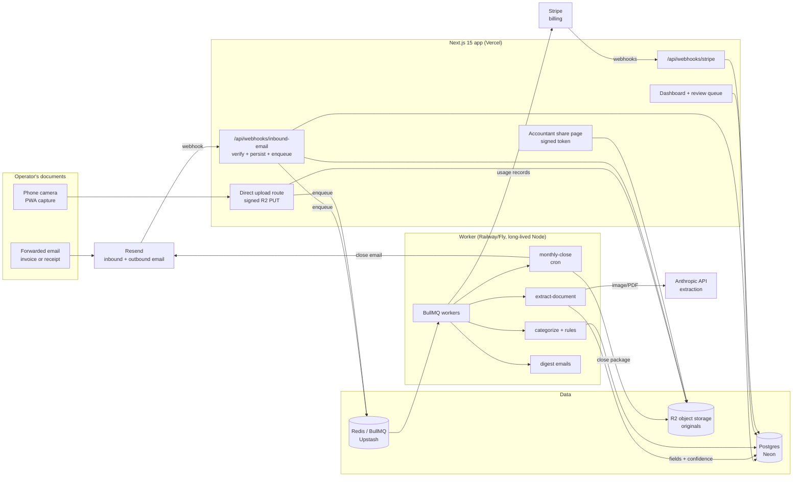

# LedgerLens Architecture

## Stack & Rationale

| Layer | Choice | Why |
|---|---|---|
| Web app + API | **Next.js 15 (App Router) + TypeScript** | One deployable for the dashboard, marketing pages, webhook endpoints, the mobile capture PWA, and the accountant share pages. Route handlers do near-zero work inline (verify, persist, enqueue). |
| Database | **Postgres (Neon) + Drizzle ORM** | The domain is relational (orgs -> documents -> extractions -> line items -> close periods). Drizzle gives typed schema-as-code; drizzle-kit handles migrations. Neon: serverless, branching for previews, cheap at small scale. |
| Object storage | **Cloudflare R2 (S3 API)** | Source images and PDFs kept forever; zero egress fees matter because close packages re-download originals. Signed URLs only -- documents are financial records. |
| Queue | **BullMQ on Redis (Upstash)** | Extraction is bursty (a user forwards 40 emails at once). Delayed jobs, per-org rate limiting, retries with backoff, and a dead-letter queue are exactly BullMQ's feature set. Monthly close runs as a cron repeatable. |
| Worker | **Standalone Node process (`src/worker`)** | Extraction jobs run 2-20s each and must not depend on serverless timeouts. Long-lived process on Railway/Fly, same repo, shares `src/db` and `src/lib`. |
| AI extraction | **Anthropic API (Claude)** | Vision input handles photos of crumpled thermal paper better than classical OCR pipelines. `claude-haiku-4-5` for routine extraction (cheap, fast); escalate low-confidence documents to a Sonnet-tier model. Structured outputs guarantee the extraction schema. |
| Inbound email | **Resend Inbound (or Postmark inbound)** | Per-org forwarding addresses, webhook delivery of parsed MIME with attachments. Outbound digests and close emails through the same provider. |
| Payments | **Stripe Billing** | Three flat tiers + metered document counts reported via usage records. |
| Auth | **Auth.js (NextAuth v5)** | Magic-link email + Google OAuth; org-scoped sessions. Accountant share links are signed tokens, not accounts. |
| Styling | **Tailwind CSS v4** | Token-driven implementation of DESIGN.md. |

## System Diagram

## Data Model

All tables keyed by `id` (uuid), timestamps `created_at` / `updated_at` implied. Multi-tenancy: everything hangs off `organization_id`.

- **organizations** -- tenant root. `name`, `plan` (solo|operator|pro), `stripe_customer_id`, `forwarding_slug` (unique, builds `docs+{slug}@in.ledgerlens.app`), `fiscal_year_start_month`, `settings` (jsonb: category set overrides, digest cadence).
- **users** -- `organization_id`, `email`, `name`, `role` (owner|member). Auth.js accounts/sessions alongside.
- **documents** -- one per ingested artifact. `organization_id`, `source` (email|photo|upload), `storage_key`, `mime_type`, `content_hash` (unique per org -- dedupe), `original_filename`, `email_message_id` (nullable), `status` (queued|extracting|extracted|needs_review|confirmed|rejected|duplicate_of), `duplicate_of_id` (nullable), `received_at`.
- **extractions** -- one per extraction run (re-runs append). `document_id`, `model`, `raw_response` (jsonb), `vendor_name`, `doc_type` (receipt|invoice|statement|other), `doc_date`, `total_cents`, `tax_cents`, `currency`, `line_summary`, per-field `confidence` (jsonb: {vendor: 0.98, total: 0.61, ...}), `overall_confidence`, `duration_ms`, `cost_microcents`.
- **line_items** -- the reviewed truth the exports read from. `document_id`, `organization_id`, `vendor_id`, `category_id`, `doc_date`, `amount_cents`, `tax_cents`, `currency`, `memo`, `confirmed_by` (system|user_id), `confirmed_at`.
- **vendors** -- normalized per org. `organization_id`, `display_name`, `normalized_name`, `default_category_id` (the learned rule), `rule_source` (correction|manual|null), `document_count`.
- **categories** -- Schedule-C-aligned seed set plus per-org custom. `organization_id` (nullable for the global seed), `name`, `schedule_c_line`, `sort`.
- **review_items** -- the queue. `document_id`, `field` (vendor|date|total|tax|category), `suggested_value`, `confidence`, `resolved_value`, `resolved_at`, `resolution` (accepted|corrected|skipped).
- **close_periods** -- one per org per month. `organization_id`, `period` (YYYY-MM), `status` (open|closing|closed), `summary` (jsonb: totals by category, flagged count, document count), `package_storage_key` (zip), `pdf_storage_key`, `closed_at`.
- **share_links** -- accountant access. `organization_id`, `close_period_id` (nullable = all periods), `token_hash`, `expires_at`, `last_accessed_at`, `revoked_at`.
- **usage_counters** -- metering. `organization_id`, `period` (YYYY-MM), `documents_ingested`, `documents_extracted`, `reported_to_stripe_at`.
- **audit_log** -- `organization_id`, `actor` (system|user_id|share_token), `action`, `target`, `metadata` (jsonb). Every export and share access is logged -- these are financial records.

## Key Flows

### 1. Email ingestion -> extraction -> review

1. Operator forwards an invoice to `docs+{slug}@in.ledgerlens.app`. Resend Inbound POSTs parsed MIME to `/api/webhooks/inbound-email`.
2. Handler verifies the webhook signature, resolves the org from the plus-address, and rejects unknown slugs. Attachments (and, when there is no attachment, a PDF render of the HTML body) are streamed to R2.
3. A `documents` row is inserted per artifact with `content_hash`; a hash collision within the org marks `duplicate_of` and stops. Handler enqueues `extract-document` and returns 200 in <1s.
4. Worker checks the org's plan cap (`usage_counters`); over-cap documents park in `queued` with a dashboard notice. Otherwise it calls the Anthropic API with the image/PDF and a structured-output schema: vendor, doc type, date, total, tax, currency, line summary -- each with a confidence score.
5. Result writes an `extractions` row. Fields at or above the confidence threshold auto-populate a `line_items` draft; fields below threshold create `review_items` and flip the document to `needs_review`.
6. Categorization: if the normalized vendor has a learned `default_category_id`, apply it silently; otherwise the model's suggested category goes through the same confidence gate.
7. The review queue shows one card per document: source image beside extracted fields, low-confidence fields highlighted, one-tap accept or inline correct. A correction to vendor/category upserts the vendor rule so next month's identical receipt skips review.

### 2. Photo capture (PWA)

1. Dashboard "Add receipt" opens the camera on mobile (`capture=environment`); the client requests a signed R2 PUT from `/api/uploads` and uploads directly -- the image never proxies through the app server.
2. On upload completion the client posts metadata; server inserts the `documents` row (dedupe by hash) and enqueues extraction, then the document appears in the inbox in `extracting` state with a live status poll.
3. Failed/blurry extractions (overall confidence below floor) prompt an immediate "retake photo" rather than filling the review queue with garbage.

### 3. Monthly close

1. On the 1st (org-local), a cron repeatable enqueues `monthly-close` per org for the prior month.
2. The job refuses to close if unresolved `review_items` exist; instead it emails "3 items need review before your March close" with a deep link. This gate is deliberate: the package must be clean or not exist.
3. When clean (or when the user forces close with flagged items explicitly marked "unreviewed"), the job aggregates `line_items` into the period summary, renders the PDF cover (category totals, month-over-month, flagged list, missing-receipt gaps inferred from recurring vendors), writes QBO-format and Xero-format CSVs, and zips them with the source images into R2.
4. `close_periods` flips to `closed`; the operator gets the close email; the accountant share link (if configured) gains the new period.
5. Usage counters report metered document counts to Stripe for the period.

### 4. Accountant share access

1. Operator generates a share link; server stores only the token hash. Link renders a read-only close-package page: period list, summaries, download buttons (signed, short-lived R2 URLs).
2. Every access writes `audit_log` and bumps `last_accessed_at` -- the operator sees "Your accountant downloaded February" (a retention moment).
3. Links are revocable and expire by default in 90 days.

## Third-Party Services & Rough Pricing

| Service | Role | Rough cost |
|---|---|---|
| Anthropic API | Extraction + categorization | `claude-haiku-4-5` at $1/$5 per MTok: a receipt image (~1,600 tok) + prompt + ~400 output tokens costs roughly $0.005-0.01 per document; Sonnet-tier escalation on the ~10% hardest documents adds ~$0.01-0.02 each. At 300 docs/mo (Operator tier) that is ~$2-4/customer against $39 revenue. |
| Neon (Postgres) | Primary DB | Free tier -> ~$19/mo -> ~$69/mo as data grows |
| Cloudflare R2 | Originals + packages | $0.015/GB-mo storage, zero egress; ~1-2 GB per active customer-year -> pennies |
| Upstash (Redis) | BullMQ backend | Free tier -> ~$10-20/mo pay-per-request |
| Vercel | Next.js hosting | Hobby free -> Pro $20/mo/seat |
| Railway / Fly.io | Worker process | ~$5-20/mo for a small always-on Node service |
| Resend | Inbound parsing + outbound email | Free 3k/mo -> $20/mo for 50k; inbound included |
| Stripe | Billing | 2.9% + 30c on our subscriptions |
| Sentry | Errors | Free tier -> ~$26/mo |
| Plausible / PostHog | Analytics | Free tier -> ~$9-20/mo |

## Estimated Monthly Running Cost

| Scale | Assumptions | Estimate |
|---|---|---|
| **0 customers (dev/preview)** | All free tiers, one $5 worker, test extraction volume | **~$10-20/mo** |
| **100 customers** | ~$3k MRR. ~12k docs/mo extracted (~$80-120 API), Neon Launch, Upstash paid, Vercel Pro, worker $10, Resend $20, Sentry | Neon $19 + Upstash $15 + Vercel $20 + worker $10 + Resend $20 + Anthropic ~$100 + R2 ~$5 + Sentry $26 = **~$200-230/mo** (~7% of revenue) |
| **1,000 customers** | ~$30k MRR. ~150k docs/mo (~$900-1,400 API), bigger DB, redundant workers | Neon ~$150 + Upstash ~$50 + Vercel ~$60 + workers ~$50 + Resend ~$90 + Anthropic ~$1,200 + R2 ~$40 + observability ~$80 = **~$1,700-2,000/mo** (~6% of revenue) |

Extraction is the only cost that scales linearly with usage, and it is capped by plan tiers; infrastructure margin stays above 90% and blended gross margin above 85% at every stage.
