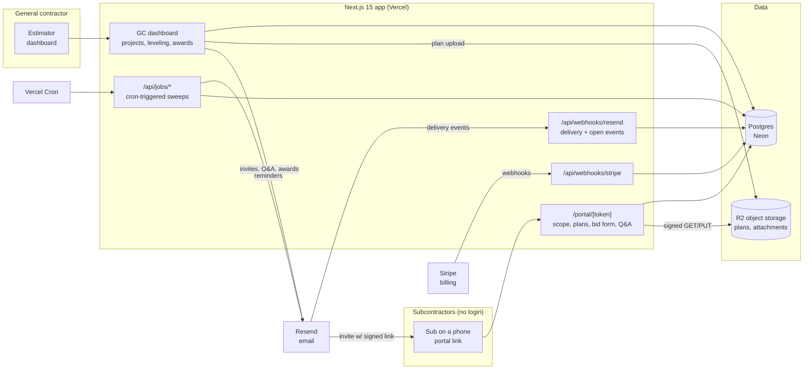

# BidBoard Architecture

## Stack & Rationale

| Layer | Choice | Why |
|---|---|---|
| Web app + API | **Next.js 15 (App Router) + TypeScript** | One deployable for the GC dashboard, the no-login sub portal, marketing pages, and webhook endpoints. The portal is a public route tree keyed by signed tokens -- same app, strict separation at the auth layer. |
| Database | **Postgres (Neon) + Drizzle ORM** | Deeply relational domain (companies -> projects -> packages -> invitations -> bids -> bid lines). Drizzle gives typed schema-as-code; drizzle-kit migrations. Neon branches for preview envs. |
| Object storage | **Cloudflare R2 (S3 API)** | Plan sets are large and downloaded repeatedly by many subs -- zero egress fees are decisive. Signed URLs only. |
| Email | **Resend** | Invitations, reminders, Q&A broadcasts, award/regret notices. React Email templates; per-GC reply-to so sub replies land with the estimator. Delivery webhooks track opens/bounces for the status board. |
| Scheduling | **Vercel Cron -> internal job route** | Reminder sends (T-7/T-3/T-1) and due-date rollovers are minute-precision-irrelevant daily/hourly sweeps; a cron-triggered route handler with DB-level idempotency covers it. No queue/worker in v1 -- called out per SCAFFOLD_GUIDE, justified by the absence of long-running jobs. |
| Payments | **Stripe Billing** | Three flat tiers; seat/project limits enforced in-app. |
| Auth | **Auth.js (NextAuth v5)** for GCs; **signed tokens (jose)** for subs | GCs get org-scoped sessions. Subs never authenticate: every portal URL embeds a JWT scoped to (invitation, package) with expiry tied to the bid due date. |
| Styling | **Tailwind CSS v4** | Token-driven implementation of DESIGN.md. |

## System Diagram

## Data Model

All tables keyed by `id` (uuid), timestamps `created_at` / `updated_at` implied. Multi-tenancy: everything hangs off `company_id` (the GC).

- **companies** -- tenant root. `name`, `plan` (crew|builder|precon), `stripe_customer_id`, `logo_key`, `reply_to_email`, `settings` (jsonb: reminder schedule defaults, branding).
- **users** -- `company_id`, `email`, `name`, `role` (admin|estimator|viewer). Auth.js tables alongside.
- **sub_companies** -- the GC's private directory. `company_id`, `name`, `trades` (CSI division codes, array), `city`, `notes`, `performance_note`, `source` (manual|import|portal).
- **sub_contacts** -- `sub_company_id`, `name`, `email`, `phone`, `is_primary`.
- **projects** -- `company_id`, `name`, `address`, `bid_due_at`, `status` (draft|bidding|leveling|awarded|archived), `owner_meeting_at` (nullable), `notes`.
- **trade_packages** -- one per trade per project. `project_id`, `trade` (CSI division + label), `scope_notes`, `status` (draft|open|closed|awarded), `awarded_bid_id` (nullable).
- **bid_form_lines** -- the GC's structured form per package. `trade_package_id`, `sort`, `description`, `unit` (nullable), `quantity` (nullable), `is_alternate`, `is_allowance`.
- **plan_files** -- `project_id`, `trade_package_id` (nullable = whole project), `storage_key`, `filename`, `version_label`, `bytes`, `uploaded_by`.
- **invitations** -- one per sub contact per package. `trade_package_id`, `sub_company_id`, `sub_contact_id`, `token_hash`, `token_expires_at`, `status` (sent|opened|will_bid|declined|submitted|no_response), `personal_note`, `last_reminder_at`, `opened_at`.
- **bids** -- one per submitted response (revisions append). `invitation_id`, `trade_package_id`, `revision`, `kind` (itemized|lump_sum), `total_cents` (computed or entered), `inclusions` (text[]), `exclusions` (text[]), `notes`, `attachment_keys` (text[]), `submitted_at`, `superseded_by_id` (nullable).
- **bid_lines** -- `bid_id`, `bid_form_line_id` (nullable when unmapped), `raw_description` (what the sub typed), `amount_cents`, `mapping_status` (matched|manual|unmapped), `mapped_by` (system|user_id).
- **leveling_adjustments** -- GC-entered rows in the comparison. `trade_package_id`, `bid_id` (nullable = applies to a column), `bid_form_line_id` (nullable), `kind` (plug|normalize|scope_add), `amount_cents`, `reason`.
- **questions** -- portal Q&A. `trade_package_id`, `invitation_id` (asker), `body`, `answer_body` (nullable), `answered_at`, `broadcast_at` (answers go to all bidders on the trade).
- **awards** -- `trade_package_id`, `bid_id`, `awarded_by`, `award_note`, `notifications_sent_at`.
- **email_events** -- delivery log for the status board. `invitation_id` (nullable), `kind` (invite|reminder|qa|award|regret), `provider_message_id`, `status` (sent|delivered|opened|bounced), `occurred_at`.
- **audit_log** -- `company_id`, `actor` (user_id|invitation_id|system), `action`, `target`, `metadata` (jsonb). Every bid view and portal access is logged (bid-shopping defense).

## Key Flows

### 1. Package setup -> invitations -> tracked collection

1. Estimator creates a project, adds trade packages, and defines each package's bid form lines (or clones from a saved template). Plans upload directly to R2 via signed PUTs.
2. For each package the estimator picks subs from the directory (filtered by trade), adds a personal note, and sends invites. Each invitation stores only a token hash; the emailed link carries a JWT scoped to that invitation with expiry = bid due date + grace.
3. Resend delivery webhooks update `email_events`; the package status board shows sent/opened/will-bid/declined/submitted per sub in real time.
4. Cron sweep sends reminders on the configured schedule (default T-7/T-3/T-1 before `bid_due_at`) to invitations still in sent/opened/will_bid -- idempotent via `last_reminder_at`.
5. Sub replies to the invite email go to the GC's reply-to; the portal is the structured path, email remains the escape hatch.

### 2. No-login portal submission

1. Sub opens the link: token verified (signature + expiry + not-revoked), portal renders scope notes, plan downloads (signed GETs), Q&A, and the bid form.
2. The form presents the GC's own `bid_form_lines` -- this is the normalization strategy: subs price the GC's structure directly, so most bids arrive pre-leveled. Per line: amount, or "excluded" / "included in line N" markers.
3. Free-form extras: the sub can add rows (typed descriptions -> `bid_lines` with `mapping_status = unmapped`), declare inclusions/exclusions as structured chips + free text, or fall back to lump-sum + PDF attachment when they refuse itemization.
4. Draft state persists against the invitation (a sub can return via the same link); submit stamps `submitted_at`, locks revision 1, notifies the estimator. Later edits before the due date create revision 2 superseding 1 -- full history kept.
5. Every portal access writes `audit_log`; the sub sees a plain statement that their numbers are never shown to other subs.

### 3. Leveling

1. The leveling view pivots `bid_lines` by `bid_form_line_id`: rows = the GC's form lines, columns = submitted bids. Matched cells render mono amounts; per-row low gets the highlight treatment (DESIGN.md).
2. Unmapped sub rows queue in a "needs mapping" tray; the estimator drags them onto a form line or marks them scope-add -- `mapping_status = manual`, remembered per sub for future projects.
3. Missing cells (sub didn't price a line) accept plug values (`leveling_adjustments.kind = plug`) so column totals stay comparable; plugs render visually distinct -- never disguised as real numbers.
4. The inclusion/exclusion matrix renders under the grid: rows = declared scope items, columns = subs, filled/empty states; this is where the "cheap bid missing dumpsters" becomes visible.
5. Adjusted totals = submitted total + adjustments; apparent low per package computed on adjusted, not raw, totals. Export produces the owner-meeting PDF/CSV with all adjustments footnoted.

### 4. Award + notify

1. Estimator selects the winning bid; confirm screen shows the adjusted-total basis and any open flags (unmapped lines, unanswered questions).
2. Award writes `awards`, flips the package to `awarded`, locks bids read-only, and sends the award notice to the winner and regret notices to the rest (templates editable, send optional but defaulted on -- subs remember GCs who tell them).
3. Project rolls to `awarded` when all packages are; leveling exports remain permanently downloadable and the audit trail preserves how the number was reached.

## Third-Party Services & Rough Pricing

| Service | Role | Rough cost |
|---|---|---|
| Neon (Postgres) | Primary DB | Free tier -> ~$19/mo -> ~$69/mo |
| Cloudflare R2 | Plans + attachments | $0.015/GB-mo, zero egress. A busy GC holds ~10-50 GB of active plan sets -> ~$0.15-0.75/customer/mo even with heavy sub downloads |
| Vercel | Next.js hosting + cron | Hobby free -> Pro $20/mo/seat |
| Resend | Invites, reminders, notices | Free 3k/mo -> $20/mo for 50k. ~15 packages x 10 subs x 5 touches = ~750 emails per active project |
| Stripe | Billing | 2.9% + 30c on our subscriptions |
| Sentry | Errors | Free tier -> ~$26/mo |
| Plausible / PostHog | Analytics | Free tier -> ~$9-20/mo |

## Estimated Monthly Running Cost

| Scale | Assumptions | Estimate |
|---|---|---|
| **0 customers (dev/preview)** | All free tiers | **~$0-10/mo** |
| **100 customers** | ~$22k MRR. ~300 active projects, ~200 GB R2, ~150k emails/mo, Neon Launch, Vercel Pro | Neon $19 + R2 ~$5 + Vercel $20 + Resend $90 + Sentry $26 + analytics $9 = **~$170-200/mo** (<1% of revenue) |
| **500 customers** | ~$110k MRR. ~1,500 active projects, ~1 TB R2, ~700k emails/mo | Neon ~$150 + R2 ~$20 + Vercel ~$60 + Resend ~$300 + observability ~$80 = **~$600-700/mo** (<1% of revenue) |

No AI costs and no worker fleet in v1; infrastructure margin stays >95%. The deliberate v1 simplification (no queue) is revisited in Phase 3 if normalization assist or heavy notification fan-out demands it.
