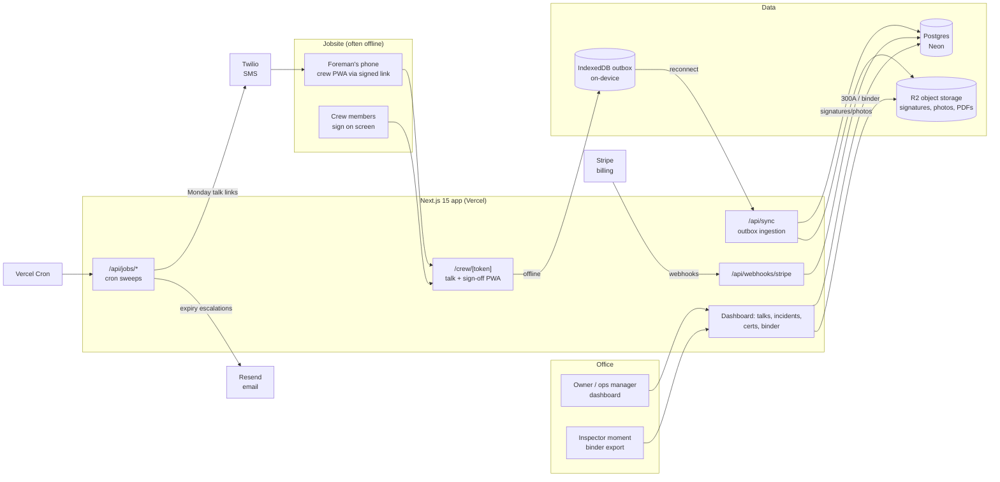

# SafetyDeck Architecture

## Stack & Rationale

| Layer | Choice | Why |
|---|---|---|
| Web app + API | **Next.js 15 (App Router) + TypeScript** | One deployable for the office dashboard, the foreman's crew PWA, marketing pages, and webhooks. The crew flow is a public route tree keyed by signed tokens -- no worker accounts. |
| PWA / offline | **Serwist (service worker) + IndexedDB outbox** | The defining constraint: sign-offs happen where there is no signal. Talk content precaches when the foreman opens the Monday link; signatures/photos write to a local outbox and sync when coverage returns. Serwist is the maintained Next.js service-worker toolchain. |
| Database | **Postgres (Neon) + Drizzle ORM** | Relational domain (companies -> crews -> employees -> talks -> sign-offs; incidents -> 300 rows). Drizzle typed schema; drizzle-kit migrations; Neon branches for previews. |
| Object storage | **Cloudflare R2 (S3 API)** | Signature strokes (SVG/PNG), huddle photos, cert-card photos, binder PDFs. Signed URLs only -- this is sensitive worker data. Zero egress helps binder re-downloads. |
| Email + SMS | **Resend (email) + Twilio (SMS)** | The Monday talk link goes to foremen by SMS (field reality: texts get opened, emails don't); cert-expiry escalations by email to ops. 10DLC registration required for US SMS -- started in Phase 0. |
| PDF generation | **pdf-lib** | OSHA Form 300/300A layouts, the signable 300A summary, and the inspection binder. Deterministic, serverless-friendly, no headless browser. |
| Scheduling | **Vercel Cron -> internal job routes** | Weekly talk fan-out, cert-expiry sweeps, February 300A reminders. Daily granularity; DB-level idempotency. No queue/worker in v1 -- no long-running jobs exist (PDF renders are <2s); revisited if binder exports grow. |
| Payments | **Stripe Billing** | Three flat tiers by field headcount. |
| Auth | **Auth.js (NextAuth v5)** for office users; **signed tokens (jose)** for foreman/crew links | Field workers never authenticate; the foreman's link is scoped to (crew, talk instance) and the sign-off is the artifact. |
| Styling | **Tailwind CSS v4** | Token-driven implementation of DESIGN.md. |

## System Diagram

## Data Model

All tables keyed by `id` (uuid), timestamps `created_at` / `updated_at` implied. Multi-tenancy: everything hangs off `company_id`.

- **companies** -- tenant root. `name`, `plan` (crew|company|fleet), `stripe_customer_id`, `naics_code`, `establishment_name` (300A header fields), `annual_avg_employees`, `total_hours_worked` (300A denominators, editable per year), `settings` (jsonb: talk cadence, reminder ladder).
- **users** -- office logins. `company_id`, `email`, `name`, `role` (owner|admin|viewer). Auth.js tables alongside.
- **crews** -- `company_id`, `name`, `site_label`, `foreman_name`, `foreman_phone`, `foreman_email`, `talk_day` (default monday), `active`.
- **employees** -- the field roster; no logins. `company_id`, `crew_id` (nullable -- floaters), `name`, `hire_date`, `job_title`, `active`, `language` (en|es).
- **talks** -- library content. `company_id` (nullable = global seed), `title`, `body_md`, `hazard_tags` (text[]), `language`, `est_minutes`, `source` (seed|custom).
- **talk_instances** -- one scheduled talk per crew per week. `crew_id`, `talk_id`, `scheduled_for`, `token_hash`, `status` (scheduled|delivered|in_progress|completed|missed), `completed_at`, `gps_lat/lng` (nullable), `site_photo_key` (nullable), `synced_from_offline` (bool).
- **sign_offs** -- one per employee per instance. `talk_instance_id`, `employee_id`, `signature_key` (R2), `signed_at` (device time), `synced_at` (server time), `device_id`. Immutable after sync (updates forbidden at the API layer; corrections append).
- **incidents** -- guided intake. `company_id`, `employee_id`, `occurred_at`, `site_label`, `description`, `injury_type`, `body_part`, `treatment` (first_aid|medical|er|hospitalized|fatality), `days_away`, `days_restricted`, `recordable` (bool, derived), `recordability_basis` (jsonb: which 1904 answers drove it), `privacy_case` (bool), `reported_to_osha_at` (nullable), `case_number` (yearly sequence).
- **osha_forms** -- generated artifacts, versioned. `company_id`, `year`, `kind` (form_300|form_301|form_300a), `storage_key`, `generated_at`, `form_logic_version`, `certified_by` (nullable, 300A signer).
- **certs** -- `employee_id`, `kind` (osha_10|osha_30|first_aid_cpr|fit_test|license|custom), `label`, `issued_on`, `expires_on` (nullable = no expiry), `card_photo_key`, `status` (valid|expiring|expired) derived.
- **reminders** -- escalation ledger. `company_id`, `target_kind` (cert|talk_missed|form_300a), `target_id`, `channel` (email|sms), `sent_at`, `rung` (60d|30d|7d|overdue).
- **binder_exports** -- `company_id`, `range_start/end`, `storage_key`, `requested_by`, `generated_at`, `contents` (jsonb manifest).
- **audit_log** -- `company_id`, `actor` (user_id|token|system), `action`, `target`, `metadata`. Every record view/export logged -- these documents end up in legal proceedings.

## Key Flows

### 1. Weekly toolbox talk -> crew sign-off (offline-tolerant)

1. Cron (crew-local Monday, per `talk_day`) creates `talk_instances` from the company's rotation (seeded schedule; ops can override the week's topic), mints a signed token, and texts the foreman the link.
2. Foreman opens the link -- ideally on wifi at the yard: the PWA precaches the talk body, the crew roster, and the sign-off shell into the service worker cache + IndexedDB.
3. At the huddle (possibly offline): foreman reads the talk, taps "Start sign-off," hands the phone around. Each crew member taps their name and signs; strokes are captured as vector paths. Optional huddle photo. Everything writes to the IndexedDB outbox with device timestamps.
4. On connectivity, the outbox syncs to `/api/sync`: idempotent by (instance, employee, device) keys; signatures/photos upload to R2 via signed PUTs; `synced_from_offline` and both timestamps recorded (device vs server time preserved honestly -- never falsified to look contemporaneous).
5. Instance flips `completed`; the dashboard attendance matrix updates. Instances still `delivered` by end of day trigger a "talk missed" nudge to ops per the reminder ladder.
6. Sign-offs are immutable post-sync: the API forbids updates; corrections are appended events. This is what makes the records defensible.

### 2. Incident intake -> OSHA 300/300A

1. Ops (or foreman via a token link) starts the guided intake: plain-language questions ("Did they get treatment beyond first aid?" with 1904's first-aid list inline; "Days away from work?"; "Was this a privacy-concern case?").
2. The recordability engine derives `recordable` + `recordability_basis` from the answers per 29 CFR 1904.7 -- conservatively, with rule text cited and a "not sure -- see the rule / consult counsel" path. The logic is versioned data (`form_logic_version`), not hardcoded.
3. `treatment = hospitalized|fatality` (or amputation/eye loss) immediately surfaces OSHA's 8/24-hour reporting duty: the screen shows the deadline clock, the 800 number, and the portal link; `reported_to_osha_at` records what the company did. Guidance only -- SafetyDeck never files on their behalf.
4. Recordable incidents append Form 300 rows (privacy cases render "privacy case" in the name column per 1904.29); Form 301 detail renders per incident.
5. Year-end: the 300A job aggregates the year's 300 rows + the company's employment/hours denominators, renders the signable 300A PDF, and opens the February-posting reminder cadence (Jan 15, Feb 1, Apr 30 window).

### 3. Cert tracking -> escalating reminders

1. Ops enters certs with expiry dates and a photo of the card (signed PUT to R2).
2. A daily cron sweep derives `status` and walks the reminder ladder: 60d (email), 30d (email), 7d (email + SMS), overdue (SMS + dashboard red). `reminders` rows make the ladder idempotent.
3. The cert matrix (employees x cert kinds) is the dashboard view and a binder page; GC prequal requests are answered from the same screen.

### 4. The inspection binder

1. One button: pick a date range (default: trailing 12 months). The export job assembles talk attendance records (with signatures), the current-year 300 log, the latest 300A, the cert matrix, and the incident list into a dated, paginated PDF bundle with a manifest cover.
2. Rendered with pdf-lib, stored in R2, downloadable via short-lived signed URL; `binder_exports` + `audit_log` record who exported what when (chain-of-custody flavor).
3. The same export is the sales demo, the GC-prequal answer, and the inspector answer -- one artifact, three buyers.

## Third-Party Services & Rough Pricing

| Service | Role | Rough cost |
|---|---|---|
| Neon (Postgres) | Primary DB | Free tier -> ~$19/mo -> ~$69/mo |
| Cloudflare R2 | Signatures, photos, PDFs | $0.015/GB-mo, zero egress; ~0.5-2 GB per active company-year -> pennies |
| Twilio | Foreman SMS links + escalations | ~$0.0079/SMS + ~$1.15/mo per number + 10DLC registration fees; ~6-10 SMS/company/week |
| Resend | Email nudges + digests | Free 3k/mo -> $20/mo for 50k |
| Vercel | Hosting + cron | Hobby free -> Pro $20/mo/seat |
| Stripe | Billing | 2.9% + 30c on our subscriptions |
| Sentry | Errors (app + sync failures) | Free tier -> ~$26/mo |
| Plausible / PostHog | Analytics | Free tier -> ~$9-20/mo |

## Estimated Monthly Running Cost

| Scale | Assumptions | Estimate |
|---|---|---|
| **0 customers (dev/preview)** | Free tiers + one Twilio number | **~$5-15/mo** |
| **100 customers** | ~$9k MRR. ~350 crews, ~3k SMS/mo, ~40k emails/mo, ~100 GB R2 | Neon $19 + Vercel $20 + Twilio ~$30 + Resend $20 + R2 ~$2 + Sentry $26 = **~$120-150/mo** (~1.5% of revenue) |
| **1,000 customers** | ~$90k MRR. ~3,500 crews, ~30k SMS/mo, ~400k emails/mo, ~1 TB R2 | Neon ~$150 + Vercel ~$60 + Twilio ~$280 + Resend ~$150 + R2 ~$15 + observability ~$80 = **~$700-800/mo** (<1% of revenue) |

No AI costs, no worker fleet, no per-seat third-party licenses; margin stays >95% on infrastructure. The real operating cost is the annual compliance review of form logic -- budgeted as a professional-services line, not infra.
