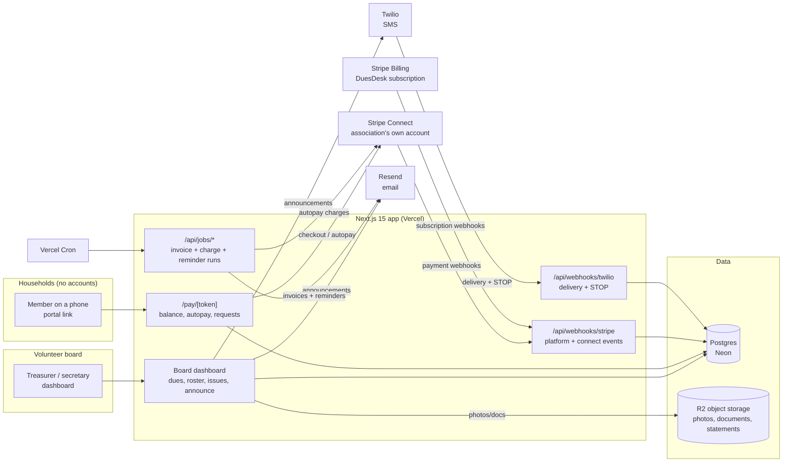

# DuesDesk Architecture

## Stack & Rationale

| Layer | Choice | Why |
|---|---|---|
| Web app + API | **Next.js 15 (App Router) + TypeScript** | One deployable for the board dashboard, the member portal (token-keyed public routes), marketing pages, and webhooks. |
| Database | **Postgres (Neon) + Drizzle ORM** | Relational domain (associations -> households -> members -> assessments -> invoices -> payments; issues -> events). Drizzle typed schema-as-code; drizzle-kit migrations; Neon branches for previews. |
| Payments | **Stripe Connect (Standard accounts) + Stripe Billing** | The load-bearing decision: dues flow as destination charges into *the association's own Stripe account* -- association money never touches our balance sheet (compliance risk #2 in README). Autopay = saved payment methods + off-session PaymentIntents on due dates. DuesDesk's own subscription runs on plain Stripe Billing. |
| Object storage | **Cloudflare R2 (S3 API)** | Issue photos, document library, generated statements. Signed URLs only. |
| Email + SMS | **Resend (email) + Twilio (SMS)** | Announcements, invoices, reminders by email; SMS announcements on Neighborhood+. Per-member SMS consent + STOP handling; 10DLC registration in Phase 0. |
| Scheduling | **Vercel Cron -> internal job routes** | Invoice generation on schedule dates, autopay charge runs, reminder ladders, monthly board digests. Daily granularity, DB-level idempotency. No queue/worker in v1: charge runs are batched, short, and idempotent; revisited if associations exceed ~1k units. |
| Auth | **Auth.js (NextAuth v5)** for board members; **signed portal tokens (jose) with magic-link step-up** for households | Board logins are real accounts with roles. Households get signed portal links; anything sensitive (saving a payment method) steps up through an emailed magic link -- no passwords for members, ever. |
| PDF | **pdf-lib** | Statements, delinquency reports, annual summaries for the board packet. |
| Styling | **Tailwind CSS v4** | Token-driven implementation of DESIGN.md. |

## System Diagram

## Data Model

All tables keyed by `id` (uuid), timestamps `created_at` / `updated_at` implied. Multi-tenancy: everything hangs off `association_id`.

- **associations** -- tenant root. `name`, `kind` (hoa|condo|club|league), `plan` (block|neighborhood|community), `stripe_customer_id` (our billing), `stripe_account_id` (their Connect account), `timezone`, `settings` (jsonb: late-fee policy, reminder ladder, fiscal year).
- **users** -- board logins. `association_id`, `email`, `name`, `role` (president|treasurer|secretary|member), `term_note`. Auth.js tables alongside.
- **households** -- the billable unit. `association_id`, `unit_label` ("214 Maple St"), `mailing_address`, `status` (active|inactive), `joined_on`, `left_on` (nullable -- history survives turnover).
- **members** -- people in a household. `household_id`, `name`, `email`, `phone`, `is_primary`, `sms_opt_in` (bool, TCPA), `sms_opted_out_at`, `portal_token_hash`.
- **assessment_schedules** -- dues policy. `association_id`, `name` ("2026 Annual Dues"), `cadence` (annual|quarterly|monthly|one_time), `amount_cents` (per household, with per-household overrides table if needed later), `due_day`, `starts_on`, `ends_on`, `late_fee_policy` (jsonb: grace days, flat/percent).
- **invoices** -- one per household per period. `household_id`, `assessment_schedule_id`, `period_label`, `amount_cents`, `late_fee_cents`, `status` (draft|sent|paid|partial|overdue|written_off), `due_on`, `sent_at`, `paid_at`.
- **payments** -- `invoice_id`, `household_id`, `method` (card|ach|check|cash|other), `amount_cents`, `stripe_payment_intent_id` (nullable -- checks are recorded manually), `received_on`, `recorded_by` (user_id|system), `payout_id` (nullable).
- **autopay_enrollments** -- `household_id`, `stripe_payment_method_id`, `method` (card|ach), `status` (active|paused|failed), `enrolled_at`, `last_charge_at`, `consecutive_failures`.
- **issues** -- the violations/requests log. `association_id`, `household_id` (nullable -- common-area issues), `number` (yearly sequence, "2026-014"), `kind` (violation|maintenance|architectural), `title`, `status` (open|in_progress|resolved|closed), `visibility_default` (member_visible|board_only), `opened_by` (user_id|member portal), `closed_at`.
- **issue_events** -- the thread. `issue_id`, `author` (user_id|member_id|system), `body`, `photo_keys` (text[]), `visibility` (member_visible|board_only), `kind` (comment|status_change|notice_sent). Append-only -- the fair-process timeline.
- **announcements** -- `association_id`, `subject`, `body_md`, `segments` (jsonb: all|delinquent|unit filters), `channels` (email|sms), `sent_by`, `sent_at`.
- **deliveries** -- per-recipient outcome. `announcement_id` (nullable -- also invoices/reminders), `member_id`, `channel`, `provider_message_id`, `status` (queued|sent|delivered|bounced|failed|opted_out), `occurred_at`.
- **documents** -- library. `association_id`, `title`, `category` (bylaws|ccrs|minutes|budget|other), `storage_key`, `version_label`, `member_visible` (bool), `uploaded_by`.
- **audit_log** -- `association_id`, `actor` (user_id|member_id|system), `action`, `target`, `metadata` (jsonb). Money movements and issue changes always logged -- boards answer to members and occasionally to courts.

## Key Flows

### 1. Assessment -> invoices -> autopay run

1. Treasurer defines the assessment schedule (e.g. quarterly $180, due the 1st, 10-day grace, $15 late fee). Onboarding imports the roster CSV first, so schedule setup ends with a real preview: "63 invoices totaling $11,340 will be created for Apr 1."
2. Cron on the schedule date generates `invoices` per active household (idempotent per household+period), emails each household its invoice with the portal link, and stamps `sent_at`.
3. On the due date, the autopay run charges enrolled households: off-session PaymentIntents (destination = the association's Connect account), one per invoice, idempotency key `invoice:{id}`. Failures mark the enrollment, retry once at +3 days, then fall back to the manual reminder ladder -- a failed autopay must degrade to a normal unpaid invoice, never a silent gap.
4. Stripe webhooks confirm settlement (`payment_intent.succeeded`, ACH's delayed `payment_intent.processing -> succeeded`): `payments` row written, invoice status updated, the dashboard's collected-vs-expected ticks up.
5. Check payers: treasurer records the check against the invoice in two taps (the "40 checks" number should trend toward zero, but recording the holdouts must be painless or the ledger forks back to Excel).

### 2. Delinquency ladder

1. Grace expires -> invoice flips `overdue`; late fee applied per policy (visible as a separate line, reversible by the treasurer -- boards waive fees constantly and the record must show it).
2. Reminder ladder per association config (default: +3d gentle email, +14d firm email, +30d "hand to the board" flag + SMS if opted in). `deliveries` rows make every send idempotent and auditable.
3. The delinquency view buckets households (current/30/60/90+) with per-household drill-down: invoice history, contact log, one-tap payment-plan creation (splits the balance into scheduled invoices).
4. Nothing escalates to legal language automatically -- the 90+ bucket surfaces "export history for your attorney" instead (README risk #4).

### 3. Member portal (no accounts)

1. Every member's invoice/announcement email carries their signed portal link. Opening it shows the household: balance, invoice history, autopay status, association documents, and their issues.
2. Paying: Stripe hosted checkout (card/ACH, ACH nudged first) -- returns to the portal with the settled state. Enrolling in autopay: SetupIntent to save the method, but only after a magic-link step-up (the emailed link proves inbox control before a payment method is stored against the household).
3. Filing a request: kind, description, photos (signed PUTs to R2) -> creates an `issues` row + first event; the member sees the member-visible timeline thereafter.
4. Portal tokens are per-member, revocable, and expire on a rolling window; every access is audit-logged.

### 4. Issues (violations/requests) with fair-process timeline

1. Board logs a violation (or a member files a request). The issue gets its yearly number, a photo thread, and a status.
2. Every action appends an `issue_event` with explicit visibility: member_visible events form the household's view; board_only notes stay internal but remain in the record (discoverable deliberately -- honest records protect fair boards).
3. Notices sent from the issue (email the household a violation notice with photos) are recorded as `notice_sent` events with delivery status -- the "we notified you on March 3" receipt that ends he-said-she-said.
4. Resolution closes the thread; the full timeline is exportable per issue (PDF) for board packets or counsel.

### 5. Announcements

1. Compose once; pick segments (all, delinquent-only, specific units) and channels. SMS requires opt-in; members without it fall back to email automatically.
2. Fan-out writes `deliveries` per recipient; Resend/Twilio webhooks update statuses; STOP replies flip `sms_opt_in` and are honored immediately (TCPA).
3. The board sees a delivery report ("58 delivered, 2 bounced -- fix these addresses"), which quietly drives roster hygiene.

## Third-Party Services & Rough Pricing

| Service | Role | Rough cost |
|---|---|---|
| Stripe Connect | Dues processing into association accounts | No platform cost; associations pay standard Stripe fees (ACH ~0.8% capped $5, cards 2.9%+30c). Optional platform fee (~0.5% on cards) is phase-2 revenue, not cost. |
| Stripe Billing | DuesDesk's own subscription | 2.9% + 30c on our subscriptions |
| Neon (Postgres) | Primary DB | Free tier -> ~$19/mo -> ~$69/mo |
| Cloudflare R2 | Photos, documents, statements | $0.015/GB-mo, zero egress; ~1-3 GB per association-year -> pennies |
| Resend | Invoices, reminders, announcements | Free 3k/mo -> $20/mo for 50k -> $90/mo for 200k. A 100-unit association sends ~500-1,000 emails/mo |
| Twilio | SMS announcements + reminders | ~$0.0079/SMS + ~$1.15/mo per number + 10DLC fees; SMS volume is opt-in-bounded |
| Vercel | Hosting + cron | Hobby free -> Pro $20/mo/seat |
| Sentry | Errors (charge runs especially) | Free tier -> ~$26/mo |
| Plausible / PostHog | Analytics | Free tier -> ~$9-20/mo |

## Estimated Monthly Running Cost

| Scale | Assumptions | Estimate |
|---|---|---|
| **0 customers (dev/preview)** | Free tiers + one Twilio number | **~$5-15/mo** |
| **100 associations** | ~$9k MRR. ~80k emails/mo, ~4k SMS/mo, ~150 GB R2 | Neon $19 + Vercel $20 + Resend $90 + Twilio ~$40 + R2 ~$3 + Sentry $26 = **~$200-230/mo** (~2% of revenue) |
| **1,000 associations** | ~$90k MRR. ~800k emails/mo, ~40k SMS/mo, ~1.5 TB R2 | Neon ~$150 + Vercel ~$60 + Resend ~$350 + Twilio ~$350 + R2 ~$25 + observability ~$80 = **~$1,000-1,100/mo** (~1% of revenue) |

Payments margin (the optional platform fee) layers on top with zero marginal infrastructure. The compliance-shaped costs -- 10DLC, Connect onboarding support, the annual template review -- are operating tasks, not infra.
