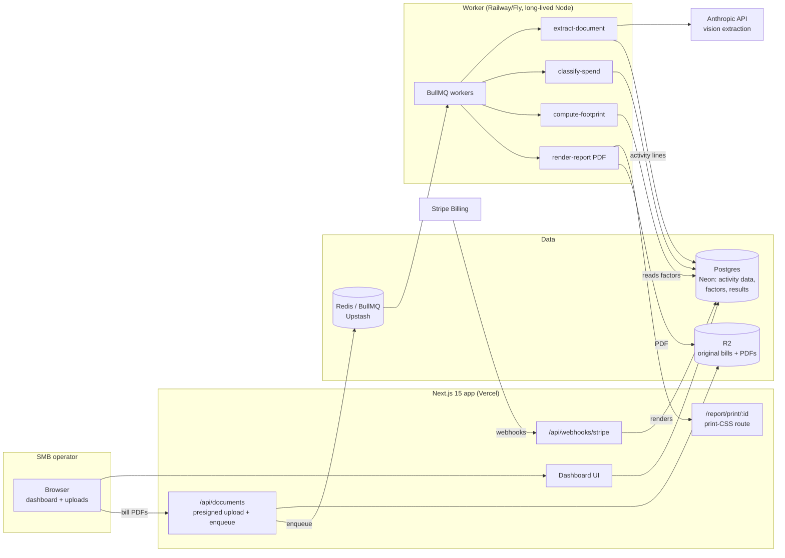

# GreenTally Architecture

## Stack & Rationale

| Layer | Choice | Why |
|---|---|---|
| Web app + API | **Next.js 15 (App Router) + TypeScript** | One deployable for marketing pages, the dashboard, upload endpoints, and Stripe webhooks. Server components suit the report-heavy, read-mostly UI. |
| Database | **Postgres (Neon) + Drizzle ORM** | The domain is relational and audit-shaped (orgs -> sites -> documents -> activity lines -> emission results). Drizzle gives typed schema-as-code; Neon branches make preview envs cheap. |
| Queue | **BullMQ on Redis (Upstash)** | Bill extraction and PDF rendering are slow, retryable background jobs; BullMQ gives delayed jobs, retries with backoff, and a dead-letter queue for failed parses. |
| Worker | **Standalone Node process (`src/worker`)** | Extraction and report rendering must not fight serverless timeouts. Long-lived process on Railway/Fly, same repo, shares `src/db` and `src/lib`. |
| Document extraction | **Anthropic Claude (vision) + heuristics** | Utility bills are wildly inconsistent; an LLM with a strict output schema + per-field confidence beats template OCR across thousands of utility formats. Deterministic validators (unit ranges, date continuity) guard the output. |
| File storage | **S3-compatible (Cloudflare R2)** | Original bills are the audit trail; store immutably, serve via signed URLs. R2 has no egress fees. |
| Emissions data | **Bundled public factor sets (EPA GHG factors, eGRID, DEFRA, US EEIO)** | Shipped as versioned seed data in Postgres with name/vintage/region on every factor. No runtime dependency on third-party factor APIs. |
| PDF generation | **Playwright (headless Chromium) rendering a print-CSS report route** | The PDF must match the designed report exactly; rendering the real HTML beats fighting a PDF layout library. Runs in the worker. |
| Payments | **Stripe Billing** | Three flat plans + annual. Checkout + customer portal; no metered complexity in v1. |
| Auth | **Auth.js (NextAuth v5)** | Email magic-link + Google OAuth; org-scoped sessions. |
| Styling | **Tailwind CSS v4** | Dashboard-speed UI development; print styles for the report route. |

## System Diagram

## Data Model

All tables keyed by `id` (uuid), `created_at` / `updated_at` implied. Multi-tenancy: everything hangs off `organization_id`.

- **organizations** — tenant root. `name`, `plan` (starter|standard|supplier_plus), `stripe_customer_id`, `industry_code` (NAICS), `revenue_band`, `fte_count`, `settings` (jsonb: branding, default reporting year).
- **users** — `organization_id`, `email`, `name`, `role` (owner|member). Auth.js tables alongside.
- **sites** — physical locations. `organization_id`, `name`, `address`, `country`, `grid_region` (for eGRID/residual-mix factor selection), `floor_area_sqm`.
- **reporting_periods** — one per reporting year. `organization_id`, `year`, `status` (collecting|review|complete), `locked_at` (freezing a period preserves the audit trail).
- **documents** — uploaded source files. `organization_id`, `site_id`, `period_id`, `storage_key`, `kind` (electricity_bill|gas_bill|fuel_receipt|spend_csv|other), `status` (uploaded|extracting|needs_review|accepted|rejected), `extraction_confidence`, `error`.
- **activity_lines** — normalized activity data, the atomic input. `document_id`, `site_id`, `period_id`, `category` (electricity_kwh|natural_gas_kwh|diesel_l|petrol_l|...), `quantity`, `unit`, `service_start`, `service_end`, `field_confidences` (jsonb), `reviewed_by` (nullable — human sign-off on low-confidence fields).
- **spend_lines** — from the GL CSV. `document_id`, `period_id`, `description`, `amount_cents`, `currency`, `gl_account`, `eeio_category` (nullable until classified), `classification_source` (auto|user), `excluded` (bool, e.g. intra-company transfers).
- **emission_factors** — versioned seed data. `factor_set` (epa_2025|egrid_2024|defra_2025|useeio_v2), `category`, `region`, `unit`, `kgco2e_per_unit`, `vintage`, `citation`.
- **emission_results** — computed, never hand-edited. `period_id`, `site_id` (nullable for org-level), `scope` (1|2_location|2_market|3_spend), `category`, `kgco2e`, `factor_id`, `activity_line_id` / `spend_line_id` (provenance), `computed_at`, `engine_version`.
- **reports** — generated artifacts. `period_id`, `kind` (csrd_lite|summary), `storage_key`, `totals_snapshot` (jsonb), `rendered_at`.
- **questionnaire_answers** — the answer bank. `organization_id`, `period_id`, `framework` (cdp_style|ecovadis_style|custom), `question_key`, `question_text`, `answer_text`, `source_refs` (jsonb: result/report anchors), `status` (draft|ready).
- **audit_log** — `organization_id`, `actor` (system|user_id), `action`, `target`, `metadata` (jsonb). Every accepted extraction, factor choice, and report render lands here.

## Key Flows

### 1. Bill upload -> extraction -> review

1. Browser requests a presigned R2 upload; on completion, `/api/documents` creates the `documents` row (`uploaded`) and enqueues `extract-document`.
2. Worker fetches the file, sends page images to Claude with a strict JSON schema (provider, service address, period start/end, quantities + units, per-field confidence), retries once on schema violations.
3. Deterministic validators run: unit sanity (kWh within plausible bands for the site), period continuity against existing lines, duplicate detection (same provider + period).
4. Confidence >= threshold on all fields: `activity_lines` inserted, document `accepted`. Any field below threshold: document `needs_review`; the review screen shows the bill image beside editable extracted fields — accepting writes `reviewed_by`.
5. Every acceptance triggers an incremental `compute-footprint` job and updates the coverage meter (months x sources with data).

### 2. Spend CSV -> Scope 3 screen

1. User uploads a GL/spend export; a mapping step assigns columns (description, amount, account) with saved mappings per org.
2. `classify-spend` job batches lines to the LLM for EEIO category suggestions; obvious matches (payroll, taxes, intra-company) are auto-excluded with reasons.
3. User confirms or edits categories in a review table (bulk actions by GL account); confirmations set `classification_source = user`.
4. Engine multiplies categorized spend by EEIO kgCO2e/$ factors -> `emission_results` rows with `scope = 3_spend`, clearly labeled a screening estimate.

### 3. Footprint computation (deterministic, replayable)

1. `compute-footprint` deletes and recomputes `emission_results` for the affected period/site — results are a pure function of (activity_lines, spend_lines, factor set, engine_version).
2. Scope 1: fuel quantities x combustion factors. Scope 2: electricity kWh x grid factor (location-based: eGRID/national grid; market-based: residual mix or contract instruments if provided). Scope 3: flow 2.
3. Each result row stores its factor id and source line id — the provenance chain the UI's audit-trail thread renders.
4. Totals, intensity metrics (per revenue, per FTE), and coverage are materialized into the period snapshot for fast dashboard reads.

### 4. Report + questionnaire answers

1. User locks the period (or renders a draft). `render-report` loads the print-CSS route in headless Chromium and writes the PDF to R2.
2. The report includes methodology notes, factor citations with vintages, scope tables (both Scope 2 methods), intensity metrics, and an explicit "screening estimate, not assured" statement for Scope 3.
3. The answer bank maps period results onto common CDP/EcoVadis-style questions via templates (figures interpolated, methodology text pre-written, boundaries stated); users edit tone, never the numbers.
4. Each answer carries `source_refs` so the "where did this number come from" question is one click, matching the in-app provenance thread.

## Third-Party Services & Rough Pricing

| Service | Role | Rough cost |
|---|---|---|
| Vercel | Next.js hosting | Hobby free -> Pro $20/mo/seat |
| Neon (Postgres) | Primary DB | Free tier -> ~$19/mo (Launch) |
| Upstash (Redis) | BullMQ backend | Free tier -> ~$10-20/mo |
| Railway / Fly.io | Worker (incl. headless Chromium) | ~$10-25/mo |
| Cloudflare R2 | Bill + PDF storage | ~$0.015/GB-mo, no egress; effectively ~$1-10/mo |
| Anthropic API | Bill extraction + spend classification | ~$0.01-0.04 per bill page; ~$0.50-2.00 per onboarding org (12 months of bills + one CSV) |
| Stripe | Billing | 2.9% + 30c |
| Resend | Transactional email (review nudges, renewal-season lifecycle) | Free 3k/mo -> $20/mo |
| Sentry | Errors | Free tier -> ~$26/mo |

## Estimated Monthly Running Cost

| Scale | Assumptions | Estimate |
|---|---|---|
| **0 customers (dev/preview)** | Free tiers + one $10 worker | **~$10-15/mo** |
| **100 customers** | ~$17k MRR. ~150 new-doc extractions/day, Neon Launch, Vercel Pro, worker $15, inference ~$60 | **~$160-190/mo** (~1% of revenue) |
| **1,000 customers** | ~$170k MRR. Heavier extraction + render volume, redundant workers, Neon scale | **~$900-1,200/mo** (<1% of revenue) |

Inference is the only cost that scales with usage, and it is front-loaded at onboarding (a year of bills at once); steady-state customers add one bill per source per month. Margins stay >90% on infrastructure throughout.
