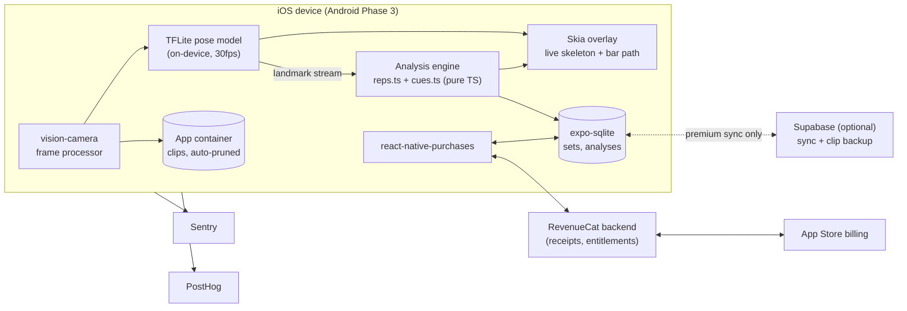

# FormCoach Architecture

## Stack and Rationale

| Layer | Choice | Why |
|---|---|---|
| App framework | Expo SDK ~52 (React Native 0.76) + TypeScript | One codebase for iOS-first launch and Phase 3 Android; EAS builds without a Mac fleet. **Camera + ML native modules force an EAS development build from day one — nothing in this app runs in Expo Go.** |
| Navigation | expo-router ~4 | File-based routing; record -> review -> log is a simple typed stack + tabs |
| Camera | react-native-vision-camera | The only RN camera with frame-processor hooks fast enough for 30fps inference; controls exposure/fps for consistent tracking in bad gym light |
| Pose estimation | On-device model (MoveNet Thunder / BlazePose-class) via react-native-fast-tflite + vision-camera frame processors | **Local inference is the product decision:** zero latency, zero inference COGS, no video upload, no privacy disclosure. Model runs per-frame on the camera thread; JS only sees landmark streams |
| Overlay rendering | @shopify/react-native-skia | Skeleton overlay live, bar-path trace on the review clip, and the exported shareable — GPU-drawn, 60fps |
| Analysis engine | Pure TypeScript (`src/lib/reps.ts`, `src/lib/cues.ts`) | Rep segmentation and cue heuristics are deterministic geometry over landmark time-series — unit-testable pure code, no ML training pipeline in v1 |
| Local data | expo-sqlite | **Local-first: sets, landmarks summaries, and analyses live on device.** A form check must work in a concrete basement gym with no signal |
| Video files | expo-file-system (app container) | Clips stay local; auto-pruned by retention policy (free: 30 days). Export copies to Photos on demand |
| Payments | RevenueCat (react-native-purchases ^8) | Receipts, entitlements, offering experiments, and churn analytics without a subscription backend |
| Sync backend (optional) | Supabase (Postgres + Auth + Storage) | Only for multi-device history sync and opt-in clip backup (premium). Stubbed behind `src/lib/sync.ts`; the app ships and functions without it |
| State | zustand | Thin in-memory mirror over SQLite for UI reactivity |
| Observability | Sentry + PostHog | Crashes and funnel/retention analytics; free tiers |

Key stance: **the camera pipeline is the app.** Everything else (log, charts, paywall) is conventional mobile CRUD around a frame-processor pipeline that must hold 30fps on an iPhone 12-class device.

## System Diagram

## Data Model

### Local (expo-sqlite, source of truth)

| Table | Purpose | Key columns |
|---|---|---|
| `lifts` | The supported lift definitions | `id` (squat / deadlift / bench), `display_name`, `camera_setup` (side / incline), `cue_pack_version` |
| `sets` | One row per recorded set | `id`, `lift_id`, `load_kg`, `rep_target`, `rpe?`, `recorded_at`, `clip_path?`, `clip_expires_at`, `analysis_id?`, `session_id` |
| `analyses` | One row per analyzed set | `id`, `set_id`, `model_version`, `engine_version`, `rep_count`, `framing_grade` (good / marginal / rejected), `confidence`, `summary_json` (per-set verdicts), `created_at` |
| `reps` | Per-rep metrics | `id`, `analysis_id`, `index`, `metrics_json` (depth delta, bar drift px->cm, torso angle, tempo), `cues_json` (ranked cue ids + severity + phrasing) |
| `flags` | Cross-session risk patterns | `id`, `lift_id`, `kind` (lumbar_trend / shift_trend / depth_load_correlation), `window_start`, `window_end`, `evidence_json`, `status` (active / dismissed) |
| `sessions` | Groups sets into workouts | `id`, `started_at`, `ended_at`, `notes` |
| `settings` | Key/value | `key`, `value` (units, retention, coaching-tone, onboarding state) |

Landmark time-series are **not** stored raw (they're huge); `analyses.summary_json` and `reps.metrics_json` keep derived metrics plus a downsampled bar-path polyline for redraws. Raw landmarks live only in memory during analysis.

### Synced (Supabase, premium multi-device only)

| Table | Purpose |
|---|---|
| `profiles` | Auth identity, subscription mirror |
| `synced_sets` / `synced_analyses` | Device-pushed projections of the local tables (metrics only) |
| `clip_backups` | Opt-in encrypted clip storage pointers (Supabase Storage) |

Privacy stance: video never leaves the device unless the user explicitly enables clip backup or taps share/export. Sync pushes derived numbers, not footage.

## Key Flows

### 1. Record -> analyze -> cues (the core loop)

1. User picks lift + load; the framing coach overlays a target silhouette and grades the live camera angle (side-on for squat/deadlift), refusing to arm until framing is `good` or user overrides to `marginal`.
2. Recording auto-starts on first bar displacement past threshold, auto-stops after N seconds of stillness; clip written to the app container.
3. Frame processor streams landmarks at 30fps into a ring buffer; on stop, `reps.ts` segments the time-series into reps via hip/bar vertical trajectory (min-prominence peak detection, tempo sanity checks).
4. `cues.ts` runs per-lift geometry per rep: squat depth (hip-crease vs knee with camera-angle tolerance), bar path vs mid-foot vertical, torso-angle collapse, deadlift bar drift + hips-rise-early, bench touch consistency + J-curve. Each fault maps to a cue with severity and plain-language phrasing.
5. `analyses` + `reps` rows are written; the review screen renders rep cards + the Skia bar-path overlay scrubbing the clip. Total time from rack to cues: under 10 seconds.
6. If `framing_grade` ends `rejected` (occlusion mid-set), the app says exactly why and how to re-prop the phone — **no cues are emitted from bad data.**

### 2. Free-tier gate + paywall (RevenueCat)

1. Launch: `Purchases.configure`; `getCustomerInfo()` cached in zustand and mirrored to `settings` so offline launches keep the last known entitlement.
2. Gated moments — 4th analyzed set of the week, first non-squat lift, first fault-trend weekly review — call `isPremium()`; if false, the paywall presents the current Offering (annual w/ trial hero, monthly fallback).
3. `purchasePackage()` -> receipt validation server-side by RevenueCat -> entitlement check on `customerInfo.entitlements.active['premium']`. Restore purchases re-runs the same check.
4. Free-tier counters (sets/week, 30-day retention pruning) computed from SQLite, never from the network.

### 3. Injury-risk flag lifecycle

1. After each analysis, a background pass recomputes trend windows per lift: e.g. lumbar-flexion proxy severity regressed against session date and load percentage.
2. Crossing a conservative threshold creates a `flags` row; the flag surfaces in the weekly review — never mid-workout, never as a scare interstitial.
3. Copy is fixed-template, reviewed language: pattern, evidence ("visible in 6 of your last 8 heavy sets"), suggested standard fix, and a "talk to a professional" pathway. Dismissal is respected; re-flag only on new evidence.

### 4. The shareable overlay export

1. From review, Share renders clip + Skia bar-path trace + rep verdicts into an exported video (watermarked on free) via the Skia offscreen surface.
2. Export copies to Photos / share sheet; nothing uploads through our infra.
3. PostHog logs share events — the overlay is the acquisition loop, so its funnel is first-class.

## Third-Party Services and Pricing

| Service | Role | Rough pricing |
|---|---|---|
| RevenueCat | Subscriptions, entitlements, offerings | Free to $2.5k MTR, then ~1% of tracked revenue |
| Apple Developer Program | iOS distribution | $99/yr + 15% commission (Small Business Program) |
| Expo EAS | Builds, submit, OTA updates | Free tier to start; $99/mo Production when build cadence demands |
| Supabase | Optional premium sync + clip backup | Free tier; $25/mo Pro when sync ships; storage ~$0.021/GB |
| Sentry | Crashes | Free tier; ~$26/mo Team at volume |
| PostHog | Analytics | Free tier (1M events/mo) |
| Domain + landing | formcoach.app + static site | ~$15/yr; static hosting free |

No inference costs, ever: the pose model is bundled with the binary.

## Estimated Monthly Running Cost

| Item | 0 customers | 100 customers | 1,000 customers |
|---|---|---|---|
| Apple Developer ($99/yr amortized) | $8.25 | $8.25 | $8.25 |
| Expo EAS | $0 | $0-99 | $99 |
| RevenueCat | $0 | $0 (under $2.5k MTR) | ~$90 (1% of ~$9k MTR) |
| Supabase | $0 | $0 | $25 + storage |
| Sentry / PostHog | $0 | $0 | ~$26 |
| Domain / misc | $1.25 | $1.25 | $1.25 |
| **Total infra / month** | **~$10** | **~$10-110** | **~$250** |

At 1,000 subscribers (~$9k MRR blended), infra is ~3% of revenue; store commission (~15%) is the real margin line. On-device inference is what keeps the middle column flat — analysis volume adds zero marginal cost.
