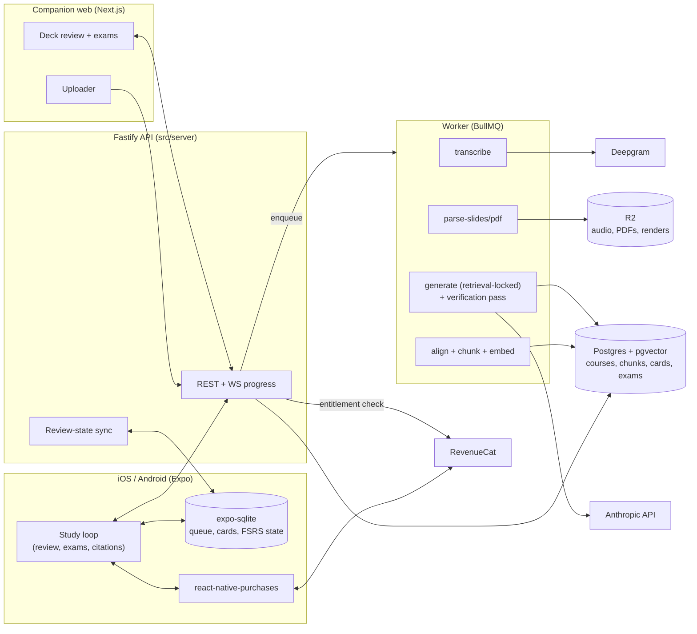

# StudyReel Architecture

## Stack and Rationale

| Layer | Choice | Why |
|---|---|---|
| Mobile app | Expo SDK ~52 (React Native 0.76) + TypeScript + expo-router | The daily study loop is mobile; one codebase for iOS-first launch and Android fast-follow; EAS builds and OTA updates |
| Local data | expo-sqlite | **The review loop is local-first:** today's queue, cards, and FSRS state live on device so a subway review session needs zero network. Server sync reconciles on connect |
| Payments | RevenueCat (react-native-purchases ^8) | Entitlements shared across mobile + web (account-linked app user id); offering experiments; no subscription backend to build |
| Backend API | **Node Fastify 5 (`src/server/`)** | The ingestion/grounding pipeline is real server work (transcription orchestration, embedding, retrieval-locked generation). Fastify: fast, typed (zod), WebSocket-friendly for ingest progress |
| Jobs | BullMQ on Redis (Upstash) | Ingestion is long-running and retryable (transcribe -> parse -> align -> embed); progress events stream to clients |
| Database | Postgres (Neon) + pgvector + Drizzle | Courses, sources, chunks, cards, exams — relational; pgvector keeps retrieval in the same database (no separate vector store to operate) |
| Transcription | Deepgram (diarization + timestamps) | Accurate word-level timestamps are load-bearing: citations point at transcript spans with audio scrub |
| Generation | Anthropic Claude (retrieval-locked prompts) | Notes, cards, and exam items generated ONLY from retrieved chunks, with a verification pass (answer must be entailed by the cited passage or the item is discarded) |
| File storage | Cloudflare R2 | Audio, PDFs, slide renders; signed URLs; no egress fees |
| Companion web | **Next.js 15 (`web/`)** | Upload from laptop, big-screen deck review and practice exams. Reads the same Fastify API; auth shared via session tokens |
| Auth | Email magic-link + Apple/Google sign-in (jose-signed sessions on the API) | Students live on phones; .edu verification for the Student Annual SKU happens in this flow |
| Observability | Sentry + PostHog | Crashes, ingest-funnel analytics, review-retention cohorts |

Key stance: **grounding is enforced in the pipeline, not requested in the prompt.** Every generated item stores the chunk ids it was built from; an item without resolvable citations cannot be written to the database (DB constraint, not convention).

## System Diagram

## Data Model

### Server (Postgres + pgvector, source of truth for content)

| Table | Purpose | Key columns |
|---|---|---|
| `users` | Identity | `id`, `email`, `edu_verified_at?`, `rc_app_user_id`, `created_at` |
| `courses` | Workspace per course/exam | `id`, `user_id`, `name`, `kind` (course / professional_exam), `exam_date?`, `archived_at` |
| `sources` | Uploaded material | `id`, `course_id`, `kind` (audio / pdf / slides), `storage_key`, `title`, `status` (uploaded / processing / ready / failed), `duration_s?`, `page_count?`, `confidence` |
| `chunks` | Citable retrieval units | `id`, `source_id`, `ordinal`, `text`, `embedding` (vector), `anchor` (jsonb: timestamps or page + bbox), `topic_id?` |
| `topics` | The course outline / coverage map | `id`, `course_id`, `title`, `ordinal`, `coverage` (rich / thin / absent) |
| `notes` | Structured note bullets | `id`, `source_id`, `topic_id`, `ordinal`, `text`, `citation_chunk_ids` (int[], NOT NULL, non-empty) |
| `cards` | Deck items | `id`, `course_id`, `topic_id`, `kind` (cloze / qa), `front`, `back`, `citation_chunk_ids` (NOT NULL, non-empty), `status` (proposed / approved / suspended), `created_at` |
| `exams` / `exam_items` | Practice exams | exam: `course_id`, `config` (jsonb), `taken_at?`, `score?`; item: `kind` (mcq / short), `prompt`, `options?`, `answer`, `rubric?`, `citation_chunk_ids` (NOT NULL), `response?`, `correct?` |
| `review_events` | Sync-merged review log | `card_id`, `user_id`, `reviewed_at`, `grade` (again/hard/good/easy), `device_id` |
| `reports` | User-flagged items | `item_ref`, `reason`, `status` (open / fixed / dismissed) |

**The grounding constraint:** `notes`, `cards`, and `exam_items` all carry `citation_chunk_ids NOT NULL CHECK (cardinality(...) > 0)` — ungrounded content is unrepresentable, not just discouraged.

### Local (expo-sqlite, source of truth for scheduling)

| Table | Purpose |
|---|---|
| `local_cards` | Synced card mirror (front/back/citation preview) for offline review |
| `fsrs_state` | Per-card FSRS parameters (stability, difficulty, due date) — computed on device |
| `pending_reviews` | Offline review events awaiting sync |
| `settings` | Day-start hour, notification prefs, streak state, onboarding |

Review-state sync is last-write-wins per review event (append-only log merged server-side); FSRS state deterministically recomputes from the merged log, so devices can't diverge silently.

## Key Flows

### 1. Ingest a lecture (audio + slides)

1. Upload via app or web to presigned R2 URLs; `sources` rows created (`uploaded`), jobs enqueued; progress streams over WebSocket.
2. `transcribe`: Deepgram with diarization + word timestamps; low-confidence spans marked on the source.
3. `parse-slides/pdf`: text + layout extraction, per-page renders stored for citation display.
4. `align + chunk + embed`: transcript segments aligned to slide pages by time + lexical overlap; chunks (~200-400 tokens, anchor-bearing) embedded into pgvector; topics updated on the course outline with coverage grades.
5. `generate`: notes per topic, then proposed cards — for each candidate item, retrieve top chunks, generate strictly from them, then run the **verification pass**: a second model call checks the answer is entailed by the cited chunks; failures are discarded, never repaired into vagueness.
6. User reviews proposed cards (approve/edit/reject) — approved cards sync to the device and enter the FSRS queue.

### 2. Daily review (offline-capable)

1. App computes today's queue from local `fsrs_state`; review works with zero network.
2. Swipe grading writes `pending_reviews`; FSRS updates locally; streak advances only on completed reviews (honest streak).
3. On connectivity, pending events sync; server merges the log; other devices (web) recompute the same schedule.
4. The citation tap: card flips to its source passage — transcript span with audio scrub (fetches the audio range via signed URL) or the highlighted PDF region (pre-rendered). Cached after first view for offline recall.

### 3. Practice exam with cited answer key

1. User configures scope (topics, length, format mix); server checks the coverage map and **excludes thin/absent topics visibly** ("2 topics lack enough material — not included").
2. Items generated retrieval-locked as in flow 1 (MCQ distractors must also be non-entailed by the cited passage — checked, not hoped).
3. Timed run on phone or web; MCQ auto-graded; short answers self-graded against rubric hints.
4. Every answer-key entry shows its citation; disputes resolve by tapping through to the passage. Results update per-topic readiness.

### 4. Entitlement across mobile + web (RevenueCat)

1. Mobile: `Purchases.configure` with the account-linked app user id; purchase/restore standard; `premium` entitlement cached for offline.
2. Web + API: the Fastify API verifies entitlements server-side via the RevenueCat REST API (cached with short TTL) before ingest-heavy endpoints; the web app never sees store receipts.
3. .edu verification (magic link to a .edu address) flags the user for the Student Annual offering; RevenueCat targeting serves the SKU.
4. Free-tier caps (courses, ingests/mo, deck size) enforced server-side where the cost is (ingest) and locally where the UX is (deck cap messaging).

## Third-Party Services and Pricing

| Service | Role | Rough pricing |
|---|---|---|
| RevenueCat | Subscriptions + cross-platform entitlements | Free to $2.5k MTR, then ~1% of tracked revenue |
| Apple / Google | Store distribution | $99/yr + 15%; $25 one-time + 15% |
| Expo EAS | Builds, submit, OTA | Free tier -> $99/mo Production |
| Neon (Postgres + pgvector) | Content DB + retrieval | Free tier -> ~$19-69/mo |
| Upstash (Redis) | BullMQ | Free tier -> ~$10-20/mo |
| Railway / Fly.io | API + worker processes | ~$10-30/mo |
| Cloudflare R2 | Audio/PDF storage | ~$0.015/GB-mo, no egress; audio-heavy: budget $5-40/mo |
| Deepgram | Transcription | ~$0.25-0.45/audio-hour (Nova-class, prerecorded) |
| Anthropic API | Generation + verification | ~$0.30-1.50 per lecture ingested; cents per exam |
| Vercel | Companion web | Free -> $20/mo |
| Sentry + PostHog | Observability | Free tiers -> ~$26/mo |

## Estimated Monthly Running Cost

| Item | 0 customers | 100 customers | 1,000 customers |
|---|---|---|---|
| Fixed infra (Neon, Upstash, Railway, Vercel, stores amortized) | ~$12 | ~$60 | ~$250 |
| Deepgram (avg 4 audio-hrs/paying user/mo) | $0 | ~$140 | ~$1,400 |
| Anthropic (ingest + exams) | $0 | ~$80 | ~$700 |
| RevenueCat | $0 | $0 | ~$70 |
| **Total / month** | **~$12** | **~$280** | **~$2,400** |

At 1,000 paying users (~$7k MRR blended given the $49 student annual), infra is ~30% of revenue at naive pricing — **transcription is the margin lever.** Ingest caps per tier, batch processing, and falling ASR prices take steady-state gross margin to 70-80%; the cost dashboard in Phase 1 exists because this line item decides the business.
