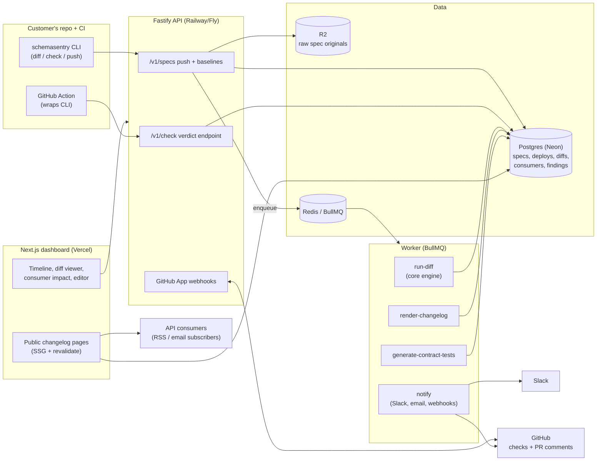

# SchemaSentry Architecture

## Stack & Rationale

| Layer | Choice | Why |
|---|---|---|
| API | **Node Fastify 5 + TypeScript (`src/api`)** | The product's spine: spec ingestion, diff runs, CI check endpoints, Slack/webhook fan-out. Fastify: fast, zod-typed schemas, trivial to self-host later (an enterprise ask in this category). Deviation from the repo's Next.js default is deliberate — the API is consumed by CLI + CI far more than by browsers. |
| Diff engine | **Pure TypeScript library (`src/core`), published OSS (MIT)** | Semantic OpenAPI 3.0/3.1 diff + breaking-change classification as a dependency-light library: unit-testable, runs identically in CLI, CI, and server. Open core is the funnel (see README). |
| CLI | **`src/cli` (commander), shipped as the `schemasentry` npm package** | `diff` works offline with no login; `check`/`push` talk to the API with a token. The CLI is the primary adoption surface. |
| Dashboard | **Next.js 15 (App Router) in the same repo (`src/app`)** | Deploy timeline, diff viewer, consumer impact, changelog editor. Minimal by design; reads the Fastify API. Also serves the public changelog pages (SSG + revalidate). |
| Database | **Postgres (Neon) + Drizzle ORM** | Specs, deploys, diffs, consumers, findings — relational with jsonb for spec payloads and diff trees. Neon branches for preview envs. |
| Queue | **BullMQ on Redis (Upstash)** | Diff runs, alert fan-out, and changelog rendering are retryable background jobs; webhook deliveries need backoff + DLQ. |
| Spec storage | **Postgres jsonb (canonicalized) + R2 for raw originals** | Diffs read canonicalized documents; originals kept immutable for audit/re-parse. |
| Integrations | **GitHub App (check runs + PR comments), Slack app (Block Kit)** | The two surfaces where verdicts land. GitHub App over Action-only so PR comments/check-runs are first-class; a thin published Action wraps the CLI. |
| Auth | **GitHub OAuth (primary) + email magic link; API tokens per org/CI** | Dev-tool convention; CI tokens scoped per API with rotate/revoke. |
| Payments | **Stripe Billing** | Flat tiers by APIs-watched; usage checked at push time, not metered billing. |
| Styling | **Tailwind CSS v4** | Dashboard + changelog pages share the DESIGN.md token set. |

## System Diagram

## Data Model

All tables keyed by `id` (uuid), timestamps implied. Multi-tenancy: everything hangs off `organization_id`.

- **organizations** — tenant root. `name`, `plan` (solo|team|platform), `stripe_customer_id`, `settings` (jsonb: default policy, Slack workspace).
- **users** — `organization_id`, `email`, `github_login?`, `role` (owner|member).
- **api_tokens** — CI credentials. `organization_id`, `api_id?` (scoped or org-wide), `token_hash`, `label`, `last_used_at`, `revoked_at`.
- **apis** — a watched API. `organization_id`, `name`, `slug` (public changelog path), `visibility` (public|unlisted|private), `policy` (jsonb rule overrides), `baseline_deploy_id`.
- **deploys** — one per pushed spec. `api_id`, `version_label` (git sha / tag), `environment` (prod|staging|pr), `spec_canonical` (jsonb), `raw_storage_key`, `spec_health` (jsonb: completeness score, warnings), `pushed_by` (token/user), `pushed_at`.
- **diffs** — one per compared pair. `api_id`, `from_deploy_id`, `to_deploy_id`, `engine_version`, `verdict` (breaking|risky|compatible), `summary` (jsonb counts), `computed_at`.
- **findings** — atomic diff results. `diff_id`, `rule_id`, `level` (breaking|risky|compatible|info), `json_pointer` (exact path), `endpoint`, `method`, `message` (human-readable reason), `acknowledged_by?`, `ack_note?`.
- **consumers** — the registry. `api_id`, `name` ("Acme webhooks", "iOS app"), `contact?`, `declared_usage` (jsonb: endpoints/fields/enum values depended on), `notify` (bool).
- **consumer_impacts** — per-diff blast radius. `diff_id`, `consumer_id`, `impacted` (bool), `details` (jsonb: which findings hit which declared usage).
- **contract_suites** — generated tests. `api_id`, `consumer_id?`, `framework` (vitest|jest), `source_deploy_id`, `content_storage_key`, `generated_at`.
- **changelog_entries** — the public page's rows. `api_id`, `diff_id`, `status` (draft|published), `title`, `body_md` (auto-drafted, human-edited), `breaking` (bool), `published_at`.
- **subscriptions** — changelog followers. `api_id`, `email?`, `rss_token`, `verified_at`.
- **check_runs** — CI verdict log. `api_id`, `diff_id`, `provider` (github|generic), `external_ref` (check-run id), `conclusion`, `pr_number?`.
- **audit_log** — `organization_id`, `actor`, `action`, `target`, `metadata` (jsonb): policy edits, acks, token use, publishes.

## Key Flows

### 1. `push` on deploy -> diff -> alert

1. CI runs `schemasentry push --api payments --version $GIT_SHA spec.yaml` with a token; the API canonicalizes (resolve $refs, sort, normalize), stores the deploy + raw original, and computes `spec_health`.
2. `run-diff` job diffs against the API's baseline (default: previous prod deploy): a semantic walk of operations, parameters, request/response schemas, enums, required/nullable flags, status codes, content types — each divergence matched to a rule -> `findings` with exact JSON-pointer paths.
3. Verdict rolls up (any breaking finding -> breaking) after applying the API's policy overrides (rules can be promoted/demoted per org taste).
4. `consumer_impacts` computed by intersecting findings with each consumer's declared usage.
5. `notify` job: Slack Block Kit message (verdict, top findings, impacted consumers, dashboard link) + configured outbound webhooks; deliveries retried with backoff, dead-lettered after N attempts.
6. A draft `changelog_entries` row is auto-written for any non-compatible diff, awaiting human edit/publish.

### 2. PR check (`check`) — the CI gate

1. The GitHub Action builds the candidate spec and calls `/v1/check` with the PR's spec + target branch's baseline ref.
2. The same engine runs synchronously (seconds); the response carries verdict + findings; the CLI exits non-zero on breaking (configurable to risky).
3. The GitHub App posts a check run + one PR comment (updated in place, never re-spammed): a findings table with pointer paths, reasons, and per-consumer impact.
4. An engineer can `acknowledge` a finding from the PR comment link — recording who/why in `audit_log` and turning the check neutral for that finding on subsequent runs of the same PR. Acks are visible in the deploy timeline forever (intent is recorded, not silenced).

### 3. Contract-test generation

1. From a deploy (or per consumer), `generate-contract-tests` walks the shapes consumers depend on and emits a runnable suite (Vitest/Jest + fetch/supertest style): status codes, required fields present, enum membership, nullability — assertions phrased from the consumer's perspective.
2. Suites are downloadable/committable; regeneration diffs against the customized copy and marks drift rather than overwriting.
3. When a diff lands, impacted suites are flagged stale with the exact assertions that would now fail — the "run this before your consumers do" artifact.

### 4. Public changelog page

1. `/c/{org}/{api-slug}` renders published entries (Next.js SSG + revalidate): breaking changes highlighted, migration notes, per-version anchors.
2. Subscribers get email (Resend) and RSS on publish; entries link back to the underlying diff for the curious.
3. The page footer carries the "Watched by SchemaSentry" mark — the distribution loop.

## Third-Party Services & Rough Pricing

| Service | Role | Rough cost |
|---|---|---|
| Railway / Fly.io | Fastify API + worker | ~$15-30/mo |
| Vercel | Dashboard + changelog pages | Free -> $20/mo |
| Neon (Postgres) | Primary DB | Free tier -> ~$19-69/mo |
| Upstash (Redis) | BullMQ | Free tier -> ~$10-20/mo |
| Cloudflare R2 | Raw spec originals | ~$1-5/mo (specs are small) |
| GitHub App / Slack app | Integrations | Free |
| Stripe | Billing | 2.9% + 30c |
| Resend | Changelog + alert email | Free 3k/mo -> $20/mo |
| Sentry | Errors | Free tier -> ~$26/mo |
| npm | CLI distribution | Free |

No inference, no media, no heavy compute: the engine is JSON tree-walking. This is about as cheap as SaaS COGS gets.

## Estimated Monthly Running Cost

| Scale | Assumptions | Estimate |
|---|---|---|
| **0 customers (dev/preview)** | Free tiers + one $10 API host | **~$10-15/mo** |
| **100 customers** | ~$10k MRR. ~2k deploys/day across orgs, diff jobs in ms, Neon Launch, paid Upstash | **~$90-120/mo** (~1% of revenue) |
| **1,000 customers** | ~$100k MRR. Redundant API/workers, bigger DB, email volume | **~$500-700/mo** (<1% of revenue) |

Gross margin sits at 90%+ throughout — consistent with the dev-tool top of the 70-85% SaaS band. The real costs are integration maintenance (GitHub/Slack API churn) and support, not compute.
