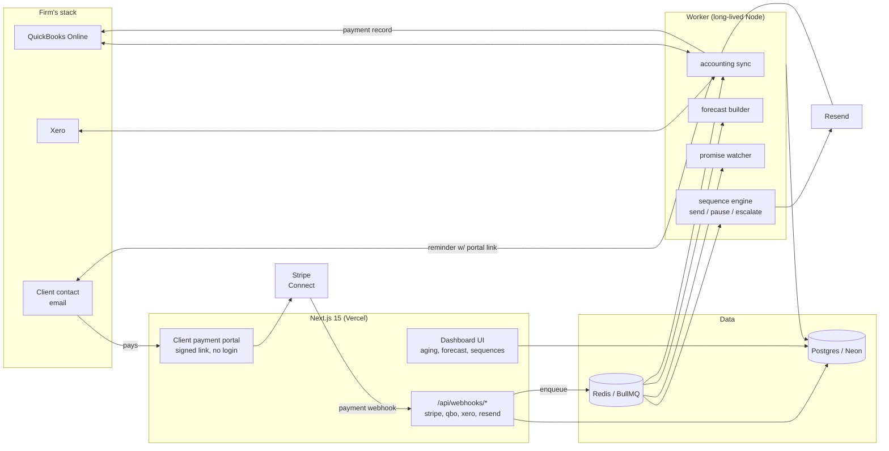

# PaidWell — Architecture

## Stack & Rationale

| Layer | Choice | Why |
|---|---|---|
| Web app + API | **Next.js 15 (App Router) + TypeScript** | One deployable for the dashboard, marketing site, portal pages, and webhook endpoints. The client payment portal is a public route with signed tokens — no second app needed. |
| Database | **Postgres (Neon) + Drizzle ORM** | The domain is fully relational (firms → clients → invoices → sequence runs → promises → payments). Typed schema-as-code; drizzle-kit migrations. |
| Queue | **BullMQ on Redis (Upstash)** | Sequence steps are delayed jobs; nightly sync and forecast rebuilds are repeatables. Escalation timing is the core of the product — a real queue, not cron-in-a-route. |
| Worker | **Standalone Node process (`src/worker`)** | Sends and syncs must survive web deploys and serverless timeouts. Long-lived process on Railway/Fly, same repo, shares `src/db` and `src/lib`. |
| Accounting sync | **QuickBooks Online API + Xero API (OAuth 2)** | Read invoices/contacts/payments, write payment records back. Webhooks where offered, polling as the guarantee. |
| Payments (portal) | **Stripe** (Checkout + ACH/card PaymentIntents, destination = firm's own Stripe account via Connect Standard) | Firms keep their own Stripe relationship; we never touch the money. Also bills PaidWell's own plans. |
| Email | **Resend** | React Email templates; per-firm sending domains with SPF/DKIM — follow-ups must come from the firm, not from us. |
| Auth | **Auth.js (NextAuth v5)** | Magic link + Google; org-scoped sessions. Portal visitors never log in (signed links). |
| Styling | **Tailwind CSS v4** | Token-driven implementation of DESIGN.md. |

## System Diagram

## Data Model

All tables keyed by `id` (uuid); `created_at`/`updated_at` implied. Multi-tenancy hangs off `firm_id`; Practice-tier operators get a `firm_group`.

- **firms** — tenant root. `name`, `plan` (studio|firm|practice), `firm_group_id?`, `stripe_customer_id` (our billing), `stripe_account_id?` (their Connect account for portal payments), `sender_domain`, `sender_status`, `settings` (jsonb: default terms, tone preset, approval_mode, late-fee copy).
- **users** — `firm_id` (or `firm_group_id`), `email`, `name`, `role` (owner|member).
- **accounting_connections** — `firm_id`, `provider` (qbo|xero|csv|stripe_invoicing), `oauth tokens`, `realm/tenant id`, `last_synced_at`, `sync_status`.
- **clients** — the payer companies. `firm_id`, `external_id`, `name`, `emails[]`, `terms_days_override?`, `vip` (bool: never auto-escalate), `avg_days_to_pay`, `reliability_score`, `notes`.
- **invoices** — `firm_id`, `client_id`, `external_id`, `number`, `issued_at`, `due_at`, `amount_cents`, `balance_cents`, `currency`, `status` (open|partial|paid|written_off|disputed), `pdf_url?`, `paid_at?`.
- **sequences** — per-firm ladder templates. `firm_id`, `name`, `tone` (warm|neutral|firm), `steps` (jsonb: [{offset_days_from_due, template_id, escalation_level}]), `active`.
- **sequence_runs** — one per invoice under follow-up. `invoice_id`, `sequence_id`, `state` (scheduled|running|paused_promise|paused_reply|awaiting_approval|completed|stopped), `current_step`, `next_send_at`.
- **messages** — every send. `sequence_run_id`, `step_index`, `to_emails[]`, `subject`, `body_snapshot`, `provider_message_id`, `status` (queued|approved|sent|delivered|bounced|replied), `portal_token`, `sent_at`.
- **promises** — promise-to-pay. `invoice_id`, `client_id`, `promised_at`, `promised_for` (date), `amount_cents`, `source` (reply|portal|manual), `status` (open|kept|broken), `resolved_at`.
- **payments** — `invoice_id`, `amount_cents`, `method` (card|ach|external), `stripe_payment_intent_id?`, `recorded_to_accounting_at?`, `paid_at`.
- **forecast_snapshots** — weekly cash-in projections. `firm_id`, `week_start`, `expected_cents`, `basis` (jsonb: per-invoice expected dates + confidence), `computed_at`.
- **audit_log** — every send, pause, escalation, and write-back. `firm_id`, `actor` (system|user_id), `action`, `target`, `metadata` (jsonb).

## Key Flows

### 1. Connect accounting → aging picture → first sequence

1. OAuth to QuickBooks/Xero; store connection; enqueue full backfill (open + 12 months of history).
2. Backfill computes per-client `avg_days_to_pay` and reliability from historical invoice→payment gaps.
3. Dashboard shows the aging report and the **aging audit** ("$61k outstanding, real DSO 47 days, slowest payer: Meridian Co at 71 days").
4. Firm picks a tone preset, reviews the default ladder (due−3d friendly heads-up → due+3d gentle → due+10d firm → due+21d final with late-fee mention), and enables autopilot or approval mode.
5. Every open invoice past its trigger point gets a `sequence_run`; steps enqueue as BullMQ delayed jobs.

### 2. Sequence step execution

1. Job fires → re-check invoice balance via latest sync (never nag a paid invoice — hard rule, re-verified at send time).
2. Check pause states: open promise, detected reply (via Resend inbound/reply-to processing), VIP flag, disputed status.
3. Approval mode: create `awaiting_approval` message, notify firm, send on one tap. Autopilot: render template (merge fields: names, amounts, days overdue, portal link) and send via the firm's domain.
4. Delivery webhooks update message status; a reply pauses the run and surfaces the thread in the dashboard ("needs a human").

### 3. Client pays through the portal

1. Reminder links to `/portal/[token]` (signed JWT: firm + client + invoice scope, 60-day expiry).
2. Portal shows balance, invoice PDFs, payment history — and a promise widget ("I'll pay on…" logs a `promises` row, pauses the sequence).
3. Pay now → Stripe PaymentIntent (card/ACH) on the firm's connected account; partial payments allowed above a floor.
4. Payment webhook → update invoice balance, complete the run, write the payment back to QuickBooks/Xero, stamp the audit log.

### 4. Promise watcher & escalation

1. Daily job scans `promises` past `promised_for` with an unpaid balance → mark `broken`.
2. Broken promise resumes the sequence at the next escalation level with promise-aware copy ("we'd agreed on Friday the 12th…").
3. Kept promises feed the client's reliability score; both feed the forecast (a promise from a 95%-reliable client is near-cash; from a 40% client it's hope).

## Third-Party Services & Rough Cost

| Service | Role | Rough cost |
|---|---|---|
| Neon (Postgres) | Primary DB | Free tier → ~$19–69/mo |
| Upstash (Redis) | BullMQ | Free tier → ~$10–20/mo |
| Vercel | Next.js hosting | Hobby → Pro $20/mo |
| Railway / Fly.io | Worker | ~$5–20/mo |
| Resend | Email | Free 3k/mo → $20/mo for 50k (volume is low: ~10–40 emails/firm/mo) |
| Stripe | Portal payments (their account) + our billing | Standard fees on our subscriptions; portal fees hit the firm's account |
| QuickBooks / Xero APIs | Sync | Free (rate-limited) |
| Sentry | Errors | Free tier → ~$26/mo |

## Estimated Monthly Running Cost

| Scale | Assumptions | Estimate |
|---|---|---|
| 0 customers (dev) | All free tiers + one $5 worker | **~$5–10/mo** |
| 100 firms (~$13k MRR) | ~4k emails/mo, Neon Launch, Vercel Pro, worker $10 | **~$100–130/mo** (~1% of revenue) |
| 500 firms (~$65k MRR) | ~20k emails/mo, bigger DB, redundant worker | **~$350–500/mo** (<1% of revenue) |

Infrastructure margin stays >90%; the real costs are accounting-API babysitting and deliverability care.
