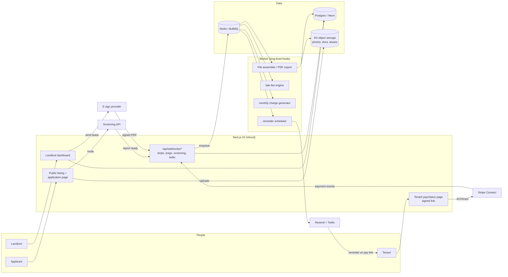

# TenantFile — Architecture

## Stack & Rationale

| Layer | Choice | Why |
|---|---|---|
| Web app + API | **Next.js 15 (App Router) + TypeScript** | One deployable serves the landlord dashboard, public listing/application pages, the tenant pay/status page, and webhook endpoints. |
| Database | **Postgres (Neon) + Drizzle ORM** | Properties → units → tenancies → charges/payments/requests is textbook relational. Typed schema-as-code, drizzle-kit migrations. |
| Queue | **BullMQ on Redis (Upstash)** | Rent reminders and late-fee application are date-driven jobs; monthly charge generation is a repeatable. |
| Worker | **Standalone Node process (`src/worker`)** | Reminder sends and ledger jobs must survive deploys and serverless timeouts. |
| File storage | **S3-compatible (Cloudflare R2)** | Listing photos, applicant documents, lease PDFs, maintenance photos. Presigned uploads straight from the browser; zero egress fees matter for photo threads. |
| Screening | **Third-party screening API (SmartMove-class)** | Credit/criminal/eviction reports, applicant-initiated and applicant-paid, so the provider carries FCRA delivery duties. Behind an adapter interface — second provider later. |
| Lease e-sign | **Embedded e-sign provider (Dropbox Sign-class)** | Embedded signing on both phones; signed PDFs + audit trail land in the File. Also behind an adapter. |
| Payments | **Stripe** (ACH-first for rent via Connect; card for our billing) | ACH fees suit rent amounts; Connect keeps rent in the landlord's account, never ours. |
| Email / SMS | **Resend / Twilio** | Reminders and thread notifications. SMS matters — tenants live in texts. |
| Auth | **Auth.js (NextAuth v5)** | Magic link + Google for landlords. Tenants and applicants use signed links, no accounts required for MVP. |
| Styling | **Tailwind CSS v4** | Token-driven implementation of DESIGN.md. |

## System Diagram

## Data Model

All tables keyed by `id` (uuid); timestamps implied. Tenancy root: `landlord_id` (account = one landlord entity, possibly multiple collaborators).

- **landlords** — tenant root. `name`, `plan` (keys|building|portfolio), `stripe_customer_id` (our billing), `stripe_account_id?` (rent collection), `settings` (jsonb: reminder defaults, branding).
- **users** — `landlord_id`, `email`, `name`, `role` (owner|collaborator).
- **properties** — `landlord_id`, `address`, `state` (drives guardrails), `type` (single|multi).
- **units** — `property_id`, `label`, `beds/baths`, `rent_cents`, `deposit_cents`, `status` (vacant|listed|occupied).
- **listings** — `unit_id`, `slug`, `headline`, `description`, `photo_keys[]`, `requirements` (jsonb), `status` (draft|live|closed), `application_count`.
- **applications** — `listing_id`, `applicant_name/email/phone`, `answers` (jsonb: standard rental app), `document_keys[]`, `status` (new|invited_to_screen|screened|approved|declined), `adverse_action_sent_at?`.
- **screening_reports** — `application_id`, `provider`, `provider_ref`, `status` (invited|in_progress|ready|expired), `summary` (jsonb: scores/flags as returned), `report_url?`, `paid_by_applicant` (bool).
- **tenancies** — the spine of the File. `unit_id`, `tenant_names[]`, `tenant_emails[]`, `tenant_phones[]`, `starts_on`, `ends_on?`, `rent_cents`, `deposit_cents`, `status` (active|ended|evicting), `lease_id?`.
- **leases** — `tenancy_id`, `provider_envelope_id`, `status` (draft|sent|partially_signed|signed|voided), `signed_pdf_key?`, `fields` (jsonb).
- **charges** — ledger debits. `tenancy_id`, `kind` (rent|late_fee|deposit|other), `amount_cents`, `due_on`, `period` (e.g. 2026-08), `status` (upcoming|due|partial|paid|waived).
- **payments** — ledger credits. `charge_id?` (nullable for unapplied), `tenancy_id`, `amount_cents`, `method` (ach|card|manual_zelle|manual_cash|manual_check), `stripe_payment_intent_id?`, `paid_at`.
- **late_fee_rules** — `tenancy_id`, `grace_days`, `kind` (flat|percent), `amount`, `max_per_month_cents?`, `state_cap_ack` (bool).
- **maintenance_requests** — `tenancy_id`, `title`, `status` (open|scheduled|done|closed), `priority`, `cost_cents?`, `opened_by` (tenant|landlord).
- **request_messages** — the photo thread. `request_id`, `author` (tenant|landlord), `body`, `photo_keys[]`, `sent_at`.
- **file_events** — the assembled timeline. `tenancy_id`, `kind` (application|screening|lease|charge|payment|reminder|request|note), `ref_id`, `occurred_at`, `summary`. Append-only; the PDF export reads this.
- **reminders** — `charge_id`, `channel` (email|sms), `send_at`, `template` (upcoming|due|late_1|late_2), `status` (scheduled|sent|canceled), `provider_message_id?`.
- **audit_log** — `landlord_id`, `actor`, `action`, `target`, `metadata` (jsonb).

## Key Flows

### 1. Vacancy → listing → application → screening

1. Landlord creates unit + listing; photos go browser → presigned R2 upload; listing page live at `/apply/[slug]` — the link they paste into Zillow/Craigslist/FB Marketplace.
2. Applicant submits the standard application + document uploads; `applications` row; landlord notified.
3. Landlord clicks "Invite to screen" → adapter calls the screening API, which emails the applicant to verify identity and pay (~$39). Provider webhook flips `screening_reports.status` to `ready`; summary stored, full report viewed via provider link.
4. Approve → seeds a tenancy draft. Decline after screening → guided adverse-action letter (FCRA), logged with timestamp in `file_events`.

### 2. Lease e-sign

1. From the tenancy draft: upload own lease PDF or start from a state template shell; map fields (names, rent, dates, deposit) from tenancy data.
2. Adapter creates the e-sign envelope; tenant and landlord sign embedded, phone-first. Status webhooks update `leases.status`.
3. On `signed`: pull the sealed PDF + audit certificate into R2, activate the tenancy, generate the first charges (prorated first month + deposit), and schedule reminders.

### 3. Rent cycle: charge → remind → pay/late

1. Monthly repeatable job generates next period's rent `charges` rows (skip if manually adjusted).
2. Reminder scheduler enqueues per-charge sends: T-3d "upcoming" (email), due-day (email+SMS), late day grace+1 and grace+7 with firmer copy. Every send re-checks charge status — never remind on a paid charge.
3. Tenant pay page (signed link, no login): balance, history, **Pay by bank** (Stripe ACH on the landlord's connected account) or card (tenant covers the card fee, toggle per landlord); partial payments recorded.
4. Grace expiry with balance due → late-fee engine applies the rule (state-cap warning acknowledged at setup), appends a `late_fee` charge, notifies both sides.
5. Manual payments (Zelle/cash/check) are first-class: "mark paid" with method — the ledger stays true even when money moves outside Stripe.

### 4. Maintenance thread → the File

1. Tenant opens a request from their page: title, description, photos (presigned upload).
2. Thread messages notify the other party (SMS-first for tenants); landlord sets status/schedule/cost.
3. Every event across flows 1–4 appends to `file_events`; **Export the File** renders the tenancy timeline (application → screening → lease → every charge, payment, reminder, request) into a court-ready PDF stored in R2.

## Third-Party Services & Rough Cost

| Service | Role | Rough cost |
|---|---|---|
| Neon (Postgres) | Primary DB | Free → ~$19–69/mo |
| Upstash (Redis) | BullMQ | Free → ~$10–20/mo |
| Vercel | Hosting | Hobby → Pro $20/mo |
| Railway / Fly.io | Worker | ~$5–20/mo |
| Cloudflare R2 | Photos/docs | ~$0.015/GB/mo, zero egress; ~$5–30/mo at scale |
| Screening API | Credit/eviction reports | Applicant-paid retail ~$39; our cost per report is lower — a margin line, not a cost line |
| E-sign provider | Lease signing | ~$0.50–2.00 per envelope via API plan (~$75–100/mo base at volume) |
| Stripe | Rent ACH (their account) + our billing | ACH 0.8% capped $5, paid by landlord or passed on; standard fees on our subscriptions |
| Resend / Twilio | Email / SMS | Free tier → $20/mo; SMS ~$0.008 ea (~2–6 SMS/unit/mo) |
| Sentry | Errors | Free → ~$26/mo |

## Estimated Monthly Running Cost

| Scale | Assumptions | Estimate |
|---|---|---|
| 0 customers (dev) | Free tiers + $5 worker | **~$5–10/mo** |
| 300 landlords (~$9k MRR) | ~1,200 units, ~5k SMS, ~15k emails, R2 ~40GB, e-sign base plan | **~$250–350/mo** (~3% of revenue) |
| 2,000 landlords (~$60k MRR) | ~8,000 units, ~35k SMS, R2 ~300GB, bigger DB + redundant workers | **~$1,200–1,800/mo** (~2–3% of revenue) |

Screening margin (~$10–15/report) at realistic vacancy rates adds 10–20% on top of subscription revenue. Infrastructure margin stays >80% throughout.
