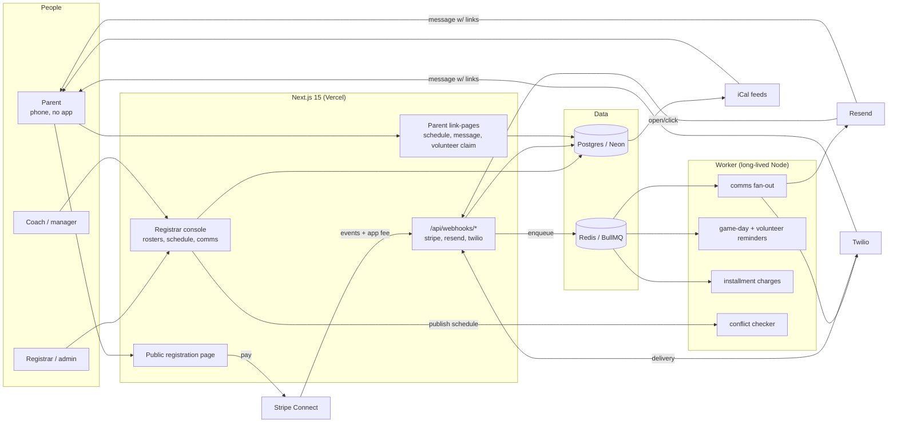

# RosterRally — Architecture

## Stack & Rationale

| Layer | Choice | Why |
|---|---|---|
| Web app + API | **Next.js 15 (App Router) + TypeScript** | One deployable: registrar console, public registration pages, parent link-pages (schedule, volunteer claim), webhook endpoints. |
| Database | **Postgres (Neon) + Drizzle ORM** | Clubs → seasons → divisions → registrations → teams → games → messages is deeply relational; conflict detection is SQL over games/venues/slots. |
| Queue | **BullMQ on Redis (Upstash)** | Announcement fan-out (email/SMS to hundreds of parents), game-day reminders, volunteer nudges, installment charges — all queued/delayed jobs. |
| Worker | **Standalone Node process (`src/worker`)** | Fan-out sends and scheduled reminders must survive deploys and serverless timeouts. |
| Payments | **Stripe Connect (Standard)** | Registration money lands in the club's own Stripe account; our $1.50 rides as an application fee. Installment plans via subscription schedules. Also bills our flat plan. |
| Email / SMS | **Resend / Twilio** | Announcements + reminders. Read receipts: Resend open/click webhooks for email; SMS gets delivery receipts + a tracked "view" link (opens are not observable in SMS — stated honestly in the UI). |
| Calendar | **iCal feeds (`ics`)** | Per-team read-only feeds; parents subscribe once, schedule changes propagate. |
| Auth | **Auth.js (NextAuth v5)** | Magic link + Google for club staff (admin/registrar/coach). Parents act through signed links — no accounts, no app. |
| Styling | **Tailwind CSS v4** | Token-driven implementation of DESIGN.md. |

## System Diagram

## Data Model

All tables keyed by `id` (uuid); timestamps implied. Tenancy root: `club_id`.

- **clubs** — tenant root. `name`, `sport`, `plan` (per_registration|flat), `stripe_account_id` (Connect), `stripe_customer_id?` (flat billing), `settings` (jsonb: fee pass-through, SMS budget, branding).
- **users** — club staff. `club_id`, `email`, `name`, `role` (admin|registrar|treasurer|coach|manager).
- **seasons** — `club_id`, `name` ("Fall 2026"), `registration_opens/closes`, `starts/ends`, `status` (draft|open|closed|archived).
- **divisions** — `season_id`, `name` ("U10 Boys"), `capacity`, `fee_cents`, `early_bird` (jsonb), `waitlist_enabled`.
- **households** — the parent side. `club_id`, `emails[]`, `phones[]`, `sms_consent` (bool, captured at registration), `signed_link_key`.
- **players** — `household_id`, `first/last`, `birthdate`, `medical_notes` (encrypted at rest), `emergency_contacts` (jsonb).
- **registrations** — the money spine. `division_id`, `player_id`, `household_id`, `status` (pending|paid|installments|waitlisted|refunded|canceled), `amount_cents`, `discounts` (jsonb: sibling, scholarship code), `stripe_payment_intent_id?`, `waiver_ack_at`, `answers` (jsonb).
- **payment_schedules** — installments. `registration_id`, `deposit_cents`, `installments` (jsonb), `stripe_subscription_schedule_id`, `status`.
- **teams** — `division_id`, `name`, `coach_user_ids[]`, `roster_locked_at?`.
- **roster_spots** — `team_id`, `player_id`, `jersey_number?`; unique (team, player) and one team per player per division.
- **venues** — `club_id`, `name`, `fields` (jsonb: subfield labels).
- **games** — schedule rows. `season_id`, `division_id`, `home_team_id`, `away_team_id?` (practices have one team), `venue_id`, `field`, `starts_at`, `ends_at`, `kind` (game|practice|event), `published_at?`.
- **conflicts** — checker output. `season_id`, `severity` (hard|soft), `kind` (field_overlap|team_double_booked|coach_overlap|sibling_overlap), `game_ids[]`, `resolved_at?`.
- **announcements** — `club_id`, `audience` (jsonb: club|division|team ids), `subject`, `body`, `channels` (email|sms|both), `sent_at`, `sent_by`.
- **deliveries** — read receipts. `announcement_id` (or `reminder ref`), `household_id`, `channel`, `provider_message_id`, `status` (queued|sent|delivered|opened|clicked|bounced|failed), `opened_at?`.
- **volunteer_slots** — `game_id?` or `event ref`, `role` ("snack bar"), `capacity`, `claims` via volunteer_claims.
- **volunteer_claims** — `slot_id`, `household_id`, `claimed_at`, `reminded_at?`, `no_show?`.
- **audit_log** — `club_id`, `actor`, `action`, `target`, `metadata` (jsonb).

## Key Flows

### 1. Season setup → registration → money in the club's account

1. Registrar creates season, divisions, fees, discounts, waiver text, and custom questions; publishes the registration page at `/register/[season]`.
2. Parent (phone) registers one or more children: household + players created/matched, waiver e-acknowledged (timestamped), SMS consent captured explicitly.
3. Stripe Checkout on the club's connected account; our $1.50/registration rides as an application fee (skipped for scholarship codes and on flat-plan clubs). Installments create a subscription schedule.
4. Webhook confirms payment → registration `paid`, capacity decremented, waitlist logic if full; household gets the signed link that is their portal forever.
5. Registrar console shows live counts, payment states, waitlists; refunds/credits are self-serve and audit-logged.

### 2. Rosters → schedule → conflict gate → publish

1. Roster builder: drag paid registrations onto teams; guardrails (one team per player per division, capacity, roster lock).
2. Schedule builder: venues/fields + time grid; games and practices placed manually or CSV-imported.
3. **The conflict gate:** publish runs the checker — hard conflicts (same field/time overlap, team double-booked) block publish; soft conflicts (coach on two teams overlapping, sibling households overlapping across divisions) are listed for explicit override. Checker is pure SQL + interval logic in `src/lib/conflicts.ts`, re-run on any edit.
4. Publish fans out the announcement, updates iCal feeds, and schedules game-day reminders (T-24h email, T-3h SMS where consented).

### 3. Announcement with read receipts

1. Registrar/coach composes to an audience (club/division/team); preview shows recipient count and channel mix.
2. Worker fans out: email via Resend (per-recipient), SMS via Twilio for consented households; every send is a `deliveries` row.
3. Provider webhooks update status: delivered/opened/clicked (email), delivered + tracked-link view (SMS — labeled "viewed link," never faked as an open).
4. Console shows the receipt grid: who saw it, who didn't; one-tap re-send to unreached households only.

### 4. Volunteer slots

1. Slots attach to games/events with role + capacity; announcement includes claim links.
2. Parent claims from their link-page (no login); slot decrements; confirmation + T-24h reminder.
3. Unclaimed-slot nudges go only to households without a claim this season (fairness rotation is a Phase 3 feature, honestly deferred).

## Third-Party Services & Rough Cost

| Service | Role | Rough cost |
|---|---|---|
| Neon (Postgres) | Primary DB | Free → ~$19–69/mo |
| Upstash (Redis) | BullMQ | Free → ~$10–20/mo |
| Vercel | Hosting | Hobby → Pro $20/mo |
| Railway / Fly.io | Worker | ~$5–20/mo |
| Stripe | Registration payments (club's account) + app fees + flat billing | App fee revenue net of nothing extra; standard fees on flat plans |
| Resend | Email | Free 3k → $20/mo for 50k → $90/mo for 200k (announcement fan-out is the volume driver) |
| Twilio | SMS | ~$0.0079/SMS + number + 10DLC fees; the real variable cost (~1–3 SMS/household/week in season) |
| Sentry | Errors | Free → ~$26/mo |

## Estimated Monthly Running Cost

| Scale | Assumptions | Estimate |
|---|---|---|
| 0 clubs (dev) | Free tiers + $5 worker | **~$5–10/mo** |
| 50 clubs (~7,500 registrations/yr ≈ $950/mo blended revenue + flat plans) | ~60k emails/mo in season, ~15k SMS/mo | Neon $19 + Upstash $15 + Vercel $20 + worker $10 + Resend $20 + Twilio ~$140 + Sentry $26 = **~$250/mo** |
| 300 clubs (~$6–8k/mo blended) | ~350k emails/mo, ~90k SMS/mo in season | Infra ~$300 + Resend ~$150 + Twilio ~$800 = **~$1,200–1,500/mo** (~18–20% of revenue in peak SMS months — watch the SMS budget knobs) |

SMS is the one cost line that scales with success; per-club SMS budgets and email-first defaults keep blended margins above 75% even in season.
