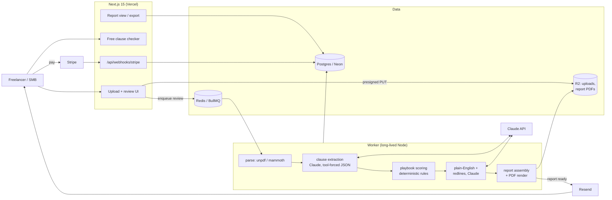

# ClauseCompass — Architecture

## Stack & Rationale

| Layer | Choice | Why |
|---|---|---|
| Web app + API | **Next.js 15 (App Router) + TypeScript** | One deployable: upload/report UI, marketing pages, the free clause checker, webhook endpoints. |
| Database | **Postgres (Neon) + Drizzle ORM** | Contracts → clauses → flags → redlines is relational; playbook rules are versioned rows; jsonb holds model output verbatim for audit. |
| Queue | **BullMQ on Redis (Upstash)** | A review is a multi-minute pipeline (extract → clause pass → scoring → report); it runs as queued jobs with progress states, never inside a request. |
| Worker | **Standalone Node process (`src/worker`)** | LLM pipelines exceed serverless timeouts and need retry control; long-lived process, same repo. |
| LLM | **Claude API (`@anthropic-ai/sdk`)** | Clause extraction + explanation via **tool-schema-forced JSON**: tools with strict input schemas so the model must emit valid typed output (`tool_choice` forces the tool). Long-context handles full contracts without chunking gymnastics. Pinned model version, eval-gated upgrades. |
| Document parsing | **unpdf (PDF) + mammoth (DOCX)** | Text + structure extraction ahead of the LLM; page/offset bookkeeping powers source-span anchoring. |
| File storage | **S3-compatible (Cloudflare R2)** | Original uploads and exported PDF reports; short-lived presigned URLs; strict retention windows (customer-visible). |
| Payments | **Stripe** | Subscriptions + one-time per-contract checkout with credits ledger. |
| Email | **Resend** | Receipts, report-ready notifications, the free-checker email gate. |
| Auth | **Auth.js (NextAuth v5)** | Magic link + Google. Per-contract buyers get an account implicitly (the report must be retrievable). |
| Styling | **Tailwind CSS v4** | Token-driven implementation of DESIGN.md. |

## System Diagram

## Data Model

All tables keyed by `id` (uuid); timestamps implied. Tenancy root: `account_id` (a person or a studio).

- **accounts** — tenant root. `name`, `plan` (per_contract|freelancer|studio), `stripe_customer_id`, `credits_remaining`, `disclaimer_ack_at` (not-legal-advice acknowledgment, required), `settings` (jsonb: retention window).
- **users** — `account_id`, `email`, `name`, `role` (owner|member).
- **playbooks** — versioned rule sets. `account_id?` (null = the default playbook), `version`, `name`, `active`.
- **playbook_rules** — `playbook_id`, `clause_type`, `rule_key` ("payment_terms_max_days"), `comparator + threshold` (jsonb), `severity_on_fail` (caution|high), `explanation_template`, `redline_template_ref`.
- **contracts** — one per upload. `account_id`, `title`, `counterparty?`, `contract_type` (msa|sow|nda|vendor|lease|other, detected + user-confirmable), `source_key` (R2), `page_count`, `status` (uploaded|parsing|extracting|scoring|explaining|ready|failed), `sha256` (dedupe), `retention_expires_at`.
- **contract_texts** — parsed text with structure. `contract_id`, `blocks` (jsonb: [{page, offset, kind: heading|para|list, text}]), `parse_warnings` (jsonb: unparsed regions — surfaced as "not analyzed," never silently dropped).
- **clauses** — extraction output. `contract_id`, `clause_type`, `heading?`, `source_spans` (jsonb: [{page, startOffset, endOffset, quote}]) — **required non-empty; unanchored output is discarded at ingest**, `raw_model_output` (jsonb, verbatim for audit), `model_version`.
- **flags** — scoring output. `clause_id?` (null for missing-clause flags), `contract_id`, `rule_id`, `severity` (ok|caution|high), `fired_because` (rendered rule text), `explanation` (plain-English), `for_you` (what it means for the signer).
- **redlines** — `flag_id`, `suggested_text`, `rationale`, `email_snippet`.
- **reports** — `contract_id`, `report_key` (R2 PDF), `share_token?`, `generated_at`, `playbook_version`, `model_version` (full provenance on every report).
- **purchases** — credits ledger. `account_id`, `kind` (subscription_grant|one_time|overage), `credits`, `stripe_ref`, `expires_at?`.
- **eval_cases** — the quality harness. `contract_fixture_key`, `expected_flags` (jsonb), `last_run_at`, `last_result` (jsonb) — run on every prompt/model/playbook change.
- **audit_log** — `account_id`, `actor`, `action`, `target`, `metadata` (jsonb).

## Key Flows

### 1. Upload → parse → extract (the anchored pipeline)

1. Client uploads PDF/DOCX via presigned R2 PUT (or pastes text); `contracts` row `uploaded`; review job enqueued; credit reserved (refunded on failure).
2. **Parse:** unpdf/mammoth produce structured blocks with page/offset bookkeeping; unparseable regions recorded in `parse_warnings`.
3. **Extract (Claude, pass 1):** the full text goes to Claude with a `record_clauses` tool whose JSON schema enumerates the clause taxonomy and **requires** `source_spans` with verbatim quotes; `tool_choice: {type: "tool", name: "record_clauses"}` forces schema-valid output. Post-validation: every quote is string-matched against the parsed text — quotes that don't match are dropped and the clause re-requested once; still unanchored → discarded and logged.
4. **Coverage check:** every numbered section must be accounted for (assigned to a clause, marked boilerplate, or listed "not analyzed"); gaps surface in the report rather than disappearing.

### 2. Scoring (deterministic) → explanation (LLM, constrained)

1. **Score:** `src/lib/playbook.ts` runs rules against typed clause fields (e.g. extracted `payment_days: 60` vs `payment_terms_max_days: 30`) — pure TypeScript, no LLM: same contract + same playbook = same flags, always. Missing-clause detection compares found clause types against the contract-type checklist.
2. **Explain (Claude, pass 2):** for each flag, generate plain-English `explanation`, `for_you`, and redline text — with the clause quote and the fired rule as the only context, schema-forced, reading level checked (target ≤ 8th grade), and a banned-phrase list ("you should," "we advise," "legal advice") enforced post-generation.
3. Report assembled with full provenance (playbook version + model version); PDF rendered; email sent. Every page carries the not-legal-advice banner; HIGH flags include "worth a real lawyer" guidance.

### 3. Payment paths

1. **Per-contract:** Stripe Checkout ($19) → webhook grants 1 credit → review starts. Implicit account (magic link) so the report is retrievable.
2. **Subscriptions:** monthly credit grants (5/25); overage at $9 confirmed in-product; unused monthly credits don't roll (stated plainly).
3. Failed pipeline → credit auto-refund + apology email; this is a trust product.

### 4. The free clause checker (lead magnet)

Paste one clause (≤ 2,000 chars) → single Claude call with the same tool schema (single-clause variant) + default-playbook scoring → type, flag, one-paragraph explanation. Rate-limited per IP, email-gated at the full result, upsell = "this is one clause; your contract has 30."

## Third-Party Services & Rough Cost

| Service | Role | Rough cost |
|---|---|---|
| Claude API | Extraction + explanation | ~$0.15–0.60 per full review (15–25k input tokens across two passes + output); free-checker calls ~$0.01 each |
| Neon (Postgres) | Primary DB | Free → ~$19–69/mo |
| Upstash (Redis) | BullMQ | Free → ~$10–20/mo |
| Cloudflare R2 | Uploads + report PDFs | ~$5–20/mo (retention windows keep this flat) |
| Vercel | Hosting | Hobby → Pro $20/mo |
| Railway / Fly.io | Worker | ~$5–20/mo |
| Stripe | Billing | Standard fees |
| Resend | Email | Free 3k → $20/mo |
| Sentry | Errors | Free → ~$26/mo |

## Estimated Monthly Running Cost

| Scale | Assumptions | Estimate |
|---|---|---|
| 0 customers (dev) | Free tiers + $5 worker + eval runs | **~$20–40/mo** (evals cost real tokens) |
| 300 customers (~$12k MRR) | ~1,500 reviews/mo (~$600 tokens), ~20k free-checker calls (~$200), infra ~$120 | **~$900–1,000/mo** (~8% of revenue) |
| 1,500 customers (~$60k MRR) | ~8,000 reviews/mo (~$3.2k tokens), ~80k checker calls (~$800), infra ~$400 | **~$4,500/mo** (~7–8% of revenue) |

Token spend is the one real COGS line; it scales linearly with revenue and stays under 10% at list prices. Batch/caching optimizations (prompt caching on the playbook + taxonomy preamble) can roughly halve it later.
