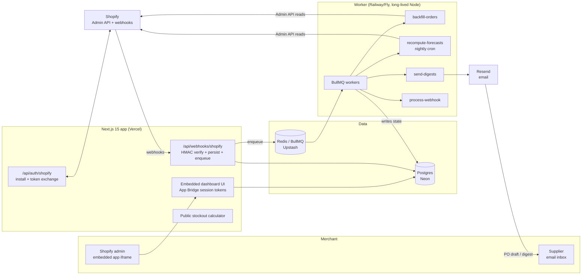

# ShelfSense Architecture

## Stack & Rationale

| Layer | Choice | Why |
|---|---|---|
| Web app + API | **Next.js 15 (App Router) + TypeScript** | One deployable for the embedded admin app, OAuth/webhook endpoints, and the public marketing site + stockout calculator. |
| Shopify integration | **@shopify/shopify-api + App Bridge (embedded app)** | OAuth token exchange, webhook registration/HMAC verification, GraphQL Admin API access, and session-token auth inside the Shopify admin iframe. |
| Database | **Postgres (Neon) + Drizzle ORM** | The domain is relational (shops -> products -> variants -> velocity -> suppliers -> PO drafts). Drizzle gives typed schema-as-code; drizzle-kit handles migrations. Neon: serverless, branches for preview envs, cheap at small scale. |
| Queue | **BullMQ on Redis (Upstash)** | Webhook fan-out, 90-day backfill batches, and the nightly forecast recompute are queue jobs with retries and rate limiting (Shopify API cost limits make naive loops fail). |
| Worker | **Standalone Node process (`src/worker`)** | Backfills and nightly recomputes outlive serverless timeouts. Long-lived process on Railway/Fly, same codebase, shares `src/db` and `src/lib`. |
| Billing | **Shopify Billing API** (deviation: no Stripe) | Shopify App Store distribution *requires* Shopify Billing for app charges. This replaces the portfolio-default Stripe; the upside is zero-friction billing on the merchant's existing Shopify invoice. |
| Email | **Resend** | Weekly reorder digests, monthly dead-stock reports, PO emails to suppliers. React Email templates. |
| Auth | **Shopify session tokens** (no separate auth system) | The embedded app authenticates via App Bridge session tokens; there are no non-Shopify users in v1. |
| Styling | **Tailwind CSS v4** | Dashboard-speed UI development inside DESIGN.md's token system. |

## System Diagram

## Data Model

All tables keyed by `id` (uuid), timestamps `created_at` / `updated_at` implied. Multi-tenancy: everything hangs off `shop_id`.

- **shops** -- tenant root. `shopify_domain` (unique), `access_token` (encrypted), `plan` (counter|backroom|warehouse), `shopify_charge_id`, `sku_count`, `timezone`, `currency`, `backfill_completed_at`, `settings` (jsonb: safety days default, digest day, alert thresholds).
- **suppliers** -- `shop_id`, `name`, `email`, `lead_time_days`, `min_order_value_cents`, `notes`.
- **products** -- mirror of Shopify products we track. `shop_id`, `shopify_product_id`, `title`, `status`, `image_url`.
- **variants** -- the forecasting unit (SKU). `product_id`, `shopify_variant_id`, `sku`, `title`, `price_cents`, `cost_cents`, `supplier_id` (nullable), `moq`, `pack_size`, `inventory_quantity`, `tracked` (bool).
- **inventory_levels** -- per-location stock. `variant_id`, `shopify_location_id`, `available`, `synced_at`.
- **sales_daily** -- the velocity spine; one row per variant per day. `variant_id`, `date`, `units_sold`, `revenue_cents`. Written from webhooks + backfill; unique on (variant_id, date).
- **forecasts** -- nightly output, one row per variant per run. `variant_id`, `run_date`, `velocity_7d`, `velocity_30d`, `velocity_90d`, `blended_velocity`, `days_of_cover`, `reorder_point`, `reorder_qty`, `order_by_date`, `stockout_date`, `revenue_at_risk_cents`, `status` (order_now|order_soon|healthy|overstocked|dead), `inputs` (jsonb: the audit trail shown in the UI).
- **po_drafts** -- `shop_id`, `supplier_id`, `status` (draft|sent|dismissed), `sent_at`, `sent_to_email`, `totals` (jsonb).
- **po_draft_lines** -- `po_draft_id`, `variant_id`, `suggested_qty`, `final_qty`, `unit_cost_cents`.
- **alerts** -- dedup ledger for notifications. `shop_id`, `variant_id`, `kind` (stockout_risk|dead_stock), `first_raised_at`, `resolved_at`, `snoozed_until`.
- **webhook_events** -- raw ingestion log for idempotency + replay. `shop_id`, `shopify_webhook_id` (unique), `topic`, `payload` (jsonb), `processed_at`, `error`.

## Key Flows

### 1. Install -> backfill -> first forecast

1. Merchant installs from the App Store; `/api/auth/shopify` runs OAuth token exchange, stores the encrypted token, registers webhooks (`orders/create`, `orders/updated`, `inventory_levels/update`, `products/update`, `app/uninstalled`), and creates the Billing API subscription (trial).
2. A `backfill-orders` job pages through 90 days of orders via the GraphQL Admin API (cost-limit aware, cursor checkpoints in the job payload so it resumes after any failure) and writes `sales_daily` + product/variant mirrors.
3. When the backfill completes, an immediate `recompute-forecasts` run produces the first reorder dashboard and the trial's revenue-at-risk headline.
4. Merchant assigns suppliers + lead times (or CSV-imports them); forecasts sharpen from default lead time (14d) to real ones.

### 2. Webhook ingestion (continuous)

1. Shopify POSTs to `/api/webhooks/shopify`; the handler verifies HMAC, inserts into `webhook_events` (unique webhook id = idempotency), enqueues `process-webhook`, returns 200 in <1s.
2. The worker applies the event: order lines increment `sales_daily`; inventory updates write `inventory_levels`; product updates refresh mirrors; `app/uninstalled` marks the shop inactive and cancels digests.

### 3. Nightly forecast recompute

1. A BullMQ repeatable job runs per shop in its local timezone (~02:00).
2. For each tracked variant: compute 7/30/90-day velocities; blend (trend-weighted: recent windows weigh more when accelerating); `days_of_cover = available / blended_velocity`; `reorder_point = blended_velocity x (lead_time_days + safety_days)`; `reorder_qty` rounded up to MOQ/pack size; `order_by_date = stockout_date - lead_time_days`.
3. Revenue-at-risk: for variants whose `order_by_date` has passed or falls within 7 days, `projected_missed_units x price` over the uncovered window; aggregate per shop.
4. Status transitions raise or resolve `alerts` rows; newly `order_now` SKUs trigger the (rate-limited) alert email.
5. Every forecast row stores its `inputs` jsonb -- the expandable "show the math" panel in the UI reads it verbatim.

### 4. PO draft -> send

1. From the reorder dashboard the merchant taps "Draft POs"; the app groups `order_now`/`order_soon` variants by supplier into `po_drafts` + lines with suggested quantities.
2. Merchant edits final quantities (MOQ/pack-size validation inline), then exports CSV or sends via Resend to the supplier's email with the shop's reply-to.
3. Sent drafts are tracked; a dismissed draft suppresses re-suggesting the same variants for `lead_time_days`.

## Third-Party Services & Rough Pricing

| Service | Role | Rough cost |
|---|---|---|
| Shopify | Platform + billing | 0% on first $1M/yr of app revenue (then 15%); Billing API handles charges |
| Neon (Postgres) | Primary DB | Free tier -> ~$19/mo -> ~$69/mo as `sales_daily` grows |
| Upstash (Redis) | BullMQ backend | Free tier -> ~$10-20/mo pay-per-request |
| Vercel | Next.js hosting | Hobby free -> Pro $20/mo/seat |
| Railway / Fly.io | Worker process | ~$5-20/mo for a small always-on Node service |
| Resend | Digests + PO emails | Free 3k/mo -> $20/mo for 50k |
| Sentry | Errors | Free tier -> ~$26/mo |

## Estimated Monthly Running Cost

| Scale | Assumptions | Estimate |
|---|---|---|
| **0 customers (dev/preview)** | All free tiers + one $5 worker | **~$5-10/mo** |
| **100 shops** | ~$10k MRR. ~40k variants forecast nightly, ~15k emails/mo | Neon $19 + Upstash $15 + Vercel $20 + worker $10 + Resend $20 + Sentry $26 = **~$110-130/mo** (~1% of revenue) |
| **600 shops** | ~$60k MRR. ~300k variants nightly, ~100k emails/mo | Neon ~$100 + Upstash ~$40 + Vercel ~$40 + workers ~$40 + Resend ~$90 + observability ~$60 = **~$350-450/mo** (<1% of revenue) |

The nightly recompute is embarrassingly parallel and cheap (arithmetic over indexed daily aggregates); infrastructure margin stays >90% at every stage.
