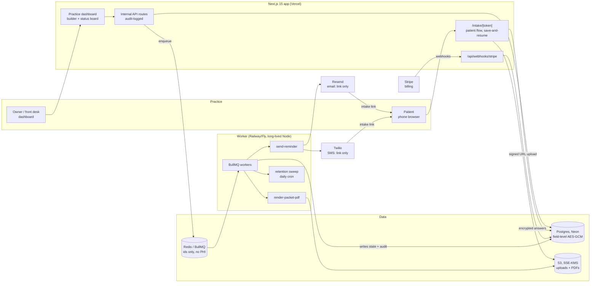

# FormForge Architecture

## Stack & Rationale

| Layer | Choice | Why |
|---|---|---|
| Web app + API | **Next.js 15 (App Router) + TypeScript** | One deployable for the practice dashboard, the patient-facing intake flow, marketing pages, and webhook endpoints. Patient flow is server-rendered and light — it must be fast on old phones. |
| Database | **Postgres (Neon) + Drizzle ORM** | Relational domain (practices -> clinicians -> forms -> intakes -> submissions -> audit events). Drizzle gives typed schema-as-code. Neon signs a BAA on paid plans (HIPAA-eligible) — a hard requirement here. |
| PHI encryption | **App-layer AES-256-GCM (field level)** | PHI answer payloads and signature records are encrypted before they reach Postgres, keyed per practice with envelope encryption (master key in env/KMS). DB compromise alone must not expose readable PHI. |
| File storage | **S3-compatible object storage (AWS S3, SSE-KMS)** | Uploaded documents (insurance cards, prior records) stored encrypted, fetched via short-lived signed URLs. AWS signs a BAA. |
| Queue | **BullMQ on Redis (Upstash)** | Reminder scheduling (send until completed, with quiet hours) and PDF rendering are delayed/retryable jobs. Job payloads carry ids only — never PHI — so Redis stays out of PHI scope. |
| Worker | **Standalone Node process (`src/worker`)** | Reminders and PDF renders must not depend on serverless timeouts. Long-lived process on Railway/Fly, same codebase, shares `src/db` and `src/lib`. |
| Payments | **Stripe Billing** | Three flat plans + 14-day trial. Card data never touches our servers; no PHI touches Stripe. |
| Email | **Resend** (no PHI in bodies) | Intake links, reminders, and receipts contain the patient's name and a tokenized link only — the packet lives behind the link, so standard transactional email stays outside the PHI boundary. |
| SMS | **Twilio** (BAA available) | Reminder texts (name + link, no PHI). 10DLC registration required for US traffic. |
| Auth | **Auth.js (NextAuth v5)** | Email magic-link + Google OAuth for practice staff; practice-scoped sessions with role checks. Patients never have accounts — tokenized links only. |
| PDF | **pdf-lib** | Archival PDF of completed packets with the signature evidence summary appended. Rendered in the worker. |
| Styling | **Tailwind CSS v4** | Dashboard-speed UI development inside DESIGN.md's token system. |

## System Diagram

## Data Model

All tables keyed by `id` (uuid), timestamps `created_at` / `updated_at` implied. Multi-tenancy: everything hangs off `practice_id`. Columns marked **[enc]** hold AES-GCM ciphertext.

- **practices** -- tenant root. `name`, `plan` (solo|group|clinic), `stripe_customer_id`, `baa_signed_at`, `branding` (jsonb), `settings` (jsonb: quiet hours, reminder cadence, retention years), `dek_wrapped` (per-practice data key, envelope-encrypted).
- **users** -- practice staff. `practice_id`, `email`, `name`, `role` (owner|clinician|frontdesk). Auth.js accounts/sessions alongside.
- **forms** -- a form/packet definition. `practice_id`, `title`, `status` (draft|live|archived), `version`, `blocks` (jsonb: ordered block configs), `is_template_copy_of` (nullable).
- **form_versions** -- immutable snapshot per publish. `form_id`, `version`, `blocks` (jsonb). Submissions reference the exact version the patient saw (consent defensibility).
- **patients** -- minimal directory row. `practice_id`, `first_name` **[enc]**, `last_name` **[enc]**, `email` **[enc]**, `phone` **[enc]**, `dob` **[enc]**, `assigned_user_id` (nullable).
- **intakes** -- one sent packet. `practice_id`, `patient_id`, `form_version_id`, `token_hash` (unique; raw token only in the link), `status` (sent|started|completed|signed|expired), `sent_at`, `started_at`, `completed_at`, `expires_at`, `reminder_state` (jsonb).
- **submissions** -- the answers. `intake_id`, `answers` **[enc]** (jsonb ciphertext), `score_summary` (jsonb: screener totals only, e.g. `{phq9: 14}` -- reportable without decryption), `completed_at`.
- **signature_records** -- `intake_id`, `block_key`, `kind` (typed|drawn), `signature_payload` **[enc]**, `signed_name` **[enc]**, `signed_at`, `ip`, `user_agent`, `document_hash` (SHA-256 of the rendered consent text + form version).
- **uploads** -- `intake_id`, `s3_key`, `content_type`, `byte_size`, `label` **[enc]**.
- **audit_events** -- append-only. `practice_id`, `actor_type` (user|patient|system), `actor_id`, `action` (viewed|edited|exported|sent|signed|deleted|login), `target_type`, `target_id`, `ip`, `metadata` (jsonb, no PHI). No UPDATE/DELETE grants on this table.
- **reminders** -- schedule ledger. `intake_id`, `channel` (email|sms), `scheduled_for`, `sent_at`, `provider_message_id`, `status`.
- **exports** -- every PDF/CSV generation. `practice_id`, `user_id`, `kind` (pdf|csv), `target_intake_id` (nullable), `s3_key`, `expires_at` -- exports are themselves audit-logged artifacts.

## Key Flows

### 1. Build -> send -> remind

1. Staff assembles a form from structured blocks (or copies a gallery template); publishing writes an immutable `form_versions` snapshot.
2. Sending to a patient creates an `intakes` row: a 128-bit token is generated, its hash stored, and the raw token embedded in the emailed/texted link (never persisted).
3. The worker schedules the reminder ladder (default: +48h, +5d, +10d, stop at completion), honoring quiet hours and channel opt-outs. Messages carry name + link only — no PHI.
4. Every send is recorded in `reminders` and `audit_events`.

### 2. Patient completes and signs

1. Patient opens `/intake/[token]`; the server hashes the token, loads the intake, marks `started`. Progress saves per block (save-and-resume); answers are encrypted with the practice DEK before insert.
2. Screener blocks (PHQ-9, GAD-7) score client-side for instant display and server-side for the stored `score_summary` (totals only, kept outside ciphertext for reporting).
3. The consent block renders the exact `form_versions` text; signing captures typed/drawn signature, consent-to-sign disclosure acknowledgment, timestamp, IP, user agent, and a SHA-256 hash of the consent text -> `signature_records`.
4. Completion flips status, cancels outstanding reminders, notifies the assigned clinician, and appends audit events for every step.

### 3. Review, export, audit

1. Staff views run through decrypt-on-read helpers that append a `viewed` audit event — there is no unaudited read path in application code.
2. PDF export: worker renders the packet + signature evidence summary via pdf-lib, stores it encrypted in S3, returns a short-lived signed URL; the export is recorded in `exports` + audit.
3. EHR-lite CSV: structured block answers map to stable columns; export scoped per clinician or date range; audit-logged like any read.
4. The audit screen answers "who touched this patient's record" with filterable, exportable results.

### 4. Billing & plan gating

1. Stripe Checkout for the three plans; webhooks (`checkout.session.completed`, `customer.subscription.updated|deleted`) update `practices.plan`.
2. Gating: clinician-count caps, branding/API on Clinic. Downgrade never locks data — read/export always works; over-cap blocks only *new* sends.

## Compliance Posture (v1 scope)

- **BAA:** self-serve signature flow at signup (countersigned PDF stored); subprocessor BAA chain documented publicly (Neon/AWS, Resend-class email kept PHI-free, Twilio, Vercel or PHI-safe hosting per final review).
- **Encryption:** TLS everywhere; field-level AES-256-GCM with per-practice envelope keys over Neon's storage encryption; S3 SSE-KMS.
- **Access:** role checks per route; sessions expire at 12h idle; audit log is append-only.
- **Retention:** per-practice configurable (default 7 years); daily sweep hard-deletes expired intakes + S3 objects and logs the deletion.
- Explicitly *not* claimed in v1: HITRUST, SOC 2 (roadmapped Phase 3), e-prescribe, direct EHR sync.

## Third-Party Services & Rough Pricing

| Service | Role | Rough cost |
|---|---|---|
| Neon (Postgres) | Primary DB (BAA on paid plan) | ~$19/mo (Launch) -> ~$69/mo |
| AWS S3 + KMS | Encrypted uploads/PDFs | ~$1-15/mo at small scale |
| Upstash (Redis) | BullMQ backend (no PHI) | Free tier -> ~$10-20/mo |
| Vercel | Next.js hosting | Hobby free -> Pro $20/mo/seat |
| Railway / Fly.io | Worker process | ~$5-20/mo |
| Stripe | Our billing | 2.9% + 30c on our subscriptions |
| Resend | Link/reminder email | Free 3k/mo -> $20/mo for 50k |
| Twilio | SMS reminders | ~$0.0079/SMS + ~$1.15/mo number + 10DLC fees |
| Sentry | Errors (PII-scrubbed) | Free tier -> ~$26/mo |

## Estimated Monthly Running Cost

| Scale | Assumptions | Estimate |
|---|---|---|
| **0 customers (dev/preview)** | Neon Launch (BAA from day one) + free tiers + $5 worker | **~$25-30/mo** |
| **150 practices** | ~$12k MRR. ~25k emails/mo, ~6k SMS/mo, modest storage | Neon $19 + S3 $10 + Upstash $15 + Vercel $20 + worker $10 + Resend $20 + Twilio ~$60 + Sentry $26 = **~$180-200/mo** (~1.5% of revenue) |
| **800 practices** | ~$70k MRR. ~150k emails/mo, ~35k SMS/mo, PDF-heavy | Neon ~$120 + S3 ~$60 + Upstash ~$40 + Vercel ~$60 + workers ~$40 + Resend ~$90 + Twilio ~$350 + observability ~$80 = **~$800-900/mo** (~1% of revenue) |

Infrastructure margin stays >90%; the real costs are the security review, insurance, and compliance diligence — budgeted as one-time/annual line items, not per-customer COGS.
