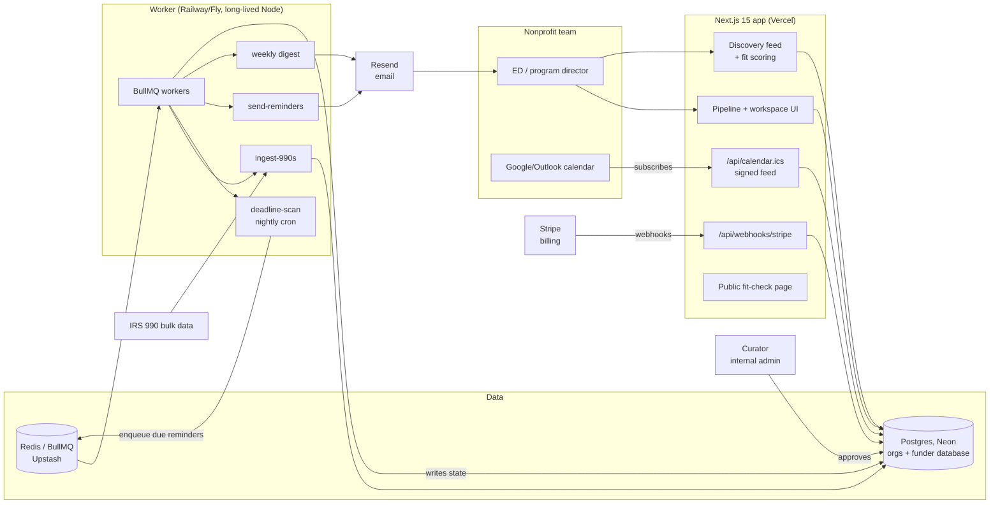

# GrantGrid Architecture

## Stack & Rationale

| Layer | Choice | Why |
|---|---|---|
| Web app + API | **Next.js 15 (App Router) + TypeScript** | One deployable for the app, marketing pages, the free fit-check, and webhook endpoints. |
| Database | **Postgres (Neon) + Drizzle ORM** | Deeply relational domain (orgs -> pipelines -> grants -> deadlines -> answers; funders -> programs -> awards). Postgres full-text search covers discovery filtering at this scale — no search cluster needed. Drizzle for typed schema-as-code; Neon for serverless + preview branches. |
| Queue | **BullMQ on Redis (Upstash)** | Reminder fan-out, 990 ingestion batches, and the weekly digest are delayed/retryable jobs. |
| Worker | **Standalone Node process (`src/worker`)** | 990 ingestion and nightly deadline scans are long-running; a persistent process on Railway/Fly shares `src/db` and `src/lib` with the app. |
| Funder data | **IRS 990/990-PF bulk data + human curation** | The IRS publishes machine-readable 990 filings (free). Automated ingestion proposes funder records + giving patterns; a curation queue (internal admin screens) approves what enters the member-facing database. Curation hours are a budgeted cost, not an afterthought. |
| Payments | **Stripe Billing** | Three flat plans + trial; Checkout + customer portal; webhooks drive plan state. |
| Email | **Resend** | Deadline reminders, weekly pipeline digest, fit-check results. React Email templates. |
| Auth | **Auth.js (NextAuth v5)** | Email magic-link + Google OAuth; org-scoped sessions with roles. Magic-link matters — this audience shares logins and forgets passwords. |
| Calendar out | **Signed ICS feed** | Every org gets a tokenized ICS URL; deadlines appear in Google/Outlook calendars without OAuth complexity. |
| Styling | **Tailwind CSS v4** | Dashboard-speed UI development inside DESIGN.md's token system. |

## System Diagram

## Data Model

All tables keyed by `id` (uuid), timestamps `created_at` / `updated_at` implied. Two families: **tenant data** (hangs off `organization_id`) and the shared **funder database** (curated, read-only to members).

Tenant side:

- **organizations** -- tenant root. `name`, `plan` (seed|grow|field), `stripe_customer_id`, `profile` (jsonb: mission, programs, budget_band, service_states, cause_codes, ein), `ics_token_hash`, `settings` (jsonb: reminder offsets, digest day).
- **users** -- `organization_id`, `email`, `name`, `role` (owner|member). Auth.js accounts/sessions alongside. Field plan: users may belong to multiple orgs via **memberships**.
- **grants** -- a funder opportunity *in this org's pipeline*. `organization_id`, `funder_id` (nullable -- manual entries allowed), `title`, `stage` (researching|loi|applying|submitted|awarded|declined|reporting|closed), `ask_amount_cents`, `awarded_amount_cents`, `owner_user_id`, `notes`, `source` (discovery|manual).
- **deadlines** -- every dated obligation. `grant_id`, `kind` (loi|application|report|renewal|custom), `due_on`, `completed_at`, `label`.
- **answers** -- the answer library. `organization_id`, `kind` (mission_short|mission_long|program|budget|board_list|attachment|custom), `title`, `body` (text) or `file_ref`, `last_reviewed_at` (staleness flag drives from this), `version`.
- **workspace_items** -- per-grant checklist. `grant_id`, `requirement` ("500-word org background"), `answer_id` (nullable link into the library), `status` (todo|drafted|final), `draft_body`.
- **reminders** -- send ledger. `deadline_id`, `offset_days` (14|7|1), `scheduled_for`, `sent_at`, `channel` (email), `status`.
- **activity_log** -- pipeline history (the institutional memory). `organization_id`, `grant_id`, `actor`, `event` (stage_change|award|note|reminder_sent), `metadata` (jsonb).

Funder database (shared, curated):

- **funders** -- `name`, `ein` (unique), `kind` (private_foundation|community|corporate), `states_funded` (text[]), `cause_codes` (text[]), `grant_size_min_cents`, `grant_size_max_cents`, `accepts_unsolicited` (bool|null), `application_url`, `deadlines_note`, `new_grantee_share` (0-1, from 990 history), `data_freshness_at`, `curation_status` (proposed|approved|retired).
- **funder_awards** -- 990-derived giving history. `funder_id`, `tax_year`, `recipient_name`, `recipient_state`, `amount_cents`, `purpose_excerpt`.
- **funder_change_reports** -- member-submitted corrections. `funder_id`, `organization_id`, `note`, `resolved_at`.

## Key Flows

### 1. Discovery -> fit score -> pipeline

1. The org completes its profile (mission, cause codes, states, budget band, typical ask). Thin profiles disable scoring rather than guessing.
2. The discovery feed filters `funders` (approved only) by geography/cause/size; each card carries a fit score computed on read: weighted factors — geography match, cause overlap, ask-vs-typical-size fit, `new_grantee_share`, unsolicited-applications signal — each factor returned *with its reason string* and rendered verbatim (never a bare number).
3. "Add to pipeline" creates a `grants` row at `researching`, copying known deadline notes into suggested `deadlines`.
4. Fit scores are cached per (org profile version, funder version) — profile edits invalidate.

### 2. Deadlines -> reminders -> calendar

1. Any deadline row (LOI, application, report, renewal) is created manually or from funder data; completing a stage prompts for the next date ("Submitted — when do they notify?").
2. The nightly `deadline-scan` enqueues reminder sends at T-14/T-7/T-1 (org-configurable) for every incomplete deadline; `reminders` ledger guarantees exactly-once per (deadline, offset).
3. Award entry auto-creates report-schedule deadlines (`reporting` stage) — the renewal-saver flow; report reminders escalate to all org users at T-1.
4. The signed ICS feed serves all incomplete deadlines; token rotation invalidates old feed URLs.

### 3. Application workspace + answer library

1. Opening a grant's workspace shows its requirement checklist; requirements link to answer-library blocks (`answer_id`) or hold one-off drafts.
2. Linking an answer copies the current version into `draft_body` (snapshot -- funder-specific edits never mutate the library) with a "source: Mission (long) v4" breadcrumb.
3. Library blocks show staleness (`last_reviewed_at` > 12 months → flagged); the weekly digest nags about stale blocks in active use.
4. On award/decline, the workspace freezes into the activity log — what was sent, when, and the outcome, queryable forever.

### 4. 990 ingestion -> curation

1. `ingest-990s` pulls IRS bulk indexes, parses 990-PF grant schedules for target states/cause areas, and upserts `funders` (status `proposed`) + `funder_awards`.
2. Derived signals computed per funder: typical grant size band, `new_grantee_share`, geographic spread.
3. Curators review proposed records in the internal admin (verify URL, deadlines note, cause codes), flipping them to `approved` — only approved records reach members.
4. Member `funder_change_reports` feed the same curation queue; `data_freshness_at` displays on every member-facing record.

## Third-Party Services & Rough Pricing

| Service | Role | Rough cost |
|---|---|---|
| Neon (Postgres) | Primary DB + funder database | Free tier -> ~$19/mo -> ~$69/mo as 990 data grows |
| Upstash (Redis) | BullMQ backend | Free tier -> ~$10-20/mo |
| Vercel | Next.js hosting | Hobby free -> Pro $20/mo/seat |
| Railway / Fly.io | Worker process | ~$5-20/mo |
| Stripe | Our billing | 2.9% + 30c on our subscriptions |
| Resend | Reminders + digests | Free 3k/mo -> $20/mo for 50k |
| IRS 990 bulk data | Funder source | Free (public data) |
| Sentry | Errors | Free tier -> ~$26/mo |
| Human curation | Data quality | The real COGS: budget ~10-20 hrs/week at launch (founder time or ~$800-1,600/mo contracted) |

## Estimated Monthly Running Cost

| Scale | Assumptions | Estimate |
|---|---|---|
| **0 customers (dev/preview)** | Free tiers + $5 worker; founder-time curation | **~$5-10/mo** infra |
| **200 orgs** | ~$17k MRR. ~60k emails/mo, funder DB ~50k records | Neon $19 + Upstash $15 + Vercel $20 + worker $10 + Resend $20 + Sentry $26 + contracted curation ~$1,200 = **~$1,300-1,400/mo** (~8% of revenue -- curation dominates) |
| **800 orgs** | ~$70k MRR. ~250k emails/mo, funder DB national | Infra ~$350 + curation team ~$4,000 = **~$4,300-4,500/mo** (~6% of revenue) |

Unusually for this portfolio, the margin story is ~85% *because of curation labor*, not infrastructure — and that same labor is the defensibility. Automate proposals, never approvals.
