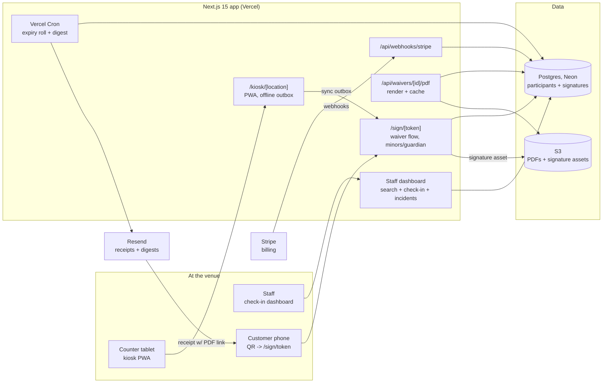

# WaiverWing Architecture

## Stack & Rationale

| Layer | Choice | Why |
|---|---|---|
| Web app + API | **Next.js 15 (App Router) + TypeScript** | One deployable for the staff dashboard, the public signing flow (`/sign/[token]`), the kiosk PWA (`/kiosk/[location]`), marketing pages, and webhooks. |
| Database | **Postgres (Neon) + Drizzle ORM** | Relational domain (accounts -> locations -> waiver versions -> participants -> signatures -> incidents). Postgres trigram/FTS indexes give the instant name search the product is sold on. Drizzle for typed schema-as-code; Neon for serverless + preview branches. |
| Kiosk / offline | **PWA (service worker + IndexedDB outbox)** | Kiosk mode is a route, not an app store install. Signatures captured offline queue in IndexedDB and sync with idempotency keys on reconnect — counters have flaky Wi-Fi (README risk 3). |
| File storage | **S3-compatible object storage (SSE)** | Rendered signed-waiver PDFs and drawn-signature assets, fetched via short-lived signed URLs. |
| PDF | **pdf-lib** | The "here it is, counsel" artifact: waiver text version + answers + signature + evidence summary. Rendered on demand in a route handler; cached to S3. Volume is low enough (per-request, not batch) that **no queue/worker is needed at MVP** — a deliberate deviation from the portfolio's BullMQ default; Vercel Cron covers the two daily jobs (expiry roll, digest). Revisit if bulk export queues appear. |
| Payments | **Stripe Billing** | Three flat plans + trial; Checkout + customer portal; webhooks drive plan state and volume soft-caps. |
| Email | **Resend** | Signed-waiver receipts, pre-arrival sign links, daily digest. React Email templates. |
| Auth | **Auth.js (NextAuth v5)** | Email magic-link + Google OAuth for staff; account-scoped sessions with roles. Signers and kiosks never have accounts — tokenized links and location-pinned kiosk sessions. |
| QR | **qrcode (server-generated SVG/PNG)** | Printable per-location/activity QR posters pointing at tokenized sign URLs. |
| Styling | **Tailwind CSS v4** | Dashboard-speed UI development inside DESIGN.md's token system. |

## System Diagram

## Data Model

All tables keyed by `id` (uuid), timestamps `created_at` / `updated_at` implied. Multi-tenancy: everything hangs off `account_id`; most rows also carry `location_id`.

- **accounts** -- tenant root. `name`, `plan` (counter|front_desk|operator), `stripe_customer_id`, `settings` (jsonb: branding, retention policy, digest time).
- **users** -- staff. `account_id`, `email`, `name`, `role` (owner|manager|staff). Auth.js accounts/sessions alongside.
- **locations** -- `account_id`, `name`, `timezone`, `kiosk_pin` (staff-settable), `qr_token` (rotatable, points sign links at this location).
- **waivers** -- a waiver definition. `account_id`, `title`, `status` (draft|live|archived), `expiry_rule` (visit|days_365|forever), `minor_rule` (jsonb: age of majority, guardian relationship options), `activity_tags` (text[]).
- **waiver_versions** -- immutable text snapshots. `waiver_id`, `version`, `body_blocks` (jsonb: liability text, initialed clauses, custom questions), `published_at`. Every signature pins one.
- **participants** -- the searchable database. `account_id`, `first_name`, `last_name`, `email`, `phone`, `dob`, `is_minor` (derived at signing), `guardian_participant_id` (nullable self-reference), `emergency_contact` (jsonb), `flags` (jsonb: medical notes captured by custom questions). Trigram indexes on names/email/phone.
- **signatures** -- one row per signed waiver per participant. `participant_id`, `waiver_version_id`, `location_id`, `signed_by_participant_id` (the guardian when minor), `guardian_relationship` (nullable), `signature_kind` (typed|drawn), `signature_asset_key` (S3), `initials` (jsonb per clause), `signed_at`, `expires_at` (from expiry rule), `ip`, `user_agent`, `channel` (qr|kiosk|link), `text_hash` (SHA-256 of the rendered version), `offline_key` (nullable, idempotency for kiosk sync).
- **checkins** -- `location_id`, `participant_id`, `checked_in_at`, `by_user_id` (nullable -- self check-in), `signature_id` (the current-waiver proof at that moment).
- **incidents** -- `account_id`, `location_id`, `occurred_at`, `title`, `description`, `logged_by_user_id`, `status` (open|closed).
- **incident_participants** -- join with context. `incident_id`, `participant_id`, `signature_id` (the exact waiver in force), `note`.
- **exports** -- audit of PDF/CSV pulls. `account_id`, `user_id`, `kind`, `scope` (jsonb), `s3_key`, `created_at`.
- **webhook_events** -- Stripe idempotency log. `stripe_event_id` (unique), `type`, `payload` (jsonb), `processed_at`.

## Key Flows

### 1. QR / pre-arrival signing

1. Customer scans the location QR (or taps an emailed link); `/sign/[token]` resolves location + live waiver, renders the current `waiver_versions` snapshot mobile-first.
2. Adults: contact fields, custom questions, initialed clauses, signature (typed or drawn), consent-to-sign disclosure. Minors: the **guardian flow** — guardian identifies themselves, adds each minor (name, DOB, relationship), initials/signs once; one `signatures` row per minor with `signed_by_participant_id` = guardian, plus the guardian's own row if the waiver requires it.
3. Server validates ages against the waiver's `minor_rule` (a minor can never be a signer), upserts `participants` (match on email/phone + name, else create), computes `expires_at`, stores `text_hash`.
4. Receipt email with the signed-PDF link; participant is immediately searchable and shows as "signed today" on the check-in dashboard.

### 2. Kiosk mode

1. Staff opens `/kiosk/[location]` on the counter tablet, enters the kiosk PIN; the PWA pins itself full-screen with the attract screen.
2. Each signing session runs the same flow as (1) at kiosk type scale; on completion the kiosk auto-resets in 8s (or on staff tap) and never shows the previous signer's data.
3. Offline: completed signings write to an IndexedDB outbox keyed by `offline_key` (uuid); the service worker syncs on reconnect; the server dedupes on `offline_key`. The kiosk header shows a quiet sync-state indicator ("3 queued") staff can see.
4. Kiosk sessions hold a location-scoped token only — no staff session, no dashboard access from the kiosk.

### 3. Check-in and retrieval

1. The check-in dashboard defaults to today-at-this-location: who signed, who's checked in.
2. Search-as-you-type hits trigram indexes across name/email/phone; a result row answers the only question that matters at the counter: **current waiver on file?** (green: valid `signatures` row; amber: expired -> one tap sends/re-opens the re-sign flow; none: sign now).
3. Check-in tap writes `checkins` with the proving `signature_id` — the record of "we verified coverage at entry."
4. Retrieval: any participant -> full history (versions, evidence, guardian links) -> PDF export with evidence summary; bulk export by date/location for counsel or insurer. Every export lands in `exports`.

### 4. Incidents

1. Staff logs an incident (what/when/where); links participants via the same search.
2. Each link snapshots `signature_id` — the waiver in force at incident time, immune to later re-signs.
3. The incident file view assembles description, participants, and their exact signed waivers; one bulk PDF for the insurer/attorney.

### 5. Billing & volume

1. Stripe Checkout for the three plans; webhooks update `accounts.plan` (idempotent via `webhook_events`).
2. Monthly signed-waiver count per account drives soft caps: over-cap banners + upgrade prompt; signing **never blocks** (a blocked waiver at a busy counter is the one unforgivable failure).

## Third-Party Services & Rough Pricing

| Service | Role | Rough cost |
|---|---|---|
| Neon (Postgres) | Primary DB | Free tier -> ~$19/mo -> ~$69/mo |
| AWS S3 | PDFs + signature assets | ~$1-10/mo at small scale |
| Vercel | Next.js hosting + Cron | Hobby free -> Pro $20/mo/seat |
| Stripe | Our billing | 2.9% + 30c on our subscriptions |
| Resend | Receipts + digests | Free 3k/mo -> $20/mo for 50k |
| Sentry | Errors | Free tier -> ~$26/mo |

No queue, no worker host at MVP (see stack rationale) — the leanest architecture in the portfolio, on purpose.

## Estimated Monthly Running Cost

| Scale | Assumptions | Estimate |
|---|---|---|
| **0 customers (dev/preview)** | All free tiers | **~$0-5/mo** |
| **250 locations** | ~$13k MRR. ~120k waivers/mo, ~140k emails/mo, PDF cache growing | Neon $19 + S3 $10 + Vercel $20 + Resend $90 + Sentry $26 = **~$165-185/mo** (~1.4% of revenue) |
| **1,000 locations** | ~$50k MRR. ~600k waivers/mo, ~700k emails/mo | Neon ~$120 + S3 ~$50 + Vercel ~$60 + Resend ~$250 + observability ~$60 = **~$550-650/mo** (~1.2% of revenue) |

Storage is the only line that compounds (signed PDFs retained for years); at ~40KB/PDF even 10M archived waivers is ~400GB ≈ $10/mo — the legal archive that drives retention costs almost nothing to keep.
